電子工作でラーメンタイマーを製作したあと、次のネタとして赤外線通信でテレビのリモコンを操作することに挑戦しました。

テレビのリモコンはとにかくボタンが多く、使わない機能が多いため、電源ON/OFFとチャンネル切替くらいのシンプルな機能でリビングのテーブルに常に置いておき探さずすぐに操作できるものを目指します。

## 必要なもの

### 部品

| 名称                | 仕様                                                                       | 個数 |
|---------------------|----------------------------------------------------------------------------|------|
| IRレシーバ/エミッタ | [VS1838B](https://amzn.to/49Br1CP)                                         | 1    |
| PICマイコン         | [PIC10F222-I/P](https://akizukidenshi.com/catalog/g/g103107/)              | 1    |
| ICソケット          | [8ピン](https://akizukidenshi.com/catalog/g/g100035/)                      | 1    |
| タクトスイッチ      | [タクトスイッチ12x12x7.3mmマルチカラーキャップ付](https://amzn.to/45I2SZV) | 3    |
| 抵抗                | [47Ω](https://amzn.to/3NfgRjS)                                            | 1    |
| 電池ホルダー        | [CR2032](https://amzn.to/4sSlYqz)                                          | 1    |
| ジュンフロン線      | [0.51mm 2mx6色](https://amzn.to/4sHVMif)                                   | 1    |
| すずめっき軟銅線    | [0.32mmx20m](https://amzn.to/49Pcgxp)                                      | 1    |
| ユニバーサル基板    | [9.7x8.9cm,4分割](https://amzn.to/3YZbWWw)                                 | 1    |
| ナイロンスペーサー  | [10mm](https://amzn.to/4bt1kXw)                                            | 4    |
| 小ねじ              | [M2x12](https://amzn.to/3Z4VUKT)                                           | 4    |
| ナット              | [M2](https://amzn.to/4qLZbdV)                                             | 4    |

### 工具など

1. [Pickit5](https://akizukidenshi.com/catalog/g/g118150/)と書き込み用の配線など
1. [ロジックアナライザ](https://amzn.to/4qeo8ia)
1. [ニッパー](https://amzn.to/3YjwZmH)
1. [ピンセット](https://amzn.to/4jjFoQs)
1. [ワイヤーストリッパー](https://amzn.to/4soWBMC)
1. [ハンダごて](https://amzn.to/4aE8zeZ)
1. [4mmスパナ](https://amzn.to/3N46tLx)
1. [精密プラスドライバー](https://amzn.to/4jzASgV)

## 赤外線通信の方式と調べ方

赤外線通信の方法は、赤外線LEDをなんらかの規則に従って点滅させることでビット列を送信しますが、フォーマットにいくつか方式があり、さらにビット列にどの機能が割り当てられているかはまちまちのようです。そのため、まずは信号を解析する必要があります。

### 赤外線通信の方式

[赤外線リモコンの通信フォーマット](https://elm-chan.org/docs/ir_format.html)を参考にさせてもらいました。通信フォーマットには、主にNEC/家電協/SONYフォーマットの3つがあるようです。今回のテレビはSONY製なので、ほぼSONYフォーマットと思ってよいでしょう。

SONYフォーマットは、下記のように40kHzのパルスを、T=600μsを基準として、開始時に4T、その後、T間隔でT=0, 2T=0のビット列を送信します。

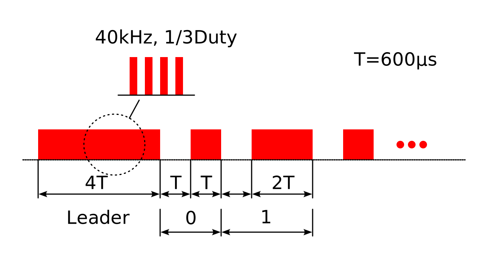

### ロジックアナライザで信号を解析する

[アマゾンで安物のロジックアナライザ](https://amzn.to/4qeo8ia)と[IRレシーバダイオードと赤外線LEDのセット](https://amzn.to/49Br1CP)を購入しました。

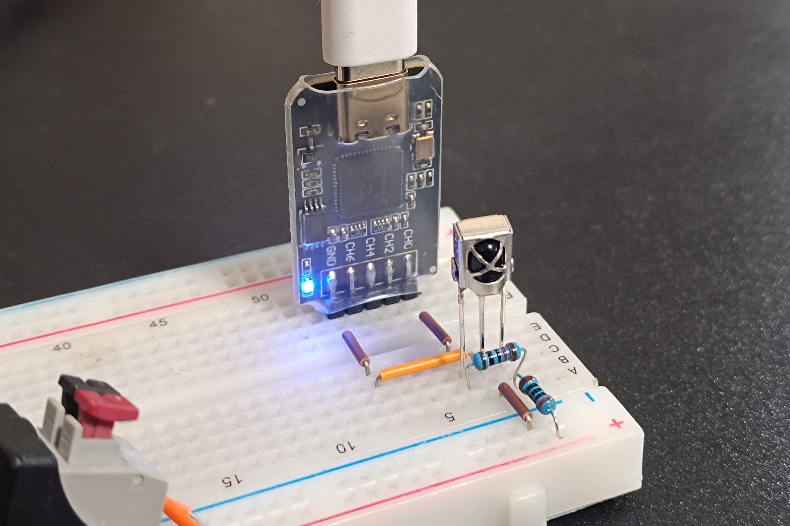

このIRレシーバダイオードは、38kHzに変調された赤外線信号を検出し電圧出力するというものです。3端子で電源、GND、出力のみの簡単な構成です。

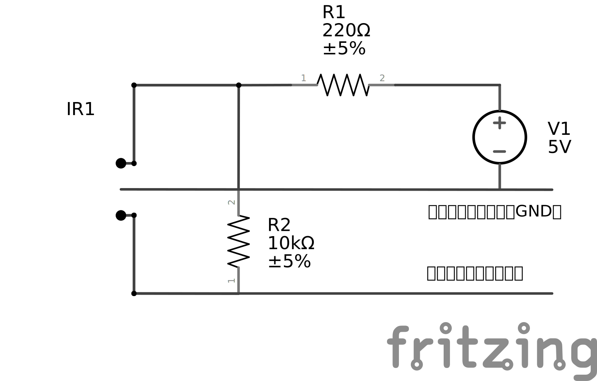

### Sigrokのインストールと設定

信号の解析には[SigrokのPulseView](https://sigrok.org/wiki/Main_Page)というフリーソフトを使います。Linux、Windows、MacOS版があり、以下Linux版をUbuntuで動かした画面になります。Ubuntuへのインストールは、aptでもappimageでもどちらも動きました。

PalseViewを起動すると、シンプルな画面が現れます。


上にあるツールバーの「Demo device」をクリックすると設定画面が出てきます。

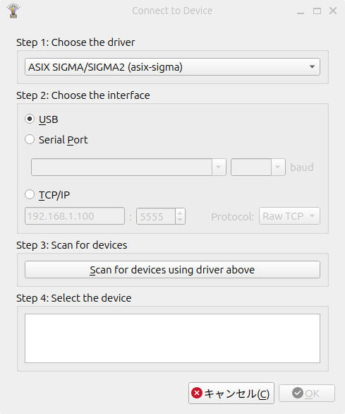

ここで、fx2lafwを選択するのですが、選択すると固まってしまいました😓 気を取り直しもう一度起動すると認識されているようです。

サンプリングレートを設定し、スタートボタンを押してからTVリモコンの電源ボタンをIRレシーバダイオードに向かって押してみます。すると、信号が表示されました。

### 信号の解析

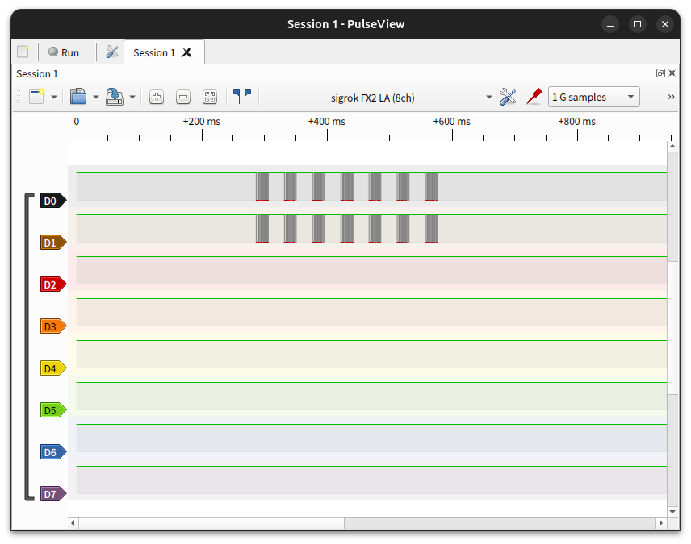

D0とD1両方に同じ信号が表示されているのは、ブレッドボードを使い配線したのでD0とD1がつながっているためです。7つのブロックが表示されていますが、ボタンを押している間だけ一定間隔で信号が出るようで、このうちの1つを拡大してみます。

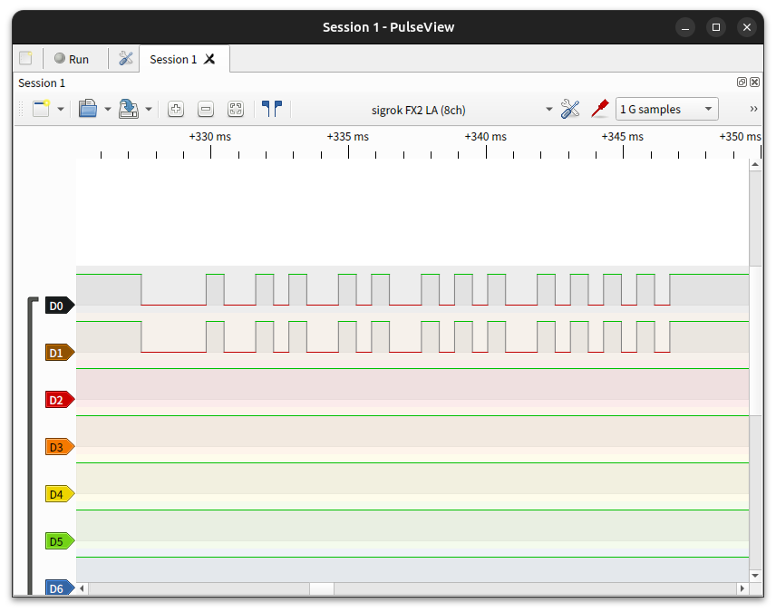

まず、先程説明した図と比べて、High/Lowが逆になっています。常時Highで赤外線が出た際にLowになるようです。理由はよくわかりませんが、こういうものだと思います。

一番短いLowとHighの間隔が同じくらいで、これがT=600μs程度になっていると思われます。ということは、この短い谷が「0」になります。一番最初（左）は4Tくらい、途中で谷が2Tくらいのものがあり、これらがそれぞれヘッダー、「1」ということですね。

600μsと思われる1山部分を拡大すると、このようになっていました。

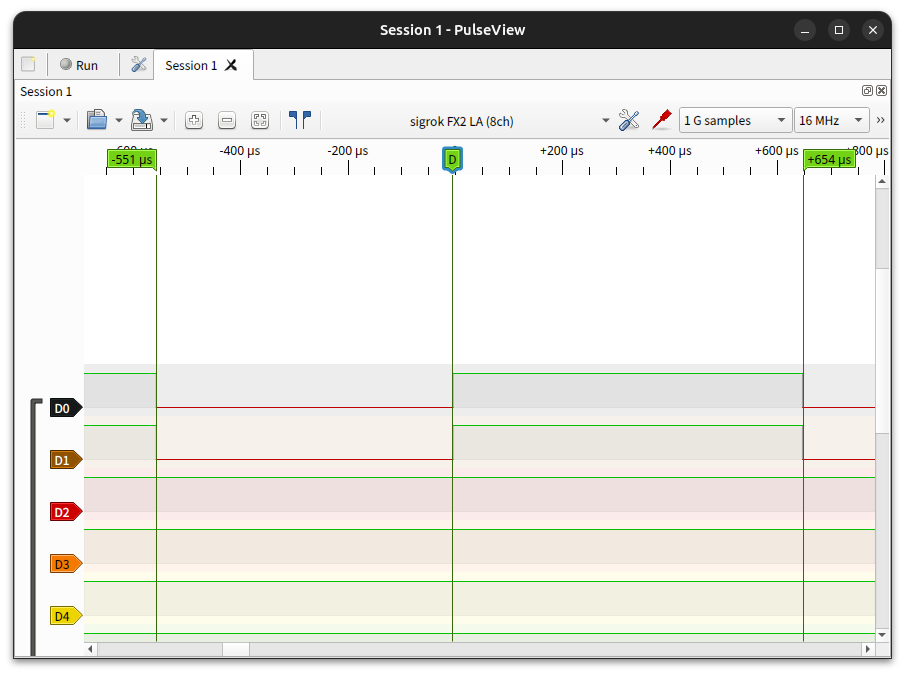

谷が551μs、山が654μsと、600μsに比べて若干違っていますが、これが仕様なのか、これくらいいい加減でも動くものなのかどうなのでしょう。

上記の電源信号は、時系列だと「101010010000」です。左7bitがデータ「1010100」、右5bitがアドレス「10000」になります。同様に、チャンネル送り、戻しも解析してみました。

| ボタン | データ  | アドレス |
|--------|---------|----------|
| 電源   | 1010100 | 10000    |
| CH送り | 0000100 | 10000    |
| CH戻し | 1000100 | 10000    |

これで信号は解析できました！

## ユニバーサル基板にはんだ付け

今回は被覆付きとすずめっき線両方を使い、部品の実装面には被覆付き線を、はんだ面にはすずめっき線を中心に使用してみました。

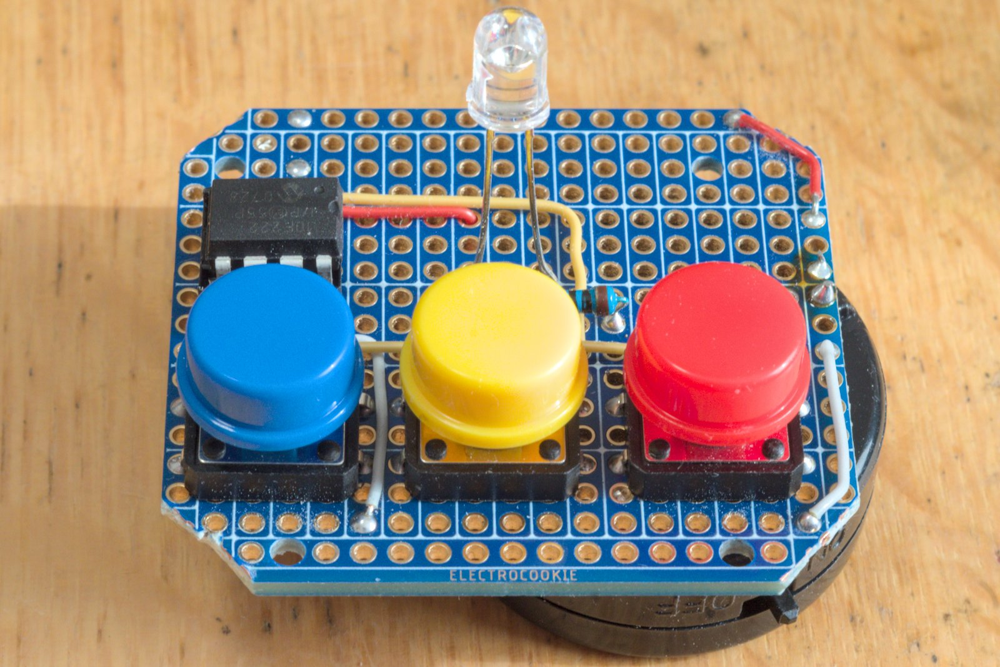

3色のボタンがいい感じです。基板の四隅をカットしているのは、後ほど丸いケースを入れるため干渉防止です。また、支柱用に4箇所穴を広げています。

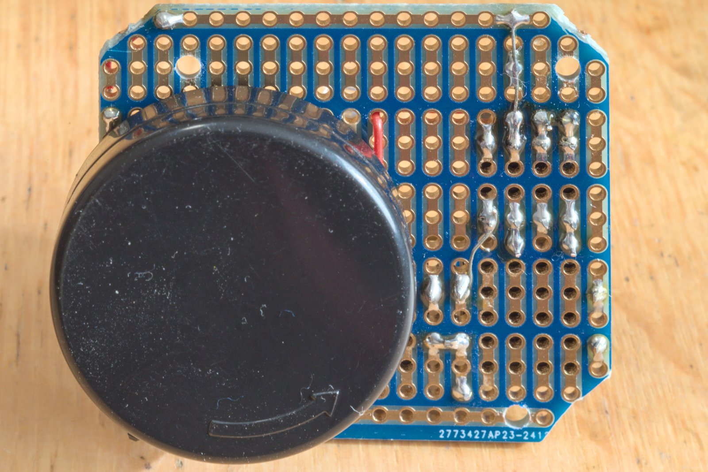

はんだ面です。基板は、上下ラインが横に、中間は縦方向に3穴が導通したブレッドボードに少し近いような[Electric Cookie製の小型基](https://amzn.to/3YZbWWw)板を使っているため、あまり配線がごちゃごちゃせずスッキリとできました。

写真では、抵抗に200Ωを使っていますが、3VだとLEDの順方向電圧1.2Vを引くと1.8V、電流は1.8/200×1000=9mAしか流れないため、電池を直列2個入る6Vの電池ホルダーにしています。これだと18mA流れますが、2m程度の距離でしか使えませんでした。また、6VだとPIC10F222の最大電圧5.5Vを超えてしまいます。この状態でも問題なく使えていますが、新しく作る場合は抵抗の選定を下記のようにやり直したほうがよさそうです。

赤外線LEDは、定格30mA、ピークで130mAまで流せるため、3Vだと47Ωか39Ωでそれぞれ、38mA、46mAとなりPICの最大電圧以内でもっと遠くから操作できるようになると思います。

## 回路図

参考に回路図を載せておきます。

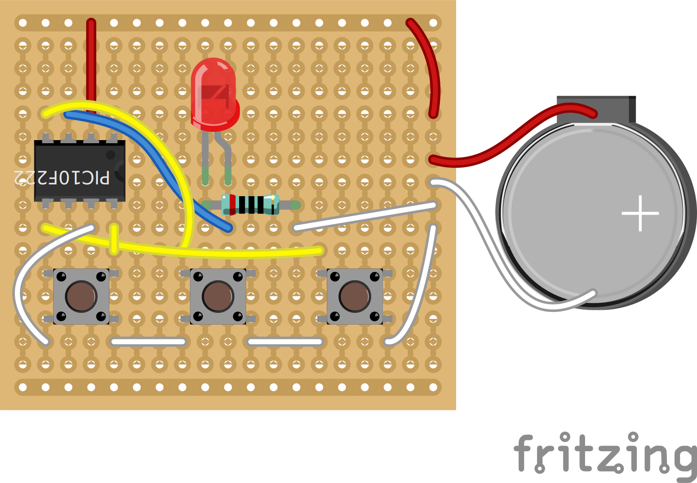

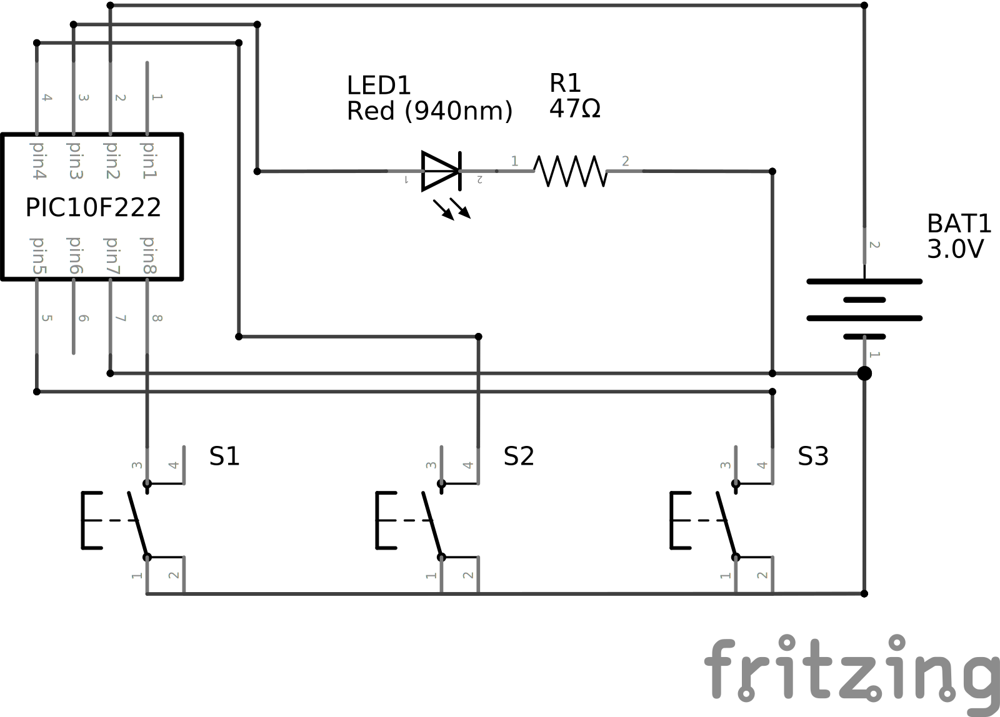

## PICプログラム

作成したプログラムを記載します。MPLAB IDEで作成し、Pickit5で書き込みました。

``` c++
// CONFIG
#pragma config IOSCFS = 4MHZ    // Internal Oscillator Frequency Select bit (4 MHz)
#pragma config MCPU = OFF       // Master Clear Pull-up Enable bit (Pull-up disabled)
#pragma config WDTE = OFF        // Watchdog Timer Enable bit (WDT enabled)
#pragma config CP = OFF         // Code protection bit (Code protection off)
#pragma config MCLRE = OFF      // GP3/MCLR Pin Function Select bit (GP3/MCLR pin function is digital I/O, MCLR internally tied to VDD)

#include <xc.h>
#define _XTAL_FREQ 4000000
#define pulse_emit() { GP2 = 1; __delay_us(12); GP2 = 0; __delay_us(1); }

void send_data(uint8_t data1, uint8_t data2) {
    for(uint8_t count = 0; count <= 88; count++){
        pulse_emit();
    }
    __delay_us(550);
    
    for(uint8_t i = 0; i < 6; i++) {
        if((data1 >> i) & 0x01) {
            // send 1
            for(uint8_t count = 0; count <= 44; count++) {
                pulse_emit();
            }
            __delay_us(550);
        } else {
            // send 0
            for(uint8_t count = 0; count <= 22; count++) {
                pulse_emit();
            }
            __delay_us(550);
        }
    }
    
    for(uint8_t i = 0; i < 6; i++) {
        if((data2 >> i) & 0x01) {
            // send 1
            for(uint8_t count = 0; count <= 44; count++) {
                pulse_emit();
            }
            __delay_us(550);
        } else {
            // send 0
            for(uint8_t count = 0; count <= 22; count++) {
                pulse_emit();
            }
            __delay_us(550);
        }
    }
}

int main(int argc, char** argv) {
    OPTION = 0b00000111; //GPWU無効、GPPU無効、プリスケーラー256
    OSCCAL = 0;
    ADCON0bits.ANS0 = 0; // GP0をデジタル
    ADCON0bits.ANS1 = 0; // GP1をデジタル
    TRISGPIO = 0b1011; // GP2:Output
    
    while(1) {
        GP2 = 0;
        if(GP0 == 0) {
            send_data(0b010101, 0b000010); __delay_ms(30);
            send_data(0b010101, 0b000010); __delay_ms(30);
            send_data(0b010101, 0b000010); __delay_ms(30);
            send_data(0b010101, 0b000010); __delay_ms(30);
        } else if(GP1 ==0) {
            send_data(0b010000, 0b000010); __delay_ms(30);
            send_data(0b010000, 0b000010); __delay_ms(30);
            send_data(0b010000, 0b000010); __delay_ms(30);
            send_data(0b010000, 0b000010); __delay_ms(30);
        } else if(GP3 ==0) {
            send_data(0b010001, 0b000010); __delay_ms(30);
            send_data(0b010001, 0b000010); __delay_ms(30);
            send_data(0b010001, 0b000010); __delay_ms(30);
            send_data(0b010001, 0b000010); __delay_ms(30);        }
        GP2 = 0;
        __delay_ms(500);
        SLEEP();
    }
    return (EXIT_SUCCESS);
}
```

一番のポイントは、`pulse_emit`マクロです。信号を40kHzのパルスで送信する必要がありますが、PIC10F222にはPWM(パルス幅変調)機能が無いため、力技でGP2ピンをON、タイマー、OFF、タイマーを繰り返すマクロを定義しました。40Hzだと、25μs周期になりますが、ロジックアナライザでパルスを見ながらタイマー値を調整しています。なので、`__delay_ms`の引数は個体差や環境によって変わるかもしれません。

また、1ビットを送る時間T=600μsだけ`pulse_emit`を繰り返しますが、これも`for`文での繰り返し回数はロジックアナライザで見ながら決めています。

PICの上位機種ではPWM機能や、割り込みを使ってより正確な信号を生成できるかと思いますが、今回は45円の格安PICで難しいことはやらずこのようにしました。

送信する信号は7+5=12bitなのですが、PICマイコンが8bitなので、1つの変数に格納することができません！8bitというと昭和のファミコン時代というイメージですが、マイコンではまだまだ健在なのですね。そういうわけで、`send_data`は引数を2つに分割しています。プログラムはAIに生成してもらったものをベースにしたため、微妙なのですが6bitずつに分割し、さらに反転させています。なので、ビット列が先程解析したものとは逆になってたりと見直す余地ありですがとりあえずこのまま載せます。

## Ballメイソンジャーに収納

さて、プログラムもできたのであとは外装ケースに収めます。

ラーメンタイマーは100均のプラケースに入れましたが、今回はテーブルの上に鎮座させたいため、家にあったBallメイソンジャーの小瓶を使ってみました。外観がオシャレで重量感もあるため、リビングのローテーブルに置いていい感じです。

蓋に基板の取り付け、LEDとボタンを露出するための穴加工を行いました。とても薄い鉄板だったので丸穴はポンチを使いなかなかきれいにできましたが、各穴はドリル、カッターやルーターを使い四苦八苦して微妙な出来栄えです。何か良い方法は無いものかと思います。

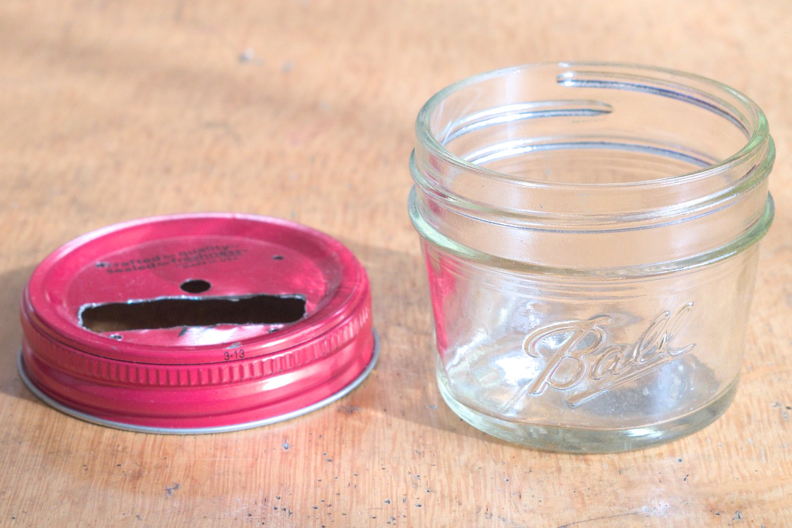

蓋と基板の間にカラーをはさみ高さを調整してボルトナットで固定します。

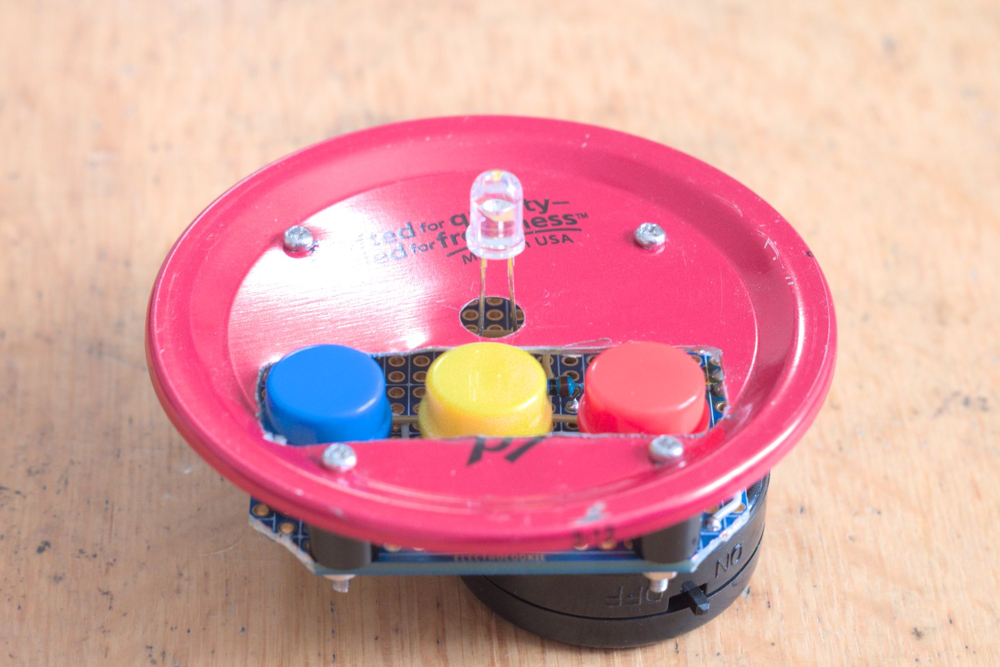

完成です！なかなかおもしろい形となり、満足できる出来栄えになりました。

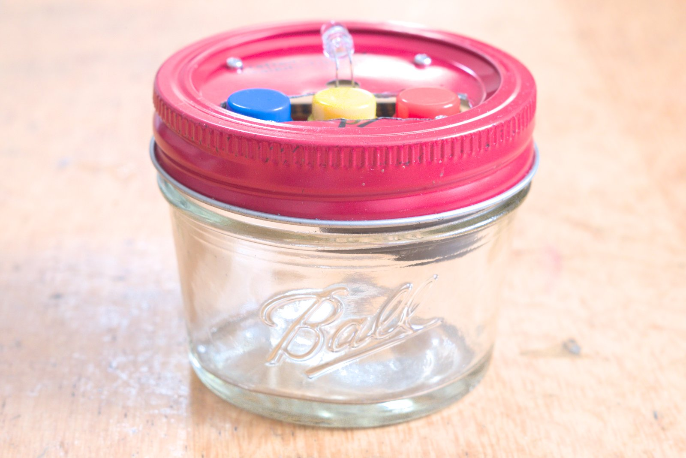

真上から見るとこんな感じです。やはり切り欠きが気になりますね。最近は個人でも手が出るくらいの価格でレーザーカット装置が出てきたりしていますが、置き場や導入後の運用、もしもの安全とかを考えるとおいそれとは買えないです。

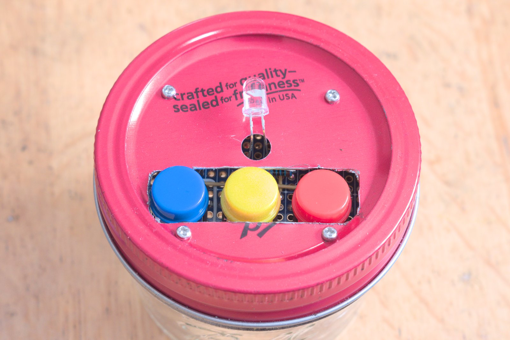

## 使用感

ドキドキとテレビのスイッチをONしてみます。ちゃんと電源入りました！抵抗の選定を間違えたので2mくらいしか離せませんが、ローテーブルがテレビの近くにあるのでとりあえず問題は無く使えています。

ボタンがペコペコと結構大きな音がなりますが、それも愛嬌だと思って愛着が湧いてきますね。

## まとめ

PIC10F222と赤外線LEDを使いTVリモコンを自作しました。赤外線通信の解析と、タイマーでパルス幅を合わせるところがやや難しそうに見えますが、IRレシーバやロジックアナライザの使い方はすぐに理解できました。配線やプログラムはシンプルなので思っていたよりすんなりと作ることができ、自作リモコンを操作する満足感も味わえるので初心者にもおすすめの電子工作だと思います。
