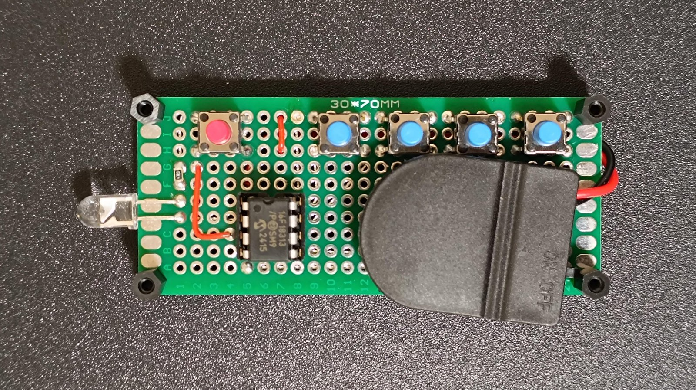
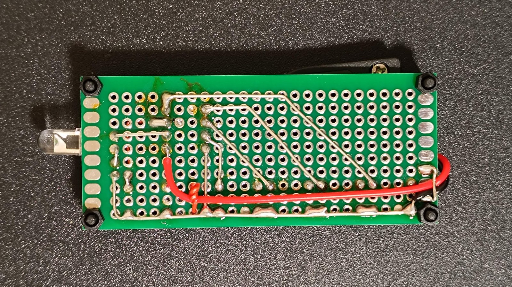
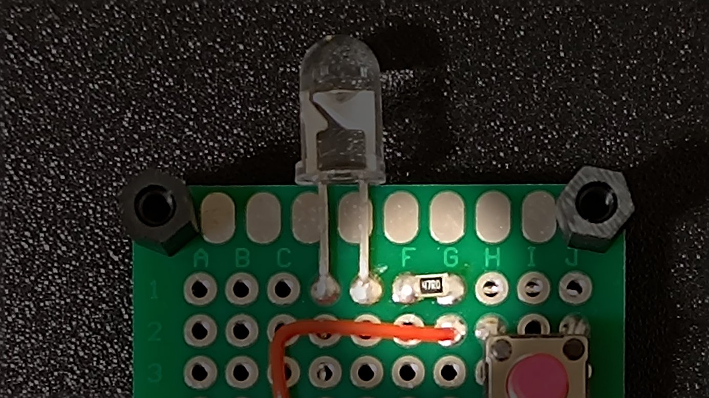
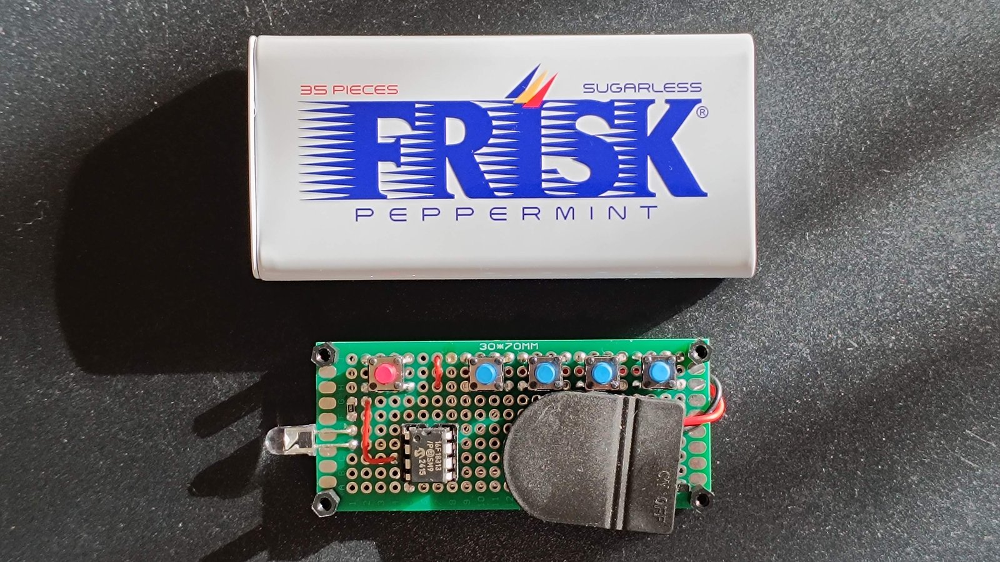
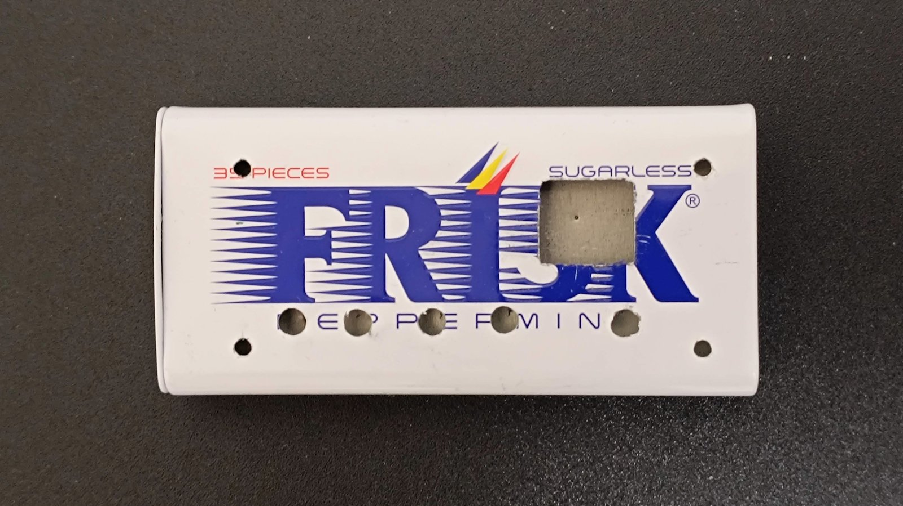
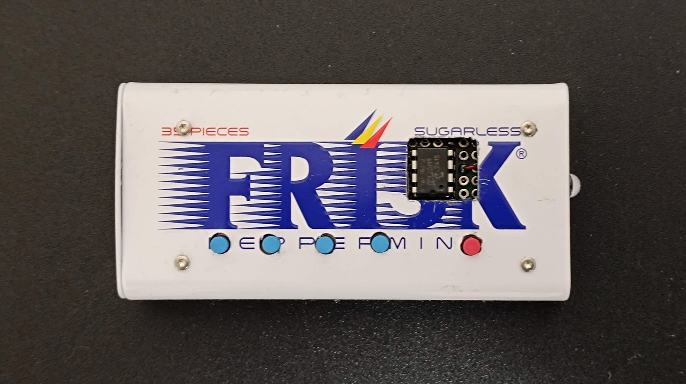

Youtubeの動画などでFRISKケースを使った電子工作の例を見て自分もやってみたい、と思いましたが、FRISKケースがいつの間にかプラスチックから金属缶に変わっていました。

金属加工の難易度は上がりそうなものの、容積は大きくなり入れられる物の自由度は高くなりそうです。FRISK金属ケースを使った電子工作の例はあまりなさそうだったので、テレビのリモコンを製作してみました。

先日PIC10F222を使いテレビのリモコンを電子工作しましたが、今回全く同じではつまらないので、少し機能の高いPIC16F18313を選び、WPM機能を使ってみたいと思います。


## 必要なものや赤外線通信の解析方法、回路図

PIC10F222を使った下記の記事とほぼ一緒です。



PIC10F222もPIC16F18313も8ピンですが、PIC10F222の場合は2ピンは使用できないためLED、電源、GNDの他にボタン3つまでしか使えませんでしたが、PIC16F18313はすべてのピンが使用できるため、音量大・小を追加し、ボタンを5つ配置しました。

| ボタン | データ  | アドレス |
|--------|---------|----------|
| 電源   | 1010100 | 10000    |
| CH送り | 0000100 | 10000    |
| CH戻し | 1000100 | 10000    |
| 音量大 | 0000100 | 10000    |
| 音量小 | 1000100 | 10000    |

## FRISKケースにピッタリの30X70mmユニバーサル基板

FRISKケースは小さいため、基板のカットが必要になるかと思いましたが、[30X70mmのユニバーサル基板](https://amzn.to/4pS54p3)がちょうどよいサイズにフィットしました。FRISK缶電子工作にはおすすめの基板です。



スイッチは、[カラーのボタンのタクトスイッチ](https://amzn.to/49CneX5)を購入しました。少し割高ですが、電源ボタンと操作ボタンで色を変えたかったのと、高さが欲しいためです。ボタンの高さは7mmですが、8ピンソケットに刺したPICと同じ高さになってしまったのでPIC部分もケースを切り欠き必要になったので、もう少し高いスイッチだとよかったかもしれません。でも、カラーボタンのものはこれしか見つかりませんでした。

配線は、[0.65mmすずめっき線](https://amzn.to/49GmpN6)と[0.51mmのジュンフロン線](https://amzn.to/3ZuefBf)を使用しました。すずめっき線はやや太すぎると感じたので次回は0.4mmあたりでやってみたいですね。



抵抗は、今回[チップ抵抗](https://amzn.to/4bgNbwE)のはんだ付けにも挑戦。別に普通のリード線が付いたもので良かったのですが、うまくはんだ付けでき、スッキリしていい感じです！



## FRISKケースに格納

FRISKケースと中に入れる基板の大きさはこんな感じです。基板の四隅にはM2×6mmの六角支柱を付けています。



基板固定用のφ2.5mm穴、ボタン用のφ4mm穴、そしてPICマイコンの逃げ用の角穴をあけます。側面にLEDの逃げ穴φ6mmも加工しています。



基板を入れ、ボルトで固定します。指が入らないのでやりにくかったですが、なんとか行けました。ボルト、ボタン用の穴はうまく行きましたがPICマイコンの逃げが寸法間違えてしまい大きくなってしまいました💦



赤外線LEDの穴もうまく合いました！


角穴は、電動ドリルをドリルスタンドに固定し、フライス用の刃でラフに穴をあけたあと、[ダイヤモンドヤスリ](https://amzn.to/4pX2fDd)で整えました。ケースが薄いため、ヤスリで意外と削っていくことができました。

## PICプログラム

PIC16F18313は、MPLAB X IDEからMCCというビジュアル的に設定を行うツールが使えるため、設定が楽にできるということでしたが、このMCCの使い方がよくわからず、結局AIとネットコピペを組み合わせ下記のようなコードとなりました。

``` c
#include <stdio.h>
#include <stdlib.h>
#include <xc.h>
#define _XTAL_FREQ 32000000

// Define Timing
#define T_US 600

// Define IR LED pin
#define LED    LATAbits.LATA5

// Define Buttons (Active Low)
#define BTN_CH_INC_PIN PORTAbits.RA0
#define BTN_CH_DEC_PIN PORTAbits.RA1
#define BTN_VOL_UP_PIN PORTAbits.RA2
#define BTN_VOL_DOWN_PIN PORTAbits.RA3
#define BTN_POWER_PIN PORTAbits.RA4

#pragma config FEXTOSC = OFF,RSTOSC = HFINT32  // HFINTOSC (32MHz)
#pragma config CLKOUTEN = OFF,CSWEN = OFF,FCMEN = OFF
#pragma config MCLRE = OFF,PWRTE = OFF,WDTE = OFF,LPBOREN = OFF
#pragma config BOREN = OFF,BORV = LOW,PPS1WAY = OFF,STVREN = ON
#pragma config DEBUG = OFF
#pragma config WRT = OFF,LVP = OFF,CP = OFF,CPD = OFF

// Function Prototypes
void SYSTEM_Initialize(void);
void PWM5_Initialize(void);
void IR_Send(uint16_t data);

int main(int argc, char** argv) {
    SYSTEM_Initialize();
    
    // Enable Interrupt-on-Change for Wake-up
    // GIE=0: Execution continues after SLEEP (no ISR vector)
    // PEIE=1: Peripheral Interrupts Enabled (required for IOC)
    INTCONbits.GIE = 0;
    INTCONbits.PEIE = 1;

    while(1){
        // 1. Enter Sleep if no buttons are pressed (All inputs High)
        if ((PORTA & 0b00011111) == 0b00011111) {
            IOCAF = 0; // Clear IOC flags
            SLEEP();
            NOP();
        }
        
        // 2. Debounce/Wake-up delay
        __delay_ms(20);

        uint16_t command = 0;
        
        // Check Buttons (Active Low)
        if (BTN_CH_INC_PIN == 0) {
            // RA0: 000010010000
            command = 0b000010010000;
        } else if (BTN_CH_DEC_PIN == 0) {
            // RA1: 100010010000
            command = 0b100010010000;
        } else if (BTN_VOL_UP_PIN == 0) {
            // RA2: 010010010000
            command = 0b010010010000;
        } else if (BTN_VOL_DOWN_PIN == 0) {
            // RA3: 110010010000
            command = 0b110010010000;
        } else if (BTN_POWER_PIN == 0) {
            // Power: 101010010000
            command = 0b101010010000;
        }
        
        if( command != 0 ){
            T2CONbits.TMR2ON = 1; // Start Timer 2
            IR_Send(command);
            T2CONbits.TMR2ON = 0; // Stop Timer 2
            __delay_ms(40);
        }
    }
    return (EXIT_SUCCESS);
}

void SYSTEM_Initialize(void) {
    LATA = 0x00;
    TRISA = 0b00011111; // RA5(bit 5) output , others input
    ANSELA = 0x00;      // All digital
    WPUA = 0b00011111;  // WPUA: Weak Pull Up. Enable for RA0-RA4
    RA5PPS = 2;         // PPS - Peripheral Pin Select. Map PWM5 to RA5
    
    // IOC Setup
    // Enable Negative Edge IOC for RA0-RA4
    IOCAN = 0b00011111; 
    IOCAP = 0x00;
    IOCAF = 0x00;
    PIE0bits.IOCIE = 1; // Enable IOC Interrupt

    // Initialize PWM
    PWM5_Initialize();
}

void PWM5_Initialize() {
    // Using Timer 2 for PWM5
    T2CON  = 0b00000000; // TMR2 OFF (bit 2 = 0), Prescale 1:1
    // Configure Timer 2
    // Fosc = 32MHz. 
    // Target Freq = 40kHz -> Period = 25us.
    // T2PR = [Period / (4 * Tosc * Prescale)] - 1
    // Tosc = 1/32M = 31.25ns.
    // 4 * Tosc = 125ns.
    // 25us / 125ns = 200.
    // With Prescale 1.
    // PR2 = 200 - 1 = 199.
    PR2    = 199;
    // PWM5CON= 0b11000000; // PWM5 enable PWM5CONbits.PWM5EN = 1 (bit7), Active High (bit4:PWM5POL=0)
    PWM5CON= 0b00000000; // PWM5 enable PWM5CONbits.PWM5EN = 1 (bit7), Active High (bit4:PWM5POL=0)
    PWM5DCH= 60;
}

void IR_Send(uint16_t data) {
    PWM5CONbits.PWM5EN = 1;
    __delay_us(T_US * 4);
     for (int i = 11; i >= 0; i--) {
        int bit = (data >> i) & 1;
        if(bit){
            PWM5CONbits.PWM5EN = 0;
            __delay_us(T_US);
            PWM5CONbits.PWM5EN = 1;
            __delay_us(T_US * 2);
        } else {
            PWM5CONbits.PWM5EN = 0;
            __delay_us(T_US);
            PWM5CONbits.PWM5EN = 1;
            __delay_us(T_US);
        }
    }
    PWM5CONbits.PWM5EN = 0;
}
```

ポイントは、`PWM5_Initialize()`関数で40kHzのパルス設定を行い、`IR_Send(uint16_t data)`関数で`PWM5CONbits.PWM5EN`ビットをON/OFFすることで信号を送信しているところです。

ロジックアナライザでPICのGPIOピンからの出力を確認後、テレビに向けて操作すると無事動作しました。

## まとめ

金属管のFRISKケースを使い、テレビのリモコンを創ることができました。30x70mmのユニバーサル基板を収めることができるためいろいろな用途に可能性がありそうです。板厚が薄く表面がツルツルなのでドリルの位置ずれや引っ掛かり、反対側への貫通に気を使う必要がありますし、中に手が入らないので基板の固定がやや大変ですが外観、質感とも満足できる結果となりました。

