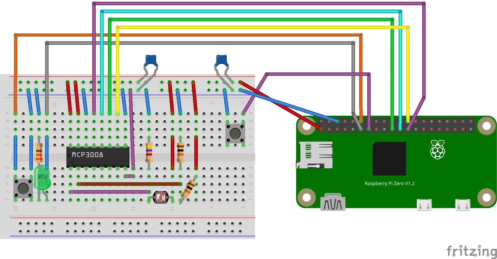
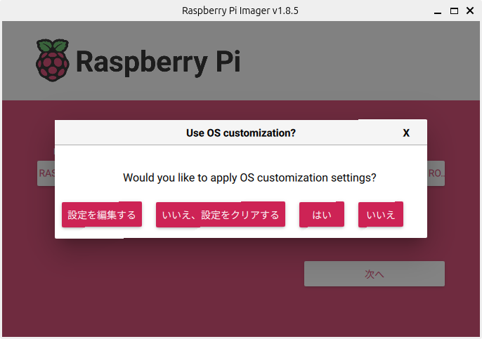
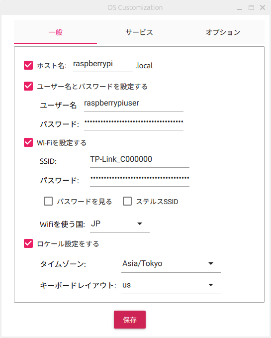
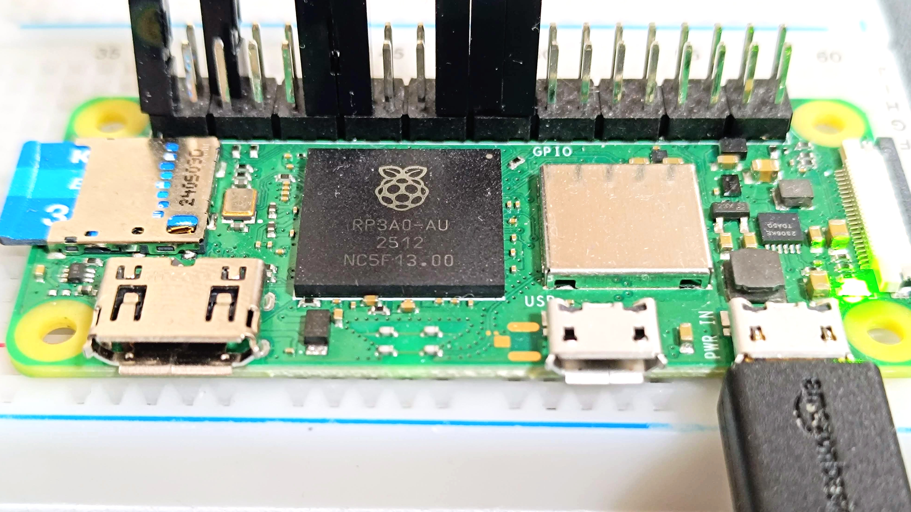
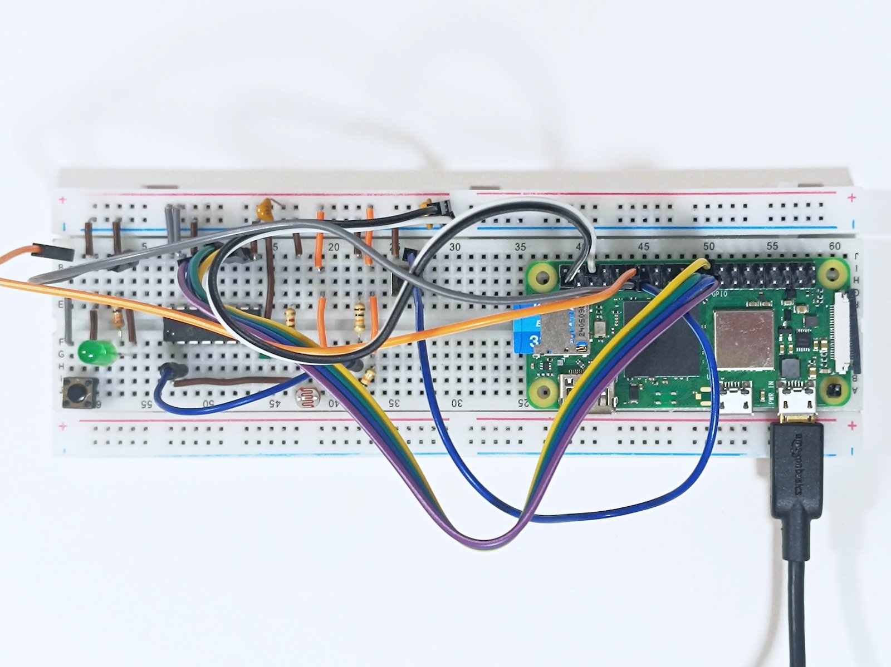
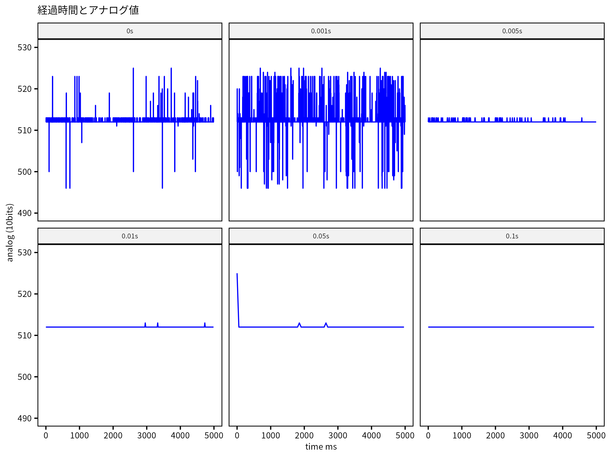
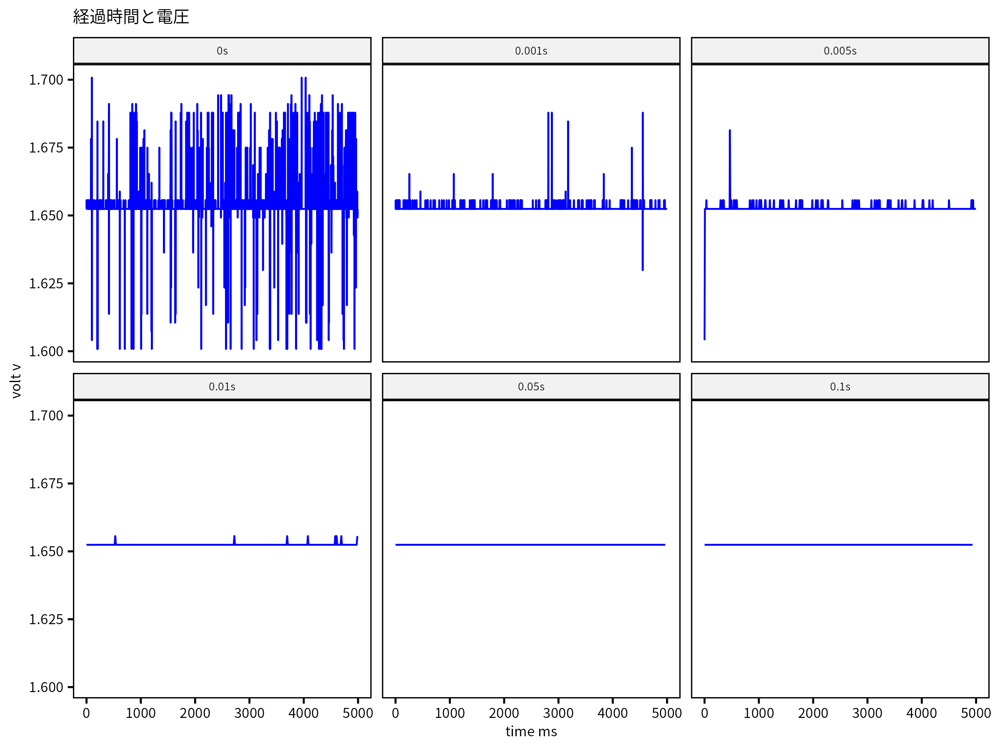
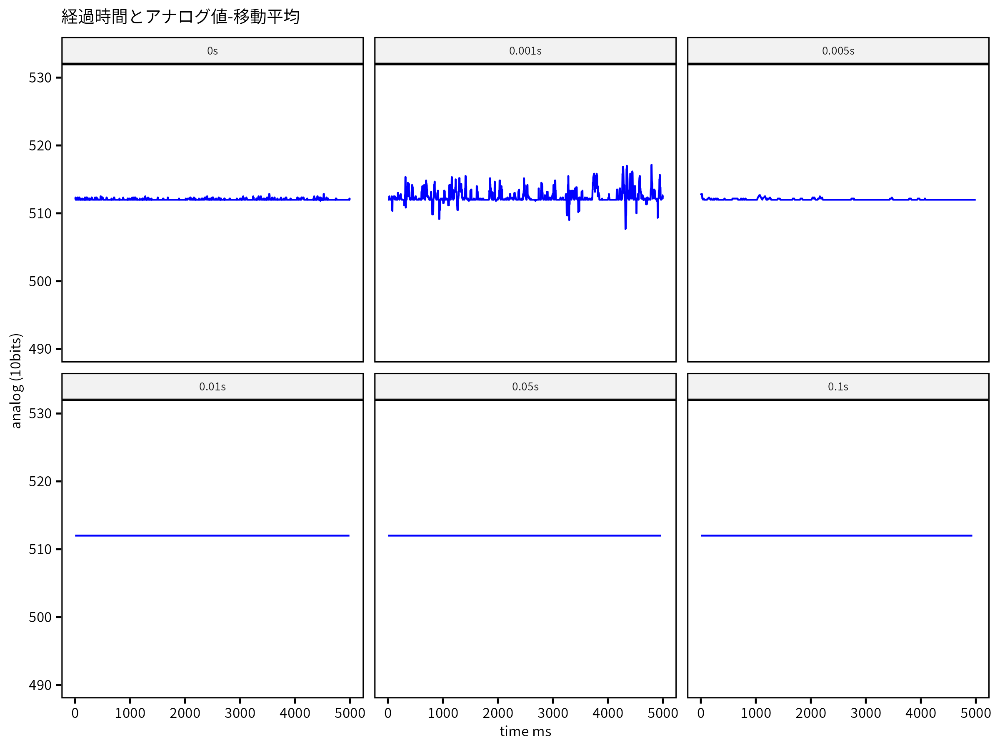
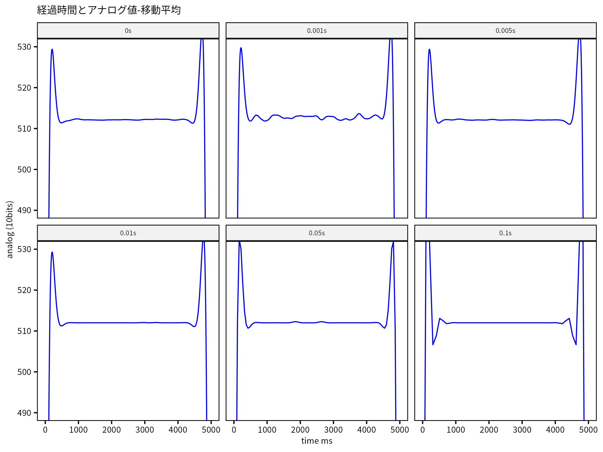

---
categories:
- 電子工作
date: "2025-10-04T15:05:02+09:00"
draft: false
images: 
- images/breadboard_3.jpg
summary: Raspberry Piと10bit ADコンバータ MCP3008を使いアナログ入力データロガーを自作しました。
tags:
- Raspberry Pi Zero 2 W
- MCP3008
- ADC
title: Raspberry Pi Zero 2 W とADコンバータを使って格安データロガーを作ってみた
js: "js/paad.ts"
---

## なぜデータロガーを自作する？

趣味で電気工作をしたり、仕事で設備や機器を扱っていると、センサーの出力や温度などを記録したい場面が出てきます。そこでデータロガーを使いたくなります。アマゾンなどで購入できるものはだいたい温度記録用くらいで、アナログ電圧をそれなりの周波数で記録できる製品はなかなか見当たりません。産業用ではキーエンス製のデータロガーなどがありますが、個人で手がでるような価格ではなく、会社で購入としても簡単に許可が下りるものでもないでしょう。

そこで、産業用レベルの性能、精度まではいらないまでも、センサー出力の経時変化を見ることができればいろいろと有用と思い、Raspberry Piと10bit ADコンバータ MCP3008を使いアナログ入力データロガーを自作してみました。

## 必要なもの

### 部品

まずは必要な部品を揃えていきます。ほぼすべてAmazonで購入しました。抵抗やコンデンサなどの小物は秋月電子あたりが安いですが、送料がかかるのであまり差はなさそうです。実店舗が近い人は羨ましいですね。

Raspberry Piは、一般的なモデルであるRaspberry Pi5ではなく、小型のRaspberry Pi Zero 2 WHを選びました。小さくて持ち運びに便利そうという理由ですが、Raspberry Pi5でも同様に動くと思います。

1. Raspberry Pi Zero 2 WH
1. microSDカード
1. モバイルバッテリー
1. microUSBケーブル
1. ADコンバータ MCP3008
1. ブレッドボード
1. タクトスイッチ
1. LED
1. 光センサー (CdSセル)
1. 抵抗 330Ω、10kΩ×2、5kΩ
1. コンデンサ 10uF, 0.1uF
1. ジャンパー線、QIコネクタセット

電気工作自体、興味はあったものの初めての経験で何も持っていなかったので、小物はLED、抵抗、ケーブル、ブレッドボードなどがセットになったものを購入しました。


 
### 工具

今回はあらかじめカットされた単線のジャンパー線と、QIコネクタの付いたより線のジャンパー線が含まれるセットを使ったので、工具は抵抗の足を切ったくらいではさみかニッパーだけで事足りました。できればきちんと線の長さを揃えたほうがよいかと思いますので、

 - ケーブルストリッパー
 - QIコネクタかしめ工具
 
 くらいは持っておいて損はないでしょう。

### PC
Raspberry Piに直接モニタ、キーボード、マウスを繋げてもよいのですが、今回はLinux(Ubuntu)PCからSSHでRaspberry Piに入り開発を行いました。

## 回路図



MCP3008とRaspberry PiはSPIで接続します。接続するピンの対応表は以下の通りです。

| MCP3008  |   | Raspberry Pi  |   |
|---|---|---|---|
| 9 | DGND | 1  | 3.3V  |
| 10 | CS/SHDN  | 26  | SPI_CE0_N  |
| 11 | DIN  | 19  | SPI0_MOSI  |
| 12 | DOUT  | 21  | SPI0_MISO  |
| 13 | CLK  | 23 |  SPI0_CLK |
| 14 | AGND  | 6  | GND  |
| 15 | VREF  | 1  | 3.3V  |
| 14 | VDD  | 1  | 3.3V  |

MCP3008は2.7〜5Vで動作しますが、Raspberry PiのGPIOの入力電圧は3.3Vまでの制約があるため、MCP3008のVDD, VREFは3.3Vにしました。アナログ入力の最大電圧はVREFで決まり、5Vまで測定したい場合はVREFのみ5Vを入れてあげればよいと思います。

また、アナログ入力の分解能は10bitなので、測定できる電圧の最小単位は、LSB Size = VREF / 1024 で、今回の場合 約3.2mV になります。

アナログ入力は、疑似差動モードもできるようですが、今回は1番ピン(CH0)にCdS光センサーを、2番ピン(CH1)に抵抗で分圧した1.65Vを入力しました。

## 格安データロガー作成手順

### Raspberry Pi Zero 2 WにOSをインストール

[Raspberry Pi Imager](https://www.raspberrypi.com/software/)をインストールし、microSDカードに書き込みます。

```sh
$ sudo apt install rpi-imager
```

rpi-imagerを起動して、デバイス、OS、書き込み先ストレージを選びます。



初めからSSH接続をしたいので、Wifiの設定をするため、設定を編集します。



WifiのSSID、パスワードを入れます。これをやっておけばOSをインストール後、Raspberry Piの電源を入れればWifiに繋がるようになります。


インストール直後からWifiからSSHで接続できるよう、SSHを有効にし、WifiのESSID、パスワードを入れておきます。


書き込み完了です。microSDカードを差し込み電源を入れましょう。

電源は、Micro USB Type-Bで供給しますが、今回はアナログ入力があるため、コンセントやPCから取るとノイズが心配だったのでモバイルバッテリーから供給しました。



### Pythonの設定

Raspberry Piが立ち上がったらSSHで接続しましょう。

```sh
$ ssh raspberrypi.local
```

venv環境でライブラリを入れます。venvで普通に仮想環境を作成すると、Raspberry Piに標準で入っているRPi.GPIOなどのモジュールが含まれません。そのため、--system-site-packages オプションを付けてvenv環境を作成します。今回はvenvのフォルダ名をmcp3008_venvとしました。

```sh
$ python -m venv mcp3008_venv --system-site-packages
$ source mcp3008_venv/bin/activate
```

MCP3008は、SPI通信を使いますが、gpiozeroモジュールを使うと簡単に取り扱いできるので、これを入れます。

```sh
$ pip install gpiozero
```


### いよいよ配線

やっとRaspberry Piの環境が整ったのでブレッドボードに部品を取り付け配線をしていきます。ブレッドボードにADコンバータを取り付ける。スイッチ、LED、光センサーを差し込む。Raspberry Pi Zero 2 WのGPIOピンからブレッドボードにジャンパー線を差し込む。ブレッドボード内の線を繋ぐ。なんやかんやと、いきなりですが完成の写真です！



### プログラムを作成する

だいぶ長くなってしまいました。以下がコードです。

```python
import threading
import RPi.GPIO as GPIO
from gpiozero import MCP3008
import time
import csv
from datetime import datetime

GPIO.setmode(GPIO.BCM)


## アナログ入力とLEDの点滅をそれぞれ別のスレッドで行う
class LEDThread(threading.Thread):
    def __init__(self):
        super().__init__()
        self.running = False

        # LED pin settings
        GPIO.setup(17, GPIO.OUT)

    def run(self):
        self.running = True
        while self.running:
            GPIO.output(17, 1)
            time.sleep(0.5)
            GPIO.output(17, 0)
            time.sleep(0.5)
        GPIO.cleanup(17)

    def stop(self):
        self.running = False


class AnalogRead(threading.Thread):
    def __init__(self, interval):
        super().__init__()
        self.running = False
        self.vref = 3.30
        self.interval = interval
        # analog settings
        self.channel0 = MCP3008(channel=0, device=0, max_voltage=self.vref)
        self.channel1 = MCP3008(channel=1, device=0, max_voltage=self.vref)
        self.channel2 = MCP3008(channel=2, device=0, max_voltage=self.vref)
        self.channel3 = MCP3008(channel=3, device=0, max_voltage=self.vref)
        print("Analog read init done.")

    def run(self):
        print("Analog run")
        print(f'{"time":^11} | {"V0":^8} | {"V1":^8} | {"V2":^8} | {"V3":^8}')
        self.running = True
        with open(data_file_name(self.interval), "w") as f:
            writer = csv.writer(f)
            start_time = time.time()
            writer.writerow(["time", "b0", "v0", "b1", "v1", "b2", "v2", "b3", "v3"])
            while self.running:
                elapsed_time = (time.time() - start_time) * 1000  # ms
                v0 = self.channel0.voltage
                v1 = self.channel1.voltage
                v2 = self.channel2.voltage
                v3 = self.channel3.voltage

                b0 = self.channel0.raw_value
                b1 = self.channel1.raw_value
                b2 = self.channel2.raw_value
                b3 = self.channel3.raw_value

                print(
                    f"{elapsed_time:6.4f} | {b0:04}, {v0:1.6f} | {b1:04}, {v1:1.6f} | {b2:04}, {v2:1.6f} | {b3:04}, {v3:1.6f}"
                )
                writer.writerow([elapsed_time, b0, v0, b1, v1, b2, v2, b3, v3])
                time.sleep(self.interval)

    def stop(self):
        self.running = False


## 保存するデータのファイル名を決める関数
def data_file_name(interval):
    today = datetime.now()
    y = today.year
    mo = today.month
    day = today.day
    h = today.hour
    m = today.minute
    s = today.second
    return f"data_{str(interval)}_{y}{mo:02}{day:02}{h:02}{m:02}{s:02}.csv"


## 最短から0.5秒ごとに測定ルーチン
def measure():
    for i in [0, 0.001, 0.005, 0.01, 0.05, 0.1, 0.5]:
        print(f"Get analog data each {i}ms")
        led = LEDThread()
        analog = AnalogRead(i)
        led.start()
        analog.start()
        time.sleep(5)
        led.stop()
        analog.stop()
        led.join()
        analog.join()


## ボタンを押すと測定開始/終了する
running = False
led = None
analog = none


def toggle_measuring(gpio_pin):
    global running
    global led
    global analog
    if running == False:
        running = True
        led = LEDThread()
        analog = AnalogRead(0.01)  # 0.01msのタイマーを入れる
        led.start()
        analog.start()
    else:
        led.stop()
        analog.stop()
        led.join()
        analog.join()
        running = False


## メイン関数
if __name__ == "__main__":
    # GPIO setting
    GPIO.setup(18, GPIO.IN, pull_up_down=GPIO.PUD_UP)
    GPIO.add_event_detect(18, GPIO.FALLING, callback=toggle_measuring, bouncetime=300)

    print("MCP3008 analog data logger")
    print("resolution: 10bit")
    print("max input voltage: 3.30v")

    try:
        # 検証用；アナログ読み込み間隔を0〜0.5sで振ってみる
        # measure()
        while True:
            sleep(1)
    except KeyboardInterrupt:
        print("Ctrl-c key pressed")
        raise
```

ポイントだけ抜き出すと、下記のような感じで、モジュールを読んだら初期化して、ループを回して値を読む流れです。

```python
# モジュールを読み込む
from gpiozero import MCP3008

# チャンネルを初期化 deviceはMCP3008のアナログピン番号
# max_voltageは、MCP3008に入力する電圧(VREF)
channel0 = MCP3008(channel=0, device=0, max_voltage=3.3)

# 値を読む
v0 = channel0.voltage # ボルト
b0 = channel0.raw_value # 生データ
```

データ取り込み中に別スレッドでLEDをチカチカさせたい、ボタンでスタート/ストップするコードも入れたので冗長になってしまいました。

## 動作確認と評価

### 抵抗で分圧した1.65Vを測定

まず、取り込み間隔にタイマーをいれず、最短でループを回し測定してみたところ、それなりにノイズが乗っていました。GNDや電源、LED、ついでに付けた光センサーなど何らかのノイズの影響かな、といろいろやってみましたがあまり変化なく、取り込み間隔にタイマーを入れると、5〜10msくらいで安定してきました。




Vdd = Vref = 3.3V、測定電圧1.65Vで半分、読み取り値は1024/2=512で、取り込み値もほぼ512になりました。

アナログ値はタイマー0より1ms入れたほうがばらつきが大きくなるのに対し、電圧は逆です。これはアナログ、電圧とそれぞれ値を読んでいるので、読み込む際のタイミングの違いでこうなっているのだと思います。

5ms以上でも、たまにスパイクした値が出てくるので、取得したデータをRで移動平均を取ってみるとだいぶ安定したように見えます。`slider`パッケージというのを使い、10店平均で15%の外れ値を除く処理です。

```R
library("slider")
analog_slide <- slide_vec(.x = analogdata, .f = ~ mean(., trim = .15), .before = 10)
```


ローパスフィルタなるものをかけてみたらもっと良くなるのでは！？と素人ながらバターワースフィルタを使ってみましたが、微妙ですね。。。



スパイクがどこからくるのか、最適な処理方法は、など、課題はありますが、データロガーとしてそれなりに使えそうなことが分かりました。

## まとめ

Raspberry Piと10bit ADコンバータ MCP3008を使いアナログ入力データロガーを自作した結果は、それなりに使えそうなものができて満足です！

欲を言えばもう少し解像度が高いとうれしいので、今後12bit, 16bitあたりのADCも試してみたいと思います。

また、Raspberry PiはLinuxベースのOSが載っているのでSSHで接続したりRaspberry Piの中でデータ加工とかもいろいろでき便利なのですが、電源を切るときはシャットダウンしないといけないなど、少し面倒にも感じます。アナログ入力も別でADCを用意する必要があります。

アナログ入力ピンがあり、電源ブツ切りOKなArduinoやESP32なども今後試してみたいと思います！


