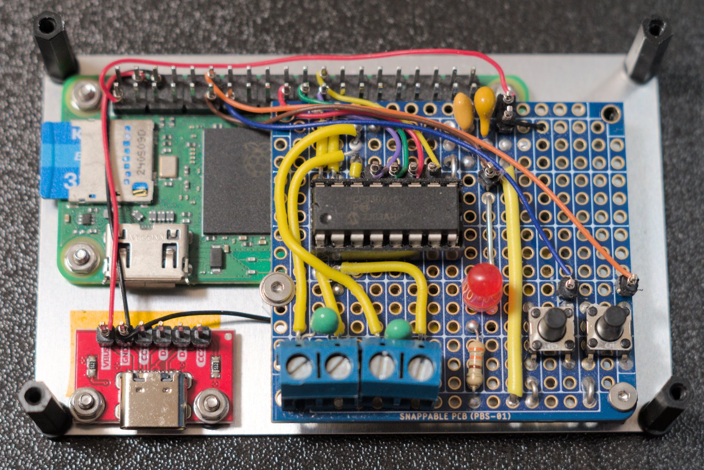
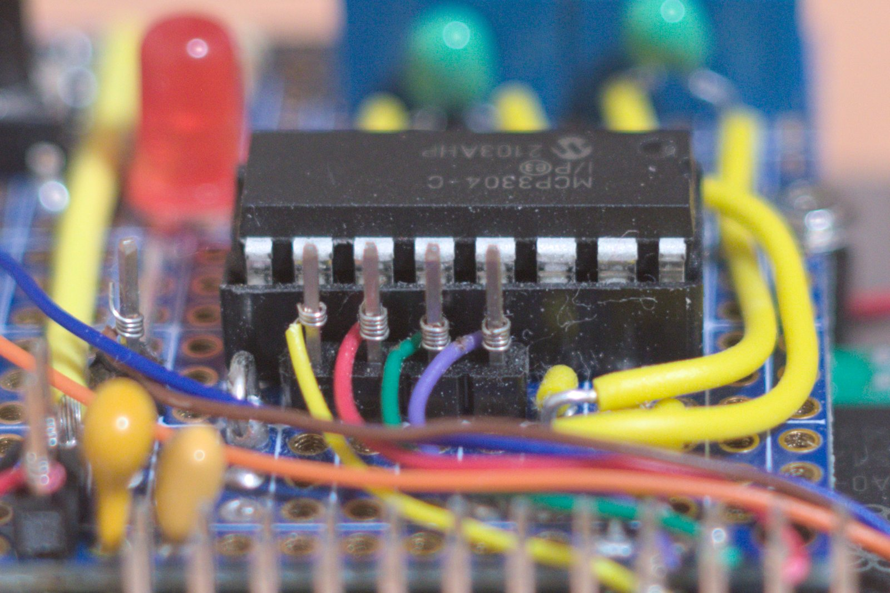
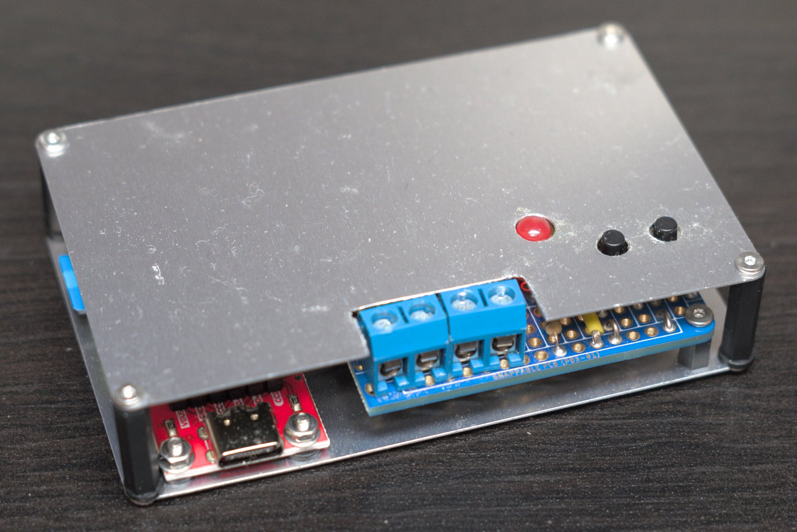
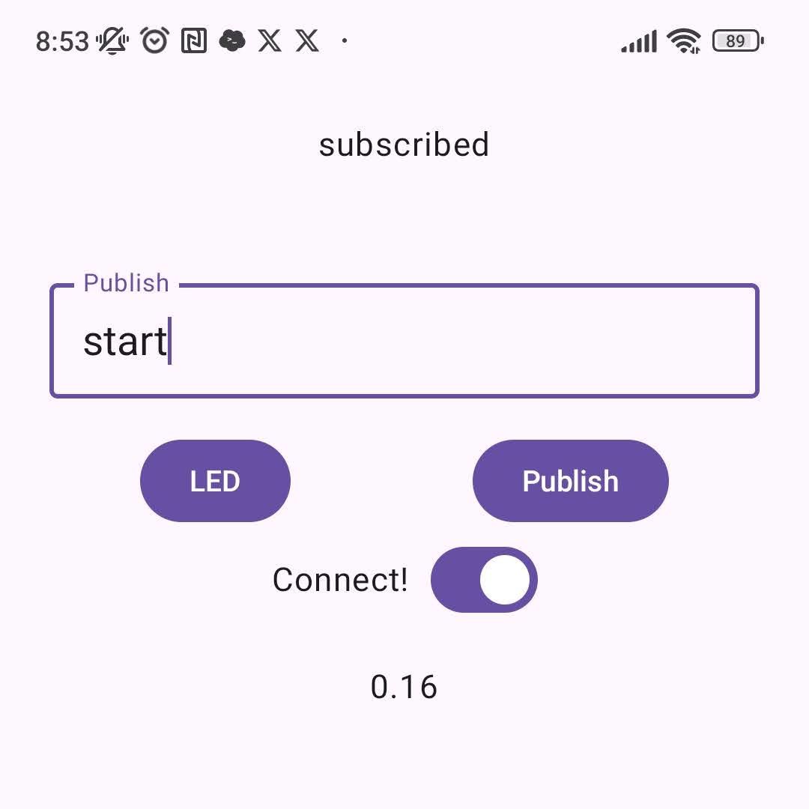
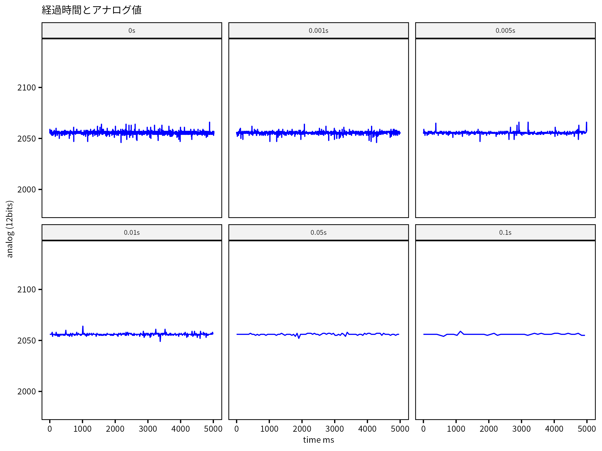
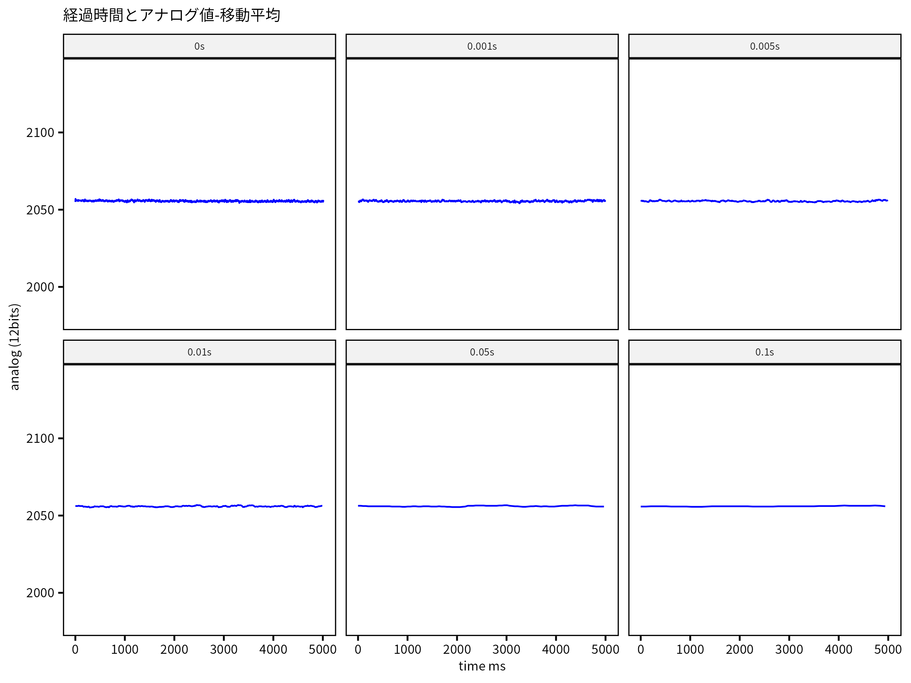
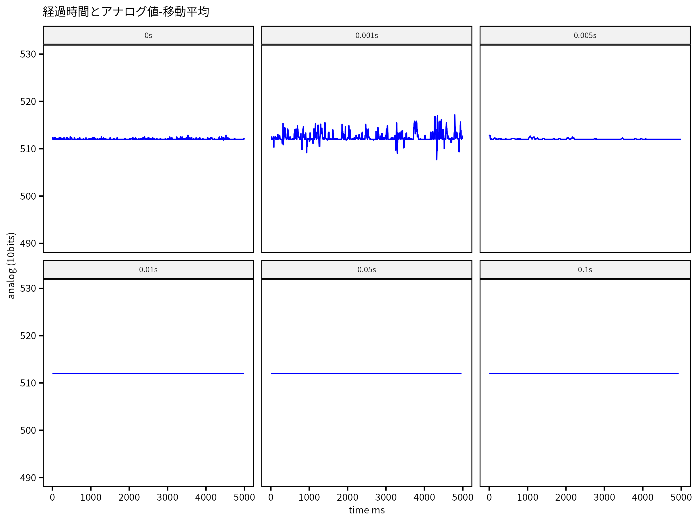

---
categories:
- 電子工作
title: Raspberry Pi Zero 2 W で格安データロガーを製作 MCP3208 MCP3304編
date: 2026-01-01T08:08:52+09:00
summary: Raspberry Piと12bit AD MCP3208, 13bit ADC MCP3304 を使いアナログ入力データロガーを自作しました。10bit ADC MCP3008と比較し測定精度を評価します。MQTTを使い、ワイヤレスでの通信にも挑戦。
draft: false
images:
- images/wire_wrapping.jpg
tags:
- Raspberry Pi Zero 2 W
- MCP3208
- MCP3304
- ADC
- ワイヤーラッピング
js: "js/paad.ts"
---

## 12bit ADC MCP3208 と 13bit ADC MCP3304

DIYで格安にデータロガーを作ろうと思いたち、ブレッドボードにMCP3008を配線して評価しました。なかなかいい感じにできたのですが、分解能が10bit(1024)ということで、もう少し精度良く見れないかと思いMicrochipの同シリーズで12bitのMCP3208、13bitのMCP3304を購入しました。

前回のMCP3008は下記の記事を参照ください。



## 基板へのはんだ付けに挑戦、名刺サイズにコンパクト化

前回と同じ回路を使えばADCの違いを純粋に評価できるのですが、今後持ち運んで使うことも想定し、基板にはんだ付けしてケースに収めることにしました。

名刺サイズのアルミプレートを購入し、その上にRaspberry pi Zero 2 WとADC、スイッチ、LEDなどを載せた基板を固定。電源のMicroUSBポートが隠れてしまったのでUSB-Cコネクタ基板も購入し、USB-Cで電源供給するようにしました。



USB-Cから直接Raspberry piのGPIOピンに5V, GNDを接続しています。ADCへはRaspberry piの3.3V GPIOピンから給電しました。

Raspberry piは、ピンヘッダー付きのものを購入しており、Qiコネクタだと高さが嵩張るしはんだ付けも微妙と思っていたところ、ワイヤーラッピングという技術を知り興味本位で基板間の配線はワイヤーラッピングでしてみました。



入手性の良いものは配線太さAWG30一択であり、細いのが強度的にも、ADCのノイズ的にも若干心配ではありますが、見た目はいい感じです。

名刺サイズのアルミプレート2枚と六角支柱を使い、ケースのような形にして完成です。なかなかいい感じに仕上がりましたが、Raspberry pi基板上のLEDが見えなくなってしまったのがいまいちです。



## プログラムを修正

前回のプログラムでは、データを取得ごとにファイルをオープンし、書き込むようにしていましたが、今回はメモリ上のバッファに測定値を溜めて測定終了後にファイル書き込みを行うように変更しました。毎回ファイル書き込みを行うより測定値のばらつきが何故か安定化しましたのでこうしています。

``` python
import threading
import RPi.GPIO as GPIO
from gpiozero import MCP3304
import time
import csv
from datetime import datetime
import paho.mqtt.client as mqtt
from paho.mqtt.subscribeoptions import SubscribeOptions

## Global variables
running = False
led = None
analog = None
client = None

## Global settings
GPIO.setmode(GPIO.BCM)

## Classes アナログ入力とLEDの点滅をそれぞれ別のスレッドで行う
class LEDThread(threading.Thread):
    def __init__(self):
        super().__init__()
        self.running = False

        # LED pin settings
        GPIO.setup(17, GPIO.OUT)

    def run(self):
        self.running = True
        while self.running:
            GPIO.output(17, 1)
            time.sleep(0.5)
            GPIO.output(17, 0)
            time.sleep(0.5)
        GPIO.cleanup(17)

    def stop(self):
        self.running = False


class AnalogRead(threading.Thread):
    def __init__(self, interval):
        super().__init__()
        self.running = False
        self.vref = 3.3
        self.interval = interval
        self.buff = [["time", "b0", "v0", "b1", "v1", "b2", "v2", "b3", "v3"]]
        # analog settings
        self.channel0 = MCP3304(channel=0, differential=False, device=0, max_voltage=self.vref)
        self.channel1 = MCP3304(channel=1, differential=False, device=0, max_voltage=self.vref)
        self.channel2 = MCP3304(channel=2, device=0, max_voltage=self.vref)
        self.channel3 = MCP3304(channel=3, device=0, max_voltage=self.vref)
        print("Analog read init done.")

    def run(self):
        global client
        print("Analog run")
        # print(f'{"time":^11} | {"V0":^8} | {"V1":^8} | {"V2":^8} | {"V3":^8}')
        self.running = True
        start_time = time.time()
        while self.running:
            elapsed_time = (time.time() - start_time) * 1000  # ms
            v0 = self.channel0.voltage
            v1 = self.channel1.voltage
            v2 = self.channel2.voltage
            v3 = self.channel3.voltage

            b0 = self.channel0.raw_value
            b1 = self.channel1.raw_value
            b2 = self.channel2.raw_value
            b3 = self.channel3.raw_value
            self.buff.append([elapsed_time, b0, v0, b1, v1, b2, v2, b3, v3])
            if client is not None:
                client.publish("my_mcp3304_test", f"{v0:2.2f}")
            if self.interval > 0:
                time.sleep(self.interval)

                # print(
                #    f"{elapsed_time:6.4f} | {b0:04}, {v0:1.6f} | {b1:04}, {v1:1.6f} | {b2:04}, {v2:1.6f} | {b3:04}, {v3:1.6f}"
                # )

    def stop(self):
        self.running = False
        with open(data_file_name(self.interval), "w") as f:
            writer = csv.writer(f)
            writer.writerows(self.buff)

## mqtt client
def on_connect(client, userdata, flags, rc, properties=None):
    print("Connected with result code " + str(rc))
    options = mqtt.SubscribeOptions(noLocal=True)
    client.subscribe("my_mcp3304_test", options=options)

def on_message(client, userdata, msg):
    global led
    print(msg.topic + " " + str(msg.payload))
    print(client)
    if b"led_on" in msg.payload:
        led = LEDThread()
        print("led on: " + str(led))
        led.start()
    elif b"led_off" in msg.payload:
        print("led off")
        if led is not None:
            if led.running == True:
                led.stop()
            led.join()
    elif b"start" in msg.payload:
        print("start measuring is called")
        toggle_measuring(0)
    elif b"stop" in msg.payload:
        print("stop measuring is called")
        toggle_measuring(0)
    elif b"measure" in msg.payload:
        print("measure routine start")
        measure()

## 保存するデータのファイル名を決める関数
def data_file_name(interval):
    today = datetime.now()
    y = today.year
    mo = today.month
    day = today.day
    h = today.hour
    m = today.minute
    s = today.second
    return f"data_{str(interval)}_{y}{mo:02}{day:02}{h:02}{m:02}{s:02}.csv"

## 最短から0.1秒ごとまでの測定ルーチン
def measure():
    for i in [0, 0.001, 0.005, 0.01, 0.05, 0.1]:
        print(f"Get analog data each {i}s")
        led = LEDThread()
        analog = AnalogRead(i)
        led.start()
        analog.start()
        time.sleep(5)
        led.stop()
        analog.stop()
        led.join()
        analog.join()

def toggle_measuring(gpio_pin):
    global running
    global led
    global analog
    if running == False:
        print("starting...")
        running = True
        led = LEDThread()
        analog = AnalogRead(0.01)  # 0.01sのタイマーを入れる
        led.start()
        analog.start()
    else:
        print("stopping...")
        led.stop()
        analog.stop()
        led.join()
        analog.join()
        running = False

def start_measuring(client):
    global running
    global led
    global analog
    print("start measuring called")
    print(client)
    if running == False:
        running = True
        led = LEDThread()
        analog = AnalogRead(0.01)  # 0.01sのタイマーを入れる
        led.start()
        analog.start()
    while True:
        print("in while loop")
        print(f"{analog.channel0.voltage:2.2f}")
        print(client)
        client.publish("my_mcp3304_test", "Hello!")
        time.sleep(0.5)

def stop_measuring():
    global running
    global led
    global analog
    if running == True:
        led.stop()
        analog.stop()
        led.join()
        analog.join()
        running = False
        
## メイン関数
if __name__ == "__main__":
    # GPIO setting
    GPIO.setup(18, GPIO.IN, pull_up_down=GPIO.PUD_UP)
    GPIO.add_event_detect(18, GPIO.FALLING, callback=toggle_measuring, bouncetime=300)

    print("MCP3304 analog data logger")
    print("resolution: 10bit")
    print("max input voltage: 3.3v")

    client = mqtt.Client(mqtt.CallbackAPIVersion.VERSION2, protocol=mqtt.MQTTv5)
    client.on_connect = on_connect
    client.on_message = on_message
    # client.connect("raspberrypi.local", 1883)
    client.connect("broker.emqx.io", 1883)
    client.publish("my_mcp3304_test", "Hello from rp")
    client.loop_start()

    try:
        # タイマを0から0.5sまで変化させて5秒ずつデータを取る場合はコメントアウト
        # measure()
        while True:  # イベント待ちループ
            time.sleep(0.5)
            # client.loop_forever()
    except KeyboardInterrupt:
        print("Ctrl-c key pressed")
        client.loop_stop()
        GPIO.cleanup()
        raise
```

## MQTT

Androidスマホからワイヤレスで測定開始したり、測定値を見られるようにするためにMQTTを使い通信を行うようにしました。Raspberry pi側はpythonのpaho mqtt clientを使用しました。


This is an MQTT client module. MQTT is a lightweight pub/sub messaging protocol that is easy to implement and suitable for low powered devices.


AndroidアプリはAndroid Studioで下記のサイトを参考にしながらGeminiにコード生成してもらい、KotlinもAndroidプログラミングも初めてだったので拙いコードであまり参考にならないかもしれませんが、下記のようになりました。


この記事では、主にAndroidプラットフォームでのKotlinの使用方法を紹介し、MQTTの利用方法を説明します。


``` kotlin
package com.example.myapplication

import android.os.Bundle
import android.util.Log
import androidx.activity.ComponentActivity
import androidx.activity.compose.setContent
import androidx.activity.enableEdgeToEdge
import androidx.compose.foundation.layout.Column
import androidx.compose.foundation.layout.Row
import androidx.compose.foundation.layout.fillMaxSize
import androidx.compose.foundation.layout.padding
import androidx.compose.material3.Button
import androidx.compose.material3.MaterialTheme
import androidx.compose.material3.Scaffold
import androidx.compose.material3.Text
import androidx.compose.material3.TextField
import androidx.compose.runtime.Composable
import androidx.compose.runtime.mutableStateOf
import androidx.compose.runtime.remember
import androidx.compose.runtime.getValue
import androidx.compose.runtime.setValue
import androidx.compose.ui.Modifier
import androidx.compose.ui.text.TextStyle
import androidx.compose.ui.tooling.preview.Preview
import androidx.compose.ui.unit.sp
import com.example.myapplication.ui.theme.MyApplicationTheme
import org.eclipse.paho.client.mqttv3.MqttConnectOptions
import org.eclipse.paho.client.mqttv3.MqttException
//import org.eclipse.paho.android.service.MqttAndroidClient
import info.mqtt.android.service.MqttAndroidClient
//import org.eclipse.paho.client.mqttv3.MqttMessage
import android.content.Context
import androidx.compose.foundation.layout.Arrangement
import androidx.compose.foundation.layout.Spacer
import androidx.compose.foundation.layout.fillMaxWidth
import androidx.compose.foundation.layout.height
import androidx.compose.foundation.layout.width
import androidx.compose.material3.OutlinedTextField
import androidx.compose.material3.Switch
import androidx.compose.runtime.collectAsState
import androidx.compose.ui.Alignment
//import android.content.Intent
import androidx.compose.ui.platform.LocalContext
import androidx.compose.ui.unit.dp
import androidx.lifecycle.ViewModel
import androidx.lifecycle.viewModelScope
import androidx.lifecycle.viewmodel.compose.viewModel
import kotlinx.coroutines.flow.MutableStateFlow
import kotlinx.coroutines.flow.StateFlow
import kotlinx.coroutines.flow.asStateFlow
import kotlinx.coroutines.launch
import org.eclipse.paho.client.mqttv3.IMqttActionListener
import org.eclipse.paho.client.mqttv3.IMqttDeliveryToken
//import org.eclipse.paho.client.mqttv3.IMqttDeliveryToken
import org.eclipse.paho.client.mqttv3.IMqttToken
import org.eclipse.paho.client.mqttv3.MqttCallback
//import org.eclipse.paho.client.mqttv3.MqttCallback
import org.eclipse.paho.client.mqttv3.MqttClient
import org.eclipse.paho.client.mqttv3.MqttMessage


class MainActivity : ComponentActivity() {
    override fun onCreate(savedInstanceState: Bundle?) {
        super.onCreate(savedInstanceState)
        enableEdgeToEdge()
        setContent {
            MaterialTheme {
                Scaffold(modifier = Modifier.fillMaxSize()) { innerPadding ->
                    MainApp(
                        modifier = Modifier.padding(innerPadding)
                    )
                }
            }
        }
    }
}

class MyViewModel : ViewModel() {
    private val _receivedMessage = MutableStateFlow("Init message")
    val receivedMessage: StateFlow<String> = _receivedMessage.asStateFlow()
    fun updateRecievedMessage(message: String) {
        viewModelScope.launch {
            _receivedMessage.value = message // 通常の関数内で状態を更新
        }
    }
}
@Composable
fun ReceivedTextField(viewModel: MyViewModel) {
    val message by viewModel.receivedMessage.collectAsState()
    Text(
        text = message,
        modifier = Modifier.padding(16.dp)
    )
}

@Composable
fun MainApp(modifier: Modifier = Modifier, viewModel: MyViewModel = viewModel()) {
    var state by remember { mutableStateOf("disconnected") }
    val isConnected = state == "Connecting..."
    var client: MqttAndroidClient? by remember { mutableStateOf(null) }
    var mqttMessage: String by remember { mutableStateOf("") }
    val appContext = LocalContext.current.applicationContext

    fun mqttSetReceiveListener(mqttClient: MqttAndroidClient) {
        mqttClient.setCallback(object : MqttCallback {
            override fun connectionLost(cause: Throwable?) {
                // Connection Lost
                if (cause != null) {
                    Log.e("MQTT", "Connection lost due to error: ${cause.message}")
                } else {
                    Log.d("MQTT", "Connection lost (Clean disconnect or unknown cause)")
                }
            }
            override fun messageArrived(topic: String, message: MqttMessage) {
                // A message has been received
                val data = String(message.payload, charset("UTF-8"))
                // Place the message into a specific TextBox object
                // editTextRcvMsg.editText!!.setText(data)
                Log.d("TAG", "Message arrived: $data")
                viewModel.updateRecievedMessage("$data")
            }
            override fun deliveryComplete(token: IMqttDeliveryToken) {
                // Delivery complete
            }
        })
    }

    fun mqttSubscribe(mqttClient: MqttAndroidClient, topic: String, qos: Int) {
        try {
            mqttClient.subscribe(topic, qos, null, object : IMqttActionListener {
                override fun onSuccess(asyncActionToken: IMqttToken) {
                    // Successful subscribe
                    state = "subscribed"
                }override fun onFailure(asyncActionToken: IMqttToken, exception: Throwable) {
                    // Failed subscribe
                }
            })
        } catch (e: MqttException) {
            // Check error
        }
    }

    fun mqttConnect(applicationContext: Context, brokeraddr: String, clientuser: String, clientpwd: String): MqttAndroidClient {
        // ClientId is a unique id used to identify a client
        val clientId = MqttClient.generateClientId()
        Log.d("TAG", "mqttConnect function called.")

        // Create an MqttAndroidClient instance
        val mqttClient = MqttAndroidClient ( applicationContext, "tcp://$brokeraddr", clientId )

        // ConnectOption is used to specify username and password
        val connOptions = MqttConnectOptions()
        connOptions.userName = clientuser
        connOptions.password = clientpwd.toCharArray()

        state = "Connecting..."
        try {
            // Perform connection
            mqttClient.connect(connOptions, null, object : IMqttActionListener {
                override fun onSuccess(asyncActionToken: IMqttToken)                        {
                    // Add here code executed in case of successful connection
                    Log.d("TAG", "Connection Succeeded")
                    state = "Connected"
                    mqttSetReceiveListener(mqttClient = mqttClient)
                    mqttSubscribe(mqttClient = mqttClient, topic = "my_mcp3304_test", qos = 1)
                    Log.d("TAG", "Topic test was subscribed")
                    state = "Topic \"my_mcp3304_test\" is sbscribed"
                }override fun onFailure(asyncActionToken: IMqttToken, exception: Throwable) {
                    // Add here code executed in case of failed connection
                    Log.d("TAG", "Connection failed")
                    state = "Connection Failed"
                    client = null
                }
            })
        } catch (e: MqttException) {
            // Get stack trace
            e.printStackTrace()
        }
        return mqttClient
    }

    fun mqttPublish(mqttClient: MqttAndroidClient, topic: String, msg: String, qos: Int) {
        // Check if the client is still connected right before publishing
        if (!mqttClient.isConnected) {
            Log.d("TAG", "Publish failed: Client is not connected.")
            return // Exit the function if not connected
        }
        try {
            val message = MqttMessage(msg.toByteArray(charset("UTF-8")))
            message.qos = qos
            message.isRetained = false

            // Publish the message
            mqttClient.publish(topic, message, null, object : IMqttActionListener {
                override fun onSuccess(asyncActionToken: IMqttToken?) {
                    Log.d("TAG", "Publish Succeeded")
                }

                override fun onFailure(asyncActionToken: IMqttToken?, exception: Throwable?) {
                    Log.d("TAG", "Publish Failed: ${exception?.message}")
                }
            })
        } catch (e: MqttException) {
            // This will catch errors like "Client is not connected"
            Log.e("TAG", "Error publishing: ${e.message}")
        }
    }

    fun mqttDisconnect(mqttClient: MqttAndroidClient?, onDisconnected: () -> Unit) {
        // 1. Use a 'let' block to safely handle the non-null client
        Log.d("TAG", "mqttDisconnect function called.")
        mqttClient?.let { client ->
            try {
                Log.d("TAG", "inside try")
                // 2. Unsubscribe first, as is good practice.
                client.unsubscribe("my_mcp3304_test", null, object : IMqttActionListener {
                    override fun onSuccess(asyncActionToken: IMqttToken) {
                        state = "Unsubscribed"
                        Log.d("TAG", "Unsubscribed")
                        client.disconnect()
                        // 3. Disconnect ONLY after a successful unsubscribe.
//                        client.disconnect(null, object : IMqttActionListener {
//                            override fun onSuccess(asyncActionToken: IMqttToken) {
//                                state = "Disconnected"
//                                Log.d("TAG", "Disconnected in onSuccess")
//                                onDisconnected()
//                            }
//                            override fun onFailure(asyncActionToken: IMqttToken, exception: Throwable) {
//                                // Handle failed disconnection
//                                Log.d("TAG", "Disconnected in onFailure")
//                                onDisconnected()
//                            }
//                        })
                    }
                    override fun onFailure(asyncActionToken: IMqttToken, exception: Throwable) {
                        // Handle failed unsubscribe
                        onDisconnected()
                    }
                })
            } catch (e: MqttException) {
                Log.d("TAG", "Error ocurred")
                e.printStackTrace()
                onDisconnected()
            }
        } ?: onDisconnected()
    }

    fun toggleMqttConnection(flag: Boolean) {
        Log.d("TAG", "toggleMqttConnection with $flag")
        if (client == null) {
            client = mqttConnect(
                applicationContext = appContext,
                brokeraddr = "broker.emqx.io:1883",
                clientuser = "sumic_client",
                clientpwd = "sumic_pwd")
        }
        else if (flag) {
            Log.d("TAG","connecting angain...")
            // client!!.connect()
            client = mqttConnect(
                applicationContext = appContext,
                brokeraddr = "broker.emqx.io:1883",
                clientuser = "sumic_client",
                clientpwd = "sumic_pwd")
        } else {
            Log.d("TAG","disconnecting...")
            mqttDisconnect(mqttClient = client) {
                Log.d("TAG", "Disconnected")
                // client = null
            }
        }
    }

    Column (
        horizontalAlignment = Alignment.CenterHorizontally,
        verticalArrangement = Arrangement.Center,
        modifier = Modifier
            .fillMaxWidth()
            .padding(24.dp)
    )
    {
        Text(
            text = state,
            modifier = modifier
        )
        OutlinedTextField(
            modifier = Modifier.fillMaxWidth(),
            value = mqttMessage,
            placeholder = { Text("Enter message") },
            textStyle = TextStyle(fontSize = 20.sp),
            label = { Text("Publish") },
            onValueChange = { mqttMessage = it }
        )
        Spacer(modifier = Modifier.height(16.dp))
        Row (
            modifier = Modifier.fillMaxWidth(),
            horizontalArrangement = Arrangement.SpaceAround
        )
        {
            LEDButton(
                onClick = { Log.d("TAG", "LED") }
            )
            Button (
                onClick = {
                    client?.let { nonNullClient ->
                        mqttPublish(
                            mqttClient = nonNullClient,
                            topic = "my_mcp3304_test",
                            msg = mqttMessage,
                            qos = 1
                        )
                    }
                },
                enabled = try {
                    client?.isConnected == true
                } catch (e: IllegalArgumentException) {
                    false
                }
            ) {
                Text(text = "Publish")
            }
        }
        ConnectSwitch(onSwicthChenged = ::toggleMqttConnection )
        ReceivedTextField(viewModel = viewModel)
    }

}

@Composable
fun ConnectSwitch(onSwicthChenged: (Boolean) -> Unit) {
    var isChecked by remember { mutableStateOf(false) }
    Row (horizontalArrangement = Arrangement.Center,
        verticalAlignment = Alignment.CenterVertically){
        Text("Connect!")
        Spacer(modifier = Modifier.width(10.dp))
        Switch(
            checked = isChecked,
            onCheckedChange = {
                isChecked = it
                onSwicthChenged(isChecked)
            }
        )
    }
}

@Composable
fun LEDButton(onClick: () -> Unit) {
    Button(onClick = { onClick() }) {
        Text(text = "LED")
    }
}

@Preview(showBackground = true)
@Composable
fun MainAppPreview() {
    MaterialTheme {
        Scaffold(modifier = Modifier.fillMaxSize()) { innerPadding ->
            MainApp(
                modifier = Modifier.padding(innerPadding)
            )
        }
    }
}
```

これでAndoroidスマホからMQTTでRaspberry piを操作することができました。



ConnectスライダでMQTTブローカーに接続後、指定したトピックにメッセージを送ります。startで測定開始、stopで終了、一番下に電圧が表示されます。
MQTTブローカーは、Raspberry piやPCなどに立てることもできますが、上の例ではbroker.emqx.ioに接続しています。

## 測定結果

寄り道が長くなりましたが、MCP3208, MCP3304で直流安定化電源(A&D)の1.6V電圧を測定しました。MCP3208は12bit、MCP3304は13bitなのですが、MCP3304は差動入力の際にマイナス側の電圧も測定できるというもので、13ビット目がプラスマイナスの符号になっていることが違いで、差動入力を使わなければ12bit、MCP3208と変わらないことに気づきました。なので、測定結果ははぼ同じものになったのでMCP3304の結果のみ記載します。

測定間隔を0〜0.1sに変化させたときの結果生データグラフです。前回MCP3008での結果に比べ、測定間のタイマー0でも値はそこそこ安定しました。大きな違いとして、前回は1回測定ごとにファイルオープン、書き込み、クローズしていたのに対し、今回はメモリ上に測定結果を保存して終了後に一気に書き込みに行っています。理由はよくわかりませんが、これによって測定結果が安定しました。



7点移動平均のフィルタ処理後の結果です。だいぶ安定して測定できていることが分かると思います。




前回のMCP3008の測定結果も載せておきます。10bitと12bitの違いがありますが、電圧換算でのY軸スケールはだいたい合わせています。測定間隔が0s, 0.001sでばらつきが大きいのは、先程記述しました毎回ファイルオープンしている影響かと思われます。逆に0.01s以降はMCP3008の方が安定しているようにも見えます。これはどちらかというと、ブレッドボードからユニバーサル基板にして配線太さ、ルートも大きく変えているのでその影響の方が大きいかもしれません。


MCP3008での7点移動平均のフィルタ処理後の結果です。



分解能については、Arduino Uno R4では14bit、Microchip社のMCPシリーズでも表面実装のものになりますが最大24bitの製品までありそうです。TIのADS1115も16bitの分解能でAda fruitからモジュール化された基板が販売されており、安物の互換品も出回っていたりしていろいろ試してみようと思っていましたが、この結果を見るとDIYレベルではこれ以上解像度上げてもノイズの影響が大きくあまり測定精度は改善できなさそうなので一旦これくらいにして、また別件でADCを使いたくなったときにでも試してみたいと思います。

## まとめ

Raspberry Piと12bit AD MCP3208, 13bit ADC MCP3304 を使いアナログ入力データロガーを自作しました。ノイズの影響が出てくるため測定精度は10bit ADC MCP3008と比べてそれほど変わらなそうな結果となりました。これ以上解像度を上げてもノイズ対策をしないと効果は薄いでしょう。

MQTTを使い、Raspberry piとAndoroidスマホ間のワイヤレスでの通信もできました。MQTTは、通信品質を保証する仕組みもあるため、モーターやセンサーを組み合わせた機器の制御にも使えそうで、まだきちんと理解できていませんが、今後広げていきたいと思います。無線通信に関してはBluetooth、赤外線通信からスマートホームに使われるZigBee、長距離で使えるLoRaなどいろいろ興味深い技術がたくさんあるのでこれらも勉強しのちのち活用してみたいと思います。
