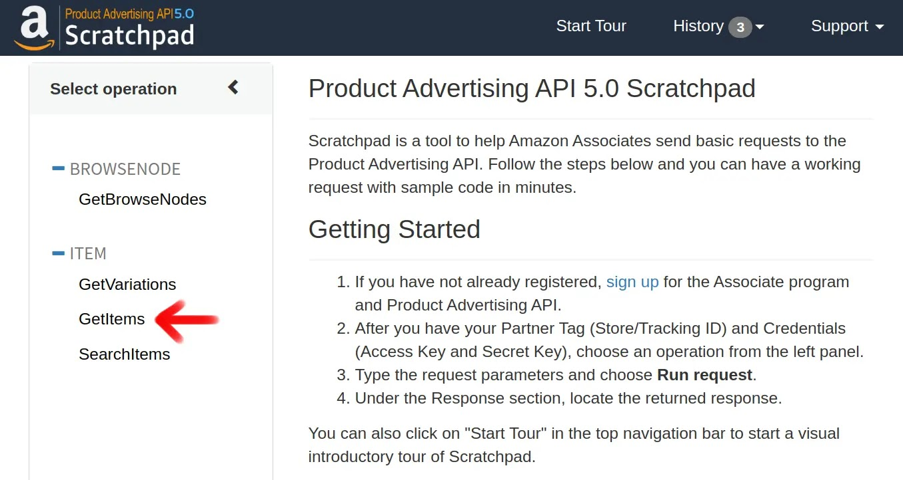

---
categories:
  - ブログ
date: "2025-02-15T23:44:18+09:00"
description: AmazonアソシエイトのPA-APIを使い画像付き商品リンクを作る方法を解説します。一番簡単な方法としてScratchpadでリンクを作成し、ブログ等にコピペする方法をご紹介します。
draft: false
images:
  - images/0000.png
summary: AmazonアソシエイトのPA-APIを使い画像付き商品リンクを作る方法を解説します。一番簡単な方法としてScratchpadでリンクを作成し、ブログ等にコピペする方法をご紹介します。
tags:
  - Amazonアソシエイト
  - PA-API
  - Webサービス
title: Amazonアソシエイト 画像付き商品リンクを作る方法
---

## アソシエイトツールバー画像リンク作成機能の廃止

Amazonの商品を紹介することで販売手数料がもらえるAmazonアソシエイト。Amazonのサイトで商品のリンクをワンクリックで作成できるAmazonアソシエイトツールバーで以前は商品の画像が入ったリンクを作成できました。

しかし、2023年に画像リンクの作成ができなくなり、現在はURL文字列のみ作成できるようになっています。

リンク作成ボタンを押すと、下記図のようになんとも素っ気ないURL文字列が出てきておわりです。

最近はSNSでURLを書き込むと画像つきのWebページまとめを勝手に付けてくれるため、SNSや動画サイトが集客の主流になった今、もはや個人のブログ等、Webサイトに埋め込む画像付きリンクはAmazonにとって優先度が低くなってしまったのかもしれません。

画像付きリンク廃止の際、Amazonから来たメールに代替手段として記載されていたのが、Amazon Product Advertising
API（商品情報API）から画像を取得する、というものでした。難易度が高そうです😟

ネットで調べると、他のやり方としては、

1.  楽天アフェリエイトから画像を取ってくる
2.  WordPressのプラグインを使う
3.  カエレバなどサードパーティのリンク生成機能を使う

などがありそうです。しかし楽天アフェリエイトはやっていなく、このブログはWordPressでないので2.の方法は使えません。カエレバでリンクを作成すればなんとかなりそうですが、Amazon Product Advertising APIとはどんなものか、調べてみました。

## Amazon Product Advertising API（商品情報API）を使う

以下、Amazon Product Advertising APIをPA-APIと書いています。

Amazonアソシエイトの
[PA-APIのページ](https://affiliate.amazon.co.jp/assoc_credentials/home)
からリンクで飛べる
[開発者ガイド](https://webservices.amazon.com/paapi5/documentation/)
が唯一とも言える情報源です。全部英語ですね。

注意点ですが、このPA-APIの利用条件は結構厳しいです😥

> Amazonアソシエイト・プログラムに参加が承認された状態で、 *過去30日以内に1円以上の発送済み商品売上を発生させている* 必要があります。

### 認証キーの作成

まずは先程の
[PA-APIのページ](https://affiliate.amazon.co.jp/assoc_credentials/home)
で認証キーを作成します。下の画像の「認証情報を追加する」をクリックします。この画像ではすでに作成済の認証キーが表示されていますが、初めての場合はまだ認証キーは表示されていないはずです。

クリックするとアクセスキーとシークレットキーが作成されます。CSVファイルにダウンロードできるのでダウンロードしておきましょう。

### 商品情報を取得する方法

[開発者ガイド](https://webservices.amazon.com/paapi5/documentation/)
のQuick Startを読んでみると、主に3種類のやり方があるようえす。

1.  cURLを使う
2.  Scratchpadを使う
3.  SDKを使う

結論から言うと、2.のScratchpadで商品画像のURLを取得するのが簡単です。商品情報、リンクも付けたHTML,CSSも生成してくれるので、これまでのアソシエイトツールバーを使った画像＋テキストリンクに近いものが得られます。

1.のcURLを使うのは、サンプルページのコードがエラーで動きませんでした。開発者ガイドのページで、アソシエイトID、アクセスキー、シークレットキーを入れるとcURLのコマンドを生成してくれるので、ターミナルにコピペして実行してみました（別途cURLがインストールされている必要があります）が、生成されたコードが日本のAmazon.co.jpではなく、アメリカのAmazon.comとなっているのがエラーの理由だと思います。2.のScratchpadでもcURLのコードを生成できるので、cURLを使う場合はScratchpadでやったほうがよいでしょう。

3.は、PHP,Java,Node.js,PythonのSDKが用意されているのでプログラミングの知識があり、サーバーを立てたりしていれば商品情報とリンクを動的に生成することもできそうです。WordPressのプラグインとかはこれを使っているのでしょうか。なかなか知識が必要そうなのと、とりあえずBloggerではサーバー側でSDKを使って商品情報を取得することはできなそうなので置いておきます。

### Scratchpadで商品情報を取得する

それではScratchapadで商品情報を検索してみましょう。例として、下の商品、3Mのマスクの商品情報を取得してみます。

商品ページの下の方に、ASINが記載されているので、これをもとに検索しますのでこの商品のASINを記録しておきます。

[Scratchpad](https://webservices.amazon.com/paapi5/scratchpad/index.html)
のページに行き、左側のGetItemsをクリックします。

Marketplaceに日本のアマゾン(www.amazon.co.jp)を、Partner
TypeはAssociates、Partner
TagはアソシエイトID、あとは先程生成したアクセスキー、シークレットキーを入力します。

ItemIdsに先程のASIN、ここではB093BHWWNKを入力し、Resoucesに取得したい情報をチェックします。今回はCustomerReviews.StarRating、Images.Primary.Medium、ItemInfo.ManufactureInfo、Iteminfo.Titleあたりをチェックしてみました。そして「Run
request」ボタンを押します。

画面下にリクエストの結果が表示されました。「Renderd
response」のタブに画像と名前が記載されたリンクが生成されています。価格など他の情報をチェックしても反映はされないようで少し寂しいですがブログに貼り付ける商品リンクとしては十分ではないでしょうか。

HTML
responseに先程の商品リンクのHTML、CSSコードが記載されています。リンクにはちゃんとアソシエイトIDも入ってくれています。これをブログにコピペすれば行けそうです。少し面倒なのが、html,
head, meta,
bodyタグが1行目とHTMLの終わりに記載されているのでこれらを取り除く必要があります。

StyleタグのCSSはとても長いのでHTMLと一緒にそのままコピペでもいいですが、ブログのテーマのCSSに入れたほうが良さそうです。

JSONタブには、指定した情報が文字列で取得できていることを確認できます。

## まとめ

Amazon Product Advertising
API（商品情報API、PA-API）を使うと商品画像、商品画像付きHTMLリンクが取得できました。いちおう目的とするものが取得できましたが、これまでのアソシエイトツールバーを使うよりかなり面倒な感は否めません。また、PA-APIは、リクエストのたびに動的に情報を取得するのが本来の使い方のように思えますが、生成されたHTMLのコピペではこのリンクが半永久的に使えるものなのか、時間が経つとリンク切れしてしまうものなのかわかりません。

WordPressなどに移行する、あるいはカエレバなどを使うのがベストアンサーなのかもしれませんが、一旦はこれで様子見してみようかと思っています。

PythonのSDKを使いリンクを作成する方法、いわゆるFaaSと言われるサービス、Netlify functionsを使い、Nodeで動的に商品情報を取得する方法もやってみましたので、関連記事をご参照ください。
