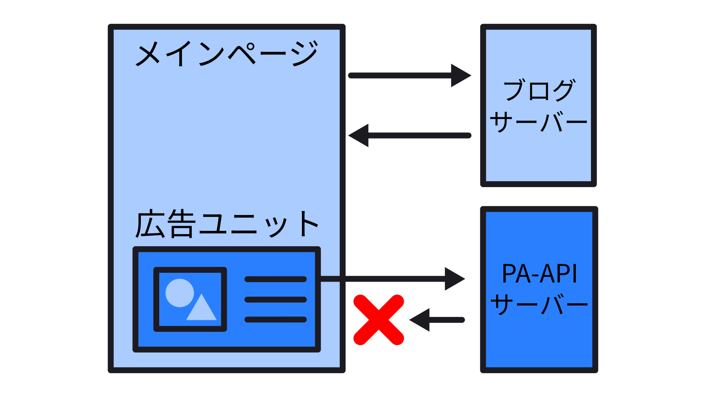
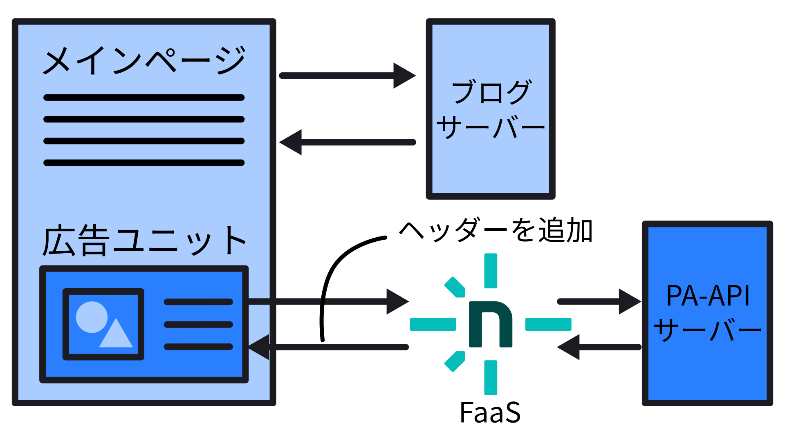
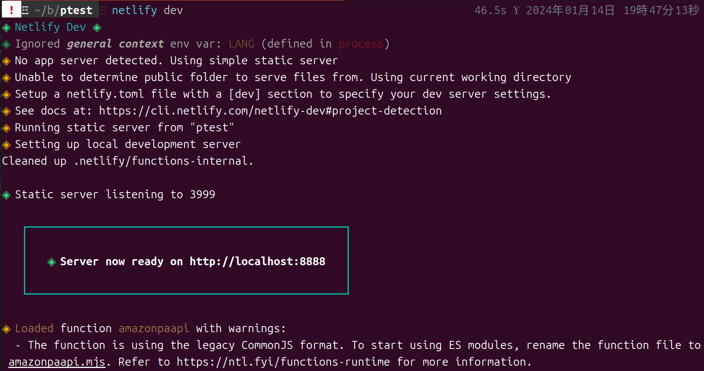
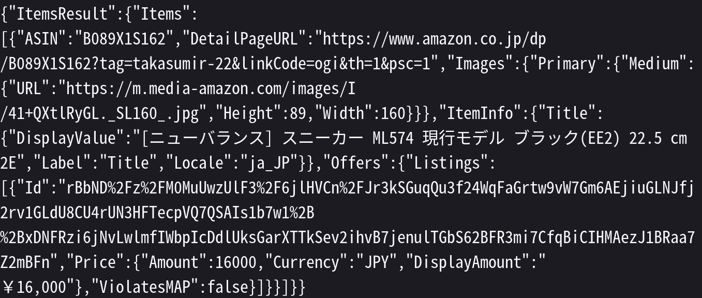
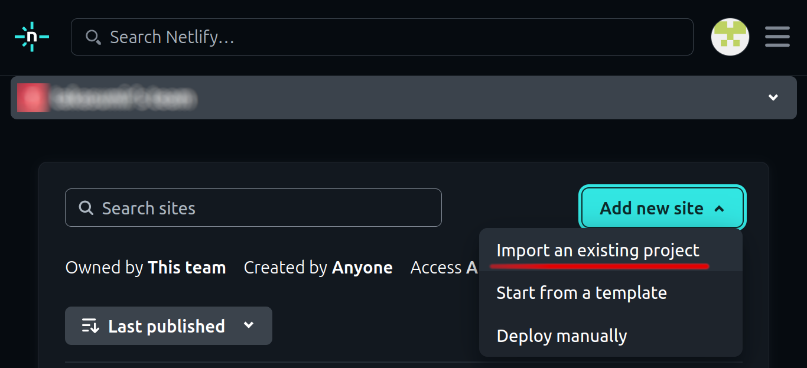
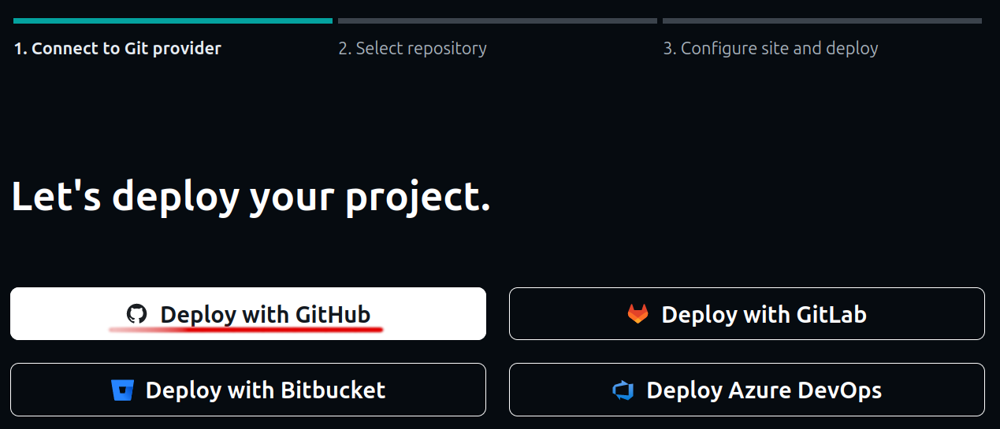
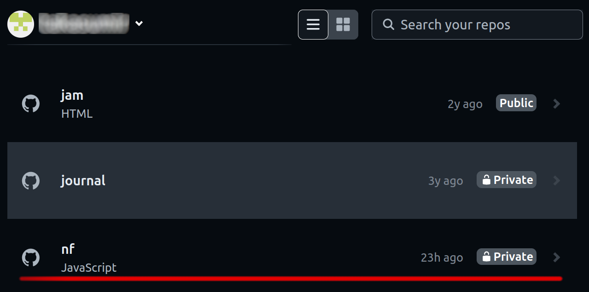
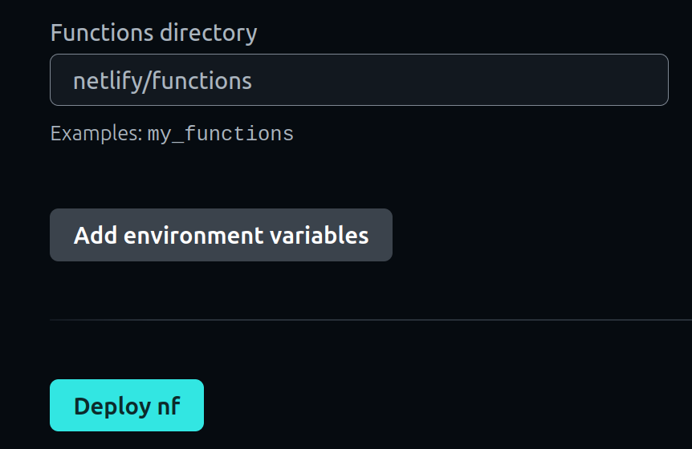
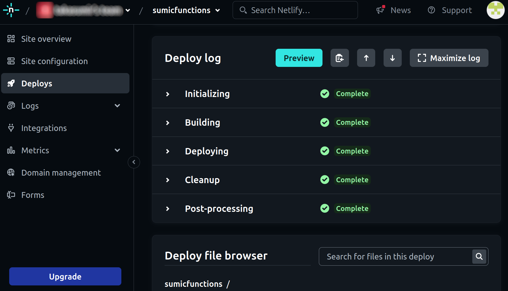

---
categories:
  - ブログ
date: "2025-02-15T23:44:20+09:00"
description: AmazonアソシエイトのPA-APIを使い画像付き商品リンクを作る方法を解説します。FaaSと呼ばれるNetlify Functionsを使い動的に商品情報を取得します。
draft: false
images:
  - images/pa-api3.webp
summary: AmazonアソシエイトのPA-APIを使い画像付き商品リンクを作る方法を解説します。FaaSと呼ばれるNetlify Functionsを使い動的に商品情報を取得します。
tags:
  - Amazonアソシエイト
  - PA-API
  - Webサービス
title: アマゾンPA-API FaaSを使いリアルタイムで商品情報を取得
js: js/paad.ts
---

アマゾンアソシエイトの画像リンクが廃止になり、API経由で商品画像、価格などの情報を取得必要になってしまいました。PyhonのSDKを使い画像つきの商品リンクを作成する方法を勉強し、取り急ぎオフラインでこれまで貼ったリンクを変換して貼り直すことはできました。



しかしこの静的なリンクだと商品情報が更新されないため、毎回ページを表示するたびに動的にリンクを更新したいです。

## オリジン間リソース共有(CORS)とは

メインページとは異なるサーバーから読み込んだリソースを取得しようとすると、通常ブラウザのセキュリティ機能でブロックされてしまいます。



サーバーからのレスポンスのヘッダーに、 ` Access-Control-Allow-Origin `
を付けてもらうとブラウザが表示してくれます。

しかしPA-APIからのレスポンスには ` Access-Control-Allow-Origin `
が含まれていないのです。

上記以外にも、リクエストの際にも認証情報が必要でさらに複雑です。

## FaaSでPA-APIからのレスポンスにAccess-Control-Allow-Originを付ける

ということで、FaaSを間に噛ませて、PA-APIの情報を取得して、そこにヘッダーを追加して返すことにします。



## Netlify Functionsを使う

GithubとNetlifyのアカウントを持っていることを前提として以下説明します。アカウントの作成方法などは下記の記事にNetlifyで静的サイトをホスティングする方法をまとめているので、その中で説明していますのでご参考ください。また、Node.jsも使用します。


最近流行りそうなJamstackでブログを作ってみようと思い、まずはJamstackでブログを作るまでのやり方を記事にしてみます。



Hugoでドラフト記事を作成し、ローカルサーバーで表示してみました。次はGitHubへのアップロードです。



Hugoでブログ記事を作成しGitHubへアップロードしました。最後にNetlifyでブログをホスティングします。


## 準備

まずはプロジェクトのフォルダを作成し、 ` npm init ` します。

```sh
$ mkdir paapiFunction
$ cd paapiFunction
$ npm init
```

PA-APIのNodeモジュール
[` amazon-paapi `](https://www.npmjs.com/package/amazon-paapi)
をインストールします。アマゾン公式のSDKのラッパーですが、公式SDKを直接使うよりも簡潔なコードで使えるのでこちらがおすすめです。

```sh
$ npm install amazon-paapi --save
```

## Functionを作る

[https://docs.netlify.com/functions/get-started/?fn-language=js](Netlifyのドキュメント)
を参考にFunctionを作ります。まず、コードを保存するフォルダが
` netlify/functions ` に指定されているため、フォルダを作ります。

```sh
$ mkdir -p netlify/functions
```

この中に、 ` 関数名.js `
というファイルを作り、デフォルト関数をエクスポートすると、その関数の返り値がNetlify
functionsでのレスポンスになります。

``` jsvascript
export default async (req, context) => {
    return レスポンス
}
```

また、この関数を呼び出すURLは、デフォルトでは
` https://ドメイン名/.netlify/functions/関数名 `
ですが、Javascriptファイル内で ` config `
値を設定することで変更することができます。

```javascript
// URLを https://ドメイン名/paapi/「asin」とし、asinをパラメーターとして
// 関数本体へ渡す
export const config = {
    path: "/paapi/:asin+",
};
```

上の例では、1つのページに複数の商品情報があることを想定し、pathの最後に+をつけると、/ASIN1/ASIN2/,,,のように複数のパラメターを渡すことができます。

あとは、 ` amazon-paapi ` のサンプルコードと、
[Netlifyのドキュメント](https://docs.netlify.com/functions/get-started/?fn-language=js)
のサンプルコードをもとに下のようなコードを作りました。

```javascript
const amazonPaapi = require("amazon-paapi");

const commonParameters = {
    AccessKey: "アクセスキー",
    SecretKey: "シークレットキー",
    PartnerTag: "アソシエイトID",
    PartnerType: "Associates",
    Marketplace: "www.amazon.co.jp",
};
const requestParameters = {
    ItemIds: ["B09MCRYG2Y"],
    ItemIdType: "ASIN",
    Condition: "New",
    Resources: [
        "Images.Primary.Medium",
        "ItemInfo.Title",
        "Offers.Listings.Price",
    ],
};
const allowed_origins = [ // 許可するドメイン
    "https://bchari.com",
    "https://www.bchari.com",
    "https://6266051941055901697_df38389a483f423c9cb61ef4566b352b55a5f72d.blogspot.com",
    "https://draft.blogger.com",
];
// 関数本体 リクエストのパラメーター asin をアマゾンPA-APIに問い合わせ、
// PA-APIからのレスポンスにAccess-Control-Allow-Originヘッダーを付ける
export default async (req, context) => {
    const origin = req.headers.get("Origin");
    console.log(context.params);
    console.log(origin);
    const asins = context.params.asin.split("/");

    requestParameters.ItemIds = asins;
    let res = "";

    /** Promise */
    await amazonPaapi
        .GetItems(commonParameters, requestParameters)
        .then((data) => {
            res = JSON.stringify(data);
        })
        .catch((error) => {
            console.log(error);
            res = null;
        });

    let header;
    if (allowed_origins.includes(origin)) {
        header = {
            "Access-Control-Allow-Origin": origin,
        };
    }
    return new Response(res, {
        status: 200,
        statusText: "Netlify functions ppapi returned",
        headers: header,
    });
};
// URLを https://ドメイン名/paapi/「asin」とし、asinをパラメーターとして
// 関数本体へ渡す
export const config = {
    path: "/paapi/:asin+",
};
```

## Netlify CLIを使いローカルでテスト

ローカルでテストができるよう、NetlifyのCLIツールをインストールします。このモジュールはグローバルでインストールしました。これも使い方は
[Netlifyのドキュメント](https://docs.netlify.com/cli/get-started/)
ほぼそのままですが、流れは下記です。

```sh
$ npm nstall netlify-cli -g
```

Netlifyにログインします。

```sh
$ netlify login
```

ユーザー名、パスワードを聞かれ、無事ログイン成功したら下記コマンドでローカルサーバーが立ち上がり作成したFunctionをテストできます。

```sh
$ netlify dev
```

下のように、サーバーがスタートします。



ブラウザが起動し、 ` http://localhost:8888 ` が表示されますが、404 Not
Foundが表示されていると思います。試しに、ASIN番号B089X1S162の商品を検索してみます。アドレスバーに
` http://localhost:8888/paapi/B089X1S162 `
と入力すると結果が返ってくれば成功です。



## デプロイ

Netlify
CLIから直接デプロイすることもできますが、今回はGithubを使います。Githubに新たなレポジトリを作成し、ファイルをGithubで管理します。

```sh
$ git init
$ git add *
$ git commit -m"my first function"
$ git remote add origin https://github.com/ユーザ/[作成したリポジトリ].git
$ git git push origin master
```

これでGithubにアップロードできました。次はNetlifyで新しいサイトを作成します。「Import
an existing project」を選びます。



Githubを選びます。



レポジトリを指定します。今回、コード中にPA-APIのシーククレットキーを埋め込んでいるため、レポジトリは「Private」にしています。



設定項目が出てきますが、何もいじらずにデプロイします。「Functions
Directory」が、ローカルに作ったフォルダ構成と同じ ` netlify/functions `
になっていますね。これを変更すればファイルの場所を変えることもできそうです。また、「Add
environment
variables」ボタンで環境変数が設定できます。シークレットキーを環境変数に保存して、コードからは環境変数を参照することでコードを公開してもシークレットキーを隠すことができます。



デプロイが開始され、全部Completeになれば成功です。



` https://サイト名.netlify.app/paapi/B075PPYDBV `
にアクセスしてローカルでのテストと同様にレスポンスが表示されることを確認しましょう。

## Bloggerでの使い方

記事作成画面で、ASINを含む ` div ` 要素を書き込みます。

```html
<div class="pa-ad-unit" data-asin="B089X1S162"></div>
<div class="pa-ad-unit" data-asin="B0B35C211B"></div>
<div class="pa-ad-unit" data-asin="B0BXP4VT3Y"></div>
```

記事のどこか、本文最後にでも広告のテンプレートを入れておきます。ちょっと長く冗長ですが、スクラッチパッドの吐き出したHTMLをほぼそのまま使いました。

```html
<template id="tpl"
  ><div class="paapi5-pa-ad-unit">
    <div class="paapi5-pa-product-container">
      <div class="paapi5-pa-product-image">
        <div class="paapi5-pa-product-image-wrapper">
          <a
            class="paapi5-pa-product-image-link"
            href=""
            title=""
            target="_blank"
            ></a>
        </div>
      </div>
      <div class="paapi5-pa-product-details">
        <div class="paapi5-pa-product-title">
          <a
            class="paap5-pa-product-title-link"
            href=""
            title=""
            target="_blank"
          ></a>
        </div>
        <div class="paapi5-pa-product-list-price">
          <span class="paapi5-pa-product-list-price-value"></span>
        </div>
        <div class="paapi5-pa-product-prime-icon">
          <span class="icon-prime-all"></span
          ><a
            class="paap5-pa-product-title-link"
            href=""
            title=""
            target="_blank"
            ><span class="buy-on-amazon">Amazonで買う</span></a
          >
        </div>
      </div>
    </div>
  </div>
</template>
```

さらに ` <script> ` タグで囲んだ下記のコードも貼り付けます。DOMツリーの
` div ` 要素のASINを取得して、先程のNetlify
Functionsからfetchしてレスポンスをテンプレートに書き込んで ` div `
の子要素に挿入するという内容です。

```javascript
async function getItems(asins) {
    const params = asins.join("/");
    try {
        const response = await fetch(
            `https://sumicfunctions.netlify.app/paapi/${params}`,
            {
                mode: "cors",
            },
        );
        if (!response.ok) {
            throw new Error("Network response was not OK");
        }
        const items = await response.json();
        return items;
    } catch (err) {
        console.log(err, "Fetch error");
        return null;
    }
}
async function renderItems() {
    const ads = document.querySelectorAll(".pa-ad-unit");
    const asins = [];
    ads.forEach((elem) => {
        const asin = elem.dataset.asin;
        asins.push(asin);
    });
    const res = await getItems(asins);
    ads.forEach((ad) => {
        const template = document.querySelector("#tpl");
        const clone = template.content.cloneNode(true);
        const link = clone.querySelectorAll(".paap5-pa-product-title-link");
        const item = res.ItemsResult.Items.find(
            (elem) => elem.ASIN === ad.dataset.asin,
        );
        link.forEach((elem) => {
            elem.href = item.DetailPageURL;
            elem.title = item.ItemInfo.Title.DisplayValue;
            if (elem.innerText === "") {
                elem.innerText = item.ItemInfo.Title.DisplayValue;
            }
        });
        const img_a = clone.querySelector(".paapi5-pa-product-image-link");
        const img = img_a.firstElementChild;
        img_a.href = item.DetailPageURL;
        img_a.title = item.ItemInfo.Title.DisplayValue;
        img.src = item.Images.Primary.Medium.URL;
        img.alt = item.ItemInfo.Title.DisplayValue;
        img.width = item.Images.Primary.Medium.Width;
        img.height = item.Images.Primary.Medium.Height;
        clone.querySelector(".paapi5-pa-product-list-price-value").innerText =
            item.Offers?.Listings[0].Price.DisplayAmount ?? "";
        ad.replaceWith(clone);
    });
}
document.addEventListener("DOMContentLoaded", renderItems);
```


## 作成した広告リンク

CSSをカスタマイズして↓のような感じになりました。



先日Python
SDKを使い静的に作成したものと見た目はあまり変わりませんが、毎回APIから最新情報を取得し表示しています。これで価格や評価など、時間とともに更新される情報も安心して載せることができます。

レスポンスに結構時間がかかるのと、たまに失敗するのが微妙なところでエラー処理をもっと考える必要がありそうですが、なんとかここまでたどり着けました。

## まとめ

アマゾンアソシエイトの広告リンクを、FaaSを間に入れることでPA-APIから動的に情報を取得、表示できるようになりました。

ただ、Bloggerなど融通のあまり効かないブログサービスを利用している場合は、記事本文に結構長いJavascript、HTMLテンプレートを貼り付ける必要がありコピペ作業とはいえちょっと微妙ですね。Bloggerのテーマに入れてしまう手もありますが、そうすると広告の無い記事にもこれらを読み込ませてしまうのでそれはそれで嫌です。

今後のアマゾンアソシエイトの広告リンクに使いながら静的、動的リンクを比較してみたいと思います。
