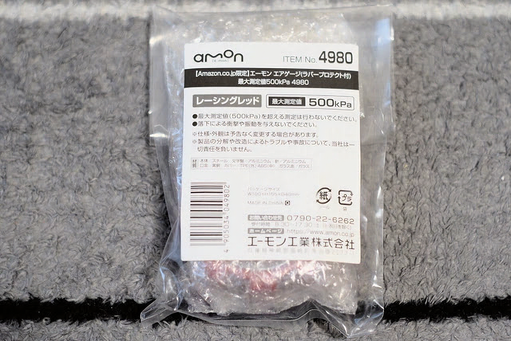
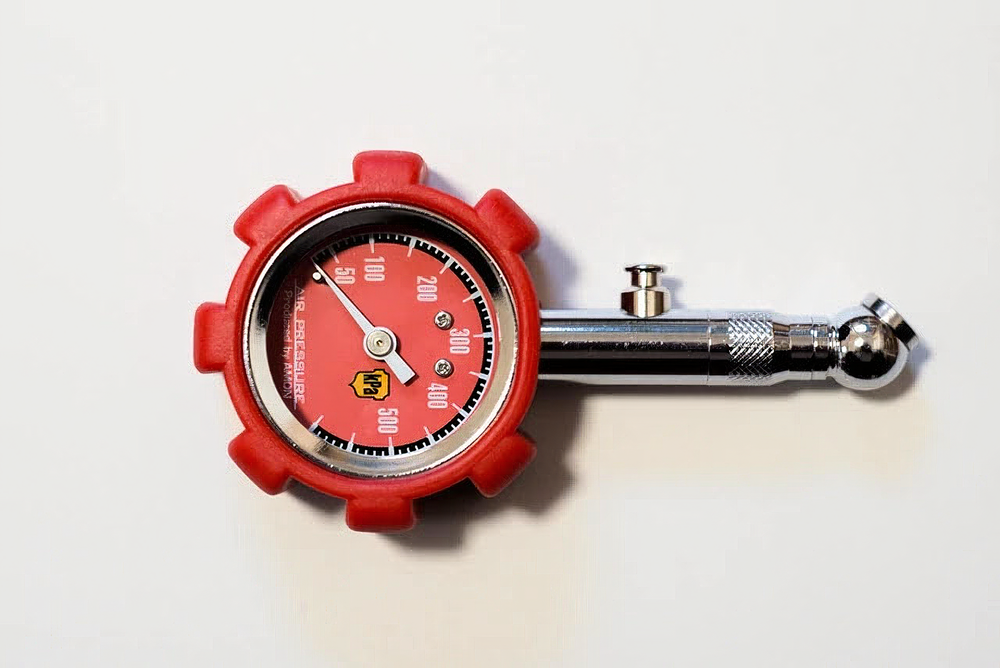
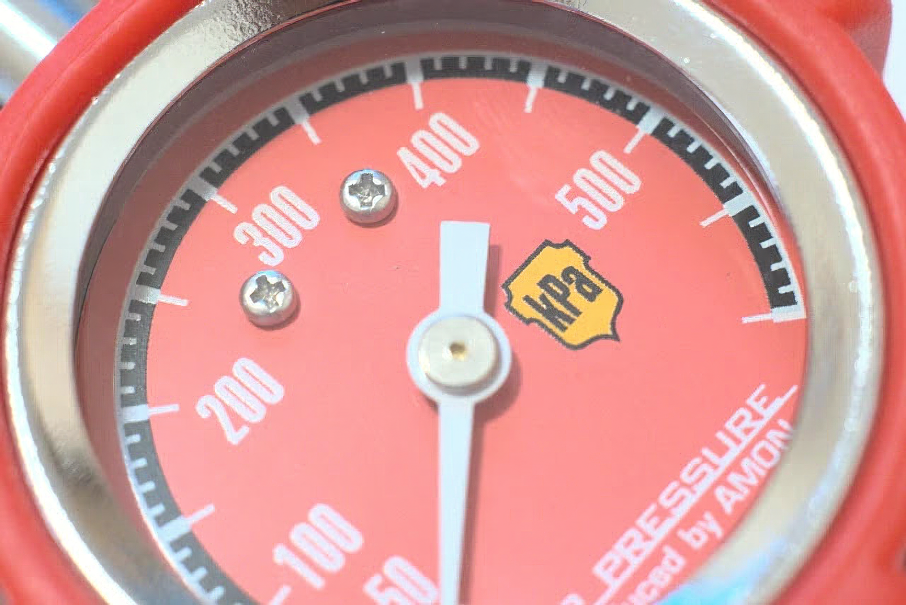
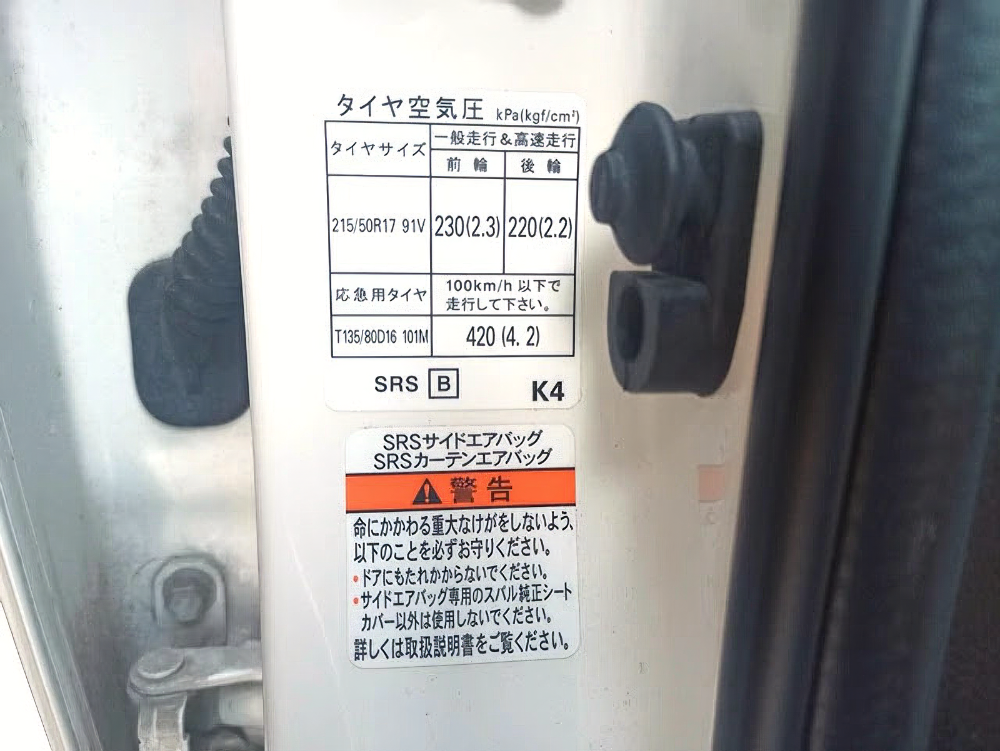
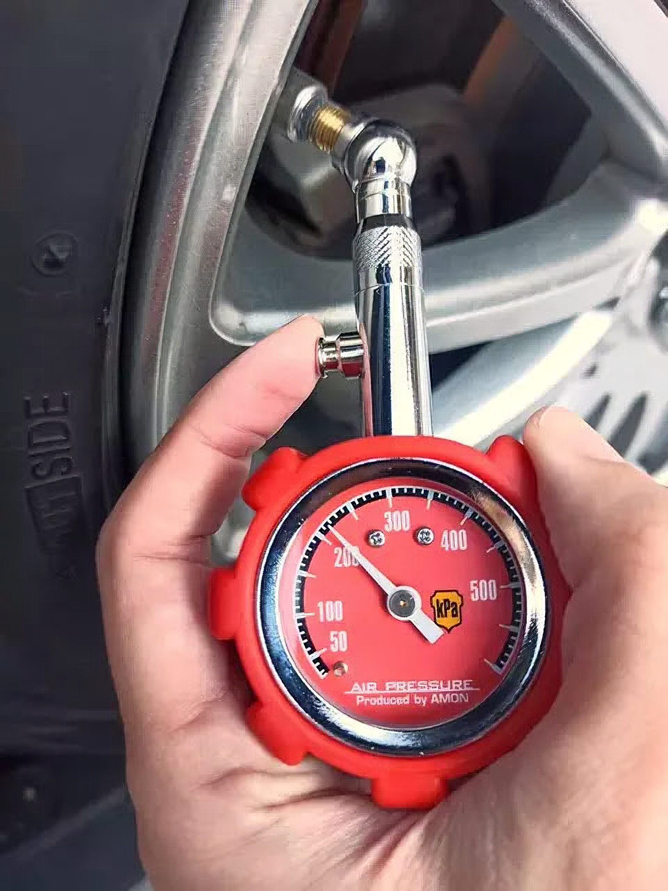
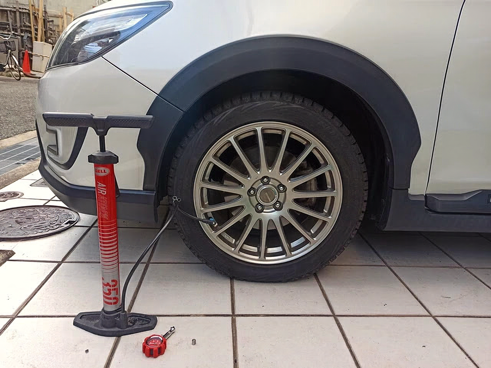

---
categories:
  - 車
date: "2025-02-15T23:43:32+09:00"
description: 車の日頃の点検やタイヤ交換をDIYで行う際に便利なエーモンのエアゲージをレビューします。真っ赤な筐体がかっこいい製品です。
draft: false
images:
  - images/Aof2y.webp
summary: 車の日頃の点検やタイヤ交換をDIYで行う際に便利なエーモンのエアゲージをレビューします。真っ赤な筐体がかっこいい製品です。
tags:
  - クロスオーバー7
  - amon
  - エアゲージ
title: エーモン amon エアゲージ 帰省前のタイヤ空気圧チェック
js: js/paad.ts
---

ここ最近はコロナ禍で実家へ帰省できていませんでしたが、今年は久しぶりに車で帰省しようと思います。

日本海側を中心に各地で突然の大雪が降ったので念の為あわててスタッドレスタイヤに交換しました。タイヤ交換はいつも通りDIYでやっています。



しかし、愛用のバッテリー式コンプレッサーが壊れてしまいました。自転車用の手動フロアポンプでとりあえず代用しようと思いましたが、安物フロアポンプには圧力計が付いておらず肝心の圧力が測定できません。

## エーモン エアゲージ購入

アマゾンでエーモンのエアゲージを購入しました。以前の注文で間違ってアマゾンプライムに加入してしまっていたのが幸いして前日PMのお急ぎ便での注文で次の日には届きました。

千円程度の安さと、日本の会社なので安心感があり、何と言っても赤い色がカッコイイ。一目見て決めました。



封筒に入れられてポストに投函されていました。開けるとビニール袋とプチプチで包まれた簡易な包装です。千円だし、これで十分ですね。

中身はこんな形です。真っ赤なゲージがいい感じですね。まるでフェラーリのようです。先端も金属製で空気抜きボタンもあり千円にしては満足感のある外観をしています。

測定圧は最大500kPaまでです。一瞬単位がどこに書いてあるか分かりませんでしたが、スポーツカーのエンブレムのような形状に"kPa"と表示してありますね。それにしても「いいもの」→「ええもん」→「エーモン」なのでしょうが、ローマ字で「AMON」と書いてこの形状だとヨーロッパかアメリカのおしゃれなメーカーのように見えてきますね。

## 空気圧の測定と調整

それでは早速タイヤの空気圧を測定してみましょう。愛車のスバル、エクシーガクロスオーバー7の空気圧は、前扉を開けたフレームに記載されています。

  前輪     後輪
  -------- --------
  230kPa   220kPa

圧力を測定します。タイヤのバルブキャップを外して、測定ヘッドの先端をバルブに押し当てるだけです。先端が45°の角度がついていますが、ストレートの方がやりやすそうです。

前輪で215kPa、今年の春にノーマルタイヤに交換してからずっと放置していた割にはそれほど空気抜けていませんね。ちなみに人差し指のボタンを押すとエアを抜くことができます。少し強めに空気を入れてこのボタンで微調して合わせられます。

空気入れは、、、こんな感じで自転車用の空気入れでシュコシュコがんばります。車のタイヤは大きいので少し空気を入れるだけでも10回以上ポンピング必要で疲れました。。。

自転車用空気入れは、だいたい先端が洗濯バサミのようになっていて英式バルブ用ですが、車は米式バルブです。多くの空気入れは、米式バルブ用の口金に英式バルブ用の洗濯バサミアダプターが挿入されているだけなので、この場合は洗濯バサミを取り外すだけで車のタイヤに空気を入れられます。

この空気入れはアメリカで購入したものなので初めから米式の口金がついていましたが、airboneというメーカーの、米式と仏式両方に対応した口金に交換しています。

## まとめ

無事4輪とも空気を入れ規定圧に合わせることができましたので無事に帰省できそうです。うーん、やっぱりコンプレッサー欲しいなぁ。ガソリンスタンドに行けば良いのですがね。

エアゲージはどれも同じようなものですが、その中でエーモンのエアゲージはフェラーリのような外観がカッコよく持っているだけでなにか満足感を得られるようなモノでした。千円程度なので1つ持っておいて損は無いでしょう。


