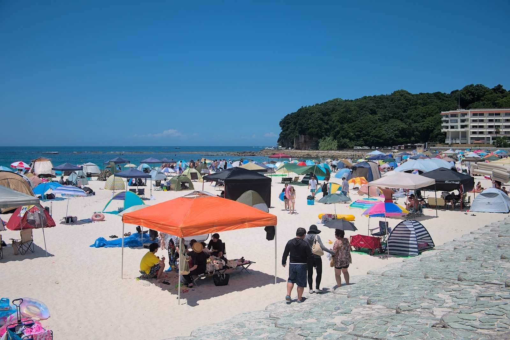
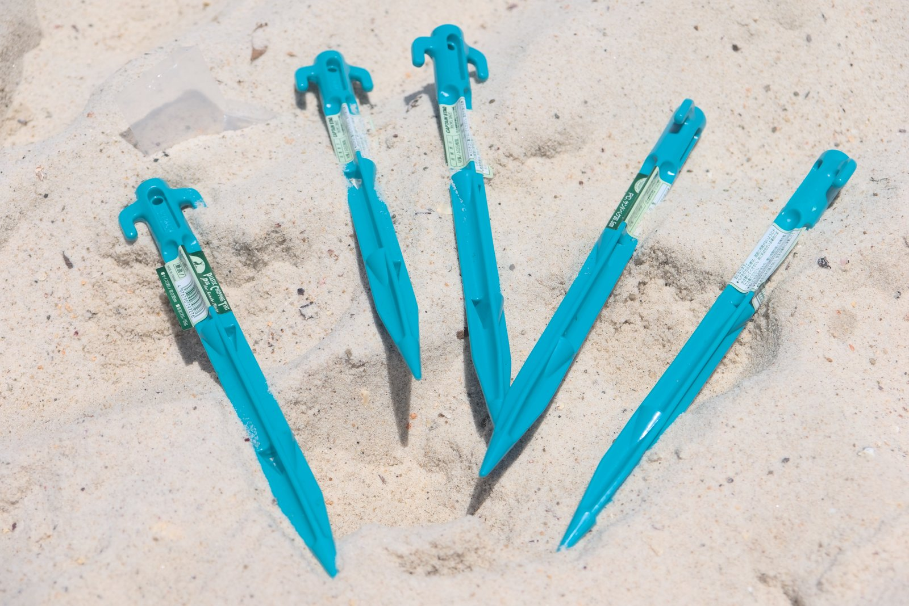
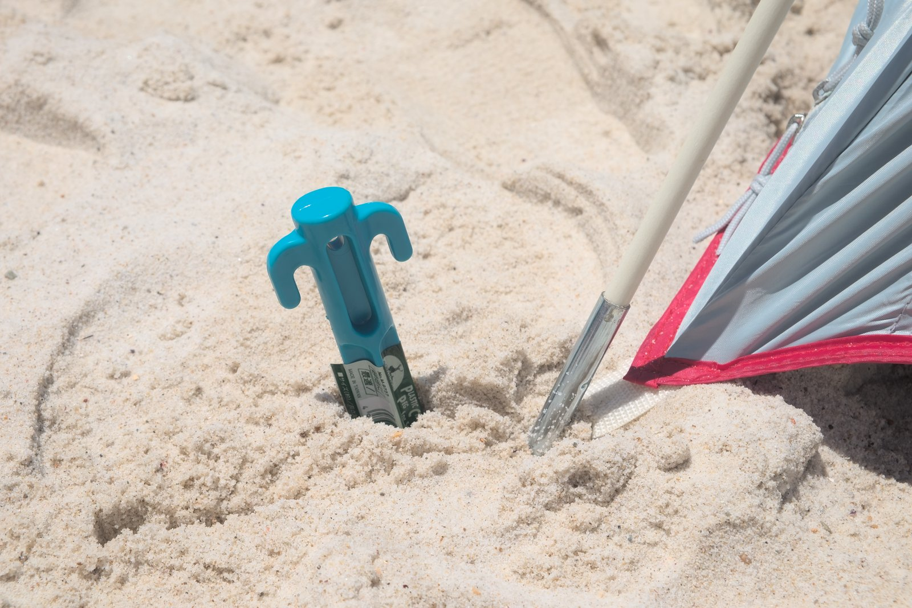
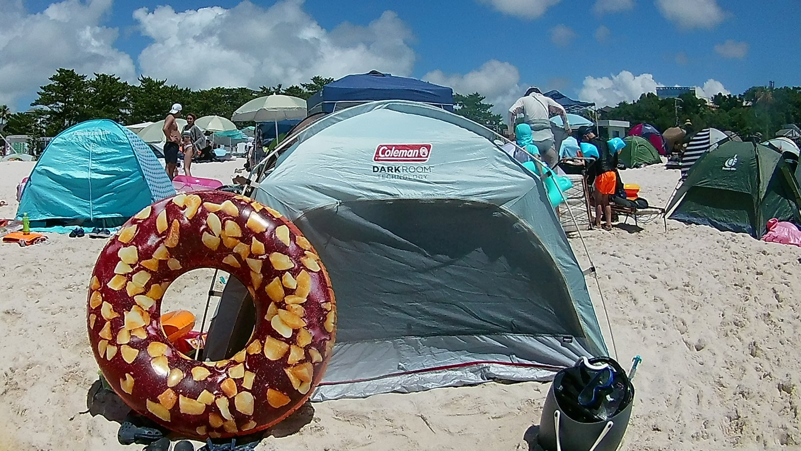
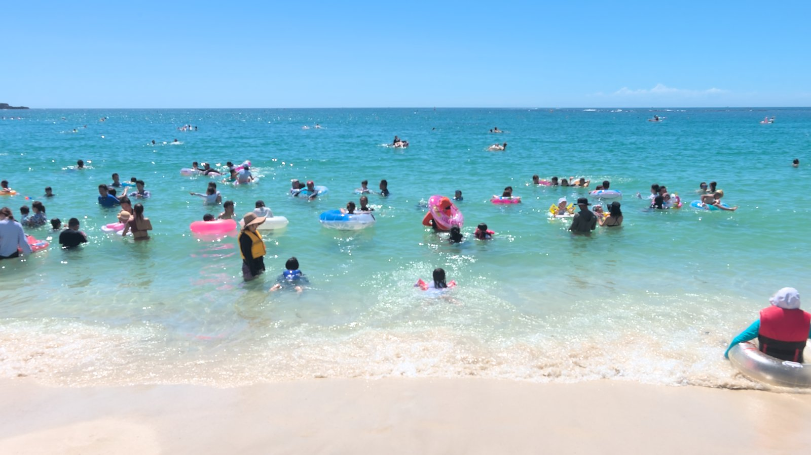

---
categories:
  - アウトドア
  - 海
date: "2025-02-15T23:44:08+09:00"
description: 砂浜にテントを固定できるサンドペグをご紹介します。強い日差しの中での海水浴は、紫外線をカットできるテントが必要ですが、海風に飛ばされてしまう心配があります。サンドペグでしっかり固定することで安心して海水浴を楽しめます。
draft: false
images:
  - images/DSCF9365.jpg
summary: 焼けるような強い日差しの中、ビーチで過ごすには太陽光、UVをしっかりカットできるテントが必要ですが、海辺は風が強いことも多く飛ばされてしまわないか心配です。砂浜でのテントの固定は、サンドペグを使うとしっかりと固定できます。
tags:
  - 海水浴場
  - 白良浜
  - 和歌山
  - キャンプ用品
title: 海水浴におすすめ 砂浜にテントを固定するサンドペグ
js: js/paad.ts
---

海水浴の季節ですが今年の夏はとんでもない暑さです。焼けるような強い日差しの中、ビーチで過ごすには太陽光、UVをしっかりカットできるテントが必要ですが、海辺は風が強いことも多く飛ばされてしまわないか心配です。

砂浜でのテントの固定は、サンドペグを使うとしっかりと固定できます。

## 夏のビーチにはポップアップテント

関西では有名な和歌山のビーチ、白良浜にやってきました。有名な海水浴場で、この時期は人だらけです。

昔はビーチといえばパラソルでしたが、今は側面からの日差しも遮光できるポップアップテントが多いですね。しかし、テントは風で飛ばされてしまう恐れがあるため、重しの荷物を入れておくのもよいですができれば四隅を固定したいもの。

## キャプテンスタッグ サンドペグ

キャンプ用や登山用テントに付属しているペグは金属製で土に打ち込むものなので、砂浜では利きません。そこで砂浜用のペグの出番です。

キャプテンスタッグのサンドペグです。プラスチック製で軽く値段も安いのですが、太く長いので砂にしっかりと食い込みます。

使い方は簡単、テント四隅のペグ固定用の輪を通して刺すだけ。プラスチック製のハンマーも売られていますが、白良浜のサラサラの砂には足で踏んでも十分刺さりました。（値札を取るのが面倒で付いたまま突き刺してしまっています、、、）

テントはコールマンのスクリーンシェードIG+、内側が真っ黒で強い紫外線もしっかりと遮光してくれます。これで全員海に出払ってもテントは強固に固定されているので安心して泳げますね。

園芸用のペグでも代用できるみたいです。

ということで、キャプテンスタッグのサンドペグのご紹介でした。



