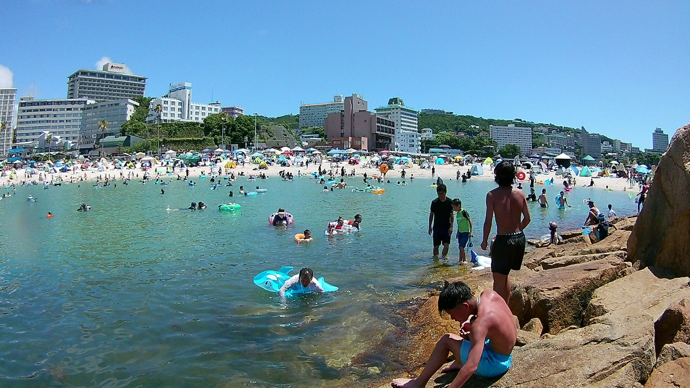

---
categories:
  - アウトドア
  - 海
date: "2025-02-15T23:44:11+09:00"
description: ハワイのワイキキビーチを思わせる白い砂浜で有名な和歌山県の海水浴場、白良浜をご紹介。日本一早く海開きし、2025年の海開きはなんと5月3日です！人も多いですがきれいな海でリゾート気分を味わえる海水浴場です。
draft: false
images:
  - images/0007.jpg
summary: ハワイのワイキキビーチを思わせる白い砂浜の白良浜、日本一早く海開きし、2025年の海開きはなんと5月3日です！関西では一番有名な海水浴場ではないでしょうか。人も多そうですが一度は行ってみたかったビーチです。
tags:
  - 海水浴場
  - 白良浜
  - 和歌山
title: ハワイのような白砂の浜 和歌山県白良浜で海水浴
---

今年の夏は猛暑日が続いています。あまりにも暑い日は外出しないほうが良いとも言われていますが、やはり夏は海。海に入ると体も冷えるので今年はプール、海、川へ行く機会が増えています。

ハワイのワイキキビーチを思わせる白い砂浜の白良浜、日本一早く海開きし、2025年の海開きはなんと5月3日です！関西では一番有名な海水浴場ではないでしょうか。人も多そうですが一度は行ってみたかったビーチです。

## アクセス

E42紀勢自動車道南紀白浜ICより、県道34号白浜温泉線を西へ約15分。シーズン中の休日は紀勢自動車道、白良浜周辺は混み合います。



## マップ、駐車場

白良浜は約620mに渡る白い砂浜が海を西に見る方向に広がっており、南端には少し突き出た人工磯があります。

駐車場は白良浜駐車場60台をはじめ、周辺にいくつかありますがすぐに満車になってしまいます。白良浜眼の前に、降りた車を遠くの駐車場に運んでくれる駐車場があり、一日3,000円と高額ですがこれを利用しました。帰りはワゴンで車の停めてある駐車場まで運んでくれます。

白良浜から離れた駐車場だと少し安く、空いているところがありましたが炎天下の中、砂浜まで歩くのはキツいでしょう。

## 白い砂浜、きれいな海

高い駐車場で車を預けると、目の前は白良浜の入口です。観光地ということもあり、浜に面した道路はお店があったりや人がたくさん歩いており海辺とは思えない都会の雰囲気です。

入口から入ると早速真っ白な砂浜が広がります。テントやパラソルも一面に設置されており、賑やかな海です。

北側はホテルの奥に小高い岬が見えています。

テントを設置して早速海へ入ります。人が多いので海の中はやや砂が舞ってやや透明度が下がっていますが、それでもこの綺麗さです。白い砂がまた海を明るく綺麗に見せています。

ビーチ中央から南側を見ると、リゾートホテルがところ狭しと並んでいます。中央奥に人工磯があります。

海に入っている人も多いですね。

これだけ人がいても水は明るくきれいです。

本州の中ではかなり南のビーチなので、熱帯魚みたいなカラフルな魚がいないかと期待していましたが、魚はあまりいませんでした。足のつかない深さまでいくと、少し海藻が生えたところに小魚の群れを発見しました。

## ビーチ南側の人工磯

南側の人工磯です。石が激熱だったので裸足注意です。

岩の奥は立ち入り禁止で、外海側には行けません。

人工磯付近の海の中には小魚がたくさんいましたが、海藻が多く水も濁り気味です。

夕方から用事があったため、半日遊んで帰る形になりましたが、アドベンチャーワールドや京都大学白浜水族館など楽しめる場所が他にもあるので泊まりでまた行ってみたいところです。

## まとめ

白良浜は、噂に違わず姉妹浜のワイキキビーチを思わせるほど美しい白砂のビーチでした。海の水も綺麗で気持ちよく泳ぐことができます。魚はそれほど多くは見られませんでした。
