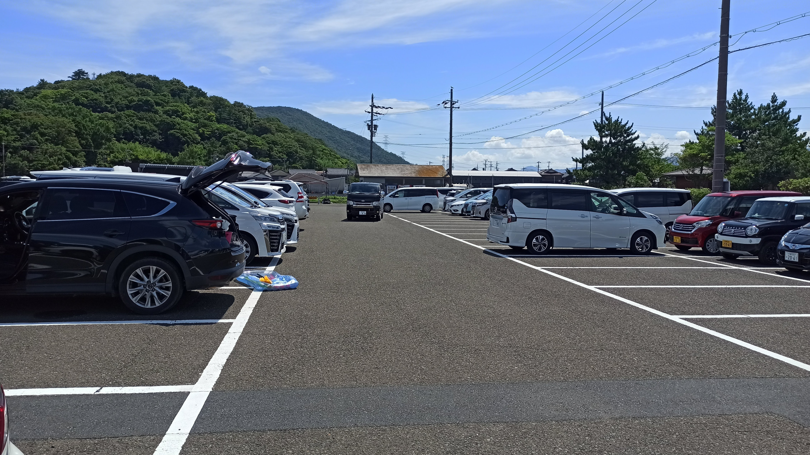
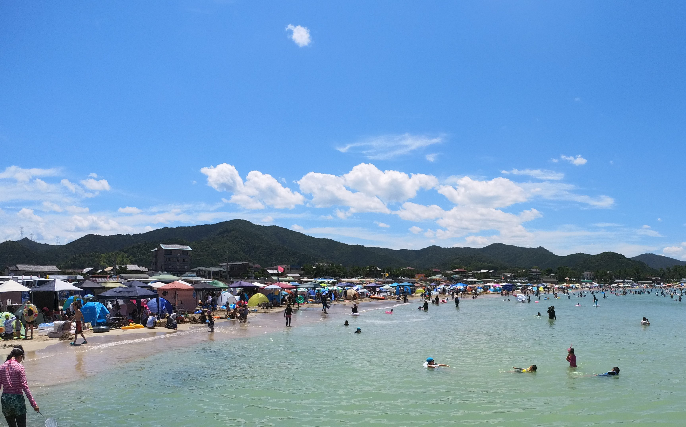
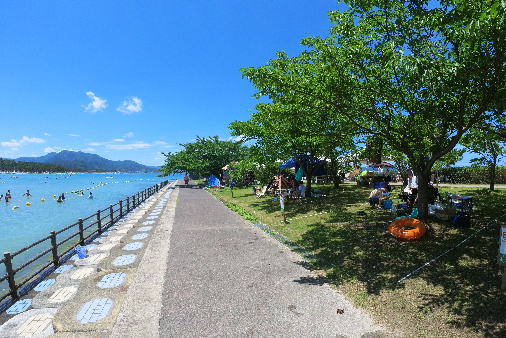
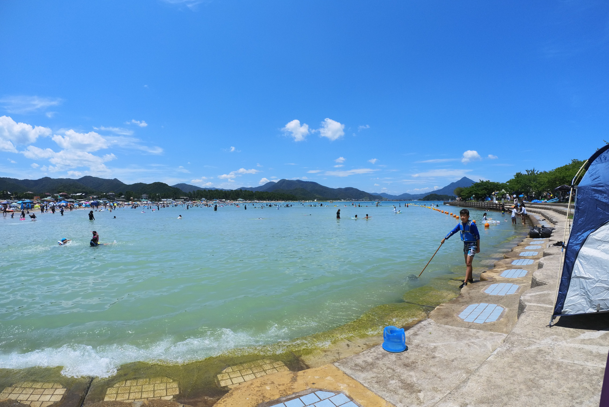
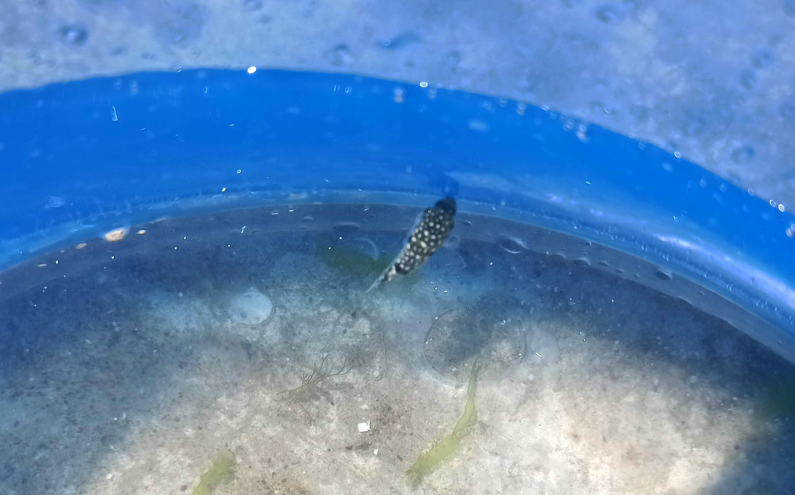

---
categories:
  - アウトドア
  - 海
date: "2025-02-15T23:43:52+09:00"
description: 福井県の日本海、若狭湾にある若狭和田海水浴場に行きました。白い砂浜に水質AAのきれいな海。大阪、京都から比較的アクセスしやすく、年間20万人以上が訪れる日本海側ではメジャーな海水浴場をご紹介します。
draft: false
images:
  - images/70.jpg
summary: 福井県の日本海、若狭湾にある若狭和田海水浴場に行きました。白い砂浜に水質AAのきれいな海。大阪、京都から比較的アクセスしやすく、年間20万人以上が訪れる日本海側ではメジャーな海水浴場です。
tags:
  - 海水浴場
  - 若狭和田海水浴場
  - 福井
  - 日本海
title: 遠浅できれいな海 福井県 若狭和田海水浴場
---

大阪から比較的近く、白い砂浜と水質AAのきれいな青い海で海水浴を楽しめる若狭和田海水浴場に行きました。

## 若狭和田海水浴場とは

福井県の日本海、若狭湾にある海水浴場です。大阪、京都から比較的アクセスしやすく、年間20万人以上が訪れる日本海側ではメジャーな海水浴場です。

水質AAの透明度の高い海と、日本海でありながら砂浜が整備され遠浅の海であるためファミリーにもおすすめな海水浴場です。

また、キャンプ場やBBQ広場（要予約）も楽しめます。

## アクセス

名神高速道路大山崎JCTから京都縦貫道を北へ、綾部JCTで舞鶴若狭自動車道を東へ進み大飯高浜ICを降りて北へ進みます。国道27号の若狭和田駅前を左折し細い道を海へ進むと若狭和田海水浴場に着きます。



周辺に駐車場はたくさんありますが、ビーチ北東の漁港側に大きな駐車場があります。

## 海水浴場付近のマップ

### 駐車場

北東の漁港にある駐車場が最も広く、数百台は停められそうです。ハイシーズンも満車になるまではいかないかなと思います。駐車料金は確か800円でした。この他に、ビーチ前の細い道路沿いに小さな駐車場がいくつも点在しています。

### ビーチ

衛星写真の通り、かなり広い砂浜です。オフシーズン時に砂を撒いて整備しています。遠浅の海なので満潮と干潮で海岸線が数十メートル前後します。

今回訪れた海開き後の休日はこの通りかなり多くのテントが所狭しと並んでいますが、砂浜はとても広いので奥の方にはいくらでもスペースがあります。

下の写真は海開き前の6月です。人がほとんど居ませんが真っ白で広大な砂浜です。

### はまなすBBQパーク

漁港の駐車場側に予約制のはまなすBBQパークがあります。眼の前が海で、コンクリートの階段から海につながっています。砂浜を通らずに海に入れるし、木陰のある芝生でBBQをしながら海水浴となかなか良さそうな場所です。

はまなすBBQパークは堤防のように海へ突き出しており、先端側は海との間に柵があります。

[なっぷ](https://www.nap-camp.com/fukui/14175?ref_host=widget)
から予約ができます。

### キャンプ場

ビーチの西側には若狭和田キャンプ場があります。いつかキャンプをしてみたいと思っていますがまだ訪れたことはありません。ネットで予約ができるのですが、キャンプ場に駐車場が無いため別途駐車場に車を停める必要があるみたいです。

## 子供も安心して遊べる遠浅の海

昼前に到着し、ビーチにはたくさんのテントが。はまなすBBQパーク前の石畳を拠点として海に入ります。晴れた暑い日であったので人が多いですね。はまなすBBQパーク側から砂浜側へ見た写真です。

満潮に近い状態でしたが海岸線から100m程度は足のつく遠浅の海です。上の写真に写っている人のほとんどがよく見ると立っていますね。下のは海の手前側から奥へ見た写真ですが、海の色が白っぽさが無くなり青くなるあたりから急激に深くなります。中央奥と左奥にイカダのようなフロートが浮かんでいますがこのあたりはかなり深い場所です。

## 水質AAのだが浅瀬は砂が舞って透明度は低い

水質AA、アジアで初の国際環境認証「BLUE
FLAG」を取得したビーチということで透明な海を期待していたのですが、、、浅瀬はこんな感じです。あれ、濁ってる！？

水の中は視界ゼロです。

というのも、水は非常にきれいなのですが遠浅で人が多いため砂が巻き上げられてこのように濁ってしまいます。朝早く、人が多くなる前だとクリアな海が見れるはずです。

上の写真は海開き前、6月に訪れたときです。真っ白な砂にとてつもなくクリアな水だということが分かります。ちなみにこのときは写真に写っていませんが一面中所狭しとクラゲが浮いていました。。。海水浴シーズンはクラゲ避けネットでも張っているのでしょう。

## ふぐの赤ちゃんがたくさん

浅瀬は水の中がよく見えないながらもたまにちょろちょろ魚が泳いでいます。キスでしょうか。

はまなすBBQパーク側の石畳にはフグの赤ちゃんが泳いでおり、網で狙ってみます。

網で簡単に捕まえられます。釣りでは外道として嫌われ者のフグですが、赤ちゃんはかわいいですね。

今回は深場へは泳いで行きませんでしたが、深い場所まで行くと水はクリアになり視界が開け、フグの赤ちゃんが集まって泳いでいる姿や、岩場につくベラなどの魚たちも見ることができます。砂地にはあまり魚がいないので魚を見るのであればはまなすBBQパークのテトラ付近や反対側にあるキャンプ場側の堤防あたりがよいと思います。

## まとめ

若狭和田海水浴場は整備された綺麗な白い砂浜のある大きな海水浴場で、遠浅なので子供でも安心して楽しめるためファミリーにおすすめです。

水質はきれいなのですが、人が多いため、海水浴シーズンには浅瀬の透明度は低いです。

海水浴だけでなくBBQやキャンプもできるので組み合わせるとより楽しめそうです。
