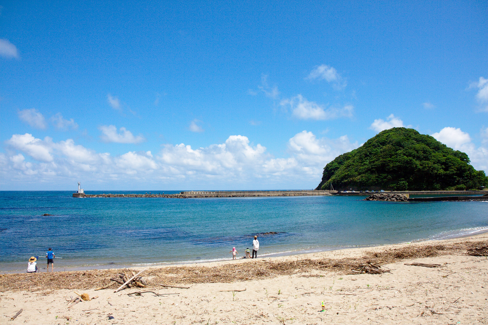
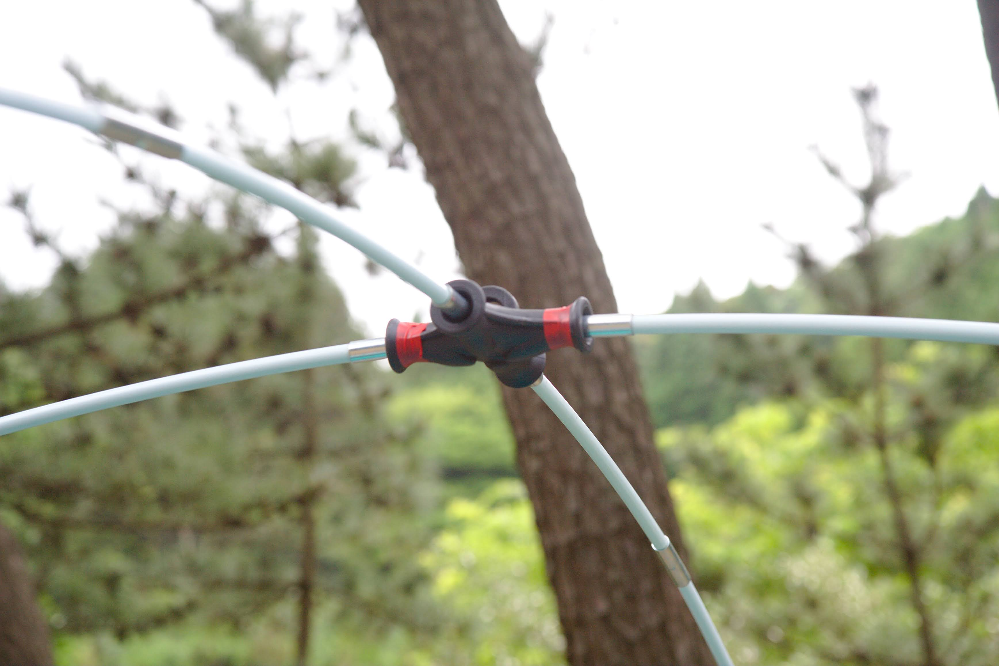

---
categories:
- アウトドア
- キャンプ
date: "2025-02-15T23:42:48+09:00"
draft: false
image: images/IMG_5055.JPG
summary: 日本海の綺麗な海の前でキャンプがしたくて弁天浜キャンプ場に行ってきました。
tags:
- 弁天浜
- キャンプ場
- 海
- 兵庫
title: 弁天浜キャンプ場で海キャンプ
---

日本海の綺麗な海の前でキャンプがしたくて弁天浜キャンプ場に行ってきました。

## 弁天浜キャンプ場の場所

兵庫県豊岡市竹野町竹野



<https://toyooka-tourism.com/recommend/nature/bentenhama_camp/>

初日は朝から出発、大阪から 2 時間半くらいで到着します。チェックインは 13
時から。

## サイト紹介

13
時過ぎにチェックイン。サイトは松林区画サイト、松林フリーサイト、砂浜区画サイト、砂浜フリーサイト、日帰りバーベキュー用の
Gazebo
があり、区画サイトは予約制、フリーサイトは予約不可です。今回は松林区画サイトを予約しました。

### 松林区画サイト

全 26 区画、松が日陰を作るのでタープは張らなくても大丈夫でした。

### 松林フリーサイト

受付を挟んで区画サイトの反対側にあります。フリーといえども区画らしきものがあり、区画サイトとほぼ変わらなそうです。区画サイトはほぼ予約いっぱいでしたがフリーサイトは
3
組くらいしかいなかったので予約取れない日でも意外とこちらは空いているかもしれません。

### 砂浜区画サイト

砂浜の端にフラットに整備された区画があります。全 4
区画と少なめです。海が目の前なので眺めは良さそうですが、日光を遮るものが無いので真夏の晴れた日は結構つらいかもしれません。地面は整地されそれなりに固そうです。

### 砂浜フリーサイト

海水浴場の砂浜にテントを張る感じです。砂浜は結構傾斜があり、ペグダウンも難しそうなので他のサイトが空いていればおすすめしません。当日は誰もいませんでした。

## 初日：テント設営と磯遊び

受付で説明を聞いてサイトへGo。車の乗り入れはできないので入り口前に荷卸スペースがあるのでそこから荷物をカートで運びます。

テントを張ります。テントはコールマンの NAMAKAN という 7 人用でアメリカの
Target で 100 ドルくらいで売っていたもので今日がデビューです。

このテントの特徴はポールに細工があって、写真のバッテンになっている部品から4本ゴム紐でつながったポールが出ているのでポールが全て一体になっています。

なので全てポールを組み立てバッテンに入れるとこんな感じになります。早く組み立てられることを売りにしてるようですが普通のテントのようにポール
2
本で対角に交差させるのとあまり作業難易度は変わらず、むしろバッテンが収納時に邪魔になるのでメリットはあまり感じません。

テントを設営しました。フライがこんなに小さくて雨が降ったら大丈夫か不安ですが、大雨の日はキャンプしないのでこれで良いでしょう。ちなみにフライから出ているコードは面倒なので風の少ない日はペグダウンせずそのままにしてしまいます。

サイトから海へ出る小道があり、そこから海へ出てみます。

透明度の高い海ですが、まだ 6
月なので泳ぐには寒いので端の磯で遊びます。カニや小魚がたくさんいて子どもたちは網で魚を取っては楽しんでいました。反対側の端に小さな突堤があり釣りをしてみました。他の家族がテトラの穴釣りでギンポ、カサゴが釣れていました。自分はちょい投げでキスを狙ってみましたが何も釣れず。。。まだ時期が少し早かったのかもしれません。

 

夜は BBQ で焼き肉をして就寝です。

## 二日目：砂浜でさらに遊び帰宅

二日目はよく晴れて綺麗な青い海を見ることができました。また磯遊びや砂浜でボール遊びをしたり自由な時間を満喫して帰宅しました。海のきれいなキャンプ場なので海開きしたらまた来たいです。

 

