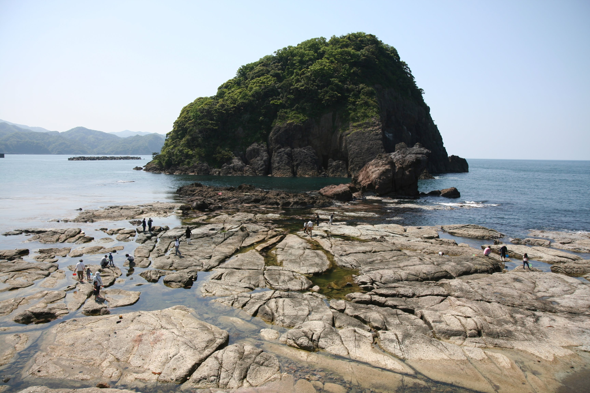

---
categories:
  - アウトドア
  - キャンプ
date: "2025-02-15T23:43:11+09:00"
description: 日本海の海辺にあり、大きな岩場、千畳敷で磯遊びができ、カエルの形をした岩（カエル島）がシンボルの今子浦キャンプ場をご紹介します。ハイシーズンでも予約不要のフリーサイトがあります。
draft: false
images:
  - images/IMG_4471.JPG
summary: 日本海の海辺にあり、大きな岩場、千畳敷で磯遊びができ、カエルの形をした岩（カエル島）がシンボルの今子浦キャンプ場に行きました。ハイシーズンでも予約不要のフリーサイトがあります。
tags:
  - 今子浦
  - キャンプ場
  - 海
  - 兵庫
title: カエル島と磯遊びが楽しいファミリーキャンプ！今子浦キャンプ場
---

日本海の海辺にあり、大きな岩場、千畳敷で磯遊びができ、カエルの形をした岩（カエル島）がシンボルの今子浦キャンプ場をご紹介します。磯遊びが楽しめ、ハイシーズンでも予約なしで行けるフリーサイトがあるので連休でキャンプ場の予約が取れなかった場合でも行ける素敵なキャンプ場です。

## 予約方法

オートキャンプサイト、常設テントサイトは事前に電話での予約が必要です。
[公式ホームページ](http://www.eonet.ne.jp/~imakoura/reserve.html "今子浦キャンプ場")
より電話番号、注意事項を確認しましょう。

フリーテントサイトは予約不可、当日受付のみです。

## アクセス



住所：〒669-6541 兵庫県美方郡香美町香住区境

たぶん公共交通機関で行くことはできないので車になります。キャンプ場入り口に100台は停められそうな広い無料駐車場があります。

## キャンプサイト紹介

出典：Google Earth

キャンプサイトは左右を山に挟まれた谷の中にあります。海は近いのですが海は全く見えません。その代わり山に囲まれているので風は穏やかです。海辺のキャンプ場だと強風に悩まされることがあるのですがテントを張るには良い場所です。

### a.駐車場 

とても広い駐車場です。100台は停められそうで、かつ無料なのが嬉しいですね。

### b.管理棟 

ここで受付、料金の支払いをします。夏場は釣りエサも売っているようです。

### c.オートキャンプサイト 

キャンプ場入り口の管理棟近くにA～Kまで全11区画あります。道、芝ともきれいに整備されたサイトで訪れた日はほぼ満席状態でした。

### d.フリーテントサイト 

オートキャンプサイトの奥に芝生があり、フリーテントサイトになっています。GWでそれなりに人は来ましたがそれでも満員状態というわけではなく、それなりに余裕がありました。ハイシーズンでも入場できなくなるということはなさそうです。

芝はきれいですが、鹿のフンが結構ありました、、、（汗）鹿のフンを避けてテント設置です。

車での乗入れはできず、駐車場から距離があるので荷物を運ぶ必要があります。昔の畑作業や工事現場で使うような一輪車を借りて運ぶことができますが、カートがあったほうが良いでしょう。

### e.常設テントサイト 

フリーテントサイトのさらに奥に常設テントサイトがありますが、奥まで行かなかったのでどのような感じかはレポートできません。こちらも事前予約が必要です。

### f.g.千畳敷・カエル島 

千畳敷は広い岩場で磯遊びができます。カエル島はその名の通りカエルのような岩で一見の価値ありです。

## フリーテントサイトでキャンプ

キャンプ場にはお昼頃に着いて早速芝生のフリーテントサイトにテントを設営しました。サイトはGW中にもかかわらずそれほど混んでいません。備え付けのテーブルでお昼ごはんを食べます。

## 磯遊びとカエル島

お昼を食べたら海へ出てみます。千畳敷という大きな岩場があり、磯遊びができます。アメフラシが大量にいて、他にもウミウシや小魚が見られました。奥の方は岩の間が大人の背丈よりも深い場所があるので、子供から目を離さないように注意必要です。

釣りをしている人もいました。釣り竿を持ってきていたのですが、夏はエサを管理棟で売っているようですが今の時期は無くて釣りはできず。まだ海水温も冷たいのであまり釣れてなさそうでした。

写真右奥がカエル島です。たしかにカエルに見えますね！

砂浜はこんな感じです。まだ寒くて泳げません。海藻がたくさんで海の色も緑色がかっていて、澄んだ海ではなかったです。少し奥まった地形なので海水の入れ替わりが少ないのでしょうか。海水浴なら近くに竹野海岸などとても澄んで綺麗な海水浴場があるのでそちらに行くのが良いと思います。

なんとハリセンボンが泳いていました。

なんと網で簡単にすくえました！刺激を与えると膨らんでカワイイ形になります。水族館以外でハリセンボンを見たのは初めてです。よく見ると岩場にも干からびたハリセンボンがいくつか転がっていたのでこのあたりにたくさんいるのでしょうかね。

初日は磯遊びをして二日目の朝は他のキャンパーたちが撤収して広くなった芝生でバドミントンをしたり遊んで帰りました。鹿のフンには注意です。

## まとめ

磯遊びが楽しい今子浦キャンプ場は、ハイシーズンでも予約無しでキャンプできファミリーキャンプにおすすめできるキャンプ場でした。行ったらぜひハリセンボンを探してみてください！
