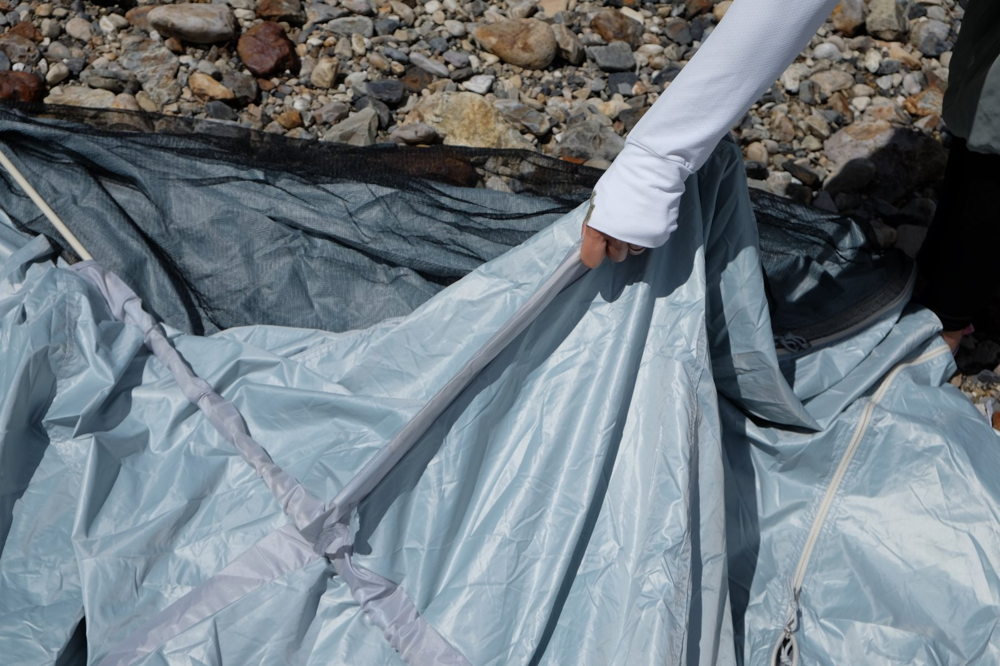

---
categories:
  - アウトドア
  - キャンプ
date: "2025-02-15T23:44:10+09:00"
description: 夏の暑さが尋常でないのが当たり前になってきた昨今、海や川遊びなどアウトドアのレジャーには日差しを遮るためのテントが欠かせません。日光をブロックし温度上昇を軽減する、コールマンのスクリーンシェードDRをレビューします。
draft: false
images:
  - images/0000.jpg
summary: 夏の暑さが尋常でないのが当たり前になってきた昨今、海や川遊びなどアウトドアのレジャーには日差しを遮るためのテントが欠かせません。日光をブロックし温度上昇を軽減する、コールマンのスクリーンシェードDRをレビューします。
tags:
  - 川遊び
  - 海
  - サンシェード
  - コールマン
title: コールマン スクリーンシェードDR レビュー
js: js/paad.ts
---

夏の暑さが尋常でないのが当たり前になってきた昨今、海や川遊びなどアウトドアのレジャーには日差しを遮るためのテントが欠かせません。

我が家では、これまでIKEAのポップアップテントを使っていました。

出典：[IKEA](https://www.ikea.com/jp/ja/)

これは3千円程度という激安価格で220x130cmというバカでかいサイズで重宝していたのですが、いろいろ不満もありました。

-   風に煽られるとフニャフニャ
-   開口部が広いので結構日が差し込み、向きによってはあまり意味をなさない場合がある
-   畳み方が難しい！初めは1時間くらい格闘することも
-   畳んでもでかい

最後の「畳んでもでかい」は、円盤状に平たくなるのですが下の画像のサイズ！毎回こいつを車に積むたびにもっと小さくならないものか、と思ったものです。

出典：[IKEA](https://www.ikea.com/jp/ja/)

ということで、新しいレジャー用テントを探しました。

## コールマン スクリーンシェードDR

コンパクトに収納できるものであれば、やはり設営が少し手間ですが組立式ですね。円盤の小さなサイズもいろいろありますが、うまく畳めないときのイライラ感と、結局円盤の面積は取るので候補から外します。

さらに、せっかくなので日差しもしっかり防げるものをと考えていたところ、コールマンのスクリーンシェードDRが良さそうです。

出典：[コールマン](https://ec.coleman.co.jp/)

ロゴスのソーラーブロック Q-TOP フルシェードも似たような商品です。

出典：[LOGOS](https://www.logos.ne.jp/)

両方とも外側が白色に近いグレーで太陽光を弾き、内側は黒く遮光されUVカット率99.9%以上というスグレモノです。

遮光率に違いがあり、コールマンは90%以上、ロゴスは100%を謳っています。ロゴスはポールもワンタッチで組立てできることもあり、機能では勝る分、価格も高めです。コールマンのスクリーンシェードDRはアマゾンでセール価格になっていることも多く、倍近く値段差が出る場合もあり、価格を取りコールマンを買いました。



## 設営方法

川遊びで使ってみました。袋は片手で持てるほどコンパクトです。この中にポールも入っています。四角い棒状なので車でたくさん荷物を積むときにスペースを取らず重宝します。

中身です。テント本体とポール、ペグが収納されています。

ペグは安物テントによく付属している丸棒の弱く曲がりやすいものなので、ペグダウンするのであればもう少ししっかりとしたものを買い直すことをおすすめします。

また、ハンマーも付いていないので柔らかい地面で無い場合はハンマーを持っていく必要があります。風が弱い日であればペグダウンせずに荷物と人の重さで固定してもよいでしょう。

ポールは2本、普通のテント用のようにゴム紐で繋がっているパイプを差し込んで組み立てます。

こんな感じで差していきます。2箇所「へ」の字になっています。

テントに組み立てたポールを入れます。

途中で引っかかったら手で修正しながらポールが反対側に出てくるまで押していきます。

2本目も通していきます。

ポールを通した状態です。

ポールの端を、テント四隅にある丸棒の金具に入れます。下の写真の場所です。

ポールが入りました。

2本のポールのそれぞれ片側を上の写真のように金具に入れたら、反対側を入れていきます。反対側を入れるには、ポールを弓なりに反らし、テントを持ち上げて入れる必要があります。テントがポール中心から寄っていたりするとパツンパツンになりうまくいかないので、テントの位置も見て必要あれば修正しながら上げていきます。

1本目が入ったら2本目の反対側も入れます。2人で1本目と2本目を同時に上げるのがよいのですが、子供にやってもらったので2人で1箇所ずつが精一杯でした。（とーちゃんは撮影係で働かず😛）

がんばりました👏

テントの四隅、ポールを差した部分です。

最後に引っ掛けをポールにはめて完成です。

こんな感じで組立てできました。

ペグダウンする場合は、四隅の紐の中にペグを打ち込みます。

ただ、河原で付属品の安物ペグでは叩いてもすぐに曲がってしまうでしょう。。。ペグは、少し重いですが鍛造品を持っておくことをおすすめします。



中は真っ黒ですが、チャックの部分からは光が差し込みます。隣でロゴスを使っている人がいましたが、もっと真っ黒でチャック部分なども遮光されていそうな感じでした。遮光率90%と100%の違いはこういうことかもしれません。

日差しの強い日で、やはりテントは必須でした。中にいるとだいぶ楽です。

## 海で使うならサンドペグがおすすめ

海辺は風が強いことが多く、砂地では普通のペグは効かないため、海で使うのであればサンドペグを使うことをおすすめします。

太いため、砂地でもしっかりとペグダウンできます。

サンドペグは下記の記事で説明していますのでご参照ください。



## まとめ

コールマン スクリーンシェードDR
は、遮光率、UVカット率が高くてコンパクトに収納でき、強風時はペグで固定もできるので使い勝手も良く早く買っておけばよかったです。

円盤状に折りたたみ、ワンタッチで設営できるポップアップテントに比べるとポールの組み立て、テントにポールを入れる工程がありやや手間ですが、自分にとってはポップアップテントの折りたたみに右往左往するくらいなら誰でもできる組立式の方が精神的に楽でした。


