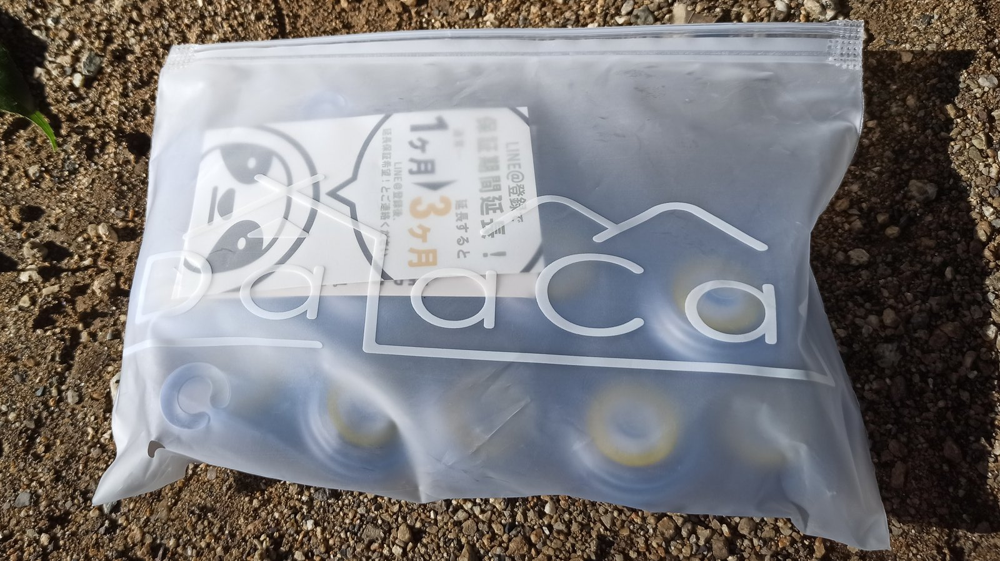
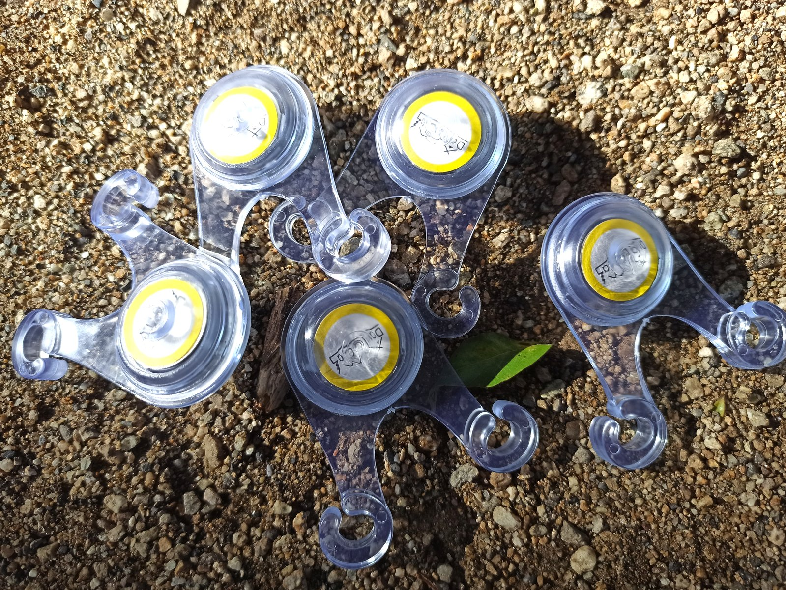
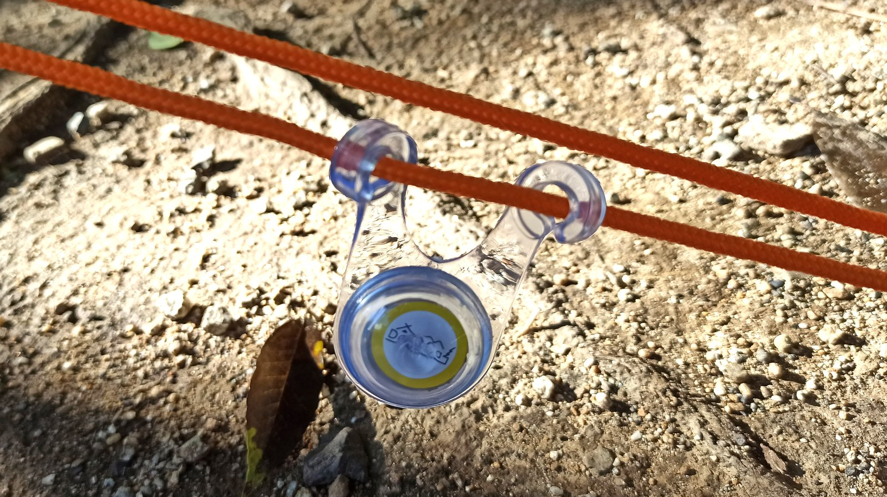
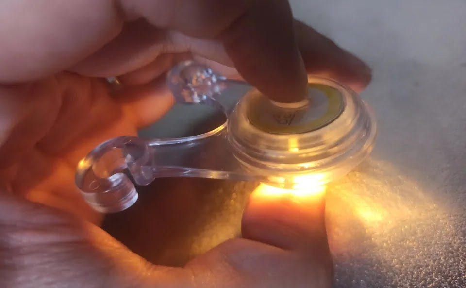
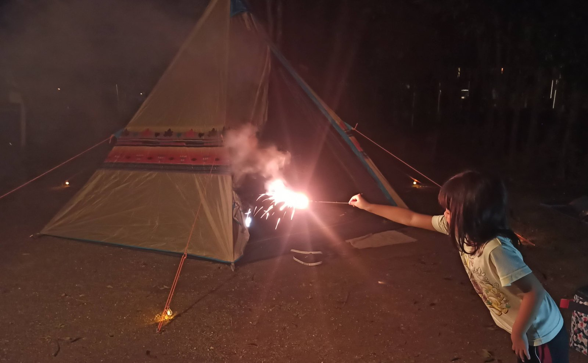
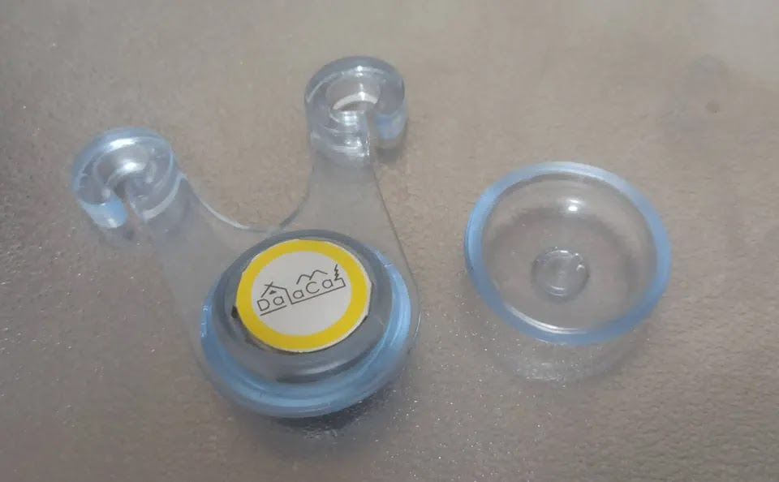
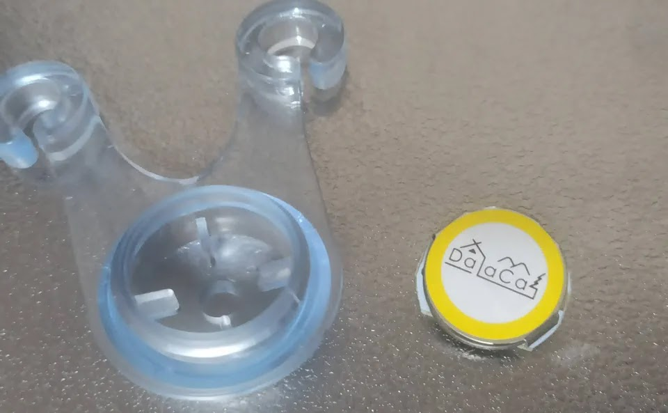
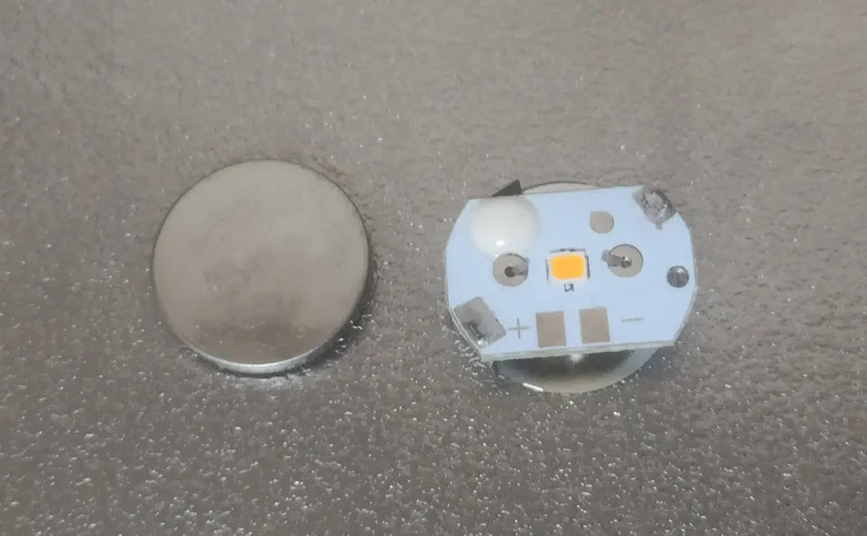

---
categories:
  - アウトドア
  - キャンプ
date: "2025-02-15T23:44:13+09:00"
description: 子連れでキャンプをする際、夜にテントのロープに子供が引っかかって転ぶことがよくありました。そんな悩みを解決するテントロープ（ガイロープ）用 LED ライトを買ってみましたのでレビューします。
draft: false
images:
  - images/0006.jpg
summary: 子連れでキャンプをする際、夜にテントのロープに子供が引っかかって転ぶことがよくありました。そんな悩みを解決するテントロープ（ガイロープ）用 LED ライトを買ってみました。
tags:
  - キャンプ用品
  - LEDライト
title: テントロープ用 夜間転倒防止LEDライト
js: js/paad.ts
---

子連れでキャンプをする際、夜にテントのロープに子供が引っかかって転ぶことがよくありました。そんな悩みを解決するテントロープ（ガイロープ）用 LED ライトを買ってみました。

## テントロープ用LEDライト

アマゾンで検索すると、だいたい同じような形状のものがたくさん出てきます。何でも同じでしょうが、アマゾンおすすめとして出てきた
DaLaCa
というブランドのものを買ってみました。10個入りで安く十分な量です。

別の手段として、蓄光ロープなんてのもあるのですね。どの程度光るのか分かりませんが、ちょっと気になります。



## 取付けてみた

ジップロックみたいな袋にたくさん入っています。飴ちゃんみたいです。カラーは黄色を選択。黄色というよりは普通の白熱灯のようなオレンジっぽい色です。

中身です。外装は柔らかいシリコンゴムのようなものでできています。

取付けは簡単、テントロープ（ガイロープ）に引っ掛けるだけです。

外装が透明なので、昼間に遠くからは付いているのかよくわからないですね。赤丸のところに取付けてあります。

## いい感じに光ります

さて、夜になったので点灯です。点灯方法は、球状の真ん中をプチッと押すと中のスイッチがカチッとクリック感があり、点灯します。1回目は点滅、さらに押していくと点滅が遅くなり、点灯、消灯と変わっていきます。

なるべく先端に取付けてみましたが、これでロープのある場所がひと目で認識できそうです。これだけで何か楽しそうな雰囲気になりますね。

これで夜に花火をしたり、バーベキューの残り火でマシュマロを炙ったり、夜に起きてトイレに行っても引っかかることなく安全に過ごせるのが良かったです。子供がコケて泣くと大変ですからね。。。

1日中電池が持つか、少しきになりましたが、一番電池を使うと思われる点灯モードで夜8時頃から朝6時頃まで10時間程度ですが、全部ちゃんと光っていました。

アマゾンの説明には200〜300時間と書いてあるのでまだまだ使えそうです。

## 電池の交換方法は？

電池交換はもちろん可能です。真ん中の球体部分が片側キャップになっており、めくるように外すことができます。

中身のライト本体を取り出します。

コイン電池は、横から差し込まれていますので、押し出すと取り出せます。プラスマイナスが良くわからないので取り出すときにしっかり見て覚えておきましょう。10個あるので、わからなくなったらもう1個分解してみればよいです。

ちなみに、電池を裏表逆向きに入れると短絡しそうな構造なので注意です。

中身は、いかにも安そうな作りですね。基盤むき出し、LEDむき出し、電池ホルダ兼プラスマイナス端子は薄い板金です。上の写真にはプラスマイナスの記載がありますが電池の表裏はどうしたらよいか全くわからないですね。。。まあ、安物だしこんなものでしょう。

電池は、コイン電池の *CR2032*
でした。入手性の良いもので、当日電池切れでもコンビニや100円ショップがあれば売っているでしょう。

## まとめ

テントロープ用LEDライトは、使ってみると転倒防止にかなり安心感があります。毎回誰かが引っかかったり転ぶのが恒例でしたが、今回は全く大丈夫でした！

作りはいかにも安っぽいですが、夜点灯すると雰囲気も出てテントに何かラグジュアリーな雰囲気すら漂います。値段も安いのでロープ引っかかりに悩んでいる方にはおすすめします。


