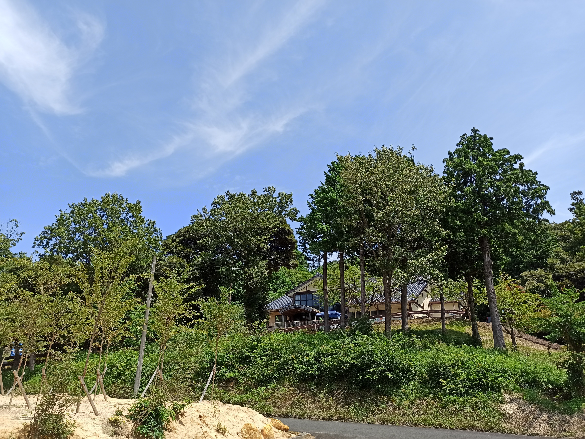
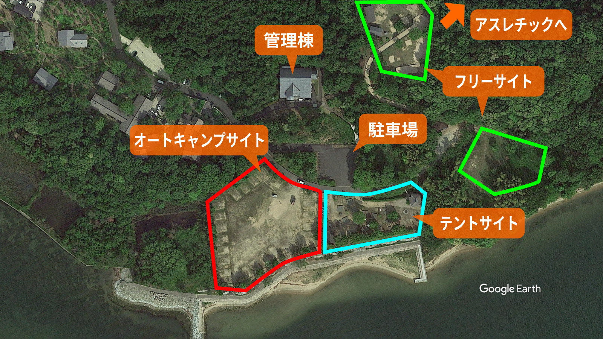
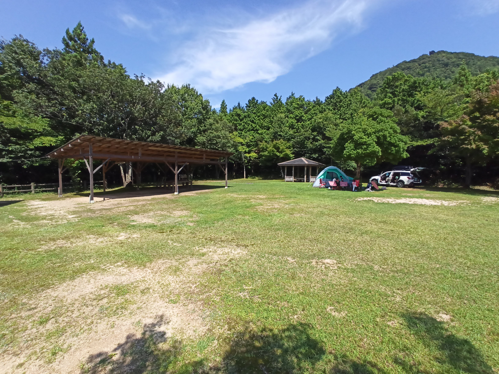
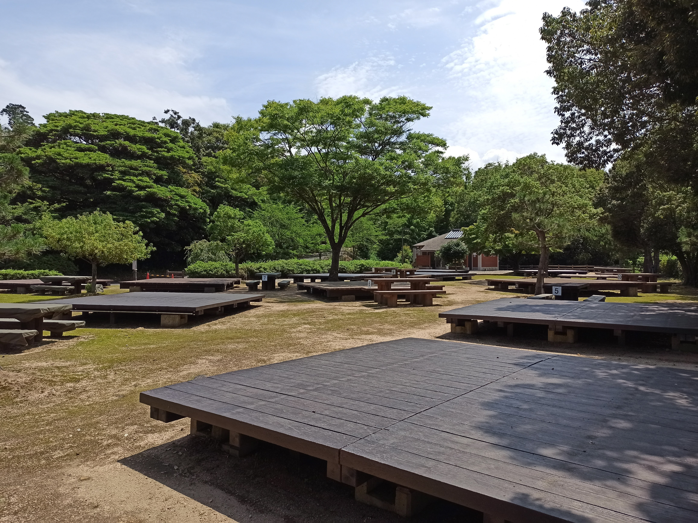
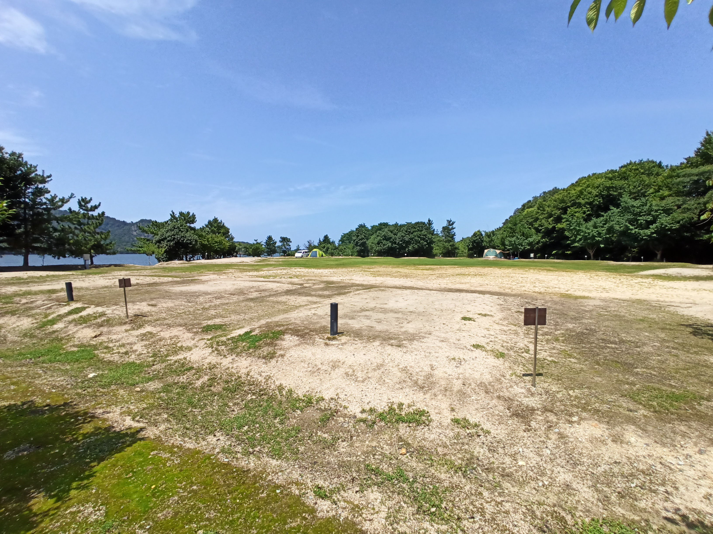
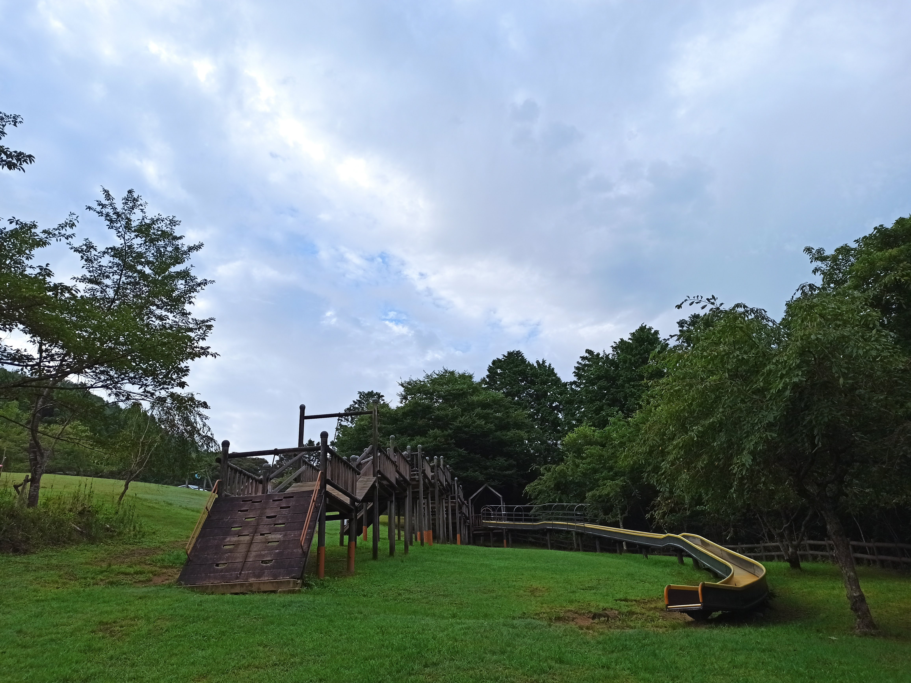
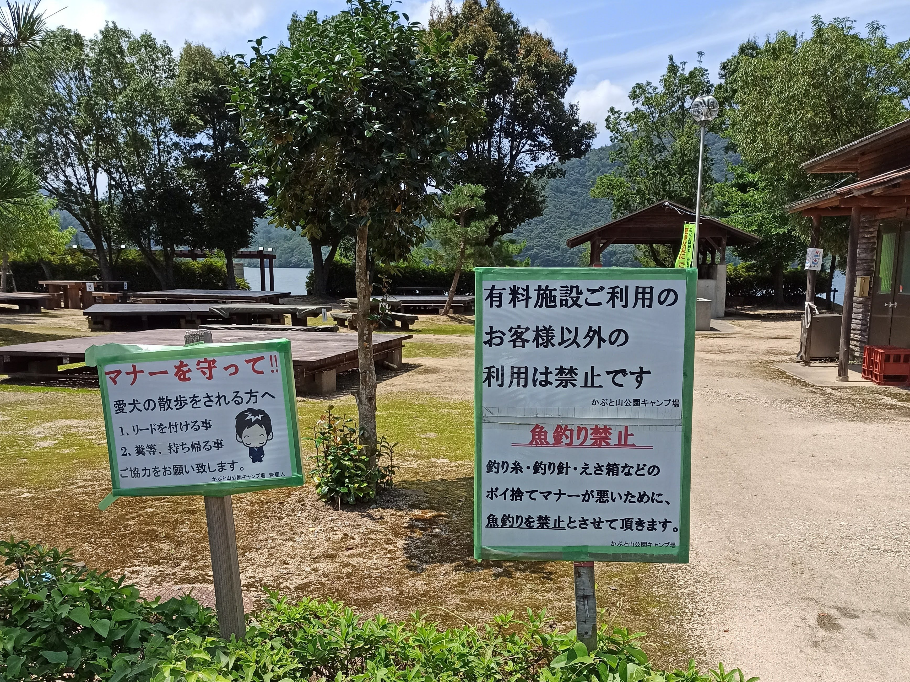
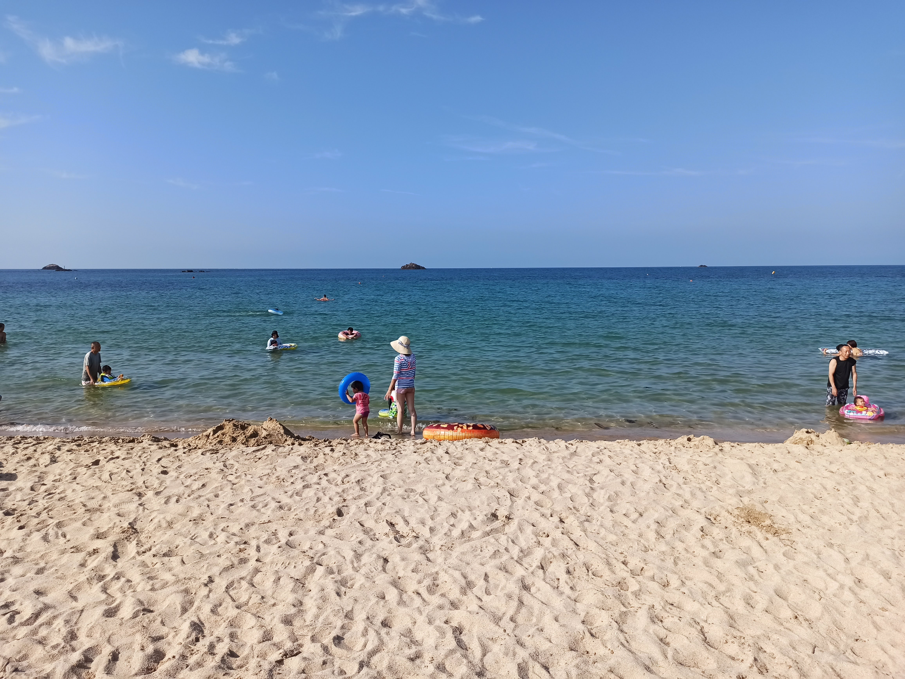
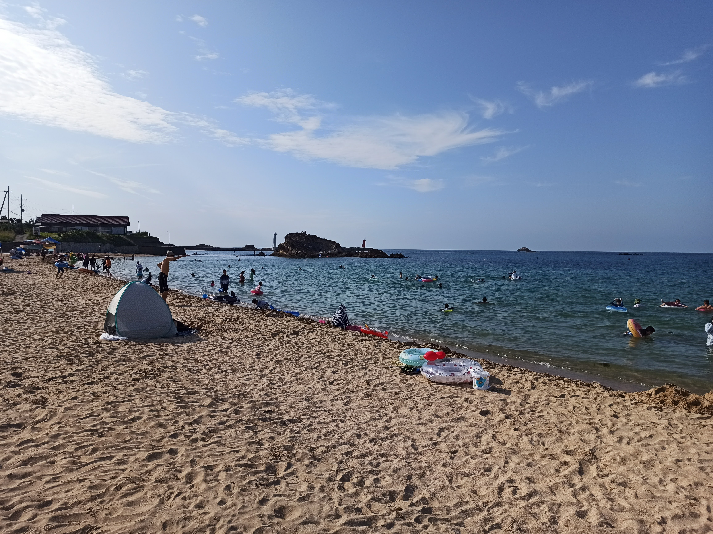
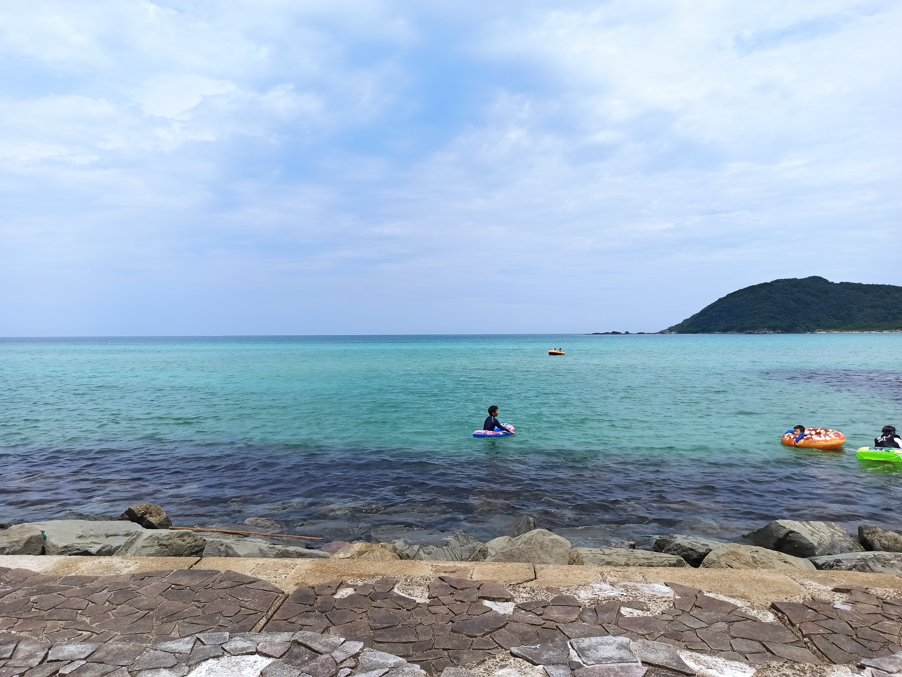

---
categories:
- アウトドア
- キャンプ
date: "2025-02-15T23:42:52+09:00"
draft: false
images: 
- images/IMG_20200801_142650.jpg
summary: 京都の日本海側、久美浜湾にあるかぶと山公園キャンプ場へ行きました。内湾で山に囲まれており穏やかでのんびりできます。海に近く、少し車で走り海水浴に行っても良い場所です。
tags:
- 海
- キャンプ場
- かぶと山公園
- 京都
title: かぶと山公園キャンプ場で海キャンプ
---

京都の日本海側、久美浜湾にあるかぶと山公園キャンプ場へ行きました。

## 予約方法

電話予約のみです。 URL: <https://www.kabutocamp.com/>

## アクセス



大阪、京都中心部から京都縦貫自動車道を終点の京丹後大宮ICで降りて久美浜湾へ下道で40分程度走ります。入り口はかぶと山の中に細い道を入っていきます。

住所: 〒629-3442 京都府京丹後市久美浜町磯６\
URL: <https://www.kabutocamp.com/>

## 駐車場と受付

かぶと山の細い道を進んでいくとキャンプ場に着きます。広々とした駐車場です。

駐車場上の管理棟で受付をします。

## キャンプサイト

芝生のフリーサイト、デッキのあるテントサイト、オートキャンプサイトがあります。なんと全て同じ値段なので空いていればオートキャンプサイトが良さそうです。しかし当然オートキャンプサイトから予約が埋まっていくようで、フリーサイトでキャンプしました。

### フリーサイト

駐車場からけっこう上に登った芝生のサイトです。山の上といった感じです。通常は駐車場に車を止めるみたいですが、今回宿泊した際はかなり空いていたので車乗り入れ可でした。3組しかいなく、写真の通り貸し切り状態。オートキャンプは満員なので結果としてフリーサイトでよかったです。

難点はトイレが近くに無く、管理棟が空いている時間は管理棟の中で、夜はデッキサイトまで降りて行く必要があります。また木が多いので蚊にたくさん刺されました。海辺のデッキサイト、オートキャンプサイトはまだ蚊が少なそうです。

### デッキサイト

駐車場の目の前にデッキがいくつかあります。真夏でデッキが熱そうでした。宿泊していたのは2組くらいで空いていました。駐車場から近いので荷物運びは比較的楽そうです。

### オートキャンプサイト

デッキサイトの隣で海が近く気持ち良さそうな場所です。フリーサイト、デッキサイトがガラガラなのに反してここは満員でした。値段が全部同じなので当然こうなるのでしょう。

### トイレ、炊事場など

サイトもそうですがトイレ、炊事場もそれなりに新しく、きれいに管理されています。管理棟にシャワーもありますがコロナ対策で閉鎖されていました。

## キャンプ場で遊ぶ

### アスレチックがある

山の上側、フリーサイトの隣には斜面を利用したアスレチックがあります。子どもたちはここで楽しく遊んでいました。キャンプ場にこうした遊具があると子どもにとっては嬉しいですね。

### 海は遊泳、釣り禁止

デッキサイト、オートキャンプサイトの目の前は久美浜湾です。海の前はさわやかでいい感じですが、残念ながら急に深くなっているため遊泳禁止でした。海というより、海と少しだけつながっている湖といった感じなので波はほとんど無く穏やかですがにごりがあり海の中は何も見えません。

事前にネットで調べたところでは夏はキスがたくさん釣れるとの情報だったので釣り竿を持ってきましたが、下の写真の通り、釣り禁止看板が、、、うーん、残念。公式ホームページには桟橋で釣りOKと書いてあります。もしかすると桟橋ではOKだったのかもしれませんが、この看板を見て釣りはやっていません。釣りをやりたい方は事前に電話で確認した方がよいでしょう。

## フリーサイトでキャンプ

ほぼ貸し切り状態のフリーサイトでした。好きなところにテントを張り、車も好きなところにとめて自由です。

釣りができなかったのでテントを張ったら久美浜湾沿いに10分くらい北上し、小天橋海水浴場へ。久美浜湾からの流れ込みがあるためか透明度は周辺の海水浴場に比べると少しだけ低い気がします。それでも日本海側の海はきれいで魚がたくさん泳いでいます。

海水浴場左端の岩のあたりでいろいろな魚を見ることができます。岩から飛び込んで遊んでいる人たちも多いです。駐車場は1,500円、あまり広くないため朝早い時間帯に満車になりそうですが来たのが夕方だったので問題なく停めることができました。

帰ったらごはんの準備をしている間子どもたちはアスレチックで遊んでいました。

## 2日目も海で海水浴

朝ごはんを食べて撤収したら透明度の高い海を求めて琴引浜へ車を走らせます。10時前、なんとすでに満車で入れませんでした。コロナ対策で例年より入場制限しているようです。鳴き砂と青い海を楽しみにしてたのに残念です。

少し西に行ったところの八丁浜海水浴場は駐車場も広くまだ入ることができました。駐車料金500円と安いです。しかしここも琴引浜で返された人たちが流れてくるので早々に満車になっていました。

臨時駐車場に留めたので目の前は砂浜ではなく石畳です。海辺も石が積み上げれれていてそこからすぐにある程度深くなります。このあたりは魚がたくさんいて子どもたちは小さな魚をたくさん捕まえていました。カワハギの赤ちゃんのような平べったい魚、アジ、しましまの魚、ベラ、おおきなボラにアオリイカの子供まで非常にたくさんの魚がいてシュノーケリングが楽しめました。

このあと砂浜でも少し遊んで帰宅です。

## 総評

目の前が海ですが泳げないので海水浴を目的とするなら微妙です。海辺のキャンプ場は風が強かったり波の音がうるさかったりしますがここは内湾で山に囲まれており穏やかです。海水浴場が近場にたくさんあるのでキャンプをしつつ海へ行って遊ぶといった感じにするといいとこどりで楽しめます。料金が安いのもGoodです。
