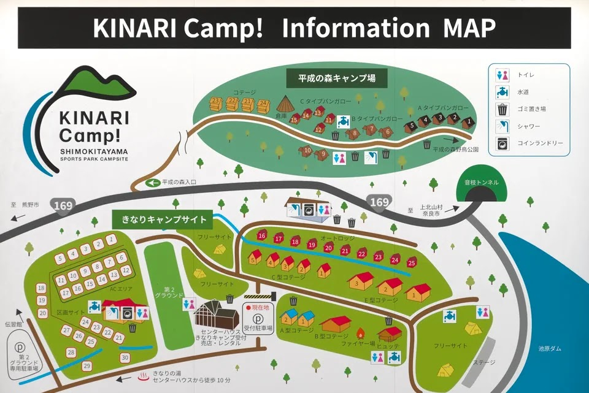
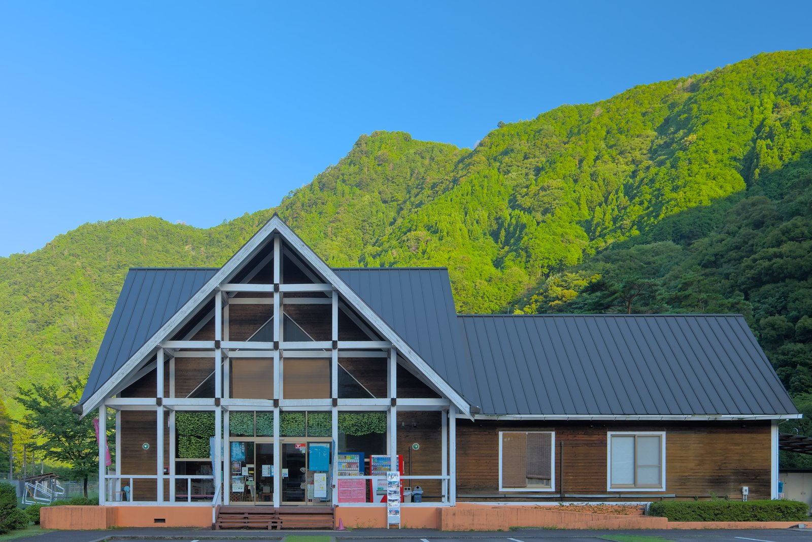
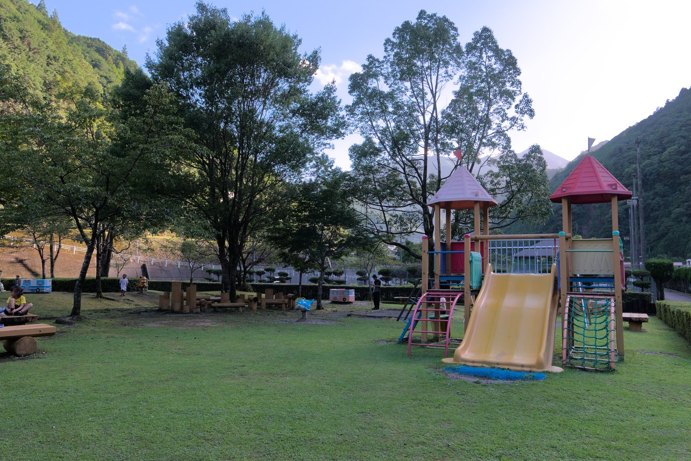
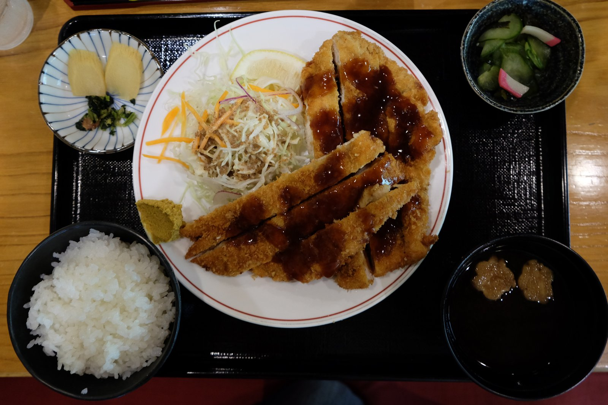

---
categories:
  - アウトドア
  - キャンプ
date: "2025-02-15T23:44:12+09:00"
description: 奈良県、吉野の山奥にあるきなりの郷でキャンプしました。ダムの真下にあり、大きな壁を下から眺める風景が「進撃の巨人」の世界を彷彿させるということで有名なキャンプ場です。
draft: false
images:
  - images/007.jpg
summary: 夏のお盆休みに、奈良県、吉野の山奥にあるきなりの郷でキャンプしてきました。ダムの真下にあり、大きな壁を下から眺める風景が「進撃の巨人」の世界を彷彿させるということで有名なキャンプ場です。
tags:
  - 川遊び
  - 高田川
  - 池郷川
  - キャンプ場
  - 神社
  - 奈良
  - ダム
title: ダムの壁直下 きなりの郷キャンプ場
---

夏のお盆休みに、奈良県、吉野の山奥にあるきなりの郷でキャンプしてきました。ダムの真下にあり、大きな壁を下から眺める風景が「進撃の巨人」の世界を彷彿させるということで有名なキャンプ場みたいです。

## きなりの郷について

紀伊半島の山奥、奈良県吉野郡にある下北山スポーツ公園の中のキャンプ場です。池原ダムの壁の真下にサッカー場、テニスコート、温泉施設、キャンプ場などが含まれる広大な敷地になっています。ダムの上にある平成の森キャンプ場と合わせ、「きなりの郷」と呼ばれているようです。

今回は、ダムの下、「下北山スポーツ公園キャンプ場」（キャンプ場の看板では「きなりキャンプ場」）の区画サイトを利用しました。呼び名がややこしいのですが、以下「きなりの郷キャンプ場」で統一します。

## アクセス



大阪、奈良から南阪奈道路の終点、新庄出入口まで行き、国道169号を南へ2時間ほどつき進むと、左手に下北山スポーツ公園入口の看板があります。下北山スポーツ公園の突き当りまで進むとキャンプ場の受付があります。

## マップ

Google
Earthの衛星画像を見ると、きなりの郷は池原ダムの西にバナナ状に広がっており、青線で囲われた部分がきなりの郷キャンプ場です。

ダムの北、ダムより高い尾根沿いに平成の森キャンプ場があります。

## 料金

-   区画サイト AC電源付 5,500円
-   区画サイト AC電源無 5,500円
-   フリーサイト 大人1名 700円 小人1名500円
-   コテージ 定員4名〜30名まであり、料金は11,000円〜35,000円まで様々です

### 駐車料金

フリーサイトは、4輪1台600円、2輪1台300円。区画サイトは1台分の駐車料金込み、2台目以降はフリーサイトと同じ料金がかかります。コテージは駐車料金は含まれています。

## キャンプサイト紹介

キャンプ場中央に広がるサッカー場、第２グラウンドを挟み、西側が区画サイト、東側にフリーサイトとコテージがあります。

### 受付

キャンプ場の中央あたり、第２グラウンド東側にキャンプ場の入口と受付があります。

中ではかっぷめん、お菓子や調味料の他に、忘れがちなガス缶、着火剤などが売られています。薪、炭もありました。バーベキュー用品のレンタルも充実しています。

受付でキャンプ場入口のカードキーをもらいます。なんと自動開閉のゲートなのです。宿泊期間中は何度でも出入りできます。

### 区画サイト

ゲートからサッカー場脇の細い道を抜けた西側が区画サイトです。車1台とテント、タープが張れる程度の広さがあります。電源ありと電源なしのサイトがバラバラに区画されている感じでした。

芝生が青々と覆っている場所、ほぼ土になっている場所、木陰になっている場所、木がほとんど無い場所など様々ですが、総じてきれいに管理されています。

### フリーサイト

フリーサイトはサッカー場の東側にあります。壁が目の前に広がるダム直下の芝生サイトがインスタ映え間違いなし！一等地に思えますが、日中は太陽を遮るものが無く暑そうでここにテントを張っている人は意外にも少なかったです。春や秋はぜひここにテントを張りたいですね。

サッカー場の東側に面したあたり、管理棟付近もフリーサイトがあります。少し木があったりするからか、こちらの方が多かったです。

### 炊事場、トイレ

炊事場は台所用の小さな流しがたくさんあり、小綺麗な感じです。ゴミも捨てられます。燃えるゴミは、受付時に渡されるゴミ袋に入れて捨てます。炭を捨てる場所もあります。

トイレもきれいです。シャワールームもあり、5分で100円でお湯も出ます。シャワールームはユニットバスのようになっていて着替えスペースもあり新しくきれいでした。

### コテージ

コテージ数は多く、大きさも様々なタイプがあります。泊まっていないので中は分かりませんが、外観からは新しく綺麗そうです。

 

## きなりの郷　施設紹介

### きなりの湯

キャンプ場の近くに温泉があります。土日祝日の営業時間は11:00-20:45ですが、ぐずぐずしていたら入り損ねてしまいました。

中のレストランには、ダムカレーという名物カレーなどを食べられます。

### テニスコート

ハードコート6面、クレイコート4面のテニスコートがあります。空いていれば当日予約無しでも使うことができます。ラケットの貸出もあります。雨上がりだったせいか誰もプレイしている人はいなかったのですが、せっかくなので借りてみました。（有料）

### わんぱくランド

木でできた建物のようなアスレチック、遊具、パターゴルフがあります。

 

### 平成の森キャンプ場

きなりの郷キャンプ場の敷地を出て、池原ダムの上まで行く道に、平成の森キャンプ場への分岐があります。登っていくとキャンプ場入口付近から池原ダムを上から眺めることができます。きなりの郷に来た際にはせっかくなので上からも見てみることをおすすめします。

キャンプ場はバンガローがいくつかある感じでしたが、敷地内には入りませんでした。

## キャンプ詳細

### 初日：池郷川で川遊び、夜は満天の星

お盆休みの初日、朝に家を出て南阪奈道路の終点から下道を走ること約2時間、お昼直前にきなりの郷に到着しました。直前まで雨が降っていたみたいで、道路が濡れていましたが運良くちょうど晴れて乾いていくところでした。

サイトは濡れているし、カンカン照りの太陽が暑そうなのでテントは建てず、まずはお昼ご飯です。きなりの湯にレストランがあるのでそこで食べることにします。巨大な日本家屋のような建物です。

ダムカレーがおすすめみたいですが、家族の誰も注文せず、自分はチキンカツ定食を頼みました。サイズがバグっているかのような巨大なチキンカツで食べごたえがあります。

お腹を満たしたら、そのまま近くの川、池郷川へ川遊びに行きます。きなりの郷入口から池郷川の対岸に駐車場があります。一日1,500円と高めですが、きなりの郷キャンプ場の利用客であれば割引で500円で停められます。

手書き地図をキャンプ場の受付でもらえますが、少しわかりにくいので場所を下に載せておきます。



きなりの郷から出た国道169号を少し北へ進んだ交差点を左折し、国道425に入り、北から南へ池郷川にかかる橋を渡ってすぐ左に入り、スロープを下りていきます。南側に池原橋がありますが、とても細く車1台ギリギリの幅なのでこちらを通っていくのはおすすめしません。

雨上がりにもかかわらず、きれいな水です。

冷たい水の中、浮輪で流れたり魚を捕まえたり、寒さで震えるくらい思いっきり遊んだ後、キャンプサイトも乾いてきたのでやっとテントを張ります。車は通常、サイト内に停めるのですが、サイトがサッカー場のすぐ隣でその日はサッカー場が使われていなかったことと、大人数家族だったからか管理人さんのご厚意でサッカー場の駐車スペースに車を停めてよいということで、ありがたく広々とスペースを使わせていただきました。

テントは今年新調し、使用2回めのロゴス ナバホ Teepee
400です。なんと最大7人入れる大きさですがポール1本で立ち、値段も安くてお得です。風にはあまり強くなさそうですが、ファミリーキャンプで基本的に天気の安定した日にしか使わないので見た目が良くいい感じです。

わんぱくランドで遊んだりテニスをしていたらあっという間に日が暮れてしまいました。

夜ご飯を食べ終わる頃には、温泉に入る時間も無くなり、コインシャワーを浴びて寝ることにします。

夜は空を見上げるとびっくりするくらいあたり一面の星。天の川も見え、とても綺麗な星空を見ることができました。

### 二日目：高田自然プールと熊野那智大社

早朝にキャンプ場内を散歩し、ダムの絶壁を見納めておきます。それにしてもすごい威圧感です。

パンを食べたら早々と撤収し、前々から行ってみたいと思っていた川遊びスポット、高田自然プールへ向かうことにします。

その前に、ダムを上側から見ておきます。平成の森キャンプ場前の駐車スペースから見渡すことができますが、このダムの下に泊まっていたかと思うとすごいです。

南東へ熊野川沿いを下り約1時間のドライブでやってきたのは和歌山県新宮市にある熊野川の支流、高田川の「高田自然プール」です。



昨日の池郷川でいいじゃないか、という話もありますが、「自然プール」という響きに惹かれGoogleマップで発見した3年前くらいからずっと行ってみたかったところなのです。ついに来ました！

ここは駐車場が無料ですが小さく、10時頃到着でギリギリ停めることができました。飛び込んで来たのはエメラルドグリーンがかった澄んだ水！

流れもそれほど速くなく、手前側は川底にハゼ系の魚がたくさんいて魚捕りを楽しめます。奥は大人も足がつかないほど深いですが、ちょうどよいくらいの流れがあり、浮輪で浮きながら流れたり、水中メガネをすると魚を見たりできます。

浅場はこの透明度です！

飛び込み台などもあり、昼間でしっかり遊んだら最後にせっかくここまで来たのだからと熊野那智大社まで寄って帰ります。

駐車場から長い階段はハードでした。

そこからさらに那智の滝まで下り、これを見て今回のキャンプ旅行は終了です。このあとまた歩けなくなった子供を背負って地獄のような階段登りをしてから車で紀伊半島の海沿いをぐるっと周り大阪へ帰りました。

## まとめ

巨大なダムの壁で有名なきなりの郷キャンプ場は、お盆休みでたまたま空きがあったので予約し、正直あまり期待はしていなかったのですがダムの実物は想像以上に存在感があり、キャンプ場はきれいで川遊びも楽しく、良い意味で期待を裏切られました。

夏の川遊びを組み合わせても楽しめますし、涼しい時期にテニスを楽しんでダム直下のフリーサイトに泊まるのも良さそうです。

また行きたくなるキャンプ場でした。
