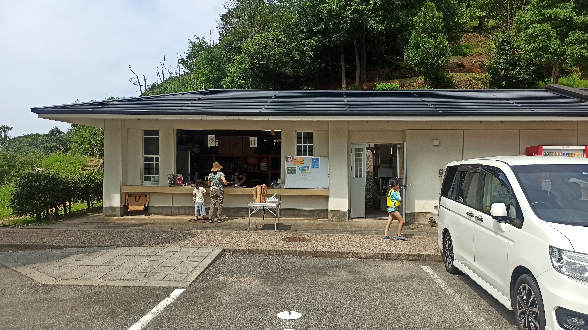
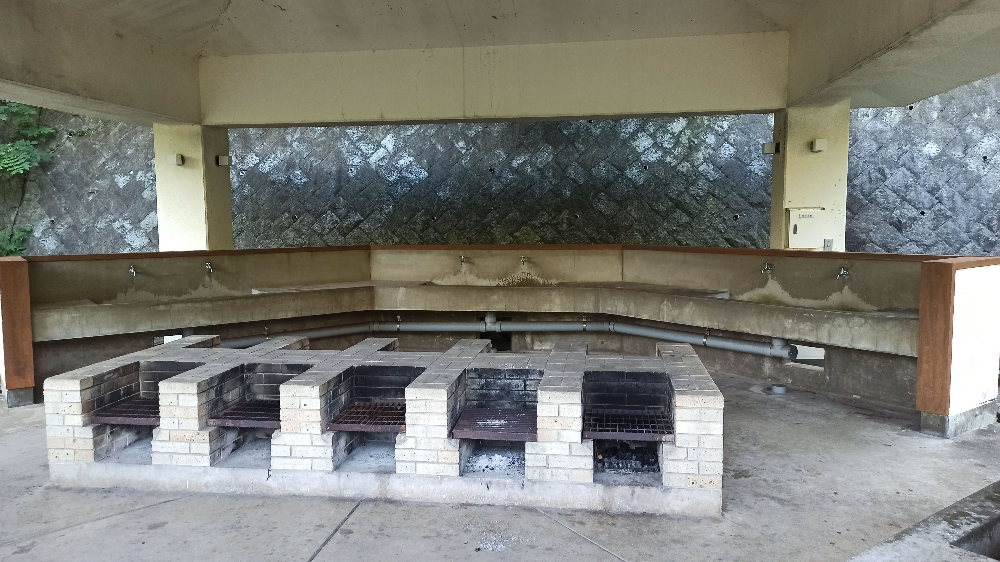

---
categories:
  - アウトドア
  - キャンプ
date: "2025-02-15T23:43:53+09:00"
description: 兵庫県の日本海側、休暇村竹野海岸キャンプ場をご紹介します。プライベートビーチ、庵蛇（あんじゃ）浜や近くの竹野浜海水浴場の綺麗な海で思いっきり遊べるキャンプ場です。
draft: false
images:
  - images/40_grass.jpg
summary: 我が家の夏の恒例となってきました海辺でのキャンプ。今年は兵庫県の日本海側、休暇村竹野海岸キャンプ場に行きました。直前の雨で楽しみにしていた休暇村のプライベートビーチ、庵蛇（あんじゃ）浜は抹茶色に濁り残念でしたが広々とくつろげるキャンプ場でした。近くの竹野浜海水浴場の綺麗な海で思いっきり遊び夏の連休を満喫しました。
tags:
  - 休暇村
  - キャンプ場
  - 海
  - 兵庫
title: 休暇村竹野海岸キャンプ場で海キャンプ
---

我が家の夏の恒例となってきました海辺でのキャンプ。今年は兵庫県の日本海側、休暇村竹野海岸キャンプ場に行きました。直前の雨で楽しみにしていた休暇村のプライベートビーチ、庵蛇（あんじゃ）浜は抹茶色に濁り残念でしたが広々とくつろげるキャンプ場でした。近くの竹野浜海水浴場の綺麗な海で思いっきり遊び夏の連休を満喫しました。

## アクセス



北近畿豊岡自動車道但馬空港ICより北へ日本海方向に向かい約30分。県道11号、但馬漁火ラインに入口の看板があります。

## 休暇村竹野海岸キャンプ場紹介

全国の国立・国定公園など優れた自然環境の中に35箇所のリゾート施設をもつ休暇村のうち、兵庫県豊岡市竹野町、綺麗な海の前にある宿泊施設です。キャンプ場も整備されており、今回キャンプ場に宿泊しました。

### キャンプ場マップ

キャンプ場は区画サイトとオートサイトがあり、全て予約制でフリーサイトはありません。区画サイトは庵蛇浜へ下りる谷沿いにあり、坂になっているため段々畑のようにサイトが区画されています。そのため隣と高さ方向にも距離が取れ、大きな芝生広場が中央にあることで隣を気にせずゆったりとスペースを使うことができます。

このキャンプ場の魅力はなんといってもプライベートビーチ、庵蛇浜で海水浴ができることでしょう。

### 駐車場

オートサイト以外の区画サイトは管理棟前の駐車場に車を停めます。

駐車場から各サイトまでの道のりは結構距離があり、しかも坂道なので荷物を移動するのが大変です。荷物の運搬用に受付近くにリヤカーがあります。

### 管理棟、ゴミ捨て場 {#管理棟、ゴミ捨て場}

駐車場の前、管理棟で受付をします。薪も売っていました。

管理棟前には自動販売機があり、ゴミはビニール袋に入れて自動販売機脇に置いて捨てるというシステムです。ゴミステーション的な箱やケージ等は無く、単に路上に置くだけで、しかも管理棟は夜には閉まるのですが普通に自動販売機横にゴミが置いてありました。早朝にも動物に荒らされた跡はありませんでした。海に近いから熊とか出ないのですかね。なるべく管理人さんがいる間に捨てたほうがよさそうです。

### 中央に大きな芝生

駐車場から庵蛇浜まで芝生広場を挟んで両側に区画サイトがあり、谷のような地形です。中央の芝生は広々としてきれいに刈り揃えられた芝生です。ここでは火器を使用できないので遊び場のような使い方になりますが、坂なのであまり活用されていませんでした。

途中の平な場所にトイレとキャンプファイヤー場があり、夜はそこで花火をしました。

### 持込区画サイト（電源・水道あり）

駐車場からキャンプサイトを見て芝生の左側が持込区画サイト（電源・水道あり）です。段々畑のようになっており、隣との距離が十分あるのでゆったりと落ち着いてキャンプができます。水道付きなので炊事場はこちら側にはありません。

西側が山になっているので、夕方は日陰になりますが朝は日が照りつけるので夏の晴れた日は到着時に日陰でもタープを張っておくことをおすすめします。

14区画あり利用料は3,500円＋一人あたり600円です。

### 持込区画サイト（電源・水道なし）

電源・水道ありの持込区画サイトから芝生を挟んで反対側が持込区画サイト（電源・水道なし）です。こちらも段々にサイトが配置されています。

東側が山なので朝は日陰、午後は日が射します。

16区画あり利用料は2,500円＋一人あたり600円です。

### 炊事場

持込区画サイト（電源・水道なし）側に炊事場があります。

水道の他にかまどもありました。

### オートサイト

駐車場から区画サイト、庵蛇浜と反対側にオートサイトがあります。電源、水道もあり荷物を運ぶ必要が無いので便利ですが、庵蛇浜からだいぶ遠くなるのが難点です。

8区画と少なめで利用料は4,500円＋一人あたり600円です。竹野浜に限らず休暇村のキャンプサイトは人気があり予約が難しいのですが、その中でも8区画しかないオートサイトが予約できたらラッキーじゃないでしょうか。

### サニタリー棟

トイレ、シャワールーム、洗濯機などがあります。

### 小浦展望台

キャンプサイトから2つの海へ下りることができます。1つは遊泳できる庵蛇浜でもう1つは小石がごろごろした小浦です。庵蛇浜へ下りる途中に小浦を見下ろす展望台があります。

### 小浦

小浦展望台から細い道を降りると小浦まで行くことができます。早朝に釣りをしてみましたがフグばかりでした。フナムシがわんさかいました。

### 庵蛇浜

キャンプサイトを下っていくと突き当りが庵蛇浜です。奥まった位置にある浜なので波が穏やかでプライベートビーチのような、このキャンプ場の魅力となる場所ではないでしょうか。

しかし、休暇村のホームページ写真ではクリアな海なのですが、内湾一帯が竹野川の河口にあたるため、雨の日などは川の濁流が流れ込んでしまいます。

きれいな休憩舎があり、水シャワーも使えます。

## 初日：雨上がり、茶色の庵蛇浜であそぶ

初日は午前中に用事があったため11時頃に大阪を出て昼食は途中で済まし、午後14時頃にキャンプ場に着きました。今回予約したのは区画サイト（電源・水道あり）です。受付を済ますとまずはリヤカーで坂道を往復して荷物を運ぶ必要があります。

広々としたキャンプ場でしかも坂道なので荷物を運ぶのが結構大変です。

荷物を運び終えたらもうひと仕事終わった感があります。なんとかテントを建てます。キャンプサイトはこんな感じでお隣さんを意識しなくて良いので気楽です。

暑いのでテントを設営したら早速庵蛇浜へ。キャンプサイトから海が広がる光景にワクワクします。

日本海の透明な海、、、あれ？？何か色が変だぞ。なんと海が真っ茶色でした。臭いまでします。

透明な海を期待して日本海まで出てきたのですが、想像と全く異なる光景に愕然とします。。。

来る途中にゲリラ豪雨のような大雨に降られたのですが、どうやら雨で濁った竹野川の流れが来たのかなと思います。狭い海なので人が入ると濁りやすいのかもしれません。泳ぐ気が起こらないレベルでしたが子どもたちが入っていったので仕方なく海へ入り一緒に泳いでみました。海中は視界ゼロで魚を見るどころでは無いですね。

海はほどほどにして退散し、火を起こして夕食は焼肉パーティです。

海の汚れを落としたいので温泉に入りたかったのですが、なんとコロナの影響でキャンプの客は休暇村の温泉が使えないとのこと。車で庵蛇浜の反対側、竹野浜海水浴場にある竹野温泉「誕生の湯」に行きスッキリしました。

夜は持ってきた手持ち花火を楽しみ就寝です。

## 二日目：竹野浜海水浴場へ

少し早起きし早朝に釣り竿を持って小浦へ降り、オキアミを付けてちょい投げしてみます。釣れたのは、、、お決まりのフグでした。何度投げても針を切られてばかりなのでフグだらけなのでしょう。早々と退散です。

庵蛇浜へ行ってみると、濁りがとれてきておりそこそこきれいな海になっていました。

庵蛇浜は東を向いているので朝日が綺麗です。子供はまた泳ぎたがりましたが、今日はきれいな海を求めて写真の向こう側に見える竹野浜海水浴場に行くことにします。外海側なので竹野川の濁りは来ないでしょう。

竹野浜海水浴場は駐車場が2,000円とびっくり価格でしたがさすが水質AAの海。遠浅ではありませんがほどよい深さです。

水はきれいですが魚はやっぱりフグの稚魚しか見られませんでした。右手には磯があり、魚がたくさんいそうでしたが磯があることに気づかず、次回のお楽しみにしたいと思います。昼過ぎまでひたすら泳ぎ、疲れ帰宅しました。

## まとめ

休暇村竹野海岸キャンプ場は広くてきれいに管理されたキャンプ場で、隣との距離が空いているのでゆったりとキャンプスペースを使えます。オートサイト以外の区画サイトは坂に配置されているので荷物の運搬は結構大変です。

プライベートビーチ、庵蛇浜で泳いでシャワーしてそのままキャンプサイトに戻れるのが大きな魅力ですが、今回のように雨の後だとかなり濁ってしまうこともあるようです。その場合は竹野浜海水浴場に行くのがおすすめです。
