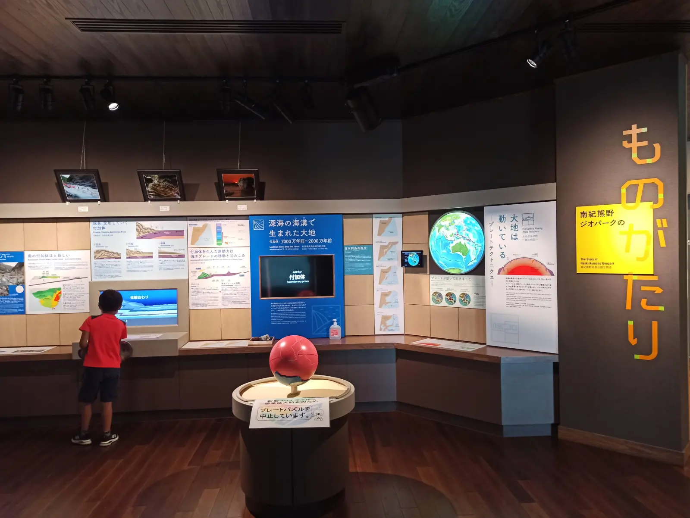

---
categories:
  - アウトドア
  - キャンプ
date: "2025-02-15T23:43:20+09:00"
description: 紀伊半島最南端に浮かぶ紀伊大島にあるキャンプ場、南紀串本リゾート大島をご紹介します。温泉から絶景の海を眺められ、管理も行き届いた高規格キャンプ場です。橋杭岩などの南紀観光と合わせても楽しめるキャンプ場です。
draft: false
images:
  - images/IMG_20210810_160600.webp
summary: 今年のお盆休みはいきなり台風、そしてその後も雨続きの予報でがっかりです。しかし8月10日、11日とピンポイントで晴れそうになったので急遽、キャンプに行くことにしました。行き先は南紀串本リゾート大島です。
tags:
  - 南紀
  - キャンプ場
  - 海
  - 和歌山
title: 南紀串本リゾート大島でキャンプと本州最南端めぐり
---

今年のお盆休みはいきなり台風、そしてその後も雨続きの予報でがっかりです。しかし8月10日、11日とピンポイントで晴れそうになったので急遽、キャンプに行くことにしました。行き先は南紀串本リゾート大島です。

## アクセス

大阪方面から近畿自動車道紀勢線の終点すさみ南ICで降り国道42号を南へ。串本から県道40号、橋を渡り大島へ入り看板のある場所を右へ入りしばらく進むと到着します。

県道40号を右折したあとから串本リゾート大島までの道は細く、すれ違いができない箇所が多くあります。リゾートへの道とういよりは山奥へ迷い込んでしまったような道ですが、看板どおりに進めば着きます。



スーパーは大島に渡る前、串本にエーコープ南紀VASEOがあり、コンビニもやはり串本まで戻りファミリーマートとローソンがあります。

## 予約方法

[公式ホームページ](https://resortohshima.com/inquiry "南紀串本リゾート大島/予約")
か [なっぷ](https://www.nap-camp.com "なっぷ")
から予約します。ネット予約のみです。

## キャンプサイト紹介

キャンプ場内はかなり広くきれいに整備・管理されていてサイトの種類も下の場内マップの通りもりだくさんです。料金は比較的高めですが非常によく管理された高規格キャンプ場です。

場内マップ [公式ホームページ](https://resortohshima.com/ "南紀串本リゾート大島")より引用

Google
Earthの衛星写真です。画像上が南、太平洋側です。基本的に森に囲まれていますが断崖絶壁の上にあり風は強めです。中央の展望サイト、露天風呂からは左右を崖に囲まれた先に海が見え絶景です。貸切露天風呂からも海を見ることができます。

出典：Google Earth

### 管理棟

キャンプ場の入り口に管理棟があり、ここで受付をします。

受付時は左側面の扉から入り、はじめに注意事項のビデオを見ます。消灯やチェックアウト時間などいろいろルールがあるので注意です。

露天風呂・貸切露天風呂の申し込みもここでします。貸切露天風呂は時間の書かれた札を取ってカウンターで支払います。

炭・薪、OD缶や調味料に花火なども売られていて、充実した品揃えでした。

### 通常サイト・電源サイト・炊事場付き電源サイト

マップ左側の大きな芝生の広場とその下側の凸部になった芝がテントサイトです。オートキャンプサイトで車を乗り入れできます。

通常サイトは電源なし。一部Wサイトという広めの区画があります。電源サイトは通常サイトの電源付き、炊事場付き電源サイトというのが1箇所だけあります。

### 展望サイト

マップ中央部、入り口からすぐ左が展望サイトで、南に海が見えます。

### ソロ・デュオサイト

マップ左奥、木が生えているあたりに小さめのソロ・デュオサイトがあります。

### グランピング

入り口からまっすぐ進み、じゃぶじゃぶ池の奥右手にグランピングがあります。屋根の下にNordiskと思われるおしゃれなテント、ハンモックもあり豪華そうです。

### コテージ、キャビン

いろいろ種類がありますがどれも真新しくきれいに見えました。

グランピングやコテージ、キャビンに宿泊するとリゾート気分を満喫できそうですね。

### ドッグラン

テントサイトのさらに左奥にドッグランがあります。

### 貸切露天風呂

貸切露天風呂の予約は受付時に時間の書かれた札を早いもの勝ちで取るシステムです。一人あたりの露天風呂入浴料に加え、貸切料1,200円が加算されますが、貸切露天風呂以外に通常の露天風呂もいつでも入浴できます。

貸切露天風呂は4つあり、色で区別されています。札の色と同じところに入り、入浴時は入り口に札をかけておきます。

海の眺めが素晴らしく、子供がとても喜びました。家族連れにおすすめです。湯船、脱衣場ともとてもきれいです。

### 大浴場露天風呂

展望サイトの南、少し下に露天風呂があります。コロナの影響で同時に10名までと人数制限がありました。こちらは入っていませんが、展望サイトと同様の眺望があるはずです。

### じゃぶじゃぶ池

訪れた日は水が抜かれて中止でしたが、子供が喜びそうなじゃぶじゃぶ池がありました。

### 炊事場・トイレ

炊事場・トイレともきれいです。

### コインランドリー

利用しませんでしたがコインランドリーもあります。

### ゴミステーション

ゴミステーションは管理棟の前にあり、可燃ごみ、不燃ごみ用の袋を渡されるので分別して捨てることができます。

## 初日：橋杭岩海水浴場で強風の中海水浴

台風一過の晴れ間を狙い南紀串本へ。朝大阪を出発し昼頃に串本に着きましたがチェックインは14時からなので橋杭岩海水浴場へ行ってみます。

遠い駐車場に車を停めてしまい、海沿いを歩きます。奥に橋杭岩が見えます。ちなみに海水浴場目の前の駐車場は有料ですが西側の駐車場は無料でした。

空は快晴ですが風が強くときどき砂が痛いくらい舞います。

海はきれいなのですが海中も砂が舞っていてきれいなブルーなのに視界が砂で遮られ透明度がありません。なんとか近くにたまたま来た小魚を1匹見られたくらいでした。南国の魚を見たいと思っていたので残念です。

海水浴のあとは地元のスーパーで串本で捕れたカンパチと朝のパンを買ってキャンプ場へ。

すれ違いも難しそうな細い道を進むと南紀串本リゾート大島キャンプ場に着きました。

天気予報で風速6～8mの強風。鍛造ペグでガチガチに打ち込みテントとタープを設営します。ウィングタイプのKELTY
NOAH'S
TARPは4箇所で固定なのでヘキサタープに比べて不安定で風に弱いです。張り方が下手でいつまでたってもピーンといきません。。。

テント設営後、少し早いですが16時から貸切露天風呂へ。海の眺めが最高で子供も大喜びでした！

夕食にスーパーで買ったカンパチを炭火で塩焼きにしました。塩を忘れたので管理棟で600円！の岩塩を買って惜しげなくふりかけて焼きます。

ごはんを炊いてこれと焼き肉でお腹いっぱい。

夜は花火をして就寝です。星がきれいでした。

## 二日目：南紀観光（潮岬、橋杭岩、串本海中公園）を満喫、午後は雨が降り帰宅

朝からやや曇り空、午後には雨の予報です。朝は地元のメロンパンを食べました。中に白あんが入っていて甘いメロンパンでした。

テントを撤収したらまずは本州最南端、潮岬を目指します。潮岬タワーという寂れたタワーがランドマークです。

ここから芝生を歩いて海側へ。ここも期間限定で予約不可のキャンプ場になります。

本州最南端の碑と記念写真です。

2個ありました。こちらが本物！？

潮岬にある南紀熊野ジオパークセンターに寄りました。

紀伊半島の地形に関する展示などが無料で見学できます。

床に映した魚をうちわで金魚すくいみたいにして遊びます。

水が砂を削って川ができるデモなどもやっていて意外とたくさん遊べて面白かったです。

次は橋杭岩へ。目の前で見ると迫力がありますね。カニや小魚もいてたくさんの人が訪れていました。

 

最後に串本海中公園です。

ここ近海の魚が展示されています。ウミガメがたくさんいて餌をあげることもできます。

海中展望台へ。

古いサビサビ感が味を出しています。

強風で海の透明度は低かったのですがそれでも近くにたくさん魚がいます。青い色した魚など南国らしい魚も見ることができました。

上からはメジナ（グレ）の群れが。コイみたいにエサを投げてパクパク食べるところを見られます。メジナの群れを初めて見たのでびっくりです。

雨も降り始め串本観光はこれでおしまい。紀伊半島を北上して家に帰りました。

## まとめ

南紀串本リゾート大島は紀伊半島の南端にあるきれいでよく管理された高規格キャンプ場でした。南紀はみどころがたくさんあるので時間があればいくらでも観光スポットがあります。

海が穏やかであれば海水浴やシュノーケリングでカラフルな魚を見ることもできそうなのでまた行きたいキャンプ場でした。
