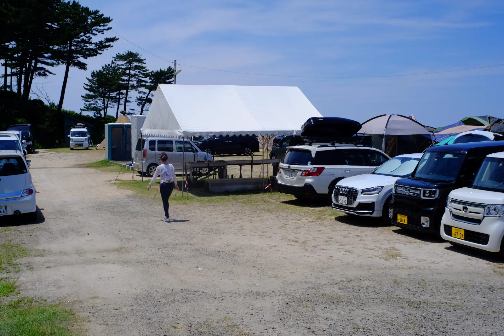

---
categories:
  - アウトドア
  - キャンプ
date: "2025-02-15T23:43:18+09:00"
description: 京丹後の国道178号沿いにあり、すぐ下が磯の小さなキャンプ場、砂方オートキャンプ場に行きました。磯から透明で深い海で泳ぎ、小魚もたくさん見られます。透き通った日本海の海を満喫できるキャンプ場です。
draft: false
images:
  - images/sunagata_15.webp
summary: 梅雨明けの4連休、オリンピックが始まりましたが我が家は関係なく夏の連休といえば海とキャンプ！ということで京丹後の国道178号沿いにあり、すぐ下が磯の小さなキャンプ場、砂方オートキャンプ場へ行ってきました。
tags:
  - 砂方
  - キャンプ場
  - 海
  - 京都
title: 砂方オートキャンプ場でシュノーケリングを楽しむ海キャンプ
---

梅雨明けの4連休、オリンピックが始まりましたが我が家は関係なく夏の連休といえば海とキャンプ！ということで京丹後の国道178号沿いにあり、すぐ下が磯の小さなキャンプ場、砂方オートキャンプ場へ行ってきました。

## アクセス



京都縦貫道を終点の京丹後大宮まで行き、そこから北へ向かい海沿いを走る国道178号沿いにあります。

## 予約方法

[なっぷ](https://www.nap-camp.com/kyoto/10586# "なっぷ")
でネット予約しました。予約はネットだけでは完結せず、ちょっと複雑です。

ネット予約をすると、確認の電話がかかってきます。この電話をもって正式予約とのことです。また、支払いは銀行振込で、行く前に銀行振込を済ませておく必要があります。

ちょっと面倒に思えますが、実際にはなっぷでの予約後すぐに電話が来て、サイトの場所や電源、キャンセルに関することなど親切に教えてくれました。また、銀行振込もネット銀行を利用しているのでスマホですぐに手続きできたのであまり手間はかかりませんでした。

## キャンプサイト紹介

砂方オートキャンプ場は、全サイトオートキャンプ場で予約制です。道路の脇にある小さなキャンプ場といった感じで道路を挟んで海側サイトと山側サイトがあります。海側サイトは14張りくらい、山側サイトは4張りくらいのスペースしかなく、こじんまりとしています。

海側サイト5,000円、山側サイト4,000円、デイキャンプ2,000円です。各サイト車が1台とテント＋タープ1個ずつが設置できる程度のスペースで、車が2台とかの場合は駐車料金が別で2,000円かかります。

### a.入り口

海側サイトの入り口は、国道西から来て左側にあります。いちおう看板が出ていますが車1台が通れるくらいの入り口なので注意していないと通り過ぎてしまうかもしれません。道路のすぐ右側が山側サイトで、山側サイトへは各サイトにそのまま入る感じです。

### b.海側サイト

入り口の坂を下ると海側サイトです。坂の途中に2張り、下りきったところに残りのスペースがあります。車1台分の駐車スペースとテント、タープ各1個が張れるスペースがありますが詰め詰めで配置されているためサイト全体で見ると窮屈な印象です。

 

サイトは砂地で結構硬いためペグの固定にはハンマー必須です。

海から見て高台になっているのでキャンプ場から海の展望は素晴らしいです。下に磯が見えます。

風が強そうですが、運が良かったのか当日は気になるほどではありませんでした。

トイレ横の分電盤に電源があり、ドラム式の延長コードを貸してくれてサイトまで引っ張ってこれます。ただし5個とのことで早い物勝ちのようです。電源が必要なものは持ってきませんでしたが扇風機や電気式クーラーボックスなどあると便利かもしれませんね。

### c.山側サイト

こちらは芝生です。海側サイトに比べゆったりスペースが確保されていそうな印象です。車の出入りも楽ですね。

トイレや炊事場、磯へ行く際は道路を渡らないといけないのが難点です。とはいえ、車の通りは少ないのでそれほど気にならないかもしれません。電源もありません。

### d.炊事場、シャワー・トイレ

炊事場は簡易的なものでテントの下に水道が3個。日中はここに管理人さんが座っていて受付をしていました。きれいに管理されています。

シャワーとトイレですが、トイレのドアの前にシャワーがあるという面白い構造です。なので、シャワー使用中はトイレの出入りができません。人数が少ないのでかち合うことはなかったです。シャワーは水ですが無料で利用できます。

上の写真のトイレ横、電灯の下にある分電盤から電源コードが伸びています。

### e.磯

キャンプ場のすぐ下は磯になっています。磯といっても岩場からすぐ深くなっているので磯遊びというよりは海に入ってシュノーケリングにおすすめの場所です。

磯からキャンプ場を見上げたところです。

岩が尖っていて痛いのでマリンシューズなど靴が必要です。

## お昼に砂方オートキャンプ場に到着、海側サイトにテントを張る

予約と支払いを事前に済ませ、当日は12時頃に到着しました。4連休の2日目ということで、既に多くのサイトはテントが張られていました。日差しが強く暑いので早速テントを張ります。

が、去年濡れタオルを入れたまま畳んでしまったらしくテントに黒カビが生えてしまっています。。。

着替えて早速磯へ降ります。

## 透明度の高い海は水深があり小魚がいっぱい

海はいきなり深いので子供はライフジャケット必須です。日本海らしい澄んだきれいな海でした。

 

小魚がたくさん見えました。アジの稚魚でしょうか。

他にもタイの子供（チャリコ）、ベラ、浅場にはハゼ、そして小さなタコまで見ることができました！

向こう側の岩に上陸したり、砂浜とは違う海を存分に楽しめました。少し休憩して夜ご飯は焼き肉です。柵を物干しとして使えて便利でした。

## 釣りは小魚数匹の釣果、小さすぎて針にかからない！？

海に入る人がいなくなった夕方は釣りをしてみます。夕日がきれいです。石ゴカイ、オキアミを餌に投げてみるとすぐに餌は無くなるのですがなかなか連れません。小さすぎて針にかからないのでしょう。

夕日を見ながら釣れたのはとても小さなタイの子供（チャリコ）とベラだけでした。写真は早朝に釣れたチャリコです。

## 夜は電灯でライトアップされている磯で花火

日が落ちていくと西の空が真っ赤になりました。

同時にライトを点けた漁船がたくさん遠くの海に出てきます。

下の磯がライトアップされているのでそこで花火をすることにしました。磯から上を見ると強いライトが磯を照らしてくれていて全体が見えるので安心です。フナムシと羽アリがたくさんいました。

手持ち花火を楽しんで就寝です。羽アリがたくさん花火やろうそくに飛び込んできました。。。

## 朝は早めに撤収して琴引浜へ

早朝に少し釣りをしたあと、朝ごはんを食べたら撤収して琴引浜へ向かいます。もう1日ここで遊んでも楽しいですが、砂浜の海にも行ってみたかったのでキャンプはこれで終了です。

::: text-contents
### [琴引浜海水浴場　－日本海のきれいな海、琴引浜で小魚を見て遊ぶ－](https://www.bchari.com/2021/08/kotobikihama.html) {#琴引浜海水浴場-日本海のきれいな海琴引浜で小魚を見て遊ぶ .title}

我が家の暑い夏の楽しみは海水浴。鳴き砂で有名な琴引浜海水浴場に行ってきました。駐車場がすぐ満車にな
\...
:::

## まとめ

磯がすぐ真下にある砂方オートキャンプ場はきれいな海でシュノーケリングを楽しむのにおすすめのキャンプ場です。透明度の高い海にたくさんの小魚を見ることができます。砂だらけにならずに遊べるのもいいですね。いきなり深いので子供連れの場合はライフジャケットを着せて目をはなさず安全に海を楽しみましょう！
