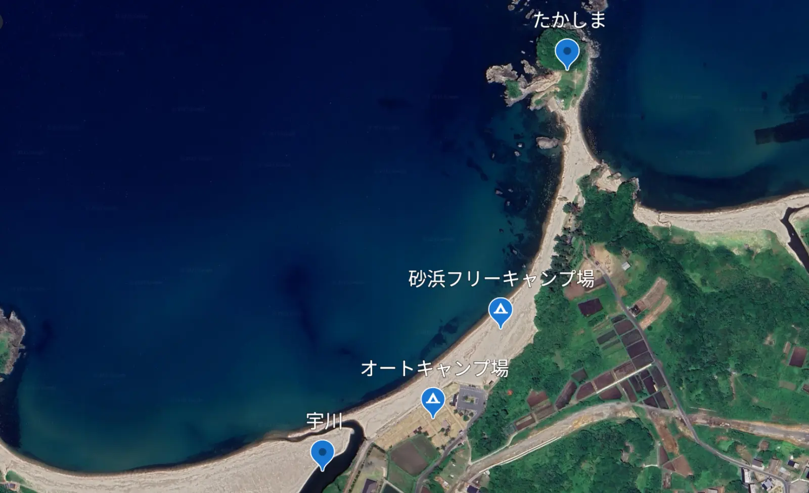
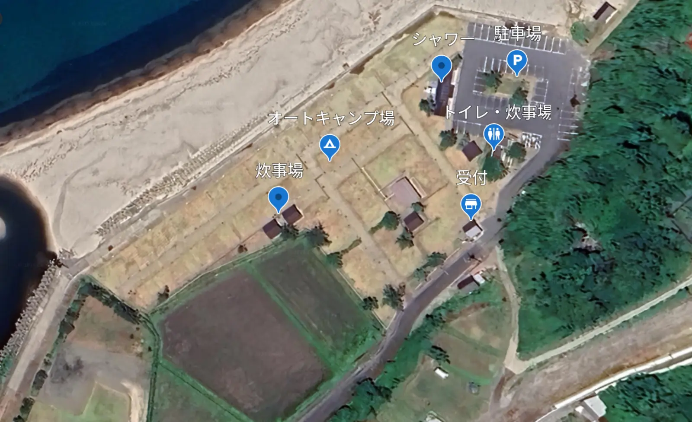
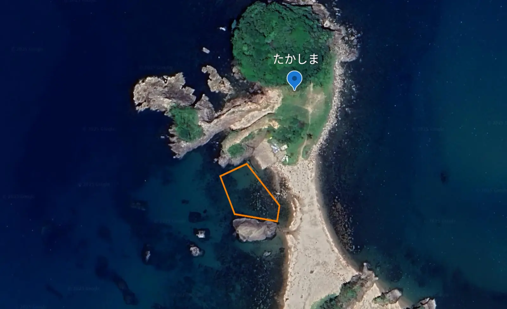
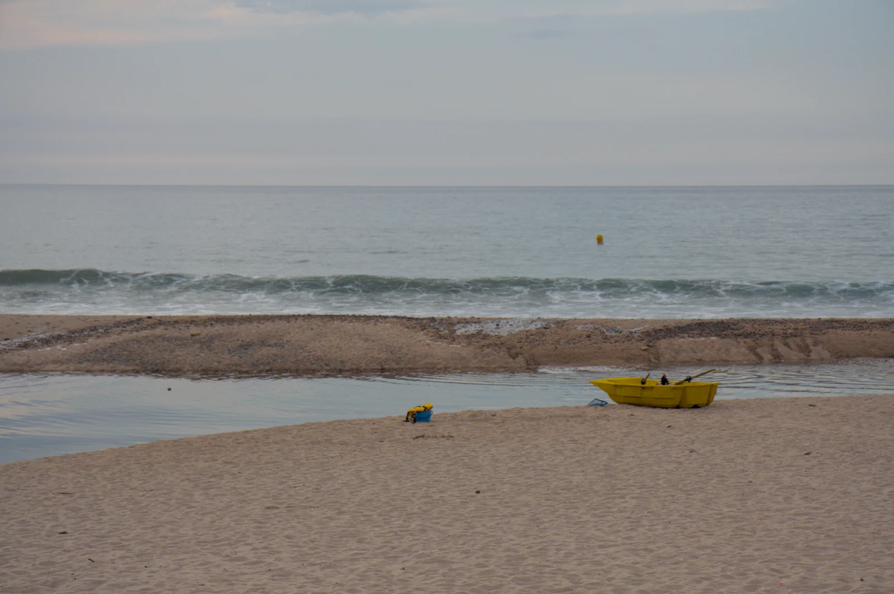
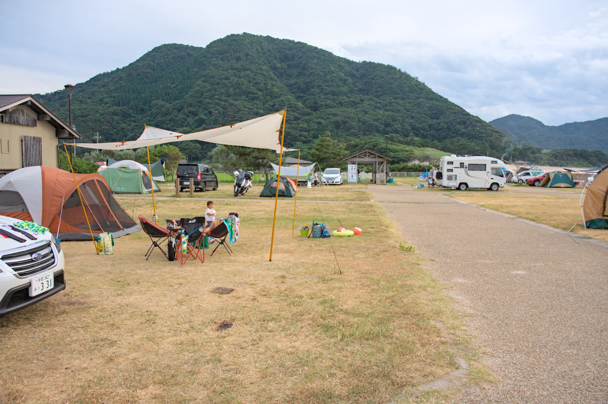
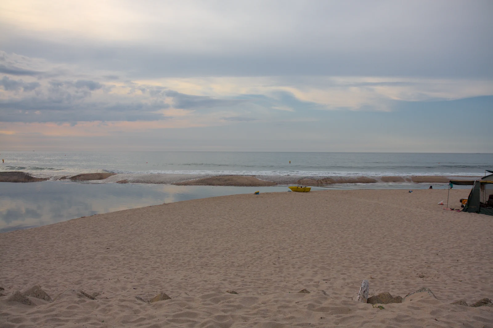
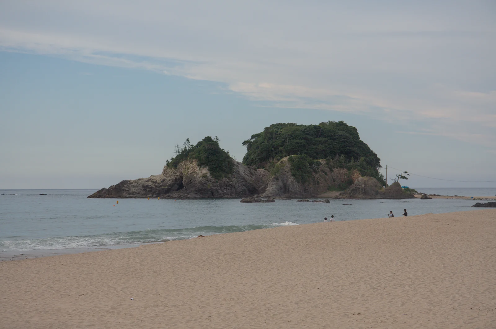
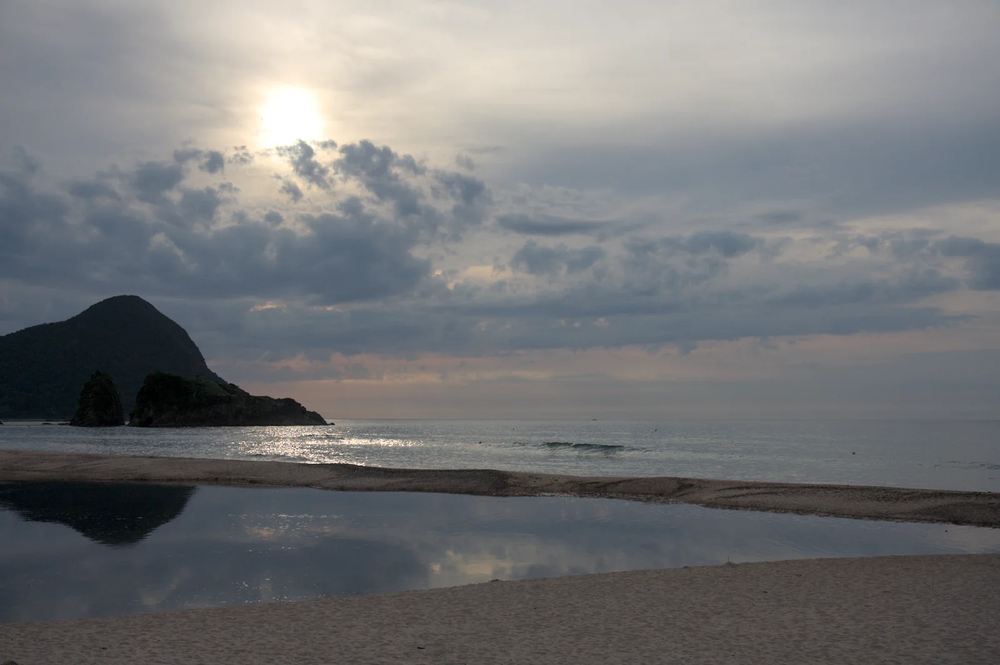
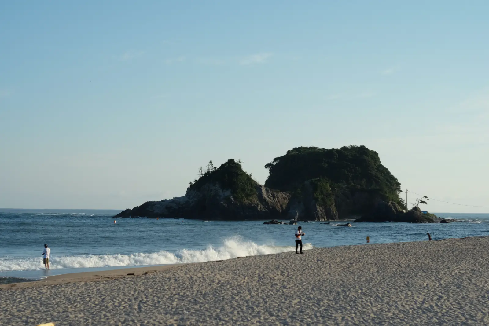
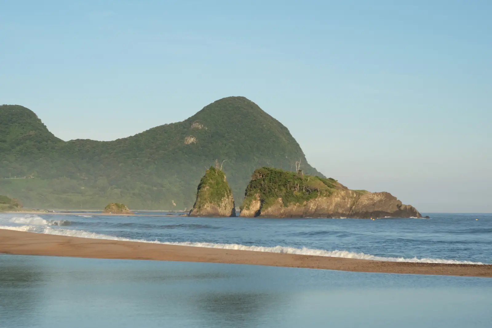

---
categories:
  - アウトドア
  - キャンプ
date: "2025-02-15T23:43:18+09:00"
description: 丹後半島の奥、日本海のきれいな海が目の前に広がる高嶋オートキャンプ場をご紹介します。天気によっては波が高く泳ぐことができない場合がありますが、目の前を流れる宇川や、たかしまとの間に一部波が穏やかな場所もあります。
draft: false
images:
  - images/DSCF4726.webp
summary: 丹後半島の奥、日本海のきれいな海が目の前に広がる高嶋オートキャンプ場でファミリーキャンプをしてきました。台風が近づいて波が高く、海水浴はあまり楽しめませんでしたが夏の休日をまったりと過ごせました。
tags:
  - 高嶋
  - キャンプ場
  - 海
  - 京都
title: 高嶋海水浴場＆オートキャンプ場で海キャンプ
---

丹後半島の奥、日本海のきれいな海が目の前に広がる高嶋オートキャンプ場でファミリーキャンプをしてきました。台風が近づいて波が高く、海水浴はあまり楽しめませんでしたが夏の休日をまったりと過ごせました。

## アクセス



京都縦貫道の終点、京丹後大宮ICを降りて国道482号を北上します。丹後半島を一周する国道178まで行ったら国道178号を東へ、丹後半島先端へ向かいコスモ石油
宇川 SSを左へ入ります。

## 予約方法

オートキャンプ場は[公式ホームページ](https://tango-takashima.com/reservation/)、または[なっぷ](https://www.nap-camp.com/kyoto/10588#plan-list)から予約できます。ネット予約のみですが当日正午まで受付可能です。

砂浜フリーキャンプ場は予約不可、当日先着順です。といっても砂浜はとても広く200張以上可能、駐車場も150台あるので「設営場所がなくなることはまずありません。」とのこと。砂浜で良ければハイシーズンでも思いついたときに行けるのがいいですね。

## キャンプサイト紹介

高嶋海水浴場＆オートキャンプ場は、区画サイトのオートキャンプ場とフリースペースの砂浜フリーキャンプ場があります。砂浜の海を見て左手には宇川が流れ込み、右手端には岩場（たかしま）があります。

出典：Google Earth

### オートキャンプ場

オートキャンプ場は砂浜から低い防波堤を隔てて一段上にあり、芝生の区画サイトです。電源付ブース(1泊5,000円、7×5m、18ブース)と電源なしブース(1泊4,000円、10×7m、33ブース)があります。

出典：Google Earth

### 砂浜フリーキャンプ場

砂浜フリーキャンプ場は、海水浴場の砂浜そのままです。風を遮るものが無いですが、砂浜は奥行きがあり、平らな場所を見つけるのは容易でしょう。砂浜右端の岩場近くあたりが木も少しあり、岩が風よけになるのかテントを張っている人がいました。

### 海

[公式ホームページ](https://tango-takashima.com/)
には青くて透明な海の写真がありますが、台風通過後で波が高く砂浜中央部での海水浴は危険な状態でした。
リアス式海岸の海はすぐ深くなり、衛星写真からも防波堤は無いので波がダイレクトに届きます。

波の高い日は宇川で遊ぶ、右端の岩場付近あたりで遊ぶ、または東に防波堤に囲まれた中浜海水浴場があるのでそちらに行ったほうが良いでしょう。

### たかしま

砂浜は波が高かったのですが、砂浜右端の岩場には波を遮るような大きな岩があり、穏やかです。砂浜と島（たかしま）の間、くびれたあたりで、写真下の岩と上のボート用スロープに挟まれたあたりが穏やかな海で小魚も見れるのでシュノーケリングにもおすすめです。

出典：Google Earth

ボート用のスロープもあり、SUPを楽しんでいる人がいました。少し泳ぐと足がつかなくなりますが、海の透明度は高く、小魚もたくさん見えました。アオリイカの子供も見ることができました！

### 宇川

川幅が結構広く、流れもほとんど感じられないくらい緩やかな宇川が砂浜へ流れ込んでいます。川は浅く、魚がたくさんいるので子供は喜び安心して遊べます。

しかし、自然豊かな丹後半島といえども川の最下流域なので日本海の海の透明度と比べるまでもなく、海水と混ざらない少し上流側は若干の臭いがして、バシャバシャすると泡立つ感じでした。日によるかもしれませんしたくさん遊んでいる人もいたので普通に遊べますが、若干気になるレベルでした。

## 台風接近で波高し

大阪をゆっくり出発したので付いたのは14時頃。電源付ブースは広く、車1台とテント、タープを張っても、もう1個テントが張れそうなくらい余裕です。

電源を使うキャンプ道具は持っていないので電源なしでよかったのですが、空いていたのが電源付のみでした。

海に出ると波が高く、写真手前に見える宇川で遊ぶことにします。魚がたくさんいますが捕まえられません。

下の写真中央の島に続く道沿いに、島の手前に岩があります。写真だと一体化して判別つきにくいですが、島の右端あたりにあります。この岩の裏あたりは波が穏やかなので少しシュノーケリングをして小魚、アオリイカなどを見ました。

砂浜の西側も同じような岩場があります。曇っているのできれいな夕焼けは見られず残念。1日目はこれにて就寝です。

## 二日目も波が高く中浜海水浴場へ行く

朝の海岸です。海と岩の景色が日本海らしく絶景ですが、波はあいかわらず「ザブーン」といった感じで泳げません。

しかし砂浜と岩の織りなす景色は日本海ならでは。この景色を堪能できただけでも満足です。

少し東へ行き、中浜海水浴場で泳ぎ昼過ぎに帰路につきました。

## まとめ

高嶋海水浴場＆オートキャンプ場は絶景の日本海が目の前に広がるキャンプ場でした。防波堤が無いので波が高い日は海水浴ができない可能性があるのでその場合は宇川で遊ぶか右端の岩場、もしくは近くの中浜海水浴場まで行くのがよいでしょう。
