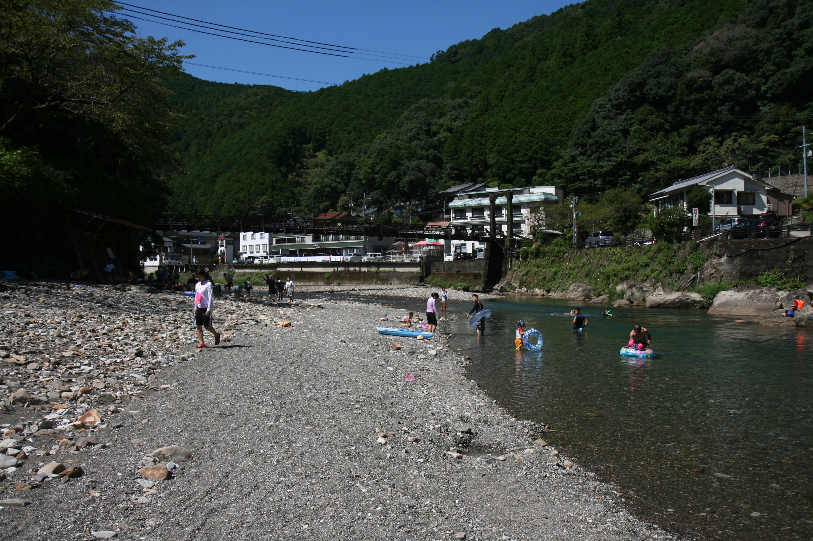

---
categories:
- アウトドア
- キャンプ
- 川遊び
date: "2025-02-15T23:42:54+09:00"
draft: false
image: images/IMG_5177.jpg
summary: 田辺川湯キャンプ場でキャンプをしました。川から温泉が湧き出て、寒くなったら温泉で温まれる。さらに水は最高にきれいで魚もたくさんいるという、今まで川遊びした中で最高の場所でした。
tags:
- キャンプ場
- 和歌山
- 田辺川湯キャンプ場
- 川遊びスポット
- 温泉
title: 田辺川湯キャンプ場 温泉の湧き出る川でキャンプ
---

田辺川湯キャンプ場でキャンプをしました。川から温泉が湧き出て、寒くなったら温泉で温まれる。さらに水は最高にきれいで魚もたくさんいるという、今まで川遊びした中で最高の場所でした。とても素晴らしい場所ですが、4連休の2日目に行くのは混みすぎているため避けた方が良いでしょう。

## 予約方法

予約不可、フリーサイトのみです。

## アクセス

京奈和自動車道、五條ICを降りて国道168号を南に約2時間。請川柿バス停前を右に県道45号那智勝浦本宮線に入り右折して大塔川を越えて県道241を大塔川沿いに進むと左手に入り口があります。橋を渡ると受付です。



住所：〒647-1717 和歌山県田辺市本宮町川湯１２８８\
URL: <https://tanabe-kawayu-camp.com/>

## 受付

入り口の橋を渡ると受付があります。4連休の2日目ということもあり、チェックインの12時を少し過ぎた頃の到着でしたが既にサイトはパンパンの状態でした。

一度駐車場に車を停めてテントを張る場所があるか見てから入るか決めてくださいということで、下見してみます。何とか入れそうな感じで、支払いを済ませます。料金はかなり安い設定ですが子供は0歳から子供料金が発生します。我が家は大人2人、子供4人もいるので800円×2人＋400円×4人＋駐車料金700円＝3,900円です。最近のキャンプ場は5,6千円があたりまえ、この人数だと8千円とかもあるのでこの値段はありがたいです。

受付を済ませると日付の書かれたポストイットを渡され、フロントガラスに内側から貼り、帰るときに返します。

## キャンプサイト

芝生サイトと河原サイトに分かれています。この他に河原サイトへの通路右側に2張り程度の小スペースがあります。河原サイトは混んでいる際は駐車場下までテントが張られています。

### a.受付

入り口の橋を渡るとゲート状の受付があります。ここで薪、炭も購入できます。鹿の肉も売っているようです。支払い後に渡されるポストイットを車のフロントガラスに貼ればあとは出入り自由です。帰りはポストイットを返してチェックアウトです。

### b.駐車場

受付前に駐車場があります。芝生サイトは車が入れないのでここに停めて荷物を運びます。

### c.芝生サイト

河原サイトは石がごつごつしているので芝生サイトは快適そうです。その分人気があるようでところ狭しとテントが乱立、入る隙間もありませんでした。

### d.河原サイトへの通路

ここを通り車で河原サイトへ出られますが、車1台分の幅ですれ違いができません。さらに芝生サイト利用者が一部この通路に路駐しているためかなり狭いです。

この通路途中、芝生サイトの反対側にテントを張れる小さなスペースがあります。もちろん埋まっていました。

この通りにトイレと炊事場があります。炊事場は芝生サイト、河原サイトにもありました。

### e.河原サイト

広いです。公式サイトには約200張とあります。利用した日はここも満員でした。区画は無く、テント、車どこに置いてもよい感じで、大きめの石を並べて陣地を確保している人などもいてカオスな感じでした。何とかテントが立てられそうな隙間を見つけられましたが車は無理で一度荷物を降ろしたら車は駐車場に停めました。駐車場もすぐに満員になりぎゅうぎゅうでした。

河原ではもちろん水遊びが楽しめます。きれいな青みのある清流です。向こう岸は結構深いようで飛び込みしている人もいました。

### f.駐車場下

河原サイトから受付側に回り込んでテントが張られていました。もうどこまでがキャンプ場なのかわからない状態です。ここの良さそうなところは、実は駐車場からすぐ下にあるので駐車場に車を停めて荷物を運ぶには意外と便利かもしれません。

川遊びもこちら側のほうが幅、深さもありおもしろそうです。

### 初日：谷瀬の吊り橋に寄ってからキャンプ場へ

朝家を出て高速から国道168号に入りひたすら南下します。コンビニ1つ無い秘境の様子でトイレ休憩に立ち寄ったところが谷瀬の吊り橋で、「日本一長い生活用鉄線吊り橋」ということで観光客がたくさん集まっていました。せっかくなので吊り橋を渡ってみます。ワイヤーに板を張ったものなので結構揺れます。さらにかなりの高度でドキドキします。

下にはキャンプ場がありました。

向こう岸から見た吊り橋です。大きいですね。谷瀬の吊り橋を後にして川湯野営場に向かいます。まだここから1時間ほどあります。

### なんとかテントを張り川湯温泉の川で遊ぶ

キャンプ場の前まで来ると川岸に多数のテントが見えます。途中何もなかっただけに想像以上に人が多いのに驚きます。到着は12時過ぎでしたが既にほぼ満員で、一度テントを張る場所があるか確認するよう勧められます。何とかテントを張れる場所を見つけチェックイン。

川の目の前にテントを立てました。1m近く高くなっているので浸水の心配は無いでしょう。

目の前はきれいな川が流れ、水遊びをしている人がいます。9月下旬で結構涼しい日だったのでぎりぎり川に入れるくらいの気温でした。

ここで川遊びでも良いのですが、以前から気になっていた温泉の出る川に行ってみたく、このぎゅうぎゅうの中、車を出して少し上流、川湯温泉まで行ってみます。

無料の駐車場がありますが規模は小さく20台程度しか停められません。それなりに出入りはあるので少し待ったら停めることができました。歩いて行ける距離なので子供が小さくなければ歩くのが正解と思いました。

川の両脇に人がたかって温泉に浸かっています。ここも人がすごいですが、本当に河原に温泉が湧き出ています。

水も綺麗で魚もたくさん泳いでいます。曇っていて少し肌寒い日でしたが、川で泳いで寒くなったら温泉につかるというこの時期に最高の川遊びスポットでした。

夕方にキャンプ場に戻り、焼き肉、花火をして就寝です。車はもう入れる場所もなさそうで駐車場に停めました。駐車場も満員になり、なんとか停められてホッとしました。

我が家恒例の焼きマシュマロです。

### 二日目：また川湯温泉で川遊び

朝起きてご飯を食べたら撤収し、また川湯温泉へ行きます。10時前でしたが駐車場は最後の1台空いていてセーフ。その後続々と駐車場から溢れ路駐の車が出てきましたが警察が定期的に回っているようで移動させられていました。

子供達は浮き輪で川を流れて遊びます。

上流側の写真左の屋根の下は温泉になっています。

 

上流側はそれなりに水深があり泳げます。水はすごく綺麗でした。

### 熊野本宮大社に寄って帰宅

帰りは熊野本宮大社に寄りました。河原に巨大な無料駐車場があり満車になる心配はなさそうです。

狛犬がマスクをしています。かわいいです。

お参りも並んでいます。さすが熊野大社です。

巨大な大鳥居です。

サクッと観光を終え帰路につきます。

### 総評

川から温泉が湧き出て、寒くなったら温泉で温まれる。さらに水は最高にきれいで魚もたくさんいるという、今まで川遊びした中で最高の場所と思いました。といってもキャンプ場敷地の河原から温泉は出ていません。

キャンプ場自体は特筆すべきことはありませんが、4連休の2日目に行くのは混みすぎているため避けた方が良いでしょう。こんなに広くて、僻地にあるのに満員とは、すごいです。こんどは鹿肉を味わってみたいです。
