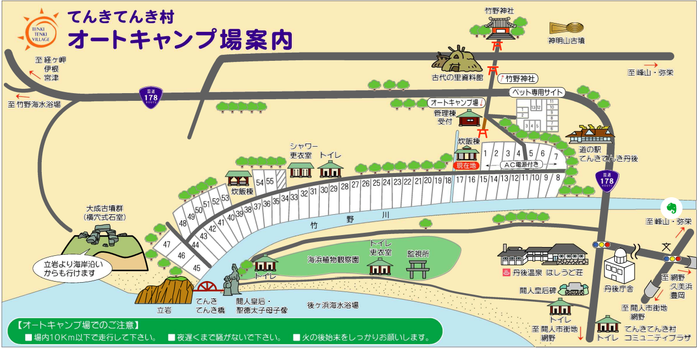
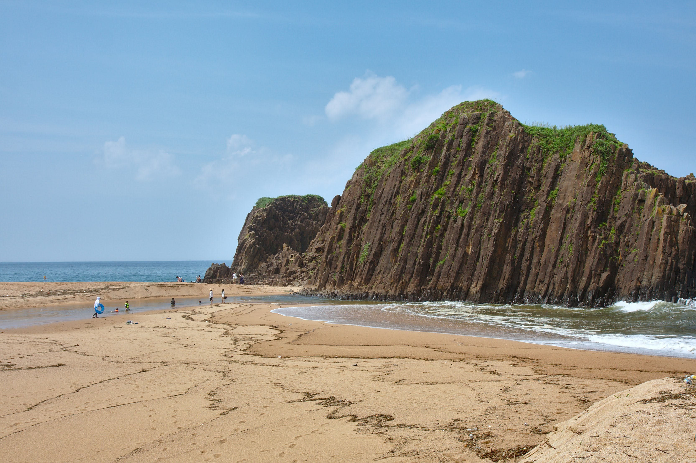

---
categories:
- アウトドア
- キャンプ
date: "2025-02-15T23:42:51+09:00"
draft: false
image: images/tenkitenki.jpg
summary: 京都の日本海側、てんきてんき村オートキャンプ場に行きました。海に浮かぶ巨大な一枚岩、立岩が眼の前にあります。海の中にプールを作ってしまった間人親水プールも楽しく遊べおすすめです。
tags:
- 海
- てんきてんき村
- キャンプ場
- 京都
title: てんきてんき村オートキャンプ場で海キャンプ
---

お盆休みの今週は京都の日本海側、てんきてんき村オートキャンプ場に行きました。

 

## 予約方法

[道の駅てんきてんき丹後 公式ホームページ](https://tenkitenki-mura.jp/)
、キャンプ場予約サイト [なっぷ](https://www.nap-camp.com/)
からネットで予約ができます。

## アクセス

大阪、京都中心部から京都縦貫自動車道を終点の京丹後大宮ICで降りて国道312号→482号を北へ約30分。道の駅入り口の少し奥にキャンプ場入り口があります。



住所: 〒627-0221 京都府京丹後市丹後町竹野\
URL: <https://tenkitenki-mura.jp/>

## 受付

お盆休みなど大型連休中はキャンプ場入口の管理棟で受付します。普段は道の駅のフロントで受付のようです。ネット予約、クレジットカード事前決済していたので名前を告げて地図とごみ袋をもらいました。ごみはキャンプ場に捨てられます。また、海側のサイトから海水浴場へ行くための川を渡る橋が通行止めなこと、今日は波が高く遊泳禁止であることを説明されました。橋を渡らずキャンプ場側の海は常時遊泳禁止です。

## キャンプサイト

電源なしサイト、電源付きサイト、ペット同伴サイトがあります。全てオートサイトです。電源付きサイトは7つしかなく、お盆休みということもあり埋まっていたので電源なしサイトを予約しました。

### 電源なしサイト

道の駅側川沿いから海側までほとんどのサイトが電源なしサイトです。海側の一部の除いて川に面しています。

場所は空いている区画を自分で選べます。どれもほとんど同じ大きさで、テント＋タープが張れる大きさの区画です。長方形に平にならされた区画の間が少し凹んだ1mくらいの幅の溝になっているので隣とある程度距離が保てます。テント、タープを張って目の前に車を横付けするとこんな感じです。ほとんどの区画に木や日陰になるものは無いのでタープ必須です。

目の前が川で気持ちの良い感じですが、土手は直角で水面まで1mくらいありそうなので小さな子供は落ちないよう注意して見ておく必要があると感じます。下の写真のように子供は川を見ていましたがちょっと気をつけないといけないです。

### 電源付きサイト

道の駅側、キャンプ場の通路を隔て川の反対側の7区画が電源付きサイトです。電源のスタンドが1つ立っていて川に面していないこと以外は電源なしサイトと同じようです。

### ペット同伴サイト

管理棟からすぐ左の分岐のさきにペット同伴サイトがあります。電源なしサイト、電源付きサイトとは完全に切り離された区画になっていました。ペットはいないので中は見ていません。

### 初日：立岩の目の前、竹野川で遊ぶ

12時にチェックイン、お昼ごはんはコンビニで買っておいたのでとりあえずキャンプ場側の海に出てお昼ごはんを食べます。キャンプ場側の海は遊泳禁止で、今日は反対の海水浴場も遊泳禁止になるくらい波が高いので海は荒れていました。立岩は圧巻の景色です。

戻ったら場所を決めてテントを張ります。道の駅側はほとんど埋まっていて、海に違い方が空いています。真ん中より少し海側くらいの場所にしました。

ここからも立岩が見えています。

暑いので今日は遊泳禁止ですがとりあえず海水浴場まで行ってみます。上の写真の橋が通行止めで使えないので道の駅まで出て川の反対側へぐるっと回る必要があり、疲れます。オートキャンプ場なのでカートを持ってきませんでしたが海へ行くためにカートがあると便利そうです。

結局波が高く少し足をつけても引きずり込まれそうなので海は諦めます。川は下流なのできれいとは言えませんが、波は無く流れも穏やかなので泳いだり魚を採ったりして遊びました。

### 二日目：間人親水プールで魚と泳ぐ

朝5:30頃に釣り竿を持って海に出てみます。昨日より波は高くなく、釣りはできそうです。ちょい投げロッドに小型のジェット天秤、キス釣り仕掛けに石ゴカイを餌に砂浜から投げ釣りをしてみると．．．

 

キスが釣れました。

もう一度投げてみると．．．フグでした。

キスを6匹釣ることができたので戻って焼いて食べました。

キャンプ場近くの立岩・後ケ浜海水浴場は昨日よりは波が低く泳げる可能性もありましたがまだある程度波もあるので子供には難しいと思い近くで穏やかな海水浴場がないか調べてみます。すると車で10分くらいの近場、間人に親水プールという面白そうな場所が。磯にプールを作ったものでもともと小学校のプールとして使用していたものを一般開放しているものみたいです。

行ってみます。親水プール入り口に小さな駐車場があり車を留めます。せいぜい20台程度が限度で、帰りには満車状態でした。（写真は帰りの状態です。）

駐車場から階段を下ると磯とプールが一体になった不思議な光景が広がります。

こんな感じでプールみたいですが海とつながっており海水です。波はほとんどありません。奥に見えるのが小学校で授業のプールでここで泳ぐというのはすごい体験ですね。

水はきれいで小魚がたくさん泳いでいます。

波がほとんど無く、浅くて小魚も見れて子供におすすめの素敵なところでした。お昼頃まで遊んで帰りました。

## 総評

立岩の絶景が見られるキャンプ場です。道の駅のキャンプ場なので食べ物を買えたりトイレも道の駅のトイレを利用すればかなりきれいです。川のそばなので開けた景色が気持ち良いキャンプ場です。海の近くですが海水浴場まで行くのが大変なこと、海水浴場は日本海のイメージ通りすぐに深くなり波も高い日が多いので小さい子供には向いていないく車で他の波の少ない海水浴場を探したほうが良いかもしれません。利用料金は安くて良心的です。
