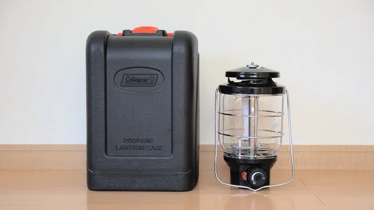
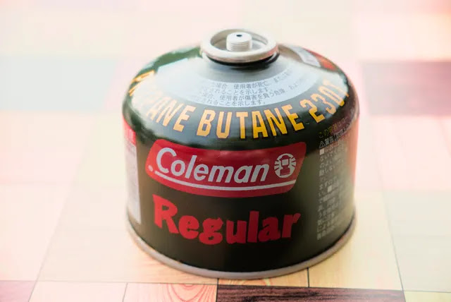
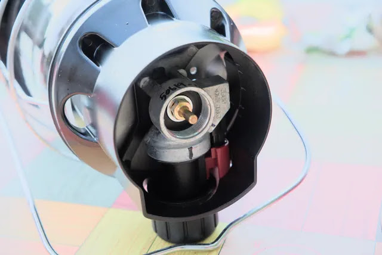
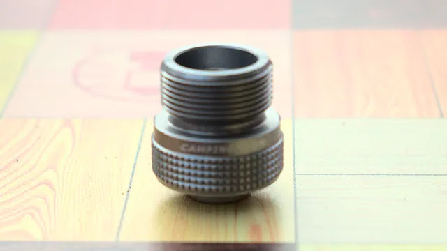
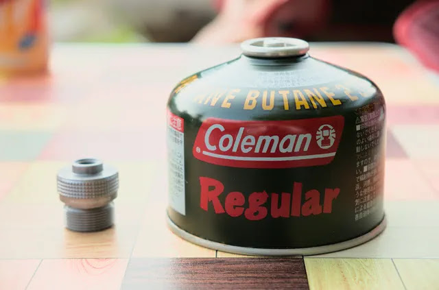
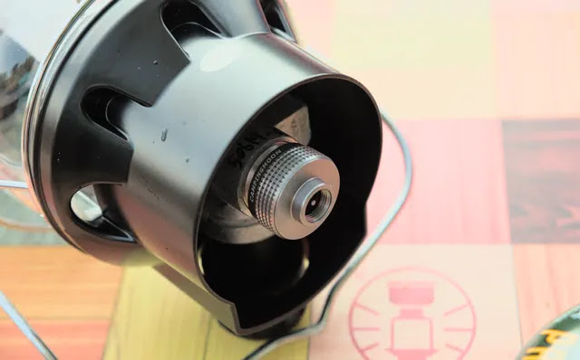
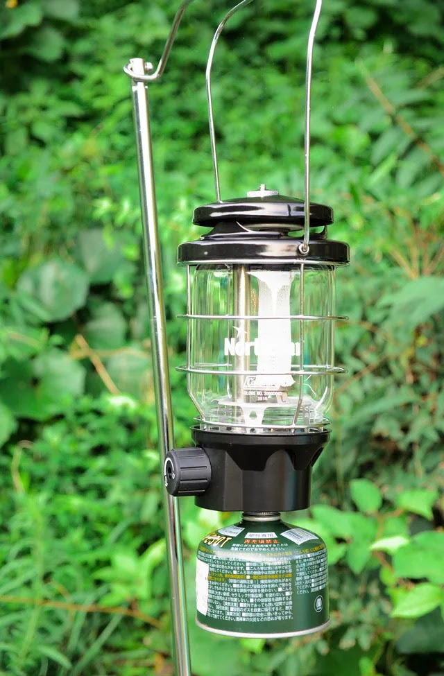
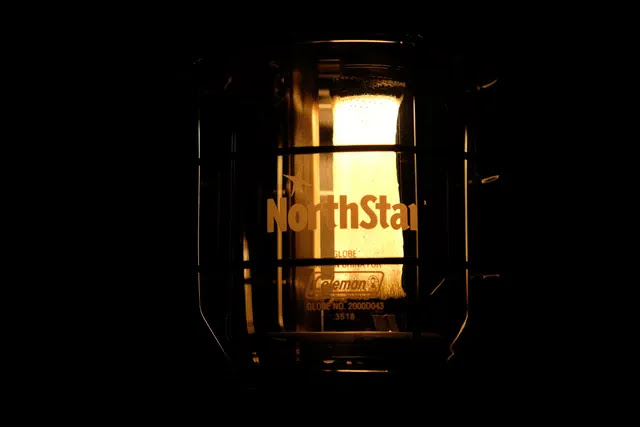

---
categories:
  - 自転車
  - bike
date: "2025-02-15T23:43:53+09:00"
description: アメリカで安く買ったガスランタンをいざ使おうとOD缶をねじ込もうとしたら、、、ねじ径が違く付きません！そんなときに便利なねじ変換アダプターをご紹介します。
draft: false
images:
  - images/00.jpg
summary: アメリカで安く買ったガスランタンをいざ使おうとOD缶をねじ込もうとしたら、、、ねじ径が違く付きません！そんなときに便利なねじ変換アダプターをご紹介します。
tags:
  - 自転車
title: アメリカ仕様のガスランタンを日本のOD缶で使う
---

キャンプで使うバーナー、ランタン等火器の燃料は悩みどころです。バーナーはホワイトガソリンでプリヒートを楽しんだり、ランタンはPetromaxが美しすぎて灯油にしてみたり、アルコールバーナーもいいなとかTrangiaを買ってみたり。

結局、面倒になってバーナーはガス缶のコールマン2バーナーに落ち着き、ランタンはLEDが楽です。しかしやはりLEDランタンは味が無く、ガス缶の使えるランタンが気になっていました。

たまたま海外出張に行った際にコールマン本場の国ではノーススターが頑丈なプラ箱入りでなんと\$43、安い！と思い衝動買いしました。日本では1万円前後ですね。日本だとレッドかグリーンですが、ブラックと渋いカラーです。

さて、キャンプへ持っていき、いざ使おうとOD缶をねじ込もうとしたら、、、あれっねじ径がぜんぜん違う！コールマンのガス缶なのになぜ入らない！？

泣く泣くLEDヘッドライトで夜を過ごし、帰ってから調べてみると当たり前かもしれませんがアメリカと日本でねじの規格が違うのですね。。。ボルトや鋼管のねじ規格が違うことは知っていたのですが、キャンプの知識では「ガス缶は、CB缶とOD缶の2種類しかない」と信じておりました。これは日本の話ですね。

アメリカの使い捨てプロパンガス缶の接続はおそらく1''-20ユニファイねじ（アメリカなのでNPTと思いましたが違うようです）、これをOD缶のねじに変換するアダプタが売られておりました。

早速購入しました。まず、OD缶の外観です。7/16NSというねじ規格のようです。いつも何気なく見ているものですが、これはこれで聞き慣れない規格ですね。

さて、ランタン側です。たいぶ大きなめねじですね。1''-20ユニファイねじみたいです。直径7/16インチと1インチでは倍以上違いますね。

購入したキャンピングムーンのアダプターです。下の写真で上側がランタンにねじ込まれるおねじです。（ピンぼけした写真ですみません）

反対側のめねじにOD缶のおねじをねじ込みます。

注意点として、
*このアダプターにはチャッキ弁（逆止弁）が内蔵されていないので、先にOD缶にアダプターをねじ込むとガスが盛大に漏れます。*
なので、先にランタン側にアダプターをねじ込んでおく必要があります。ちなみに外すときも、アダプターとOD缶を持って先にOD缶をアダプターから抜くように注意が必要です。

ランタンにアダプターをねじ込んだあと、最後にOD缶をねじ込めばOKです。

アメリカ仕様ノーススターにアダプターとOD缶を付けて吊るした状態です。アダプターがあるぶん、ランタンとOD缶の間に隙間ができてなんか間抜けな外観になりましたが実用上は問題無いので良しとしましょう。

やはりランタンはマントルの光が明るく、キャンプの雰囲気が出ますね。ホワイトガソリンや灯油に比べると儀式的な楽しみや雰囲気は劣りますがガス缶はお手軽でLEDよりは味があるので最近はガス缶に落ち着きつつあります。

コールマンのノーススターですが日本で買えば、もちろん日本のOD缶がそのまま取り付けできる仕様になっています。
