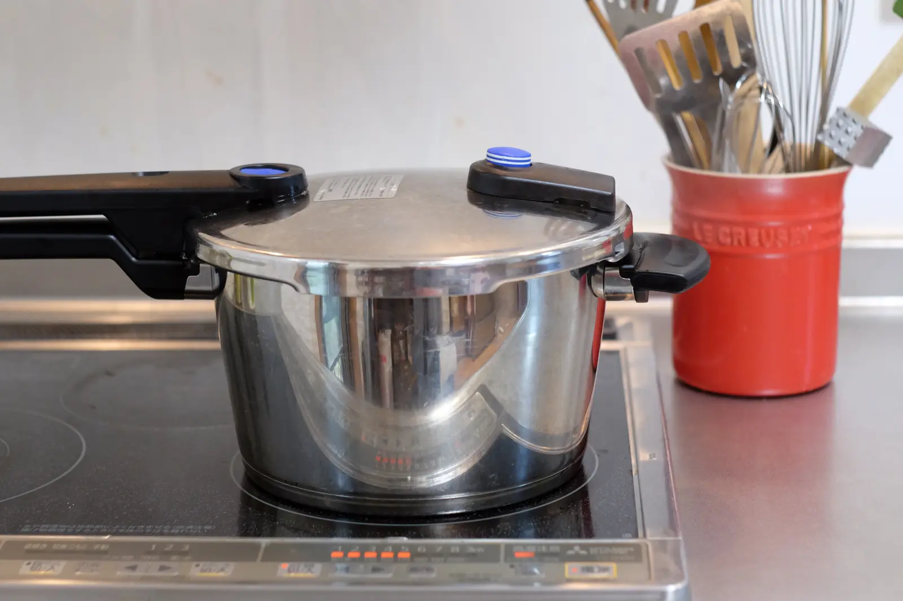
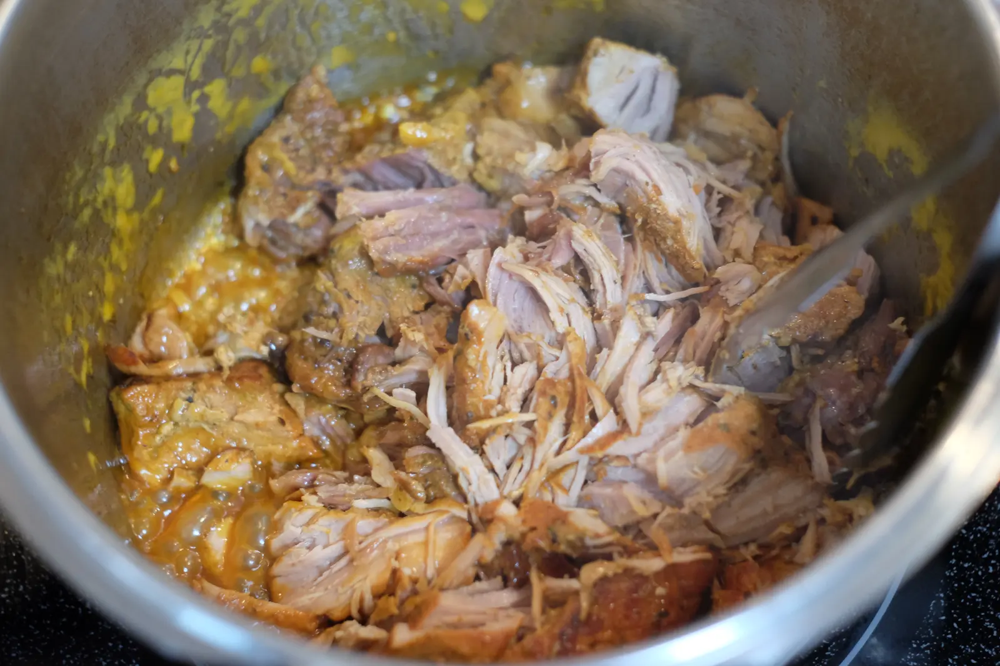

---
categories:
  - 料理
date: "2025-02-15T23:43:16+09:00"
description: 豚肉を圧力鍋で柔らかく煮込みフラワートルティーヤ(小麦粉)に包んで食べる絶品のタコス・デ・カルニタスの作り方をご紹介します。
draft: false
images:
  - images/DSCF4584.webp
summary: トルティーヤプレスを買ってからたまにタコスを作るようになりました。この前はとうもろこしの粉（マサ）でコーントルティーヤ（tortilla de maíz）を作りましたが今回は小麦粉（tortilla de harina）でやってみます。
tags:
  - タコス
  - トルティーヤ
  - カルニタス
  - メキシコ
title: タコス・デ・カルニタスを作る
js: js/paad.ts
---

トルティーヤプレスを買ってからたまにタコスを作るようになりました。この前はとうもろこしの粉（マサ）でコーントルティーヤ（tortilla
de maíz）を作りましたが今回は小麦粉（tortilla de
harina）でやってみます。

具は豚肉をオレンジシュースとスパイスを入れて圧力鍋で煮込みました。

## トルティーヤ・デ・アリーナ

小麦粉で作る方法はネットにいろいろ載ってますが、今回は薄力粉と強力粉3:1にしました。英語だとフラワー・トルティーヤ、スペイン語だとトルティーヤ・デ・アリーナ(tortilla
de harina)、本場メキシコでは ll
の発音が濁るので「トルティージャ」と言います。

### レシピ

-   強力粉 150g
-   薄力粉 50g
-   オリーブオイル 大さじ 2
-   塩 小さじ 1/2
-   熱湯 150g

### 作り方

強力粉、薄力粉、オリーブオイル、塩をボウルにぶちこんで混ぜます。

熱湯を入れてさらに混ぜます

熱いので手で触れるようになったら手でコネコネしていきます。

3個作りました！ラップにくるんで寝かせます。常温で4時間くらい寝かせました。長時間寝かせたほうが良いみたいです。

いままで焼くとバリバリになってしまったのですが、今回はやわらかもっちりに仕上がりました。
*オリーブオイル多め（大さじ 2）、熱湯、長時間寝かせる*
のが柔らかくするポイントだったと思います！

寝かせたらまるめてトルティーヤプレスで平にします。くっつくのでクッキングシートで挟むと良いです。

トルティーヤプレスは15cmのアルミ製（下リンクの左）を使ってます。リンクで挟んだ片方から力をかける仕組みなので、薄くしようとするとどうしてもリンク側が厚くレバー側が薄く厚みのばらつきが出てしまいます。回しながら押したり、仕上げは綿棒で伸ばすなど少し工夫が必要です。



メイド・イン・コロンビアの20cmで鋳鉄製の本格的なものに物欲を駆られます。アマゾンのレビューだときれいにプレスできそうなので木になっています。



鉄フライパンで160℃、油をひかずに焼き上げます。これも試行錯誤で毎回適当なのですがクッキングシートを片側剥がし、もう片側はつけたままでフライパンに乗せ、フライパンの上でもう片側を剥がすことで縮み、形崩れを防ぎます。

2回ひっくりかえすと気泡ができてふくらんでくるので、ある程度ふくらんだら出来上がりと思ってます。。。

焼いたら濡らした乾かないようにキッチンシートを敷いた皿に移して保管します。

## カルニタス

スペイン語で牛肉はカルネ(carne)、豚肉はこのカルネ(carne)に小さいもの、可愛らしいものの語尾に付ける
-ita
をつけてカルニータ(carnita)です。牛肉と豚肉は全然違うものだけど似たような呼び名なのですね。

### レシピ

-   豚肉 1kg
-   オレガノ 適当
-   クミン 適当
-   パプリカパウダー 適当
-   塩 適当
-   こしょう 適当
-   にんにく 2片すりおろし
-   オレンジジュース 150cc

豚肉に切れ目を入れてスパイスを適当にふりかけて揉み込みます。スパイスはネットのレシピではオレガノが良く使われますが、毎回適当です。

圧力鍋に油を引いて熱し、焼き色をつけます。

にんにくとオレンジジュースを入れて30分加圧します。

圧力なべはFisler、トルティーヤを焼く鉄フライパンはLodgeのものを愛用しています。男の料理は、味はともかくとりあえず道具からです。。。Fislerは高価ですが、アメリカはテネシー州で生産されるキャストアイアンのフライパン、Lodgeは価格も安く、キャンプとかでも重宝しています。





圧力が下がったら蓋を開けます。グロ画像になってしまいました。

肉は柔らかくなっているので細かくします。

火にかけて残った水分をある程度飛ばしたら完成！

美味しそうなカルニタスができあがりました。

### タコス・デ・カルニタス

肉をアボカド、玉ねぎ、トマトなどとトルティーヤに乗せて食べると最高の味です！

子供は辛いものが嫌いなので一人だけサドンデスソースをかけて食べています。酸っぱいので本当はサルサソースがあればよいのですが。

タコス・デ・カルニタスは、トルティーヤを作るのが面倒で肉も柔らかくなるまで時間がかかりますが、技術や感性が必要な部分は皆無なので、面倒なのを我慢すれば誰でも作れるので男（おじさん）の料理におすすめです。キャンプでダッチオーブンに入れて肉を焼き、トルティーヤのタネは作って持っていくと楽しめそうです。
