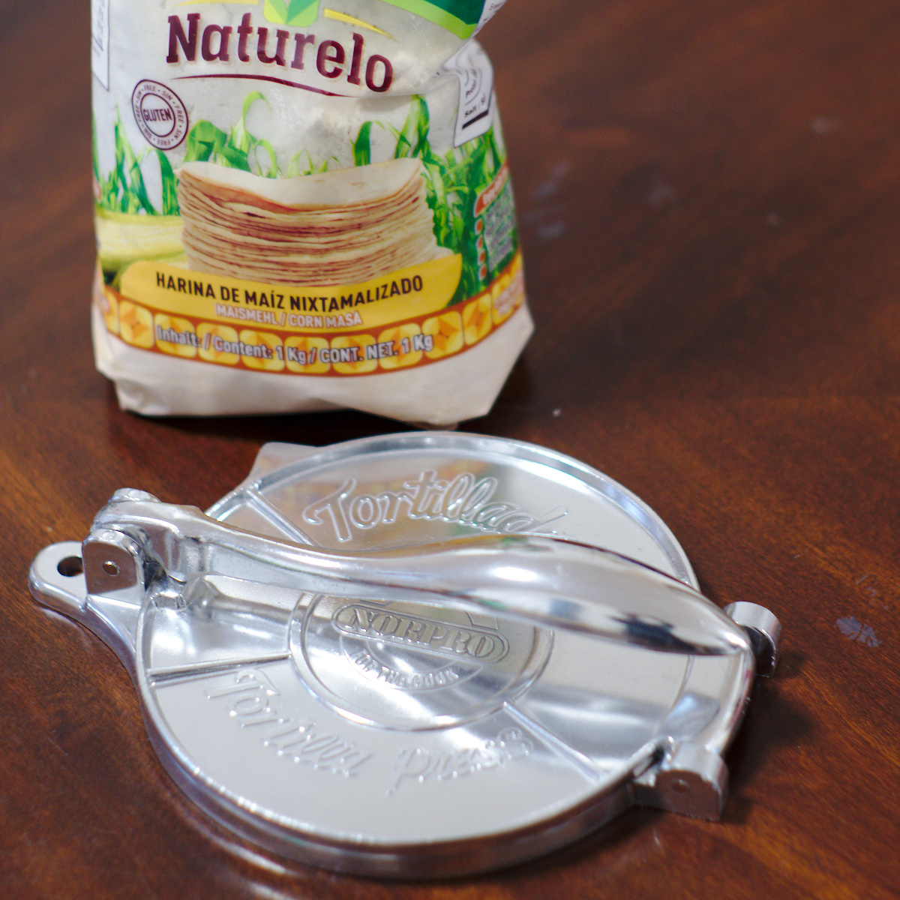
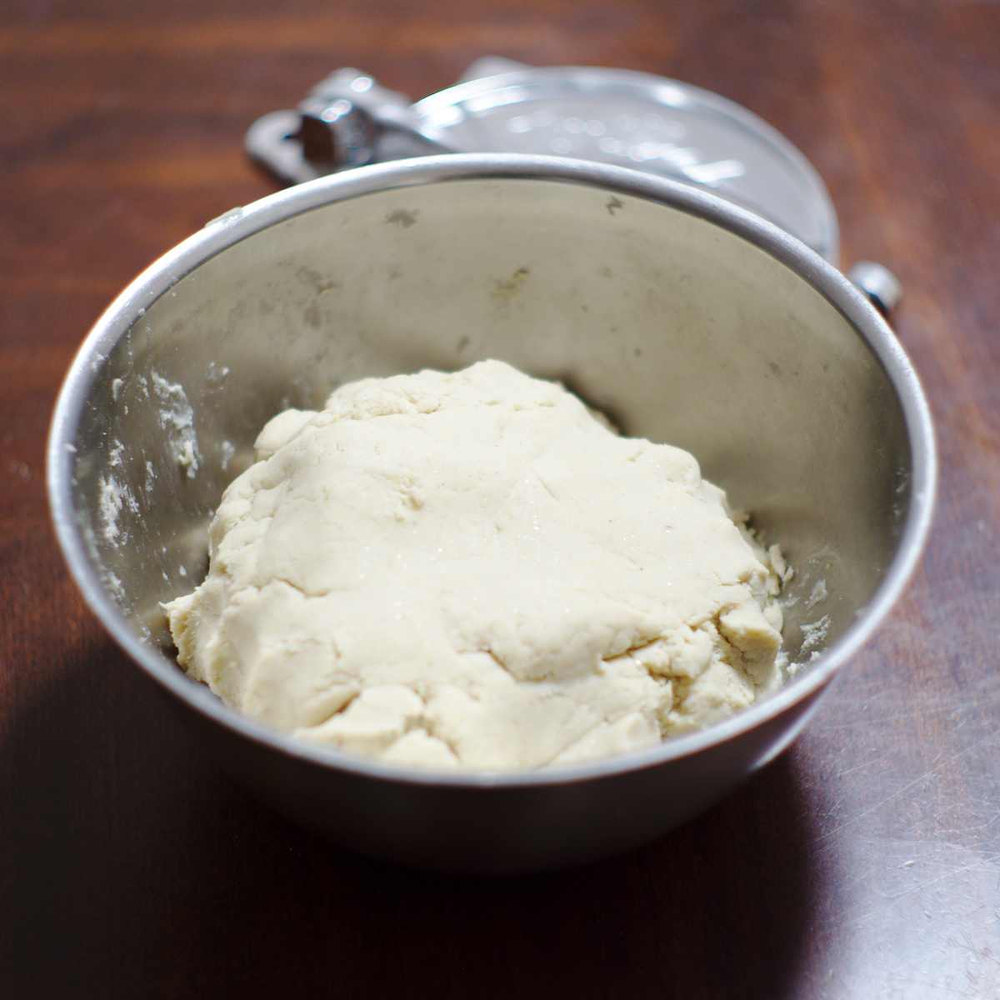
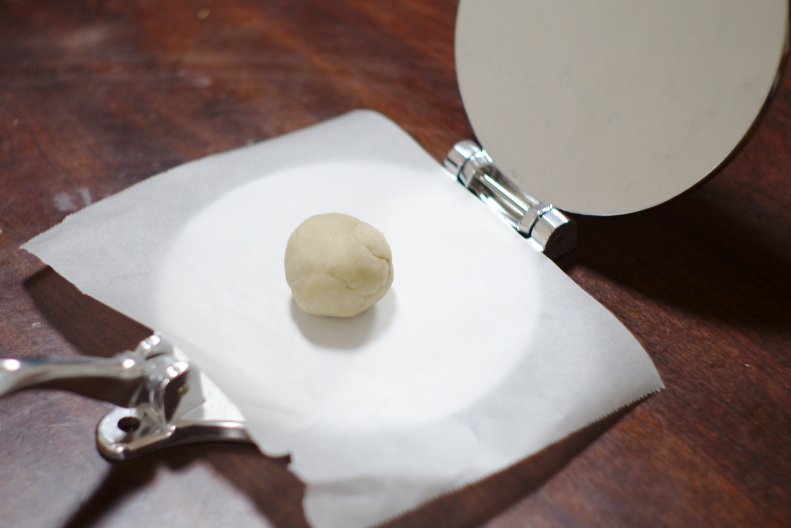
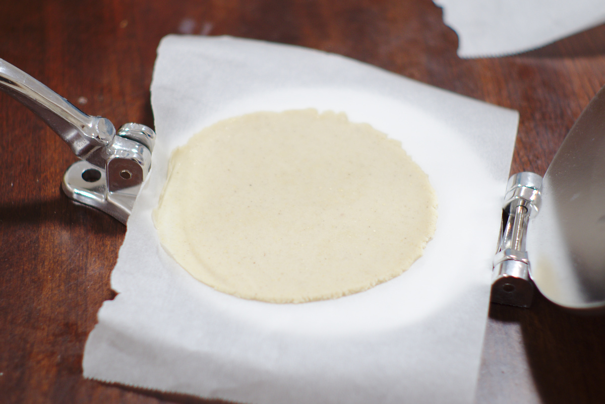
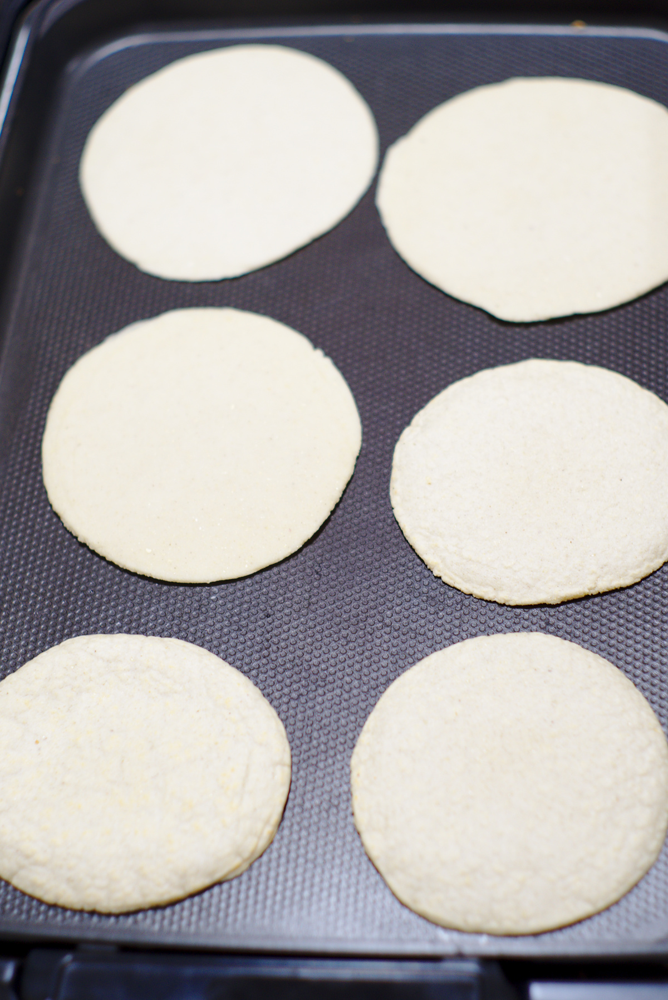
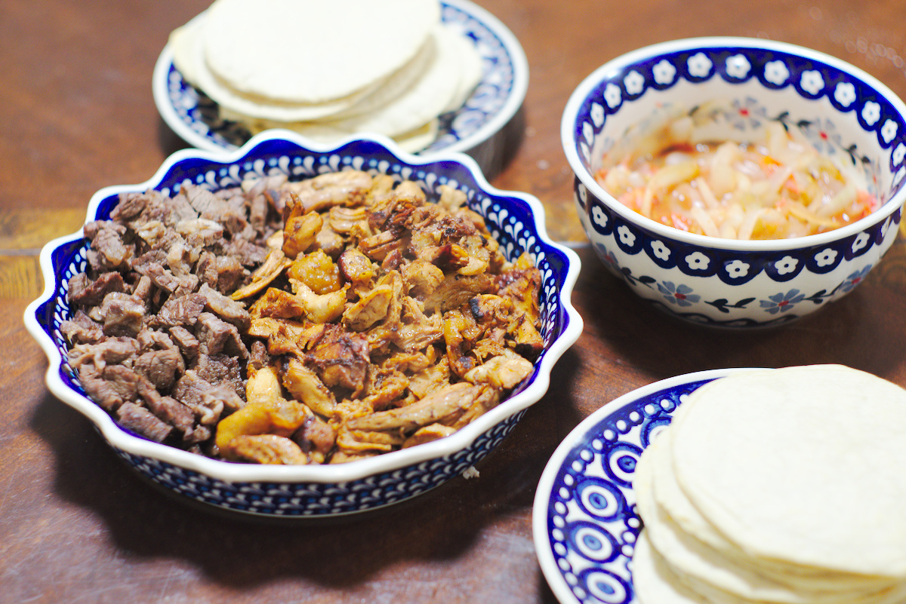

---
categories:
- 料理
date: "2025-02-15T23:42:35+09:00"
draft: false
images:
- images/tortillapress.jpg
description: トルティーヤプレスを使い、手作りでタコスの皮の作り方を解説します。
summary: 本場メキシコのタコスはパリパリの皮では無くてソフトなトルティーヤで肉を挟んで食べます。何度か作ってみたのですが、麺棒で伸ばす方法ではなかなか丸くならずアマゾンでトルティーヤプレスなるものを見つけたので購入し、タコスの皮を手作りしてみることに。
tags:
- トルティーヤ
- トルティーヤプレス
- タコス
- マサ
- メキシコ
title: トルティーヤプレスでタコスの皮を作る
js: js/paad.ts
---

以前メキシコに住んでいてタコスが大好きでした。メキシコのタコスはパリパリの皮では無くてソフトなトルティーヤで肉を挟んで食べます。自宅で何度か作ってみたりしたのですが、クックパッドなどで紹介されている麺棒で伸ばす方法ではなかなか丸くならずアマゾンでトルティーヤプレスなるものを見つけたので買ってみました。ついでにコーンの粉（マサ）も入手。

 



マサ500gにオリーブオイルと水と塩を加え手でこねます。

小さい団子にしたものをトルティーヤプレスに乗せます。くっつかないようにキッチンペーパーを上下に挟みます。

フタ（？）を閉じてレバーで押します。1度では伸びが足りないので3回くらいグッと押します。

きれいな丸になりました。ただ、レバー側が薄くなってしまうので90°ずつ回転させて押すとある程度均一になります。
これをホットプレートで両面焼けばできあがりです。

牛肉と鶏肉を挟んで食べました。肉は焼く→煮る→刻む→焼くという工程でやわらかくて本場の味に近づきます。今まで焼いているだけと思っていましたが煮ることで柔らかくしていたのですね。メキシコでは安くて美味いので自分で作ろうなんて思ったこと無かったですが作り方見ておけばよかったです。

コーンより小麦粉の方が好みです。コーントルティーヤは独特の味とパサパサ感があって子供には不人気でした。次は小麦粉で作ってみよう。


