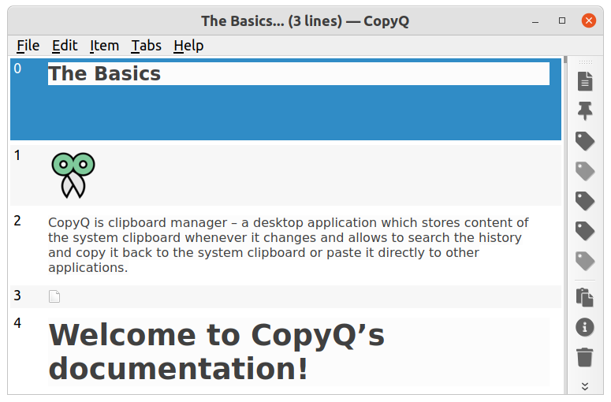
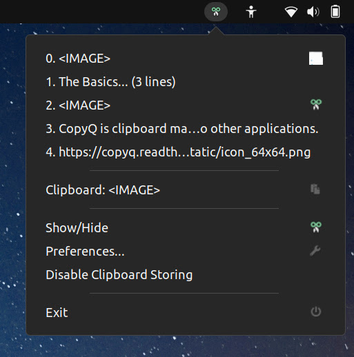

---
categories:
  - ソフトウェア
date: "2025-02-15T23:44:15+09:00"
description: クリップボード履歴を保存したり定型文を登録して呼び出せる便利な Linux 用クリップボードマネージャ CopyQ のクリップボード履歴が更新されなくなった場合の対処法を解説します。
draft: false
images:
  - images/copyq.jpg
summary: クリップボード履歴を保存したり定型文を登録して呼び出せる便利なクリップボードマネージャ CopyQ を愛用していましたがあるときからクリップボード履歴の保存ができなくなりました。設定変更が必要だったので防備録として記録します。
tags:
  - Linux
  - CopyQ
  - クリップボード履歴
  - Ubuntu
title: Linux のクリップボードマネージャ CopyQ が動作しないときの対処法
---

クリップボード履歴を保存したり定型文を登録して呼び出せる便利なクリップボードマネージャ
CopyQ を愛用していましたがあるときからクリップボード履歴の保存ができなくなりました。

設定変更が必要だったので防備録として記録します。

## 環境

-   Ubuntu 23.04
-   CopyQ 6.4.0-1

## クリップボードマネージャ CopyQ

クリップボード履歴を保存して貼り付けできるアプリケーションです。定型文を保存しておいたり、タグ付けして整理したりできる高機能なものです。



トレーに常駐させることもできます。



Windows
だとこの手のソフトは古くからいろいろあり、最近はクリップボード履歴は標準装備されるようになりましたが、Linux
だと外部アプリが必要で、あまり種類が無い感じです。（知らないだけかも）

## クリップボード履歴が保存されなくなる

かなり前、Debian
を使っていたときに重宝していたのですが、あるときからクリップボード履歴が保存されなくなり、放置していました。

今回 PC を新調し、Ubuntu を入れたのでまた CopyQ
を使おうとしたのですがやはり履歴が保存されず、原因を調べてみました。

## Wayland が原因

[CopyQの公式サイト](https://copyq.readthedocs.io/en/latest/known-issues.html)
の Known Issues に記載がありました。

ウィンドウマネージャに X11 ではなく、 Wayland
を使っていると動かなくなるようです。環境変数 ` QT_QPA_PLATFORM `
を設定することで解決できるとのこと。

## 起動オプションを設定する

アプリケーションランチャから起動する場合

` /usr/share/applications/com.github.hluk.copyq.desktop `
の下記行を変更する。

変更前

```sh
Exec=copyq --start-server show
```

変更後

```sh
Exec=env QT_QPA_PLATFORM=xcb copyq --start-server show
```

スタートアップアプリケーションとして登録している場合

` ~/.config/autostart/copyq.desktop ` の下記行を変更する。

変更前

```sh
Exec="/usr/bin/copyq"
```

変更後

```sh
Exec="env QT_QPA_PLATFORM=xcb /usr/bin/copyq"
```

これで無事に履歴が保存され、使えるようになりました。

## まとめ

CopyQ を Wayland で使う場合には、 ` .desktop `
ファイルを編集して環境変数 ` QT_QPA_PLATFORM ` の設定が必要でした。
