---
categories:
  - 車
date: "2025-02-15T23:44:06+09:00"
description: アマゾンでタイヤを購入、ガソリンスタンドなどの交換サービス店へ送付して取付けてもらうことで格安でタイヤ交換する方法を解説します。
draft: false
images:
  - images/01.webp
summary: 愛車のタイヤ表面がひび割れてきました。溝はまだ残っているのですが、そろそろ交換した方がよさそうです。17インチのタイヤは高いため、少しでも安くしようとアマゾンのタイヤ取付・交換サービスを使ってみました。
tags:
  - タイヤ
  - タイヤ交換
title: アマゾンのタイヤ取付・交換サービスを利用してみた
---

エクシーガクロスオーバー7に乗って早7年が経とうとしており、タイヤ表面がひび割れてきました。溝はまだ残っているのですが、そろそろ交換した方がよさそうです。17インチのタイヤは高いため、少しでも安くしようとアマゾンのタイヤ取付・交換サービスを使ってみました。

アマゾンでタイヤを購入、取付サービスを利用してみました。予約のやり方、当日サービスを利用してみた感想をまとめました。

## アマゾンのタイヤ取付・交換サービス

アマゾンでタイヤを購入すると、提携しているお店でタイヤ交換までしてくれるサービスです。通常のネットショッピングと同様にタイヤを選ぶと、商品の画面から取付店舗を選ぶことができ、店舗、日時を指定して予約を行います。タイヤ現物は店舗へ直送されるため、予約した日に店舗へ行くとタイヤ交換をしてくれます。

## タイヤを買う

アマゾンでは大手から聞いたことの無いメーカーまで様々なメーカーのタイヤが売られています。アマゾンで買う理由は、タイヤ専門店やディーラー、カーショップより安くしたいからですが、商品の性質上、安全性も重要です。

悩んだ挙句、PIRELLIピレリ(PRELLI)から安いタイヤを見つけられたので
CINTURATO P1
という製品に決めました。ピレリはイタリア発祥の老舗メーカーですが、現在は中国資本に買われています。F1のタイヤを供給しており、ブリヂストン、ミシュラン、グッドイヤーのビッグ3と比較してややマイナーですが、その分安く比較的安心できるブランドのように思えます。（完全に主観です）

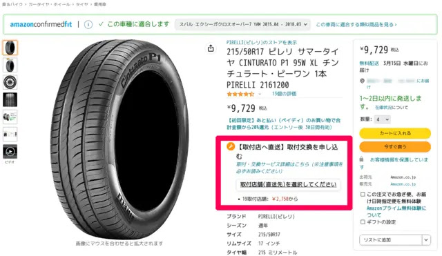

自分でサイズを選ぶ必要があるのが一番の難所かもしれませんね。今付いているタイヤのサイド部を見るか、取説、ネットなどで調べましょう。スバル　エクシーガクロスオーバー7は前後とも
215/50R17
です。アマゾンで車種を登録しておくと適合するかも表示してくれるので便利です。

## 取付を予約する

上のタイヤ購入画面で、赤枠で囲んだ部分から取付の申込みができます。

クリックすると、車種と店舗を選ぶ画面に飛びます。交換の費用は店舗ごとに若干異なります。ガソリンスタンドのある場所にピンの立っている【グーネットピット】スマイルオートさんを選びました。

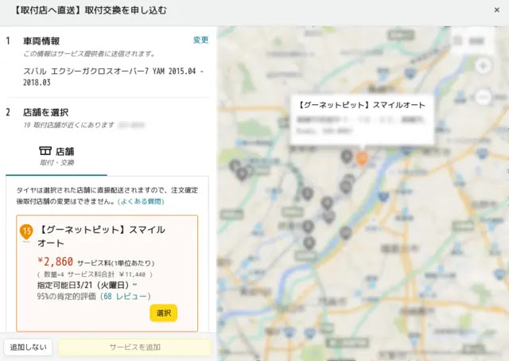

取付・交換サービス選択済となりました。この状態で商品をカートに入れて購入に進みます。

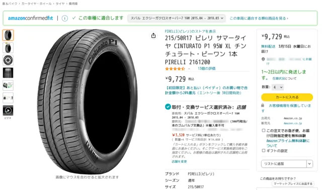

タイヤのお届け先が先程選んだ店舗になっています。

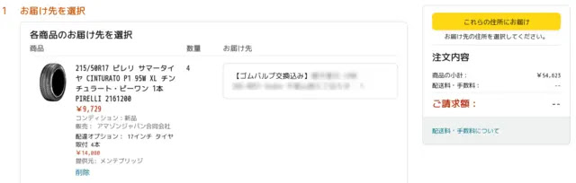

次の画面で取付の予約画面が現れました。希望日付と時間帯を第3候補まで選びます。日付と時刻の確定は、店舗からの連絡で決まります。一択で決められないのがややデメリットかもしれませんね。

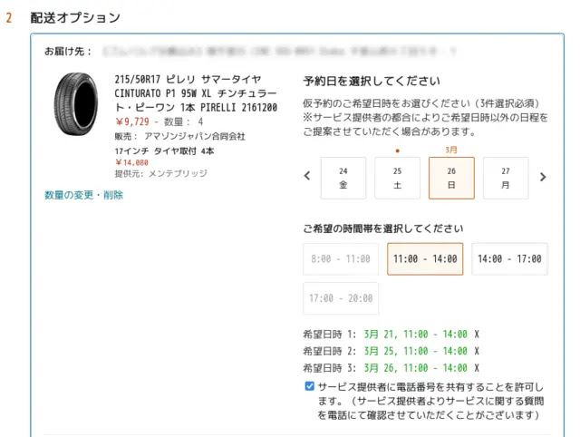

最後にお支払い方法を選択して購入します。

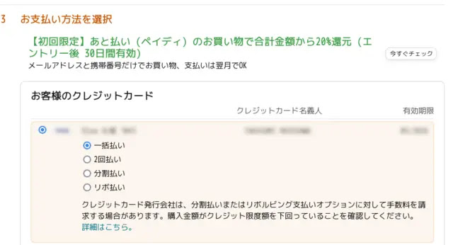

決済後、どのような手順になるのか不安でしたが、支払後の画面に1〜3営業日以内にメールで連絡が来るようなのでとりあえず、待っていればよさそうです。

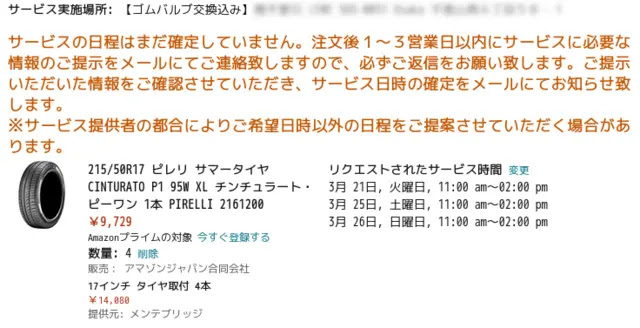

注文確定画面です。

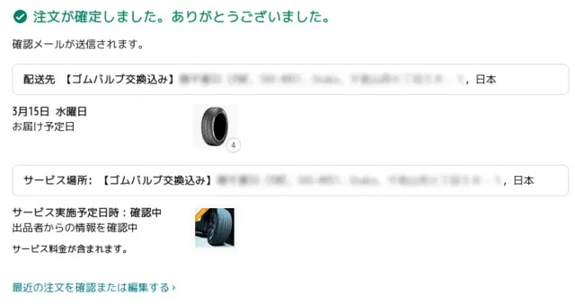

注文履歴には「まだスケジュールされていません」と出ています。この画面から予約の再スケジュールもできるようです。

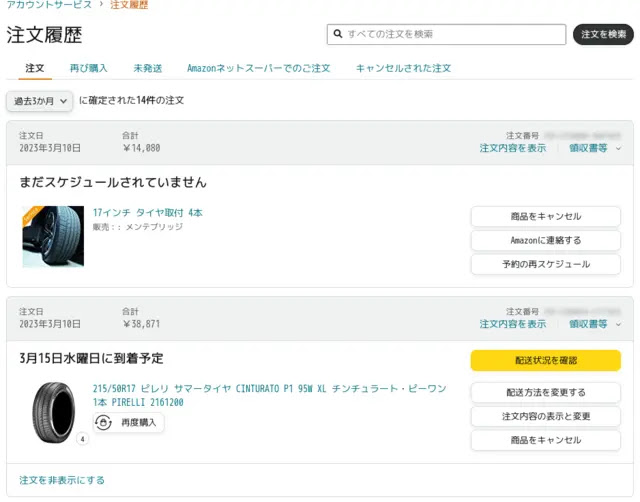

## 予約確定の連絡が来る

早速その日のうちに予約確定のメールが来ました。まずアマゾンからのメールです。

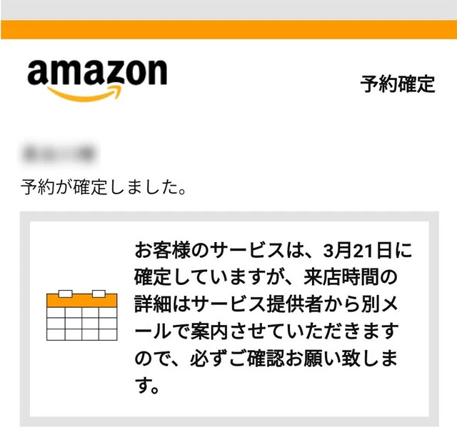

そしてほぼ同時に店舗からのメールも来ました。確定した日時が記載されています。特に返事など必要は無く、あとは指定された日時に行くだけみたいです。

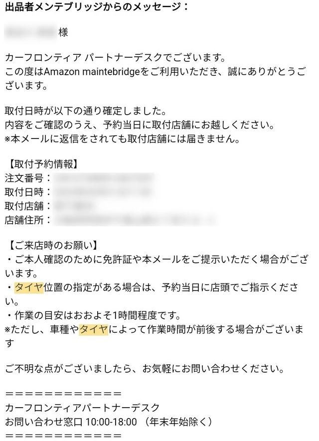

## 当日、ENEOSで交換してもらう

当日、地図で選んだ場所に行きます。やはりガソリンスタンドENEOSさんでした。選択時の地図には【グーネットピット】スマイルオート、メールはカーフロンティアパートナーデスクというところから送られて来ましたが、実際に行くのはENEOSです。

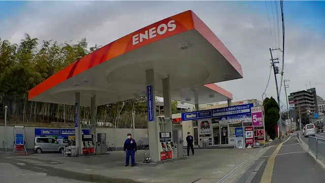

入ったときからタイヤ交換と気づいてくれていて、車を停めるとすぐにキーを渡し交換が始まります。

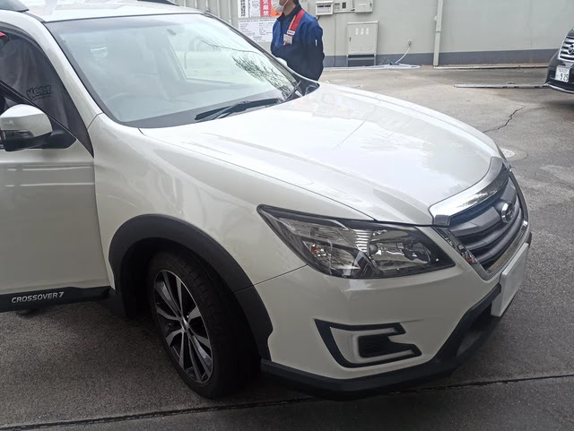

車を渡した後はレジのある建物の中で待つだけです。

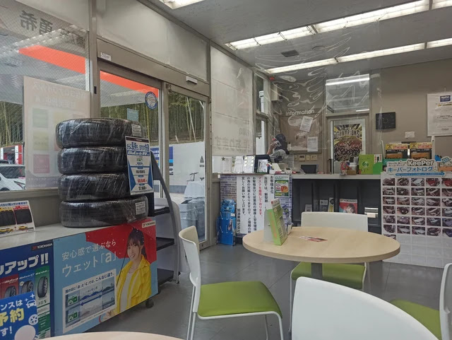

作業ガレージは車1台分しかないのですぐ近くでタイヤ交換が行われています。

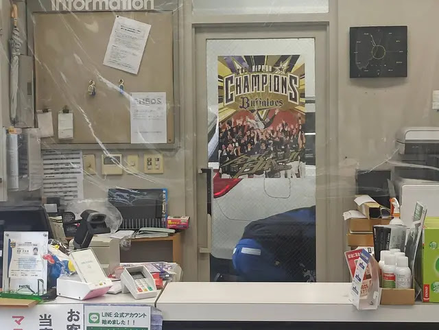

作業時間は約1時間ということでしたが、1時間15分くらいで終わりました。結構大変な作業なのですね。バランス出しもしてくれ、無事完了です。

## 廃タイヤ引取は別料金がかかる

最後に古いタイヤをどうするか聞かれ、処分を頼むと別料金がかかりました。価格を忘れてしまいましたが、3,000円くらいだったような。。。

交換後のエクシーガクロスオーバー7です。見た目は何も変わってませんが。

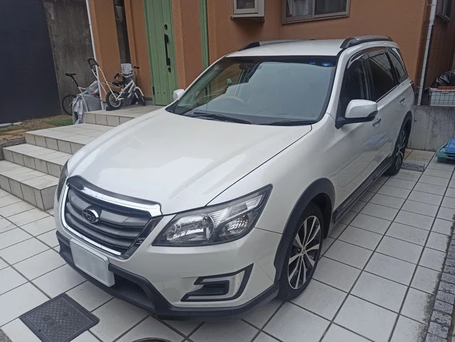

新品タイヤです。以前のブリジストン ECOPIA
は冬はスタッドレスに交換していましたが、約7年持ちました。このピレリ
CINTURATO P1 も同じくらい持つことを期待します。

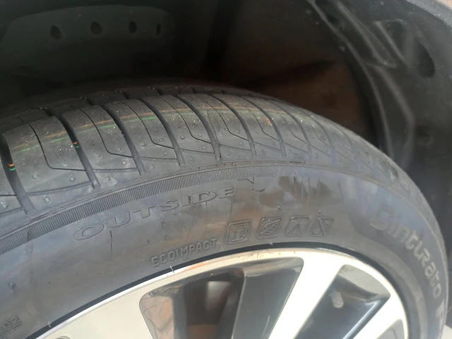 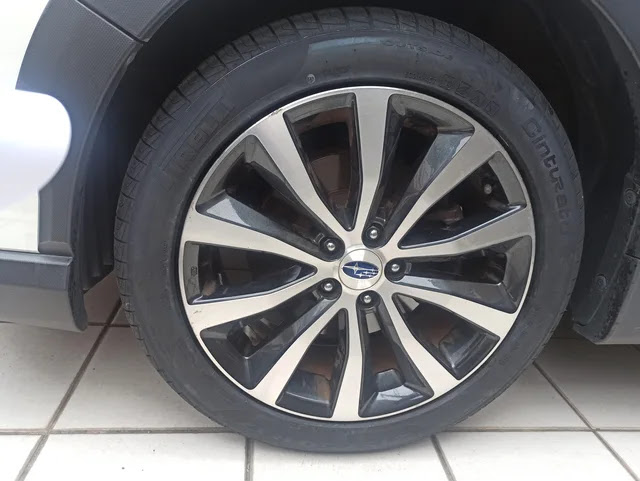

## まとめ

アマゾンでタイヤを買って交換は、ネットショップならではの安さが魅力です。予約、実際の交換は経験するまではやり方がよくわからなかったのですが、普通にアマゾンで購入する流れで予約までできるのでわかりやすく、簡単でした。

デメリットがあるとすれば、ディーラーやタイヤ専門店のように営業担当がタイヤ選定してくれないのでサイズは自分の責任で選ぶ必要があったり、待合い時にお茶が出たりしないとか、タイヤ交換作業以外のサービスは一切無いところでしょうか。また、店舗はお客さんが買ったタイヤを付けるだけ、だと思うので「購入したタイヤに不具合があった場合」にちょっと面倒そうですね。
