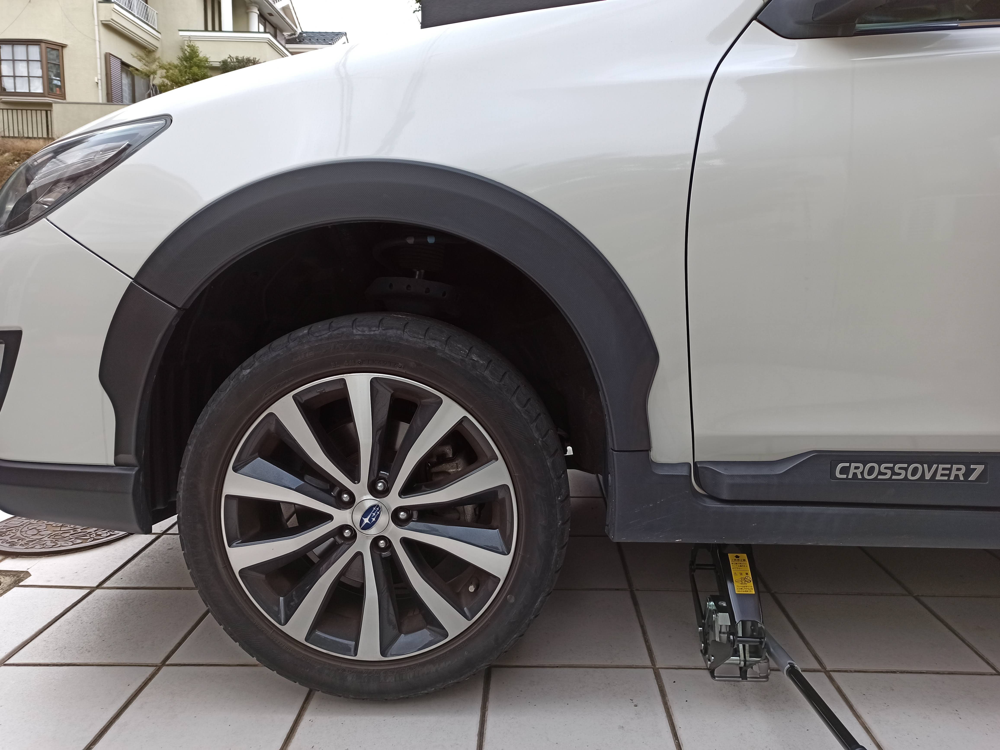
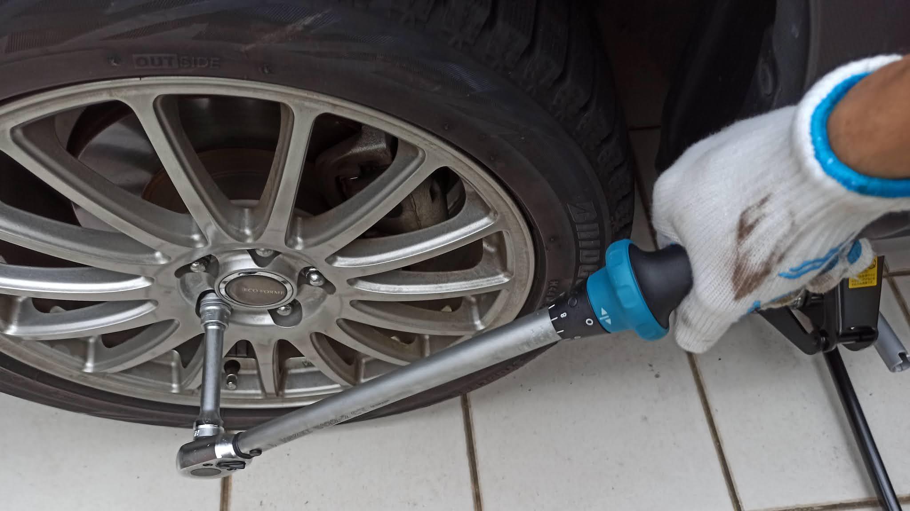

---
categories:
- 車
date: "2025-02-15T23:42:58+09:00"
draft: false
image: images/IMG_20201128_114025.jpg
summary: 今年も冬が近づいてきました。温暖化で雪が降らなくなってきたかと思いきや、突然寒くなり雪が降ることもあるため、早めにDIYでスタッドレスタイヤに交換しました。
tags:
- クロスオーバー7
- タイヤ交換
title: スバル エクシーガクロスオーバー7 タイヤ交換
---

今年も冬が近づいてきました。温暖化で雪が降らなくなってきたかと思いきや、突然寒くなり雪が降ることもあるため、早めにDIYでスタッドレスタイヤに交換しました。

タイヤ交換といっても17インチのタイヤをリムから自力で外せるわけもなく、ホイールごとの交換です。意外と工賃高いのでケチって自分でやっていますが工具や油圧パンタジャッキなど欲しくなってしまいいまのところ赤字です。

## タイヤ交換に使用したもの

-   エアコンプレッサー
-   油圧パンタジャッキ
-   タイヤストッパー
-   クロスレンチ
-   トルクレンチ, 19mmソケット付
-   軍手など、作業用手袋

ジャッキとレンチは車載工具でもできますが、ねじ式パンタジャッキは回すのがとても大変なので油圧パンタジャッキを使います。レンチも短いものでは手が痛くて大変なのでクロスレンチを、いちおうそれなりのトルクで締め付けたいのでトルクレンチを使用します。

トルクレンチは定期的に校正する必要があるようですが、、、まあ、感覚よりは正確と思い使っています。

⚠ タイヤ交換は水平な場所でパーキングブレーキを引いてタイヤストッパを使いましょう！ジャッキアップ中に車が動くと危険です。
{ .border-x-8 .border-blue-600 .px-4 .py-2 .font-bold}

## スタッドレスタイヤに空気を入れる

ブリヂストンの BRIZZAK 215/50 R17
です。3年くらい前にタイヤ館で購入しました。スタッドレスは3年経つと劣化してくると言いますが、、、。一番安いホイールに組んでます。保管はカバーしているものの外に放置で少しカビが生えていました。

まずは安物エアコンプレッサーで空気を入れます。規定圧はフロント 230
kPa、リア 220 kPa です。

## タイヤを外す

ジャッキアップの前に、パーキングブレーキを引いてタイヤストッパーを交換するタイヤ以外の場所にセットします。タイヤストッパーは最低限、前輪交換の際は後輪2箇所、後輪交換の際は前輪2箇所は必ずセットします。

ジャッキアップポイントは写真のフレームに切り込みのある部分です。

油圧パンタジャッキをジャッキポイントの下に滑り込ませ、リリースバルブを締めてジャッキを上げていきます。

ジャッキがフレームの切り欠き部分にかかったことを確認して、タイヤが地面から離れない程度に少しジャッキアップします。ホイールのボルトは固く締まっているため、タイヤを浮かせてから力をかけて車体を揺さぶると最悪ジャッキが倒れてしまうことを防ぐためです。

※昔の車はタイヤが地面に付いていないとホイールが回ってしまい外せないので気が付きます

クロスレンチでナットを少しだけ弛めます。まだタイヤが地面に付いているのでズルズルに弛めてはいけません。

ナットを弛めたらさらにジャッキを上げていきます。

タイヤが地面から離れました。

ホイールを外す前に、ジャッキが倒れたり突然下がってしまったときの備えとして、タイヤを1本車体下に入れておきます。写真は中に入れすぎですが、タイヤを入れているときにジャッキが下がることも考慮して半分くらい入れて手は車体下に入らないようにするのが理想です。

油圧ジャッキは内部のシールが劣化してくるとシールから油漏れ下がる宿命にあるので、特にジャッキが下がるトラブルには気をつける必要があります。ジャッキアップ後、油漏れと、ジャッキが下がらないか少しの間確認してからホイールを外した方が良いです。

ここまできたらナットを外していきます。

ホイールを外します。手を入れる際はいつジャッキが下がっても挟まれないようタイヤの下や車体フレーム下に手や体を入れないようにしましょう。

ホイールが外れました。ブレーキまわりに粉状の赤錆が付いてます。。。

外したホイールです。タイヤは純正では無く、ブリヂストンの PLAYZ
を付けています。

スリップサインまではまだ少しありますが、トレッドの端がひび割れてきてますね。。。

## スタッドレスタイヤの取付

交換するホイールをスタッドボルトに穴をあわせて入れます。重い！

ナットを取付けます。

ナットをすべて取り付けたら軽く締めます。ナットは対角状に締めていきます。

車体フレーム下に入れていたタイヤを取り出します。

ゆっくりリリースバルブを弛め、完全にジャッキを下げずにタイヤが地面に付いたところで止めます。

本締めはトルクレンチを使います。規定トルクは取扱説明書に記載があり、エクシーガ
クロスオーバー7 の場合は 100Nm
でした。トルクレンチを規定トルクにセットします。

カチッとクリック音がすれば締め付け完了です。ここも対角状に本締めします。

ゆっくりと最後までジャッキを下げていきます。

ジャッキを抜いて取付完了です。

ホイールはスバルマークの無い安物感が出ています。純正の方が数段カッコいいですね。

## 外したタイヤの保管は？

外したタイヤです。17インチのホイール付タイヤは重いです。これまでは庭で寝かせて4段積みにした状態で、銀色のタイヤカバーをかけて保管していましたが、一番下が地面の湿気でカビが生えてしまったので地面から浮かせるためタイヤラックを買おうかDIYでラックを作ろうかと思っています。

## まとめ

タイヤ交換（ホイールごと）は、大きな車ほど重いタイヤを扱うので体力を使いますが、DIY
でやると工賃の節約と好きなときにできるのがメリットです。軽自動車やコンパクトカーなら力もあまり必要ありません。

大変さで言えば、タイヤを車に積むのもかなり力が要るのでディーラーやカーショップにタイヤを持ち込む苦労と交換の苦労は実はそれほど変わらないかもと感じます。（交換に必要な道具さえ揃っていれば）

ただし、重量物を扱うので常にジャッキが倒れたとき、車が動いてしまったときの危険を意識して手や体の位置に注意して慎重に行う必要があります。
