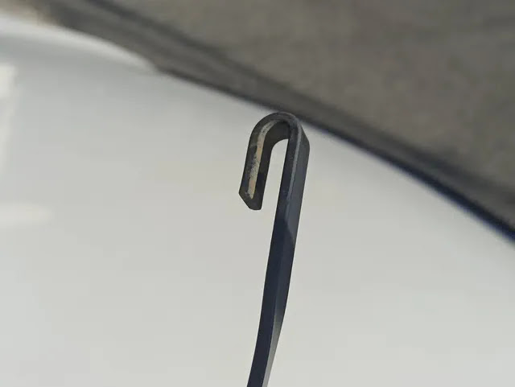

---
categories:
  - 車
  - DIY
date: "2025-02-15T23:44:05+09:00"
description: DIYでワイパーブレード交換方法を解説します。適合ワイパーの検索方法もご紹介。
draft: false
images:
  - images/0019.webp
summary: 購入してから約7年が経つスバルエクシーガクロスオーバー7のワイパーブレードを交換しました。
tags:
  - ワイパー
  - クロスオーバー7
title: ワイパーブレード交換
---

購入してから約7年が経つスバルエクシーガクロスオーバー7のワイパーブレードを交換しました。

## ワイパーブレード交換に思い至った経緯

もう何年も車に乗っていますが、ワイパーのゴム交換を点検や車検でついでにやってもらうくらいで、ワイパーブレードを交換したことはこれまで経験ありませんでした。そんなに壊れるものでもないし、寿命もあるのか分からず。

先日雨が降ったときにふと、ワイパーの拭き残りに気付き、ワイパーゴムを交換してみようと思いました。もう7年も乗っているのでワイパーブレードごと交換してみようと思いたちました。

## ワイパーブレードの種類と選定

アマゾンで安いワイパーブレードが売っているのですが、仕様は車種ごとに異なるため、自分の車に合うかよくわかりません。カー用品店に行って聞けばすぐに分かるのでしょうが、大手メーカーではネットで適合検索できます。やはり初回は信頼の大手メーカー、
[PIAAの適合検索システム](https://www.piaa.co.jp/index2.html)
を使って調べました。

これで品番が分かったので、アマゾンでフロント左右、リアのワイパーブレードを注文しました。

## フロントワイパーブレード交換

モノが届いたので早速交換です。

まずはフロントワイパーから始めます。

ワイパーブレードはこんな感じで取り付けられています。右側のツメでロックされています。

ツメを上に開けばよいのですが、長年の汚れが溜まったのか結構固く、マイナスドライバーにティッシュを巻いて隙間に突っ込んで開きました。

ツメを開いた状態です。

ワイパーブレード持ちながらを下に引いてずらします。この状態で引っかかりが外れます。

上の状態からワイパーブレードを90°回転させると抜くことができます。

ワイパーブレードを外した状態です。なんか、傘の持ち手のような、あっさりした形状ですね。

外したワイパーブレードです。

外したワイパーブレード（上）と新品のもの（下）を並べてみました。所詮ワイパーブレード、遠くからの見た目は変わりませんね。上の外したものは全体的に若干白くなっていました。

新しいワイパーブレードのツメを開きます。新品なので手でかんたんに開きました。

こちらが購入したワイパーブレードです。

ワイパーゴムの断面は面白い形をしています。この形状が拭き取り性能に効くのでしょうか？

あとは外した方法と逆に取り付けていくだけです。まずはU字部分をワイパーブレードに挿入します。

入れたら、ワイパーを上にずらし、中のシャフトにU字部分を引っ掛けます。

引っ掛けたらツメを戻します。

取り付け完了です。

反対側も交換し、フロントワイパー交換完了です。

## リアワイパーブレード交換

次はリアワイパーです。

ワイパーブレードを時計回りに回転させます。

上の状態から両手でワイパーブレードを持ってさらにグリッと回すと外れました。

外した後のワイパーブレードを引っ掛ける部分です。

上がもとから付いていたワイパーブレードで、下が新品です。形がほとんど同じなのでわからないですね。

新しいワイパーブレードの引っ掛け部分です。上下がこの向きに取り付けるのですが、ロゴが逆さまになってしまします。

ワイパーブレードのシャフトを引っ掛けます。

ワイパーブレードを押しながら回すと取り付けできました。

ロゴが逆さまでしたが、見えなくなるので問題ないですね。取り付け完了です。

## まとめ

ワイパーブレード交換はコツが要るかなと思いましたが、意外と簡単でした。メーカーのサイトで品番検索をして正しい品番を選ぶことが重要ですね。
