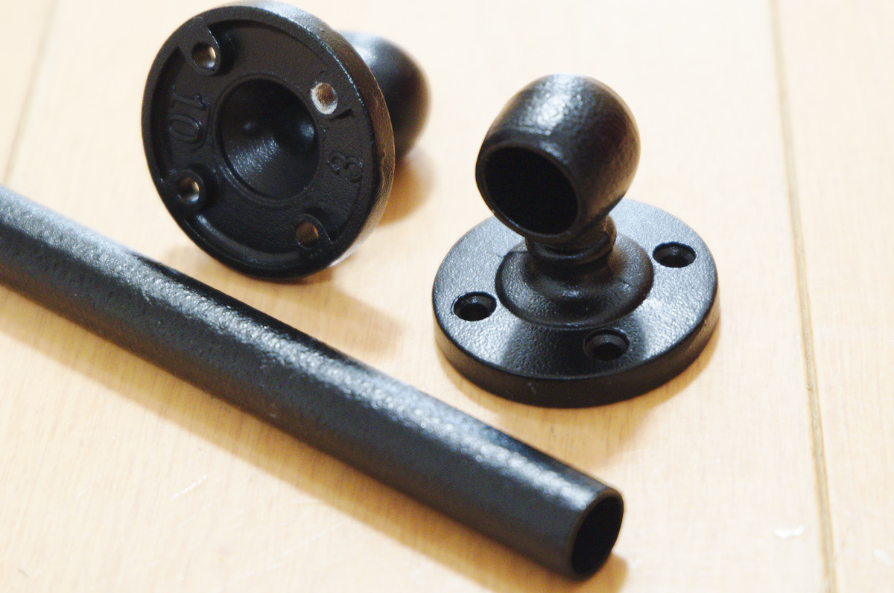
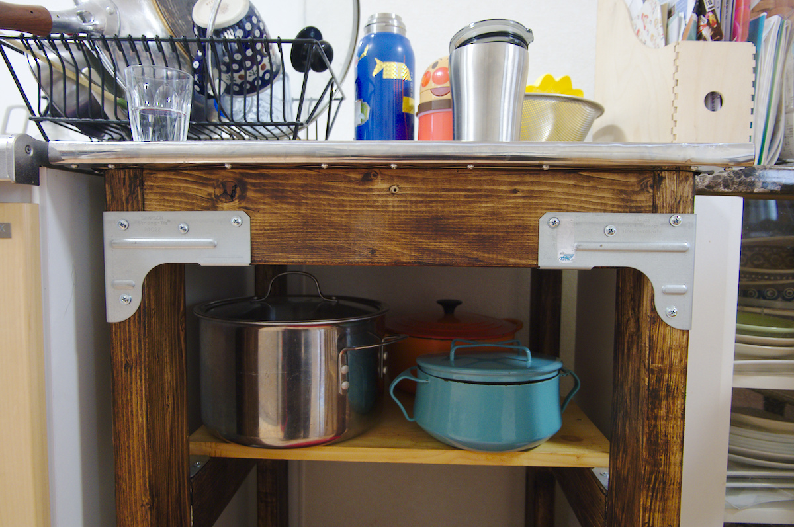
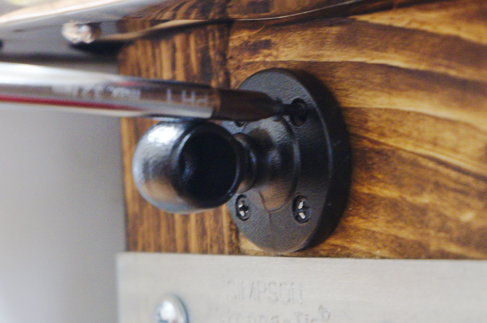
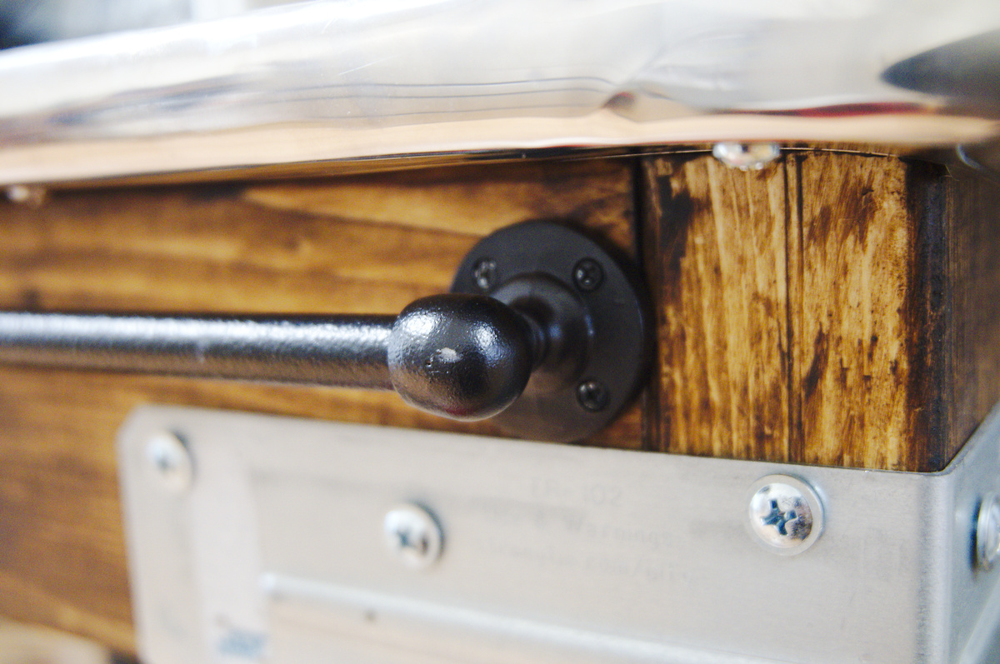
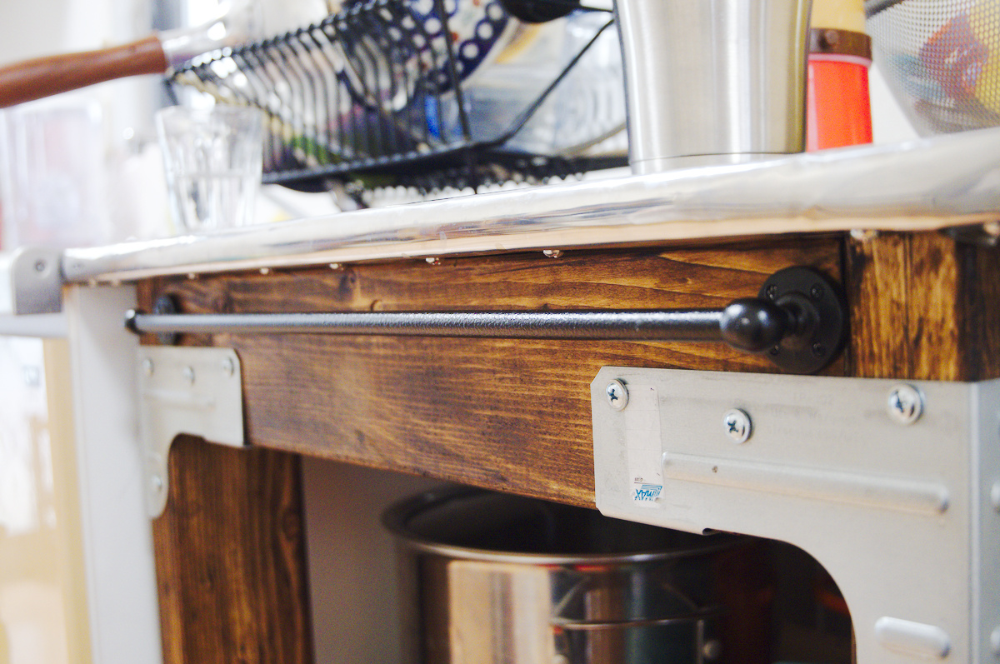
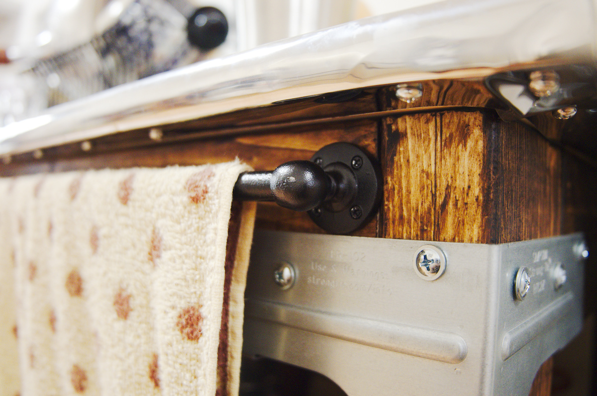
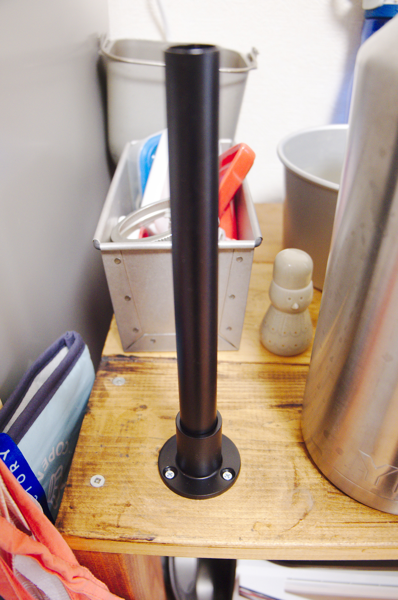
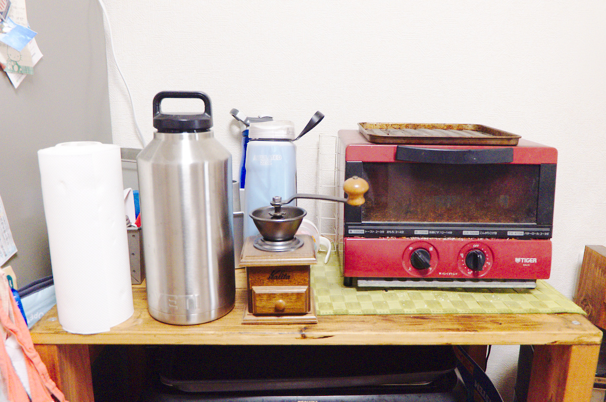

---
categories:
- DIY
date: "2025-02-15T23:42:36+09:00"
draft: false
images:
- images/DSCF0014.jpg
description: ホームセンターに売っているアンティーク風パイプを使ったDIYをご紹介します。タオル掛けとキッチンペーパースタンドを作りました。
summary: 年末年始はあまりやることも無いので大晦日にスーパービバホームに行ってアンティーク風パイプを買ってみました。これでタオル掛けとキッチンペーパースタンドを作ってみます。
tags:
- アンティークパイプ
title: アンティーク風パイプで作るタオル掛けとキッチンペーパースタンド
---

年末年始はあまりやることも無いので大晦日にスーパービバホームに行ってアンティーク風パイプを買ってみました。これでタオル掛けとキッチンペーパースタンドを作ってみます。

金属に黒色のシボ塗装というのでしょうか、ザラザラ塗装が施されていて男心をくすぐります。

以前に制作したキッチン作業台の正面にタオル掛を取り付けます。取付は簡単。付属の木ネジでジョイントを両側固定してパイプを渡すだけ。ねじの黒塗装がいい加減でドライバーで塗装が剥げます。フランジの取付穴ピッチ円が小さくドライバーが頭に干渉し斜めになるため締め付けにくいです。

ジョイントも少し塗装剥げがありますがまあ、アンティーク風だしいいでしょう。

パイプはφ9.5mmで440mmの長さを購入。ながさは作業台の幅にちょうどフィットしたので切らずにそのまま使えました。

100円ショップのタオルを掛けてみます。いい感じです。

ついでにキッチンラックのオーブントースター脇にφ19mm長さ300mm程度のパイプを立て、キッチンペーパーをおいてみました。

キッチンペーパースタンドは売り物だと固定されていないのでキッチンペーパーを引っ張ると動いてしまう、横向きは意外と場所を取るため固定されたパイプは結構使いやすいです。

