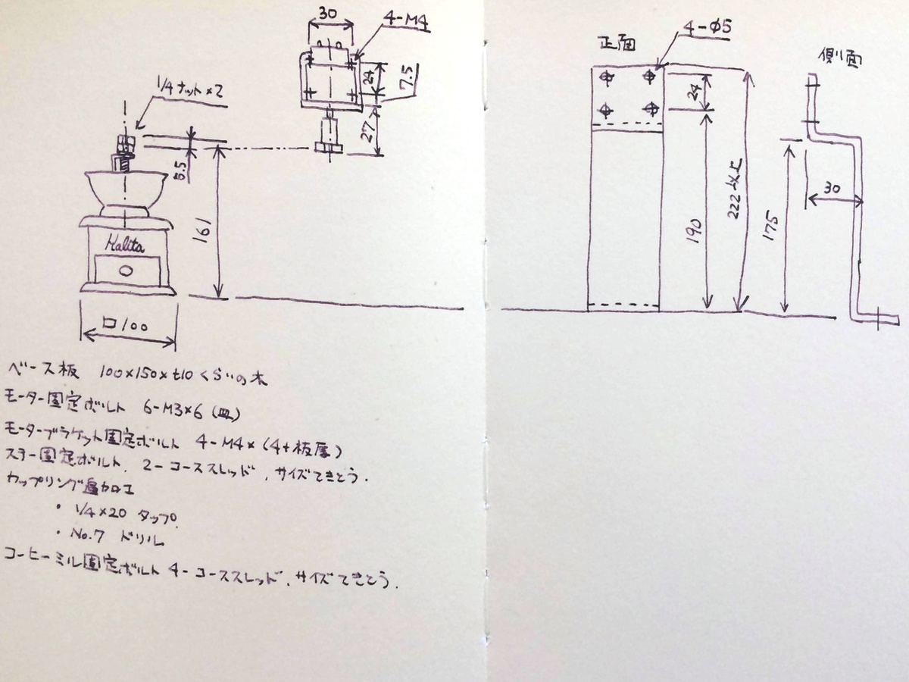
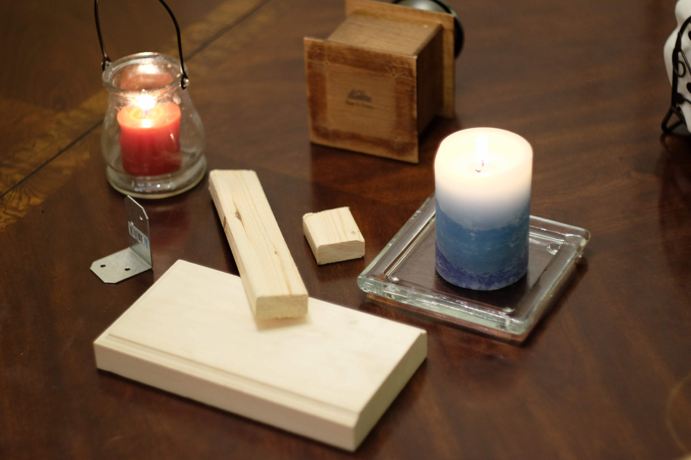
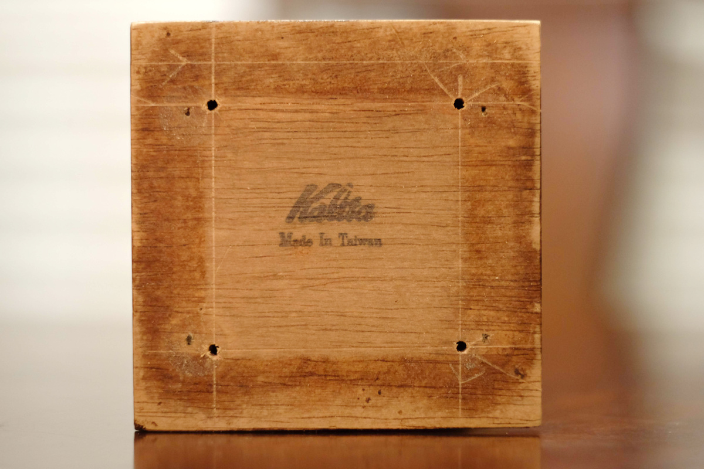
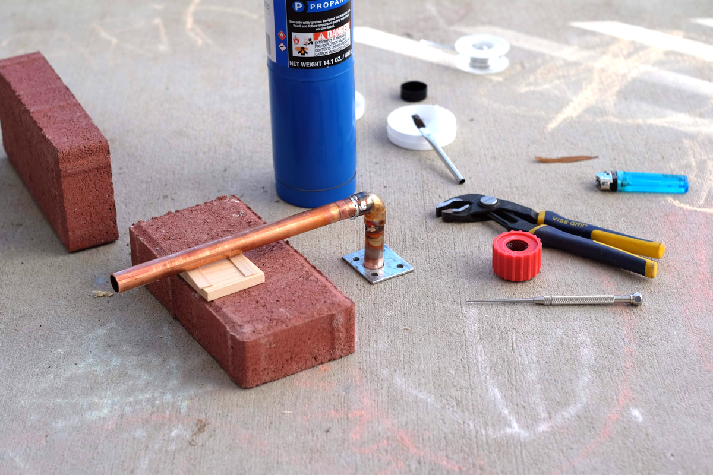
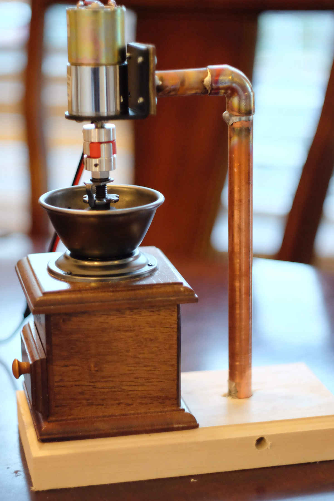
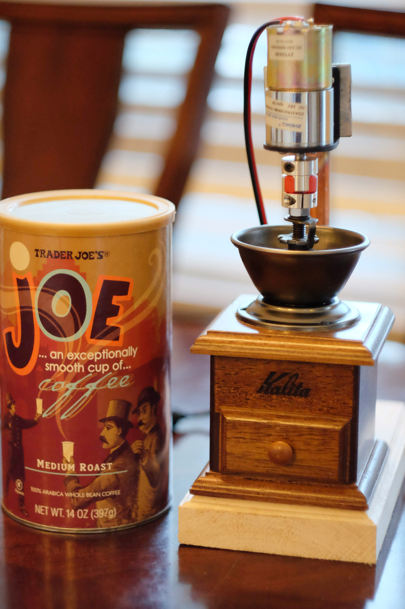
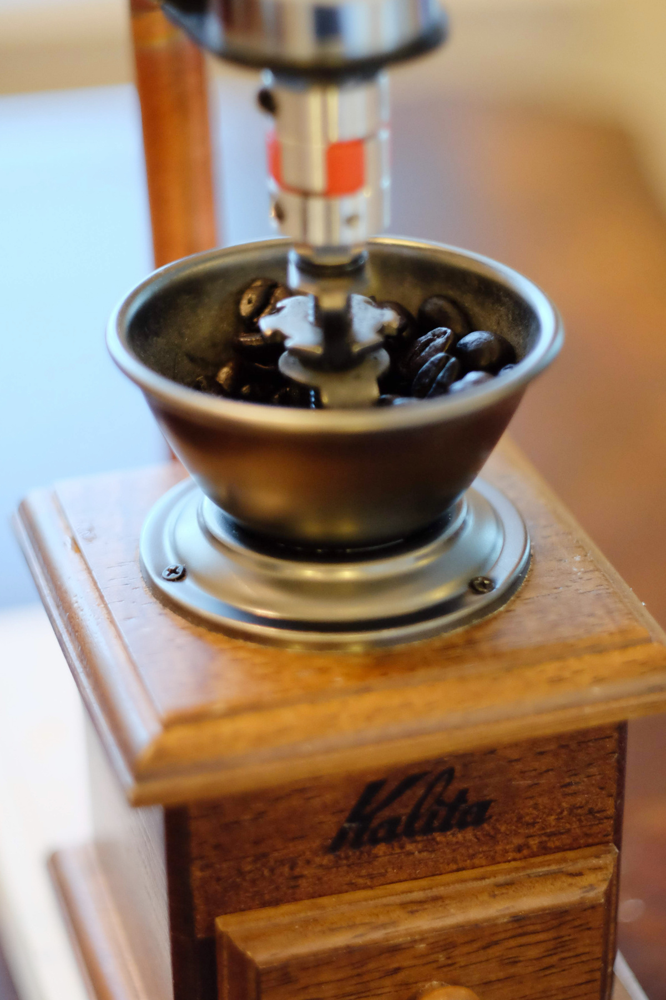

---
categories:
- DIY
date: "2025-02-15T23:42:34+09:00"
draft: false
images:
- images/DSCF6628.JPG
description: 小型DCモーターを使ったコーヒーミル電動化の方法を説明します。
summary: コーヒーミル電動化に挑戦！インパクトレンチでコーヒーミルを回してみたところ音が大きいのでモーターで回すことに。モーターはどの程度の容量を選べばよいかよくわからず、Amazonで適当に部品を物色し試行錯誤でモーター駆動版を作りました。
tags:
- コーヒーミル電動化
title: コーヒーミル電動化 （モーター編）
---

前の記事でインパクトレンチで回したところ音が大きいのでモーターで回すことを考えました。モーターはどの程度の容量を選べばよいかよくわからず、Amazonで適当に物色しとりあえずこんな感じかなとスケッチ。

100X200X20mm程度の適当な木をベースプレートとします。

 

コーヒーミル底面に下穴を空けてベースプレートにコーススレッドで固定します。

モータースタンドは板金で作りたかったのですが、個人では製作先を見つけ見積もり、発注するのは面倒そうなので結局1/2インチの銅管に適当な平板をロウ付けしました。

ロウ付けに四苦八苦しつつも完成。銅管が結構おしゃれな見栄えとなり満足です。ベースプレートに銅管と同じ径の穴を開け横からコーススレッドで銅管を貫通させて固定しています。

モーターはDC24V、ギア付き出力軸30rpmを選定、オルダム式のカップリングでコーヒーミルの軸と接続。コーヒーミル側はネジなのでカップリングに1/4のねじを切りねじ込み+クランプで固定しています。

減速比が大きいのでかなりゆっくり回りますが十分なトルクでコーヒーを挽けています。実はモーターは一度DC12V.
60rpmを買って力が足りず失敗しています。DC24V,
30rpmあたりが最低限必要な出力なのでしょう。

