---
categories:
- DIY
date: "2025-02-15T23:42:34+09:00"
draft: false
images:
- images/DSCF6995_01.jpg
description: DIYでコーヒーテーブルの作り方を解説します。SPFの2X4と1X4を使い、ポケットホール治具を使いねじが隠れるようにして天板をかわいらしい水色塗装で仕上げました。
summary: コーヒーテーブルをDIYで作ったときの記録です。設計は3DCADのOnshapeで行いました。材料はSPFの2X4と1X4、ポケットホール治具を使いねじが隠れるように組立てました。天板は室内用水性ペンキで塗装、フレームは赤茶のステインで塗装しました。
tags:
- コーヒーテーブル
- 2X4
- OnShape
title: DIYコーヒーテーブル
---

## コーヒーテーブルを2X4と1X4材でDIY

コーヒーテーブルをDIYで作ったときの記録です。設計は3D
CADのOnshapeで行いました。材料はSPFの2X4と1X4、ポケットホール治具を使いねじが隠れるように組立てました。天板は室内用水性ペンキで塗装、フレームは赤茶のステインで塗装しました。

## Onshapeで設計

### パーツの作成

Part
Studioで部品を作っていきます。Onshapeでもパラメータが使えることを知り、主要寸法にパラメータを使い後から簡単に寸法変更できるように工夫してみました。

まずはパラメータ定義です。主要寸法として、テーブル幅、高さ、フレーム（脚）の幅、
奥行き4つに対してそれぞれ #Table_W, #Table_H, #Leg_W, #Leg_D
とパラメータを割り当てます。 Onshapeのパラメータは \#
から始まる決まりみたいです。
天板の奥行きは1X4を6枚重ねて作るのを前提として、パラメータ化はしません。
さて、Onshapeで新規ファイルを開いてPart Studioでアイコンの (x)
マーク、Variableをクリックします。

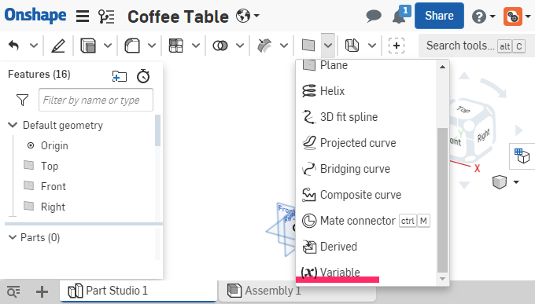

パラメータの名前と値を定義できるので入力します。

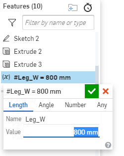

#Table_W, #Table_H, #Leg_W, #Leg_D
の各値を入力しました。各値は下記としました。

-   #Table_W: 800
-   #Table_H: 370
-   #Leg_W: 600
-   #Leg_D: 450

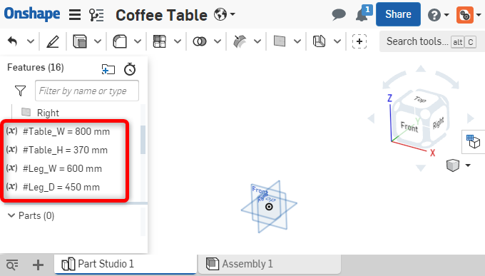

次に正面スケッチを作成し、寸法を入れる際にこれらパラメータ名を入力します。入力してEnterを押すと800など普通の数値が表示されますが、寸法値をダブルクリックするとパラメータ名が表示されます。

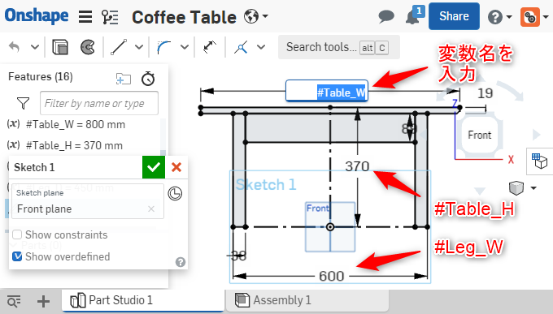

ちなみにAutodesk
Inventorなどではスケッチで寸法記入の際に「パラメータ名=値」と入れることでパラメータ作成と値設定が同時にできますが、Onshapeではスケッチでパラメータ定義はできません。なので、少し面倒な気がします。

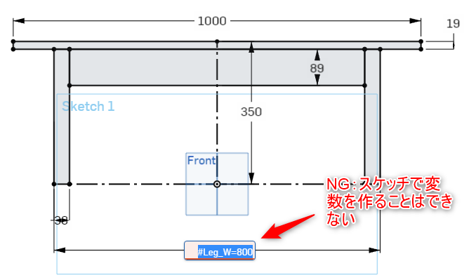

正面スケッチを描き終えたら今度は側面スケッチですが、脚の幅方向にオフセットした位置にスケッチを描きたいので平面を作成します。このときにオフセット量を
#Leg_W / 2 とすることで脚の幅方向端面に平面を作成できます。

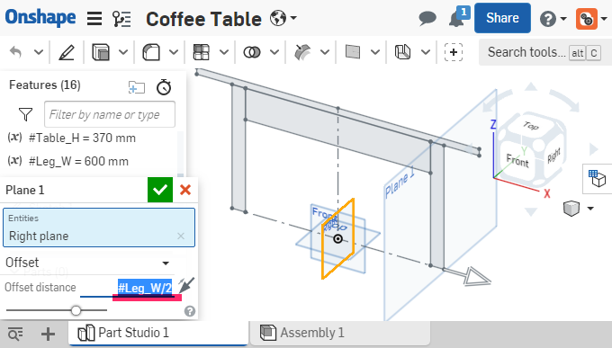

新規スケッチを作成した平面上に作り、側面スケッチを描いていきます。このとき側面スケッチでも脚の奥行き寸法を先に定義したパラメータを使います。

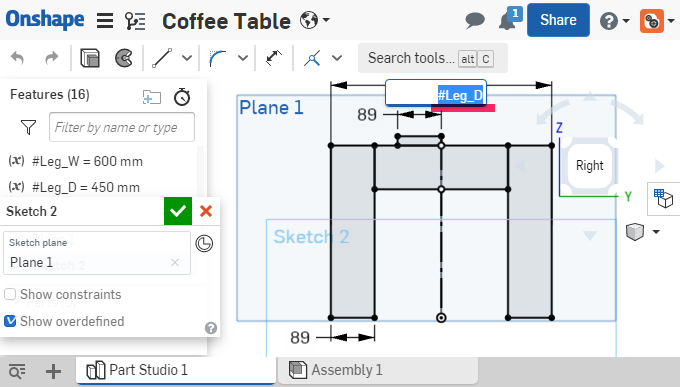

天板と側面フレームを押し出しソリッド化し3種類のパーツを作ります。

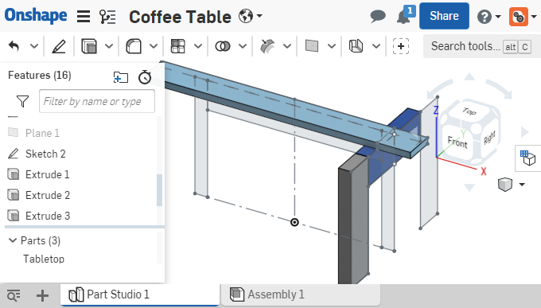

脚の正面側の平面にスケッチを作成し、正面側の梁を描きます。既に始めの正面スケッチで画はできているので梁の部分を投影すればOKです。

梁も押し出しソリッド化します。これで全4種類のパーツができました。

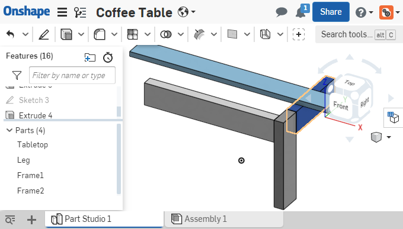

### アセンブリ作成

パーツができたらアセンブリで組立てます。ここでもPart
Studioで定義したパラメータが使えると簡単にアセンブリができるのですが、Onshapeではアセンブリでパラメータを使うことができません。パラメータを参照しながらパターンで各部品を配置し、パラメータを変更すると部品、組図とすべて変わるようにしたいのですがこういったことはできません。
ちょっと残念な仕様ですが、仕方無いので力技で拘束のFastened
Mateを使って組んでいきます。

アセンブリに4種類の部品を配置し、これらは固定します。天板にカーソルを合わせコピーし、適当な場所で貼り付けして部品を複製します。

Fastened
Mateアイコンをクリックし、貼り付けした天板の角、固定先である元の天板の角の順にクリックすると2つの部品が拘束されます。

拘束されました。

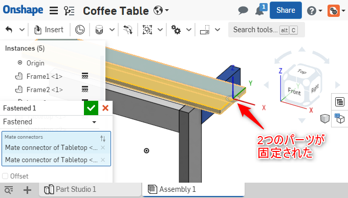

同様に6つの天板を拘束し、さらに脚もFastened
Mateで組んでアセンブリ完成です。

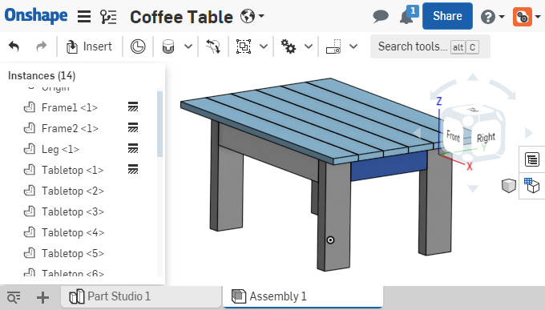

### パラメータを使うメリット

パラメータを使いパーツ、アセンブリを作成するメリットとして、後から寸法変更する際にパラメータを変更するとパーツ、アセンブリ、図面と全てが変わってくれるので変更の工数が減り間違えも少なくなります。

今回のコーヒーテーブルも試しにパラメータを変更してみましょう。Part
Studioに戻りパラメータの値を下記のように変更します。

-   #Table_W: 800 → 1000
-   #Table_H: 370 → 800
-   #Leg_W: 600 → 1000
-   #Leg_D: 450から変更無し

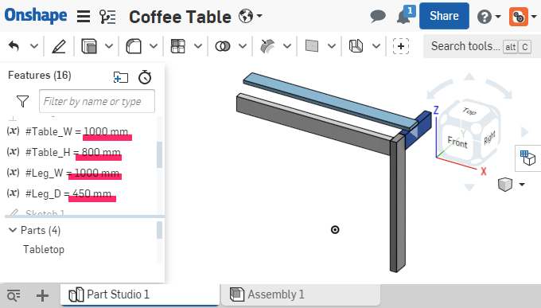

パーツ、アセンブリ共に変更され、高さのある作業机のような形になりました。このように始めから想定した寸法変更が非常に容易に行えることが大きなメリットです。設計した後からやっぱりもう少し高くしたいとかありますよね。

### 図面化

パラメータは元に戻し図面化しました。

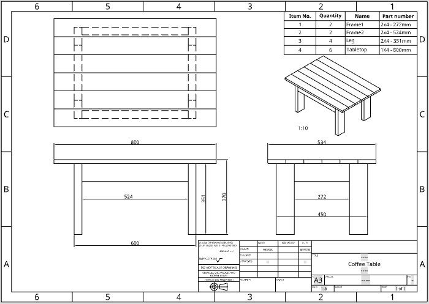

図面化と部品表作成の詳細は下記の記事を参照ください。

### 製作したコーヒーテーブル

製作詳細は割愛します。ホームセンターで2X4、1X4の材料を購入し頑張って自分でカットしました。フレームはKregのポケットホール治具を使ってねじが隠れるように組立てました。天板の明るい水色がいい感じで子供がDVD見たりお菓子を食べるのに使っています。

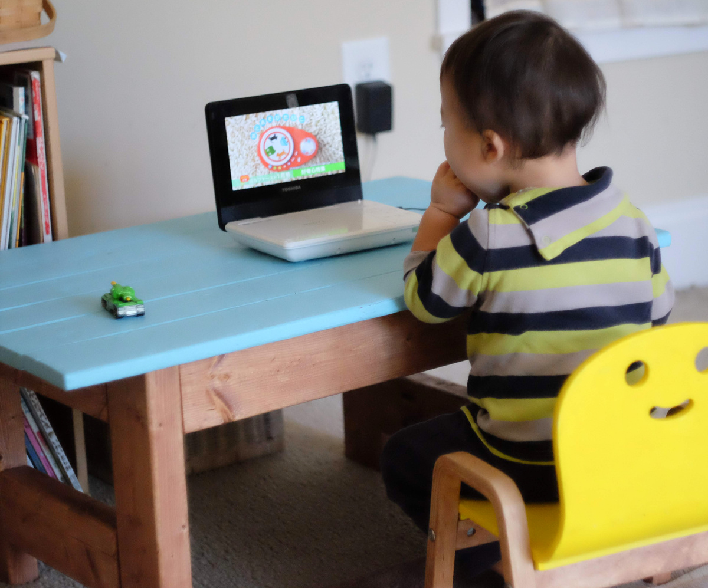
