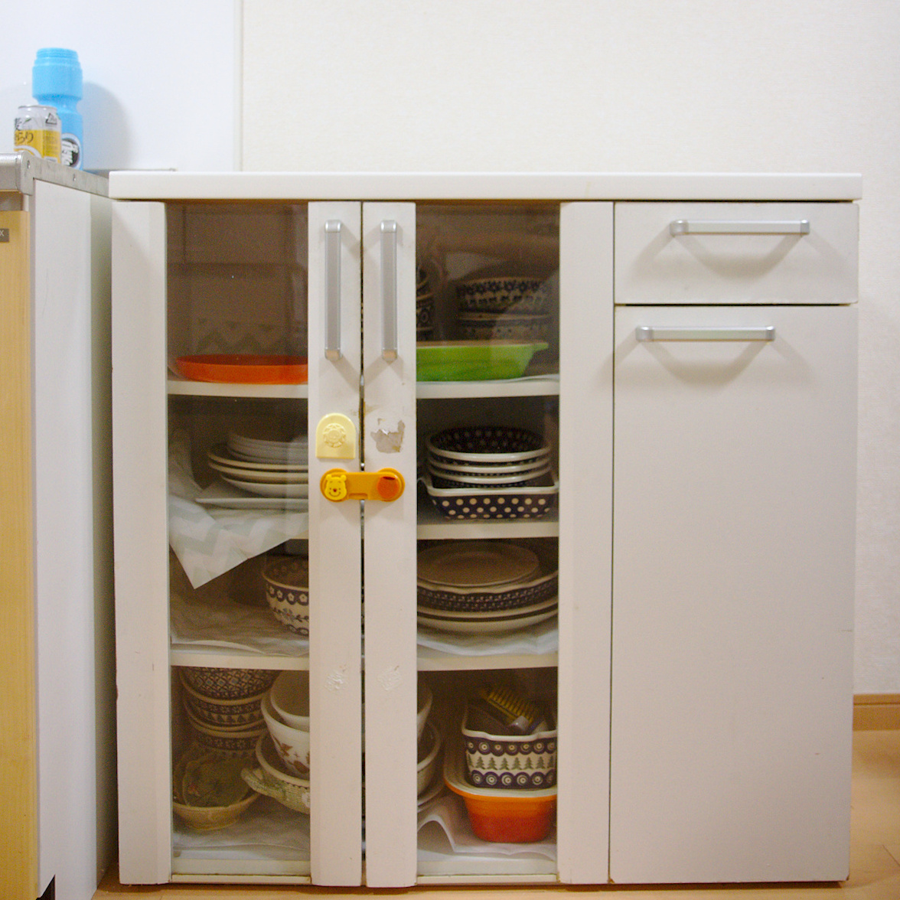
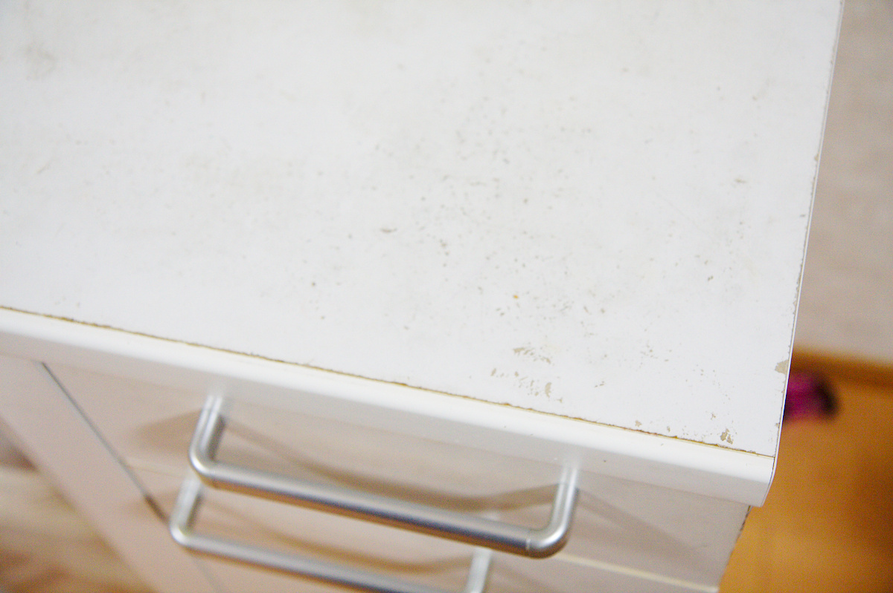
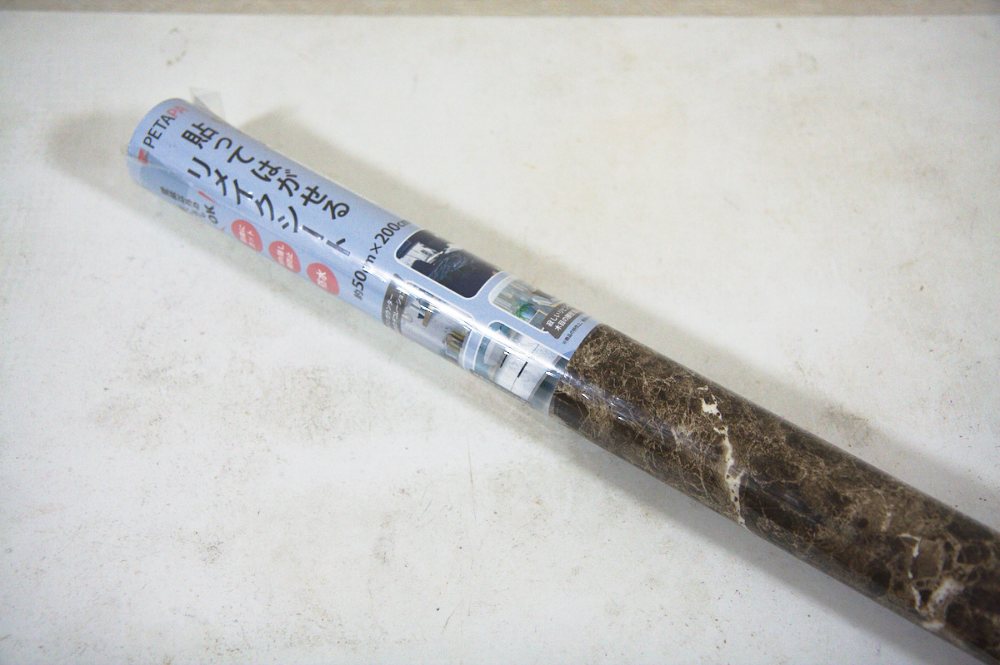
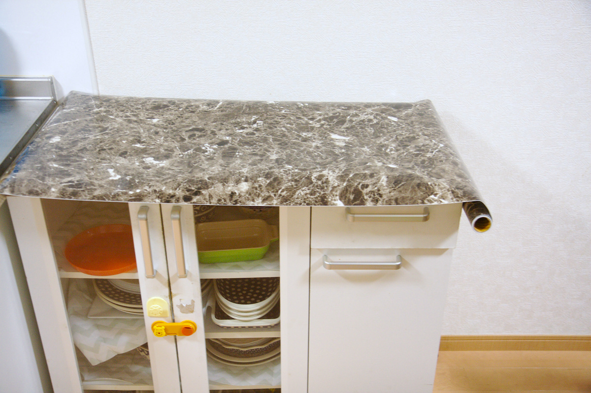
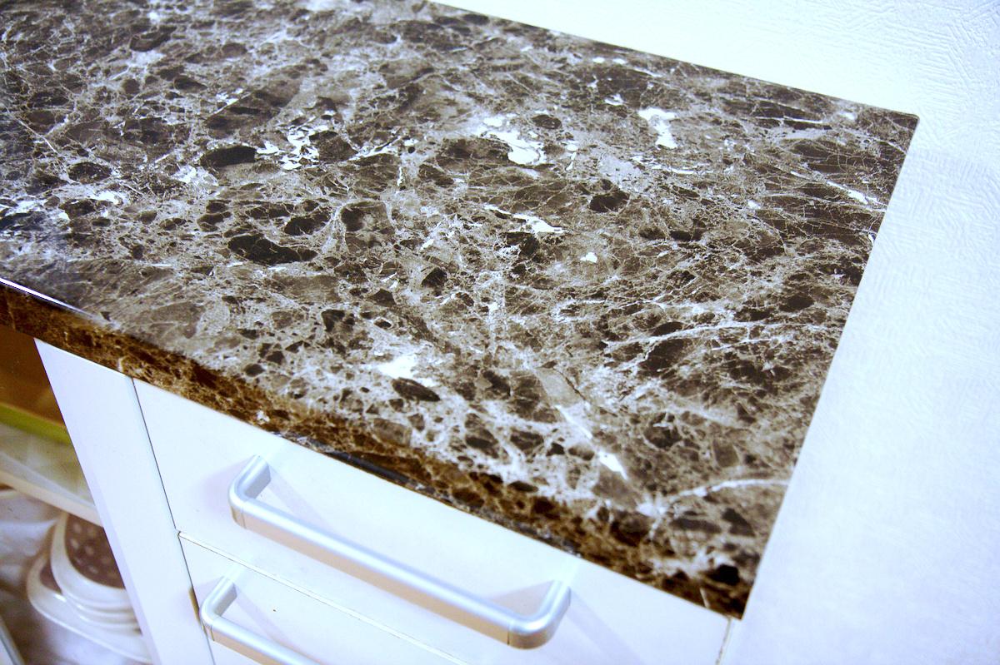
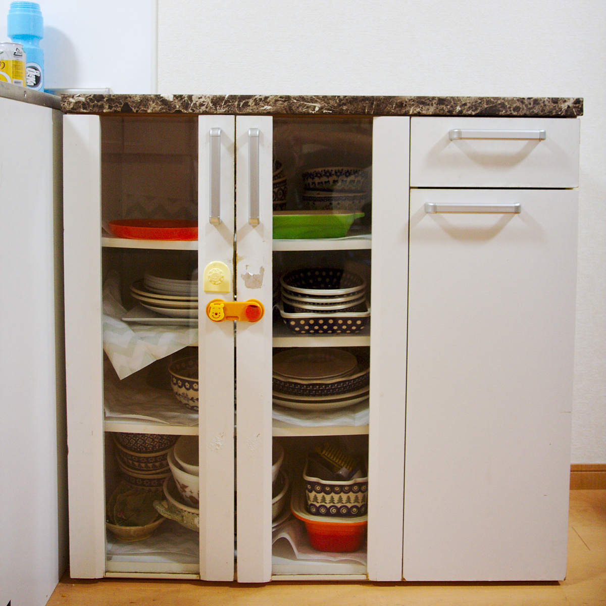
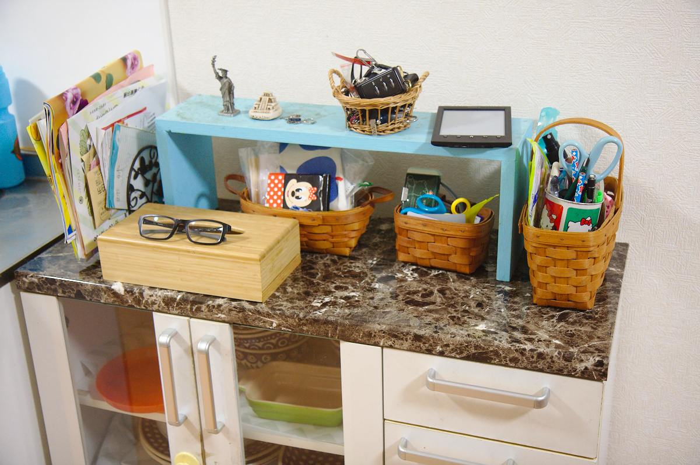

---
categories:
- DIY
date: "2025-02-15T23:42:31+09:00"
draft: false
images:
- images/IMG_4811.jpg
description: 古くなった食器棚の天板に大理石の模様が印刷されたシートを貼ってリメイクする方法を解説します。
summary: 我が家にはキッチンと同じ高さの食器棚を12年くらい使っています。全体が白い化粧板でできていますが、段々と剥がれたり汚くなったりしてきます。そこで補修とイメージチェンジ兼ねて大理石シートを貼ってみました。
tags:
- リメイク
- 食器棚
title: 大理石シートで食器棚の天板をリメイク
---

我が家にはキッチンと同じ高さの食器棚を12年くらい使っています。
全体が白い化粧板でできていますが、段々と剥がれたり汚くなったりしてきます。
そこで補修とイメージチェンジ兼ねて大理石シートを貼ってみました。

食器棚はこんな感じで一部化粧板の白色が剥げて下地が見えてしまっています。

大理石シートをアマゾンで購入。本当はダイノックフィルムが良いのですが
高いので安いのを探し、50X200cmで\\1,250でした。白と黒、ピンクがかった白など
色がありましたがシックにしてみようと黒を選択。

天板の上に広げてみます。天板は45X120cmくらいなので側面まで折り返すことを考えると
幅はちょうど良いくらいです。長さは折返しを考えて少し長めにカッターでカットしました。

きれいにシートを貼るのは結構難しい作業かなと思っていましたが、このシートは
「貼ってはがせる」と書いてある通り粘着性は強くなく、剥がしてやり直しができるので
なんとか気泡やシワが入らずに貼ることができました。いきなり貼った後の写真ですが
作業中はかなりテンパっていました。

正面から見るとこんな感じです。材質はビニールなのでテカテカしていて近くで見ると
やっぱりビニール感があります。

しかし物を置いて少し離れて見ると結構大理石の高級感が出ていい感じです。
ビニールなのと接着剤が弱いので耐久性が気になりますが今のところ問題無く家族にも
好評です。この調子で天板以外も木目調とかでシート貼りしたいですが引き出しや扉とかは
かなり面倒そうなのでとりあえずここまで。

