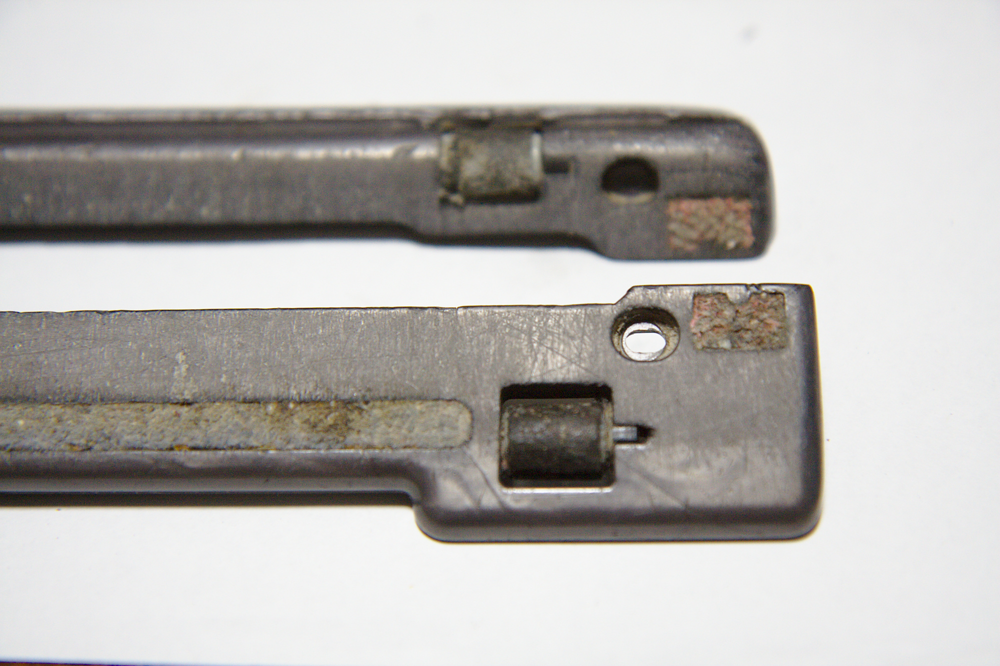

---
categories:
- DIY
date: "2025-02-15T23:42:28+09:00"
draft: false
images: 
- images/IMG_4500_01.jpg
description: ダイソンDC47のエアタービンが回転しなくなった際の分解清掃方法を解説します
summary: 買ってから5年になるダイソンDC47のエアタービンが回らなくなりました。完全ロック状態で手でも回らない感じです。DIYで分解清掃にチャレンジしました。
tags:
- ダイソン
- タービンヘッド分解
title: ダイソン エアタービン ベアリング交換
---

## ダイソンのエアタービンが回らなくなった

買ってから5年になるダイソンDC47のエアタービンが回らなくなりました。完全ロック状態で手でも回らない感じです。ネットで調べると結構バラしている人いますね。大体はゴミを除去すると回るようになったというような情報です。

## ばらしてみる

ばらし自体はネットで↓のサイトのような感じでやっていきます。TORXねじが使われているため、TORXドライバーが必要です。サイズはTX8とTX10でした。

[Dyson DC26 タービンヘッド
分解清掃](https://minkara.carview.co.jp/userid/469414/car/475868/1740809/note.aspx)

## ベアリングがゴリゴリに

タービンヘッドの駆動は、吸引口にあるファンを風の力で回し、上写真の手前に見える白いギアに動力を移し減速します。ギア軸の反対側はタイミングブーリーが付いていてタイミングベルトでさらに減速しつつ、右上のブラシを回すカップリングを回転させます。このカップリングがガチガチで回りません。

多分↑で紹介したリンクの内容のようにベアリングに髪の毛などのゴミが溜まっているのでしょう。カップリングを外そうとしますが引っかかりが無く、とても硬く軸に圧入されているので苦労します。最終的に傷付くの覚悟でウォーターポンププライヤーで挟んで無理やり引っこ抜きました。

↑は分解しベアリングを抜いた画像ですが、実はベアリングは壊れてサビサビのゴリゴリ状態で、髪の毛が渦巻き状になったゴミが挟まっていました。ギョエーとなるあまりにも汚い状態だったので写真撮り忘れてしまいました。

## ベアリング交換

ベアリングが壊れていたので、新しいベアリングを購入です。シールに606RSと書かれているのでアマゾンで検索するとuxcellから1個500円程度でバラ売りしています。送料無料で嬉しいですが、届くまで2週間くらいかかりました。

なんとカンボジアから発送のようです。

## 組み立て

あとは新しいベアリングを入れて元通りに組み立てます。ベアリングの外輪固定に穴の無いCリングを使っているので取るのも入れるのも苦労しました。精密マイナスドライバー2本で無理やりこじりながら入れていきます。

## ついでに掃除

ついでにこのゴミが溜まって動かなくなったコロコロローラーも外して掃除しておきます。

 

ここは両サイド、軸に白い紙のようなゴミが溜まっていました。

タービンヘッドを組み立て完成です。

## 電源ON

回るようになりましたが、うーん、微妙。新品のようには戻らず何となくぎこちないです。おもちゃのような細いシャフトにプラスチックの部品で軸受ができているので、一度ばらすとビシッと精度が出ないのでしょう。まあ、回るようになったので良しとします。

もともとバラしてメンテナンスすることなど想定していなそうな作りで苦労する割には得るものも少ない気がするのであまりおすすめしません。自己責任で。
