---
categories:
- DIY
- CAD
date: "2025-02-15T23:42:33+09:00"
draft: false
images:
- images/2019-11-04_07h23_29.png
description: 無料で使える3D CAD OnShapeを使い、電子レンジやオーブントースターなどを置くラックを設計する方法を解説します。作図後、DIYで作り使っています。
summary: 電子レンジやオーブントースターなどを置くラックをDIYで作ってみました。作るにあたり、事前に3D CAD Onshapeで図面を作図しました。木材をホームセンターでカットしてもらうので、間違えると大変なので図面を描いて正解でした。

tags:
- キッチンラック
- OnShape
title: DIYキッチンラック
---

電子レンジやオーブントースターなどを置くラックをDIYで作ってみました。作るにあたり、事前に3D CAD Onshapeで図面を作図しました。木材をホームセンターでカットしてもらうので、間違えると大変なので図面を描いて正解でした。

## Onshapeで設計

CADは、無料でブラウザ上で動作しインストール不要で3Dが使えるOnshapeを利用しました。英語ですが簡単なので3D
CADを使ったことのある人であればすぐに操作できると思います。思いついたときにブラウザ開いてちょこっと設計できるので重宝します。

[Onshape \| Product Development
Platform](https://www.onshape.com/)

### 部品のモデリング

基本的に2x4とその仲間(1x6, 2x2)を使い、固定は骨組みをポケットホール、
天板は普通に上からコーススレッドで固定する感じです。

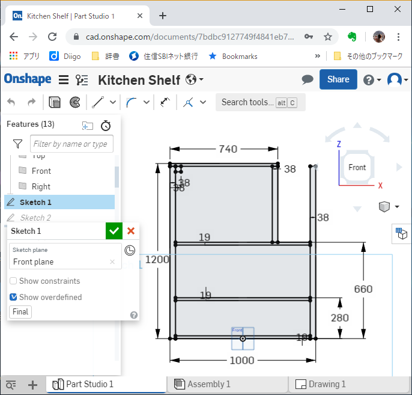

Onshape のサイトにアクセスし、新規プロジェクトを開いたらPart Studioで
まず正面のスケッチを描きます。

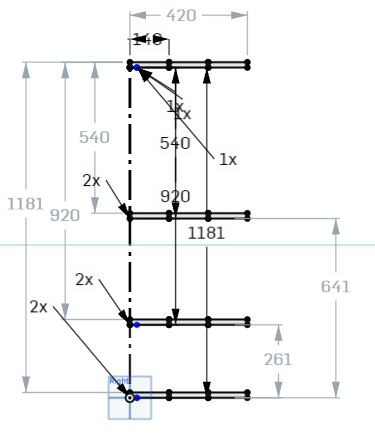

続いて側面スケッチです。1x6の天板と棚の位置をスケッチしていきます。

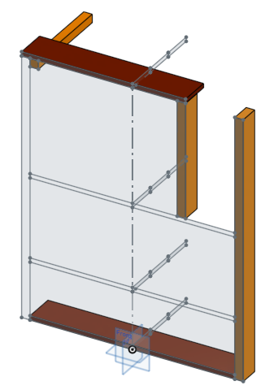

押出しでフレーム、天板を作ります。押出はアイコンでわかりますが英語でExtrude、エクストゥルードと言います。なんか響きがかっこよくて好きです。

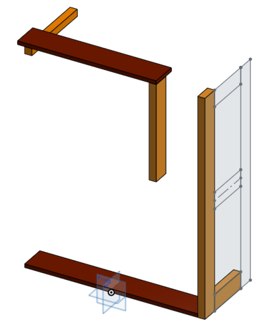

支柱側面にスケッチを追加し、側面の枠となるフレームを描き押出します。あとはこれら6種類の部品を組み合わせるだけなので組み合わせはアセンブリで行います。

### アセンブリ作成

アセンブリに移動しPart Studioで作成した部品を配置します。位置はPart
Studioで描いた位置そのままでOKです。

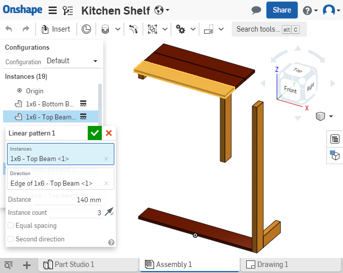

天板をパターンで3枚分となるよう配置します。

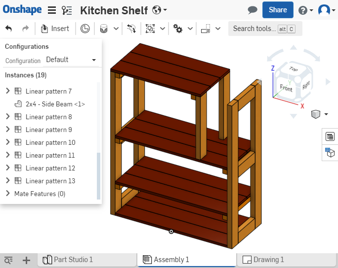

同様に他の部分もパターンで配置してアセンブリを完成させます。
拘束（Mate）を使っても良いのですが動きのない部品なのでシンプルにパターンで配置しています。

### 部品表(BOM)テーブルの編集

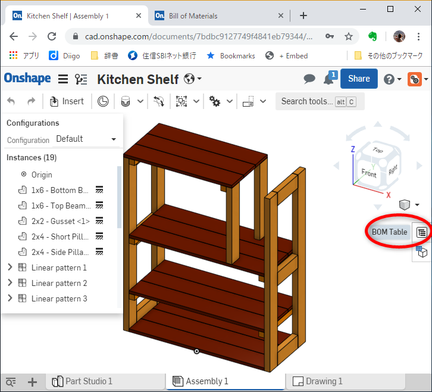

アセンブリ上で部品表のデータを編集できます。アイコンの場所がわかりにくいですがウィンドウ右側のツリー表示のようなアイコンをクリックします。

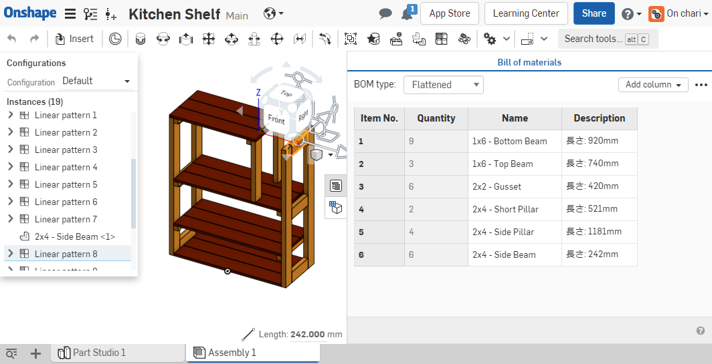

Part
Studioで各パーツのプロパティを入れて、部品表ではどれを表示するかなどを
編集できます。通常は図番、名称あたりを表示し、デフォルトでもそのような表になっていますが
今回はパーツ名(Name)に材料情報(1x6など)を記載してあり、Descriptionに長さを
記入して、この2つの情報で材料手配ができるのでこのような表にしました。

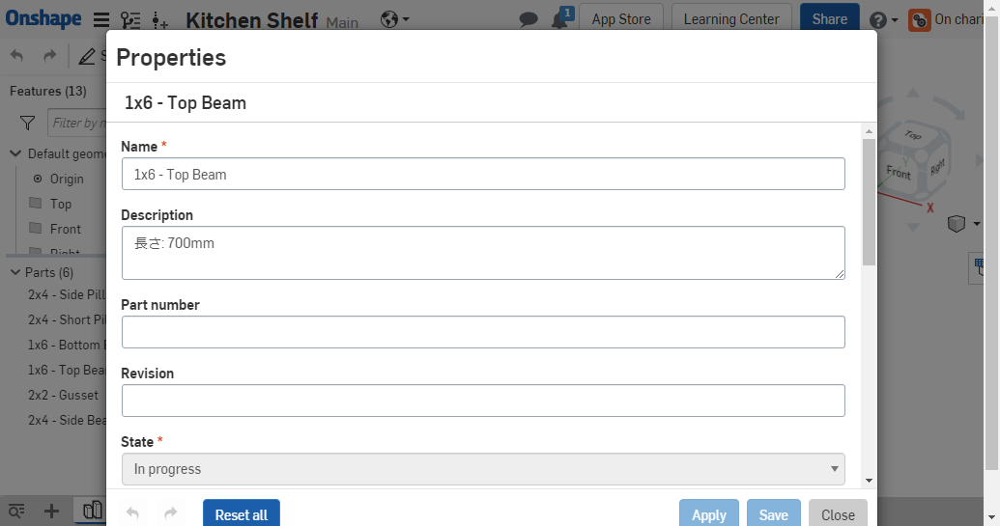

パーツのプロパティはPart
Studioでパーツ名を右クリックしてPropatiesで編集できます。

### 図面化

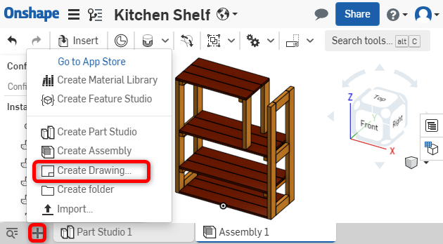

ウィンドウ左下の「＋」マークをクリックしてCreate Drawingを選択、
図面を描いていきます。標準のテンプレートは第1角法なので第3角法にする場合は
Custom Templateタブで指定できます。今回はそのまま第1角法のままです。

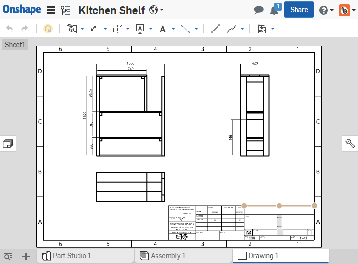

図面を開くとすぐに図面化するモデルを選択するウィンドウが出てくるので
アセンブリを選択します。各部品は単純で部品表を見ればわかるのでアセンブリ
のみ図面化します。

正面、側面、平面図を配置します。

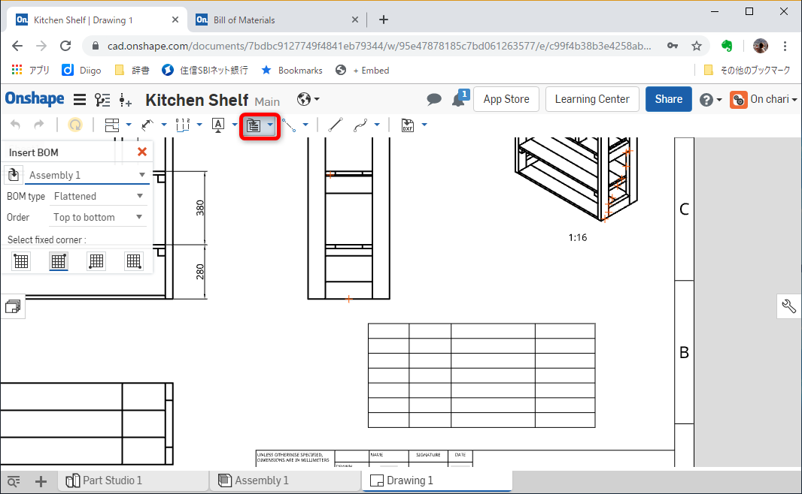

部品表を配置します。

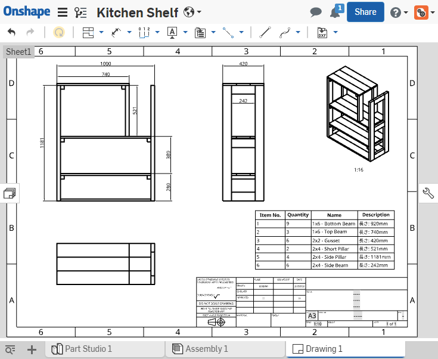

部品表はアセンブリのBOMテーブルで編集したものが表示されます。

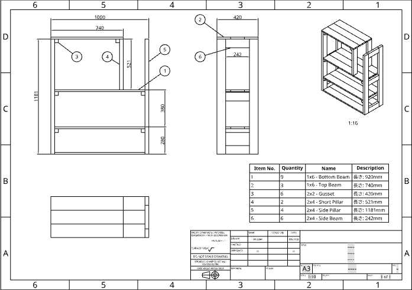

最後に風船を上げて完成です。↓Onshape図面のリンク

[DIY キッチンラック -
Onshape](https://cad.onshape.com/documents/7bdbc9127749f4841eb79344/w/95e47878185c7bd061263577/e/c99f4b38b3e4258ab7b21715)

## 製作したキッチンラック

材料はホームセンターでカットしてもらいポケットホール治具とコーススレッドで
組立て表面はフレーム部を赤茶のステインで、天板は3色のBriwaxで仕上げました。右上はコーヒーメーカーに水を入れられるよう天井が空けてあります。

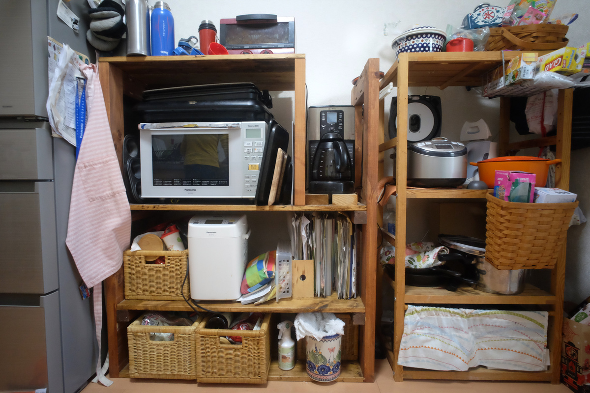
