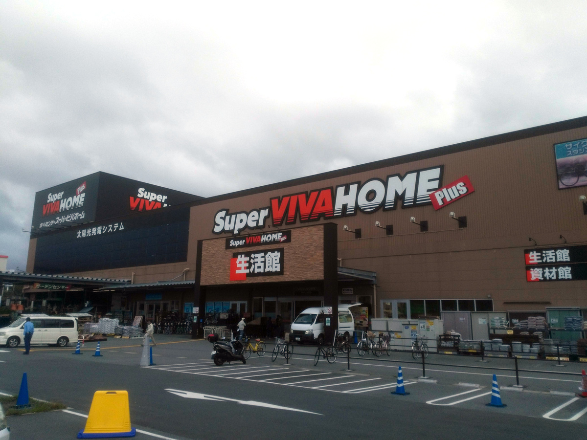
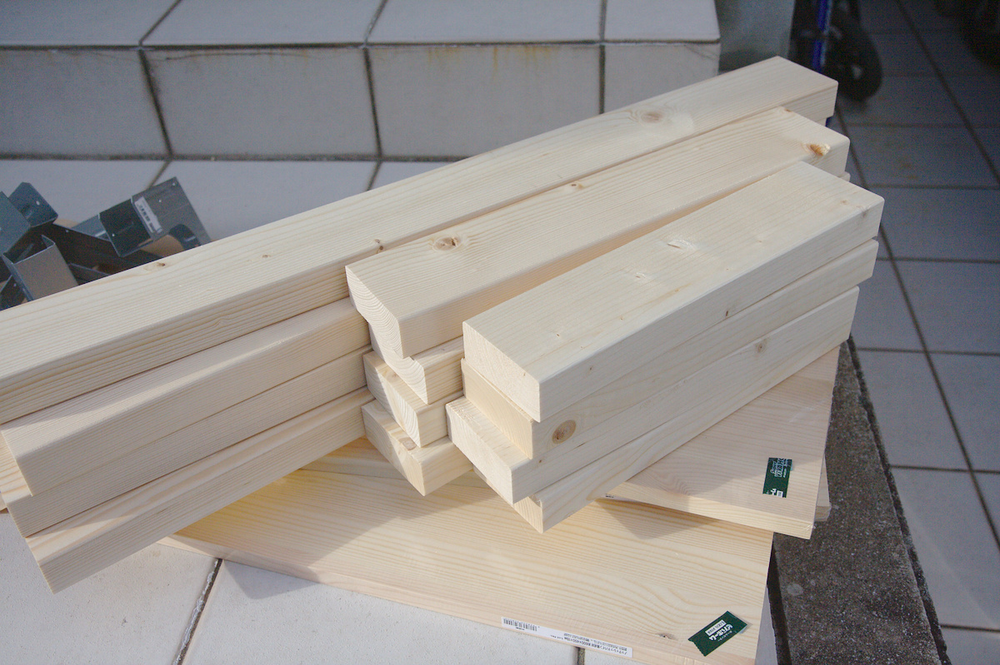
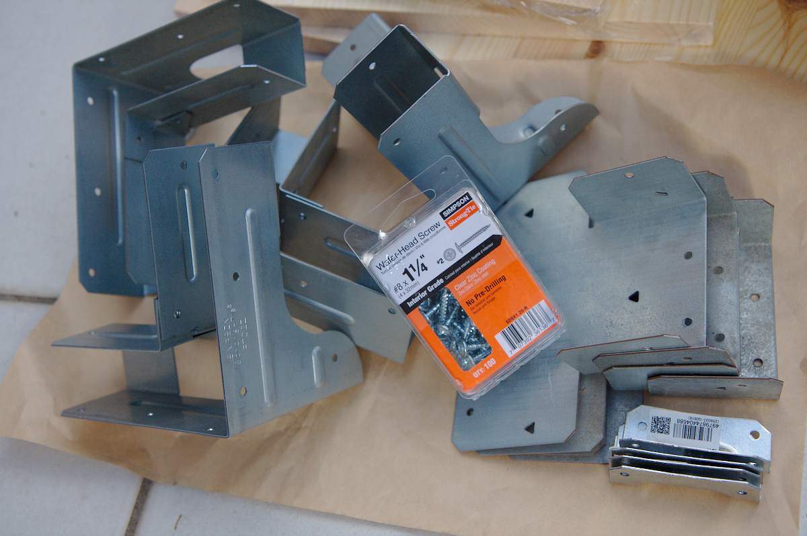
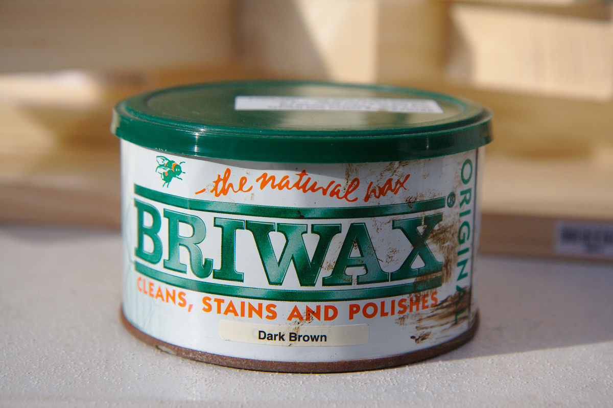
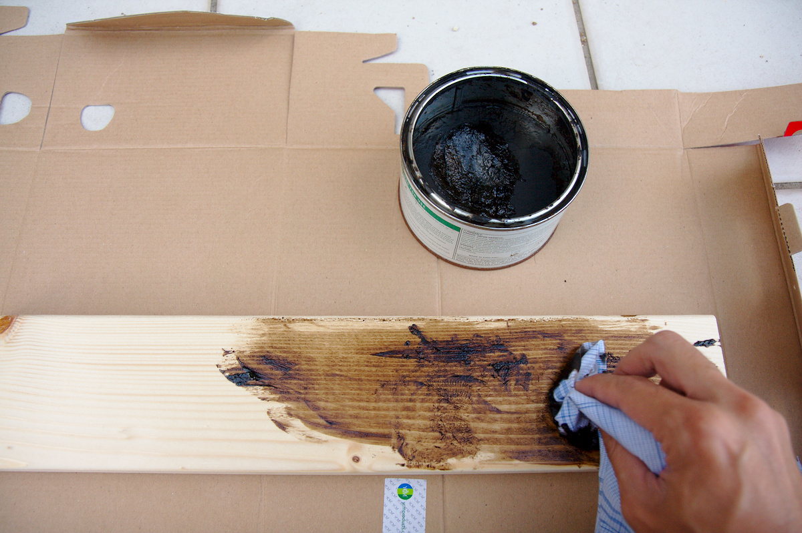
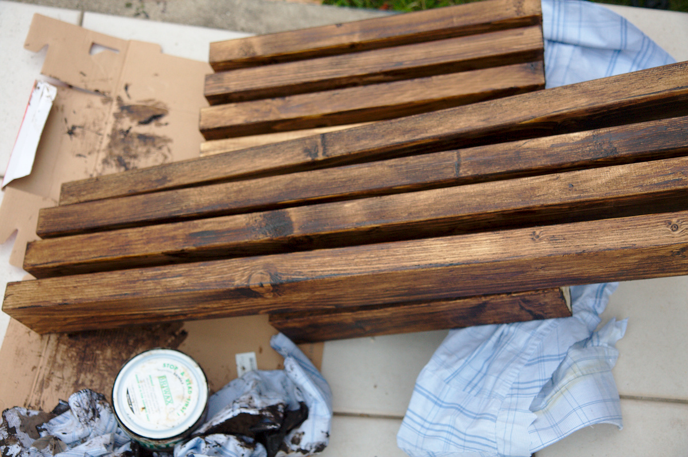

---
categories:
- DIY
date: "2025-02-15T23:42:29+09:00"
draft: false
images:
- images/IMG_4706.jpg
description: キッチンで使う作業台の制作過程を解説します。準備した木材をシンプソン金具を使い組み立てます。設計図をもとにホームセンターで材料を購入しました。
summary: キッチンで使う作業台の制作をDIYでチャレンジ。材料を揃えたのでやっと組立て開始です。CADを使って設計図ができたので材料を購入します。ホームセンターで天板、2X4、シンプソン金具を購入しBRIWAXを塗布してシックに仕上げました。
tags:
- キッチン作業台DIY
- 2x4
- BRIWAX
- ホームセンター
title: キッチン作業台DIY 2 - 材料購入とワックス塗布編
---

CADを使って設計図ができたので材料を購入します。ホームセンターで天板、2X4、シンプソン金具を購入しBRIWAXを塗布してシックに仕上げました。

## 購入した材料

2X4の材料はホームセンターでカットしてもらいました。8ftの材料3本から材料が取れました。

天板はなるべく厚くて1枚ものが良かったのですが、幅600mmは種類があまりなく、価格も高いし厚みが増すとさらに高額になるので妥協して幅300X長さ600mmの板を2枚つなげることにしました。

中間の板は幅450mmの1枚ものを選びました。長さ600mmはカット必要でしたが忘れてしまい後で自分でカットすることに。

全部で6,000円程度でした。

-   2X4 8ft - 3本

-   -   820, 820, 464 - 2本
    -   464, 464, 362, 362, 362, 362 - 1本

-   合板 300X600X18 - 2枚

-   合板 450X600X18 - 1枚

シンプソン金具はスーパービバホームに目当てのものが無かったのでロイヤルホームセンターへはしごして入手。

-   Rigid Tie RTC2Z - 4個
-   Post Cap AC4 - 4個
-   Gusset Angle GA1 - 4個
-   ねじ #8X1 1/4 - 1箱(100個入り)

中間フレームもリジッドタイで繋げる予定でしたが4個しか売ってなくポストキャップとアングルで繋げることにしました。

これで約6,000円。木材と同じくらいの価格になってしまいました。外観からは安かろうな品に見えるのですが、意外と高いです。さすがアメリカ。ねじはシンプソンじゃない安いものにすれば良かったかな。

## BRIWAXを塗布

家にあったBRIWAXのダークブラウンで2X4材を塗ることにしました。BRIWAXも買うと高いですね。在庫があってよかった。

ウェスにBRIWAXを付けてスリスリ擦り込んでいきます。手が真っ茶色になります。

全部塗るのは大変でした。天板はステンレスシートを貼るつもりなのでそのまま、中間板はどうしようか悩み中です。今日はこれでギブアップ。朝まで乾かして次は組み立てていきます。
