---
categories:
- DIY
date: "2025-02-15T23:42:29+09:00"
draft: false
images:
- images/IMG_4756.jpg
description: キッチンで使う作業台の制作過程を解説します。準備した木材をシンプソン金具を使い組み立てます。
summary: キッチンで使う作業台の制作をDIYでチャレンジ。材料を揃えたのでやっと組立て開始です。まずは脚と天板を載せるためのフレーム（枠組み）を2X4材をシンプソン金具で固定して組立てました。
tags:
- キッチン作業台DIY
- 2x4
- シンプソン金具
title: キッチン作業台DIY 3 - フレームの組立て
---

材料を揃えたのでやっと組立て開始です。まずは脚と天板を載せるためのフレーム（枠組み）を2X4材をシンプソン金具で固定して組立てました。

## 脚と天板取付け枠部分の組立て

写真のBRIWAXを塗布した茶色の2X4材をシンプソン金具で組立てていきます。

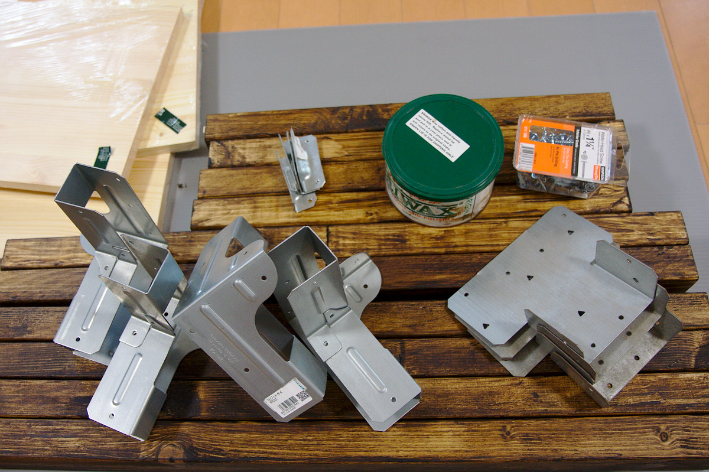

始めに床に天板を取り付ける枠となる4本の木材を置いて四隅に脚を立てた状態でシンプソン金具
リジットタイ RTC2Z に差し込み仮固定します。

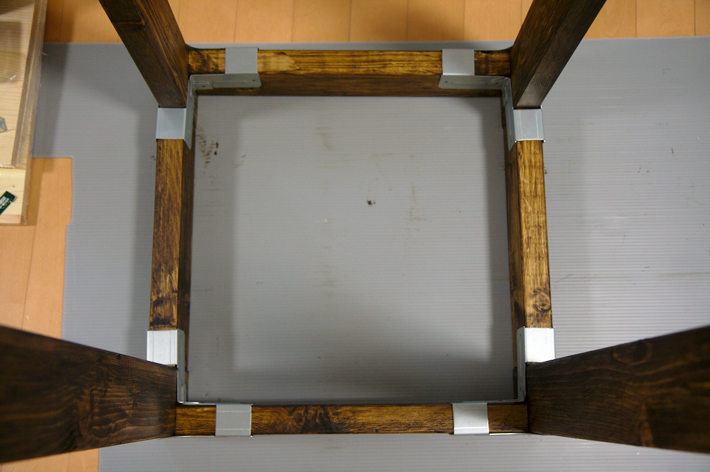

リジッドタイ固定部内側です。

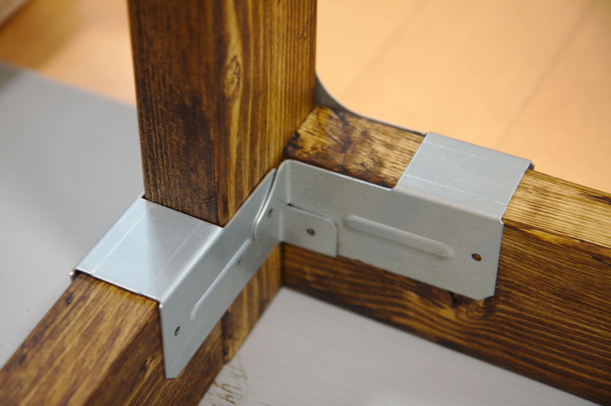

外側から見るとこんな感じです。

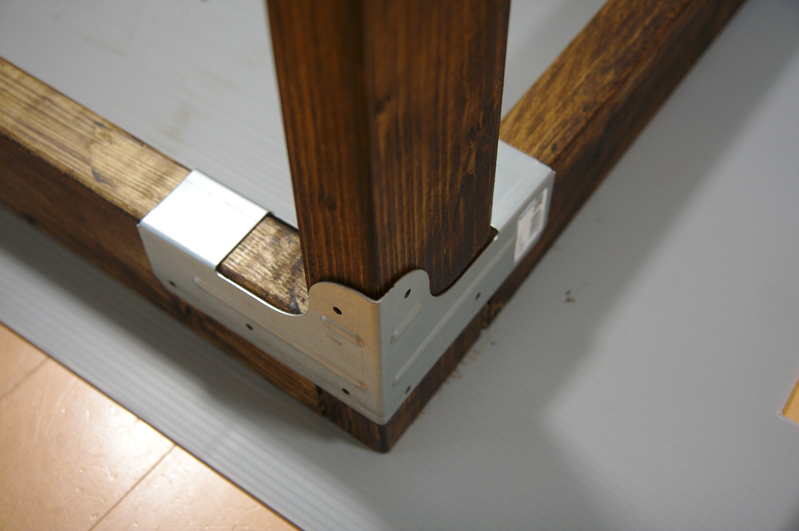

インパクトドライバでねじ止めしていきます。ねじの箱にWafer head
screwと書いてありますがなべ小ねじやトラス小ねじのような十字穴付きで大きめの丸い頭です。

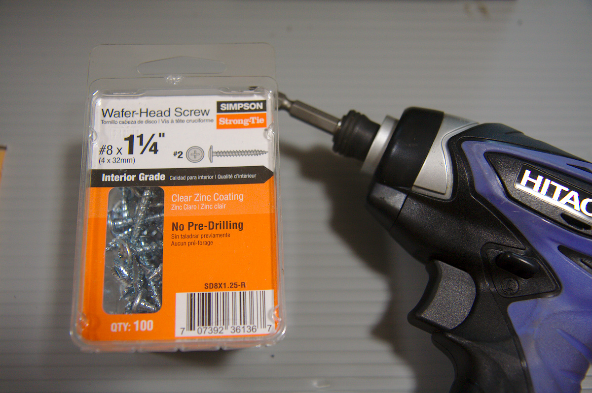

1本止めたところで金具のバーコードシールが気になって剥がそうとします。が、これが剥がれない！だいたいシールはアルコールで剥がれやすくなるのでアルコールで濡らして擦ってみますが全然剥がれません。途中で諦めこれもデザインのうちと開き直り進めます。

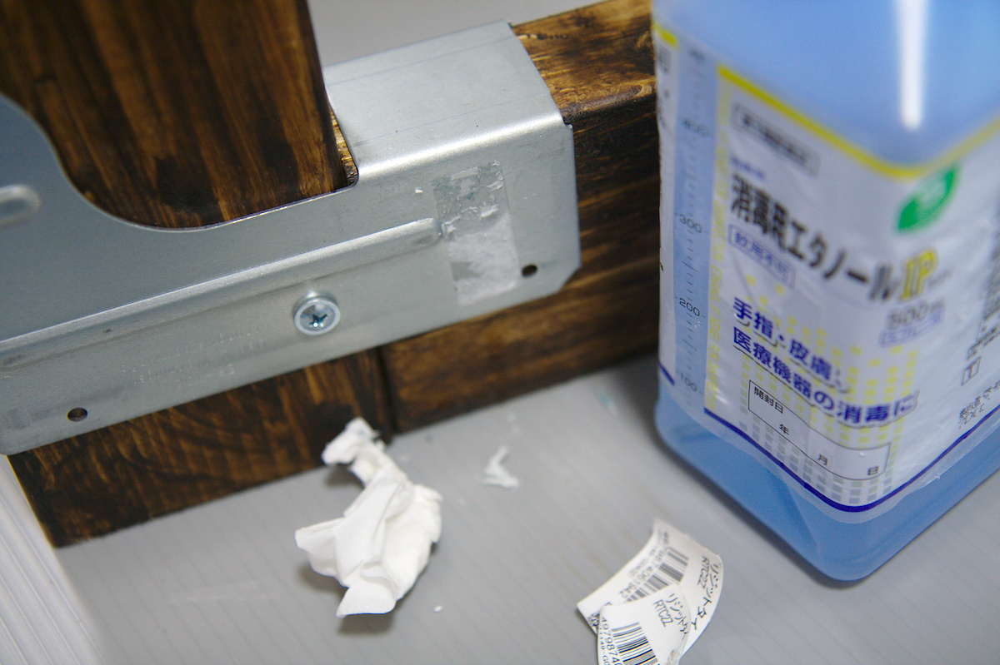

止めた後の内側です。角に近い2箇所はインパクトドライバが真っ直ぐに入れられず少し斜めにねじが入ってしまいます。

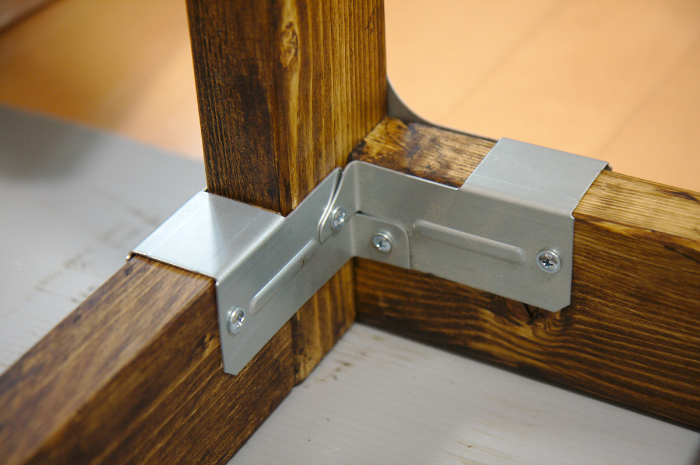

外側です。金具の穴とねじの外径にクリアランスが少ないので注意してセンターに止めていきます。

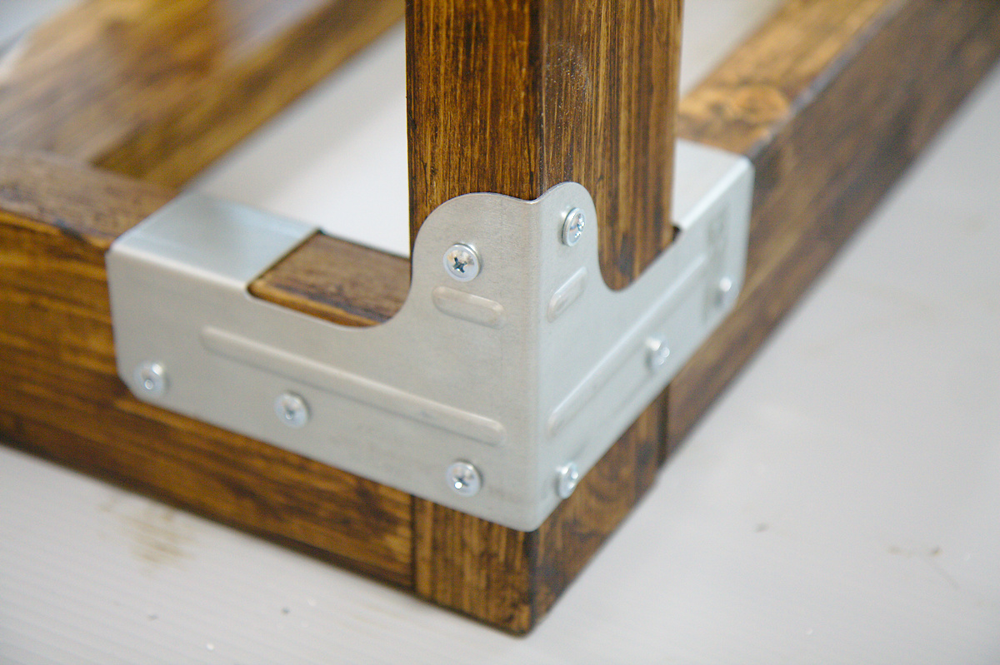

四隅とも固定できました。真ん中の梁は2枚の天板の繋ぎ兼補強で一度この位置でコーススレッドで止めたのですが縦横を間違えてしまったのと止める際に少し高さ方向にズレてしまい天板の平面がでなくなるため後で外し、天板同士を梁で先につないでからフレームに乗せました。

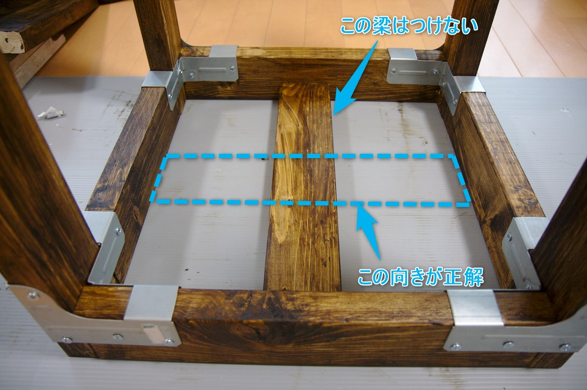

フレームを横に寝かせます。

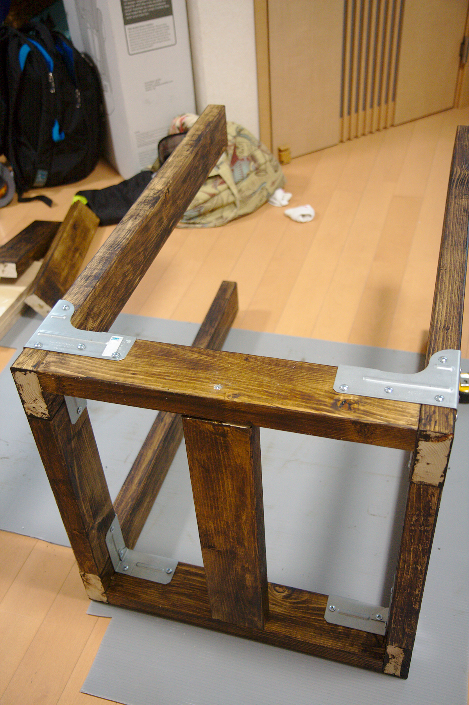

フレームを天板側から見たところです。先程書いた通り真ん中の梁は一度外しています。脚の端面はサボってBRIWAXを塗っていませんでしたがすぐにカビたりすると嫌なので後で塗りました。

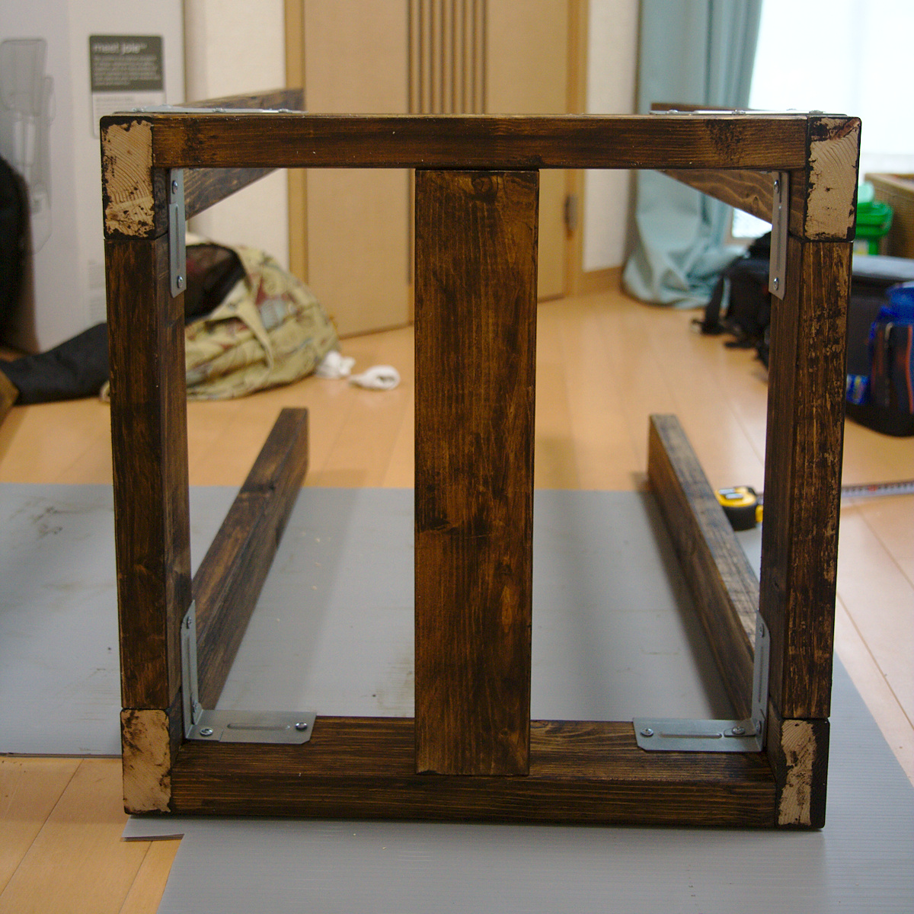

## 中板取り付け用の梁を固定

フレームを寝かせた状態で、フレーム両側面、脚の下端から400mmの位置に中間の梁をポストキャップAC4で固定します。

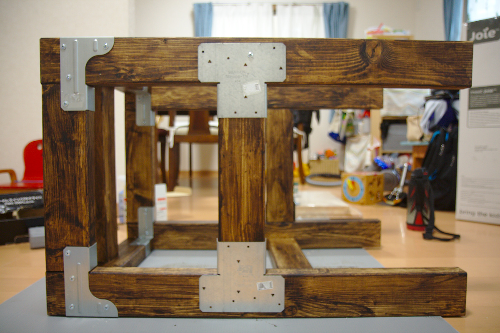

背面の梁はガセットアングルGA1で側面の梁と同じ高さになるよう脚へ固定します。

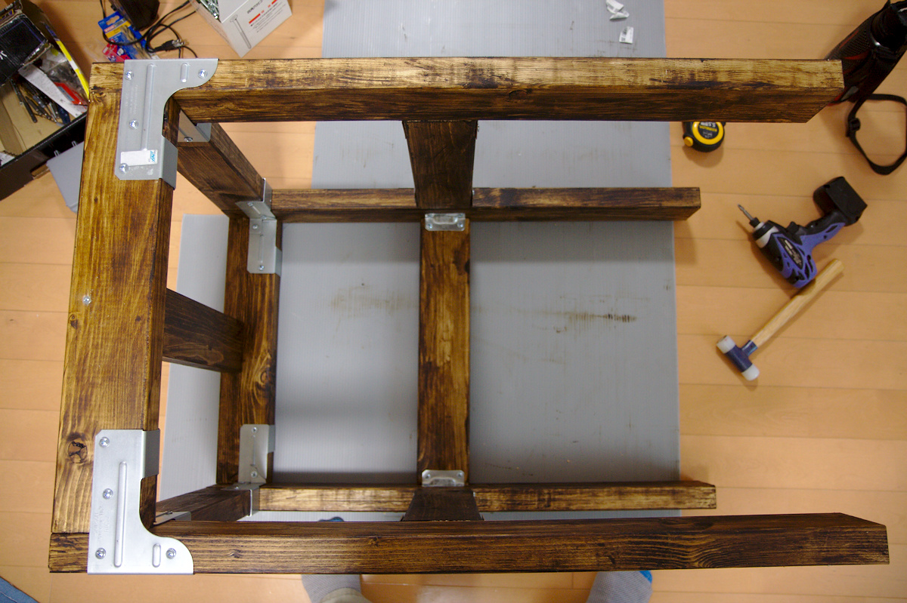

固定金具部分はこんな漢字になります。ガセットアングルがやや心もとない感じですが、他のリジットタイとポストキャップがごつすぎて強度的にはこれくらいでいいのではと思います。

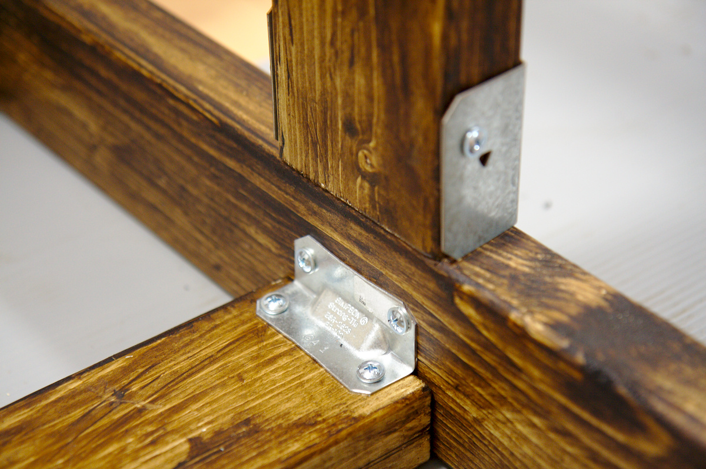

フレームの完成です。シンプソン金具が強い主張をしてなかなかいい感じです。キッチンでは違和感出しそうですが。。。

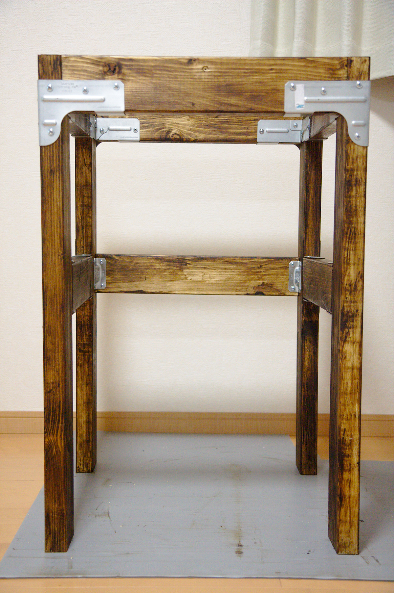

次は天板と中間板を乗せてテーブル完成です。
