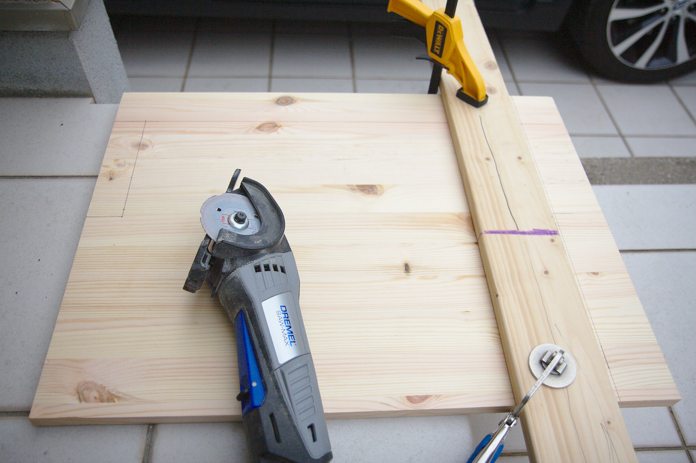
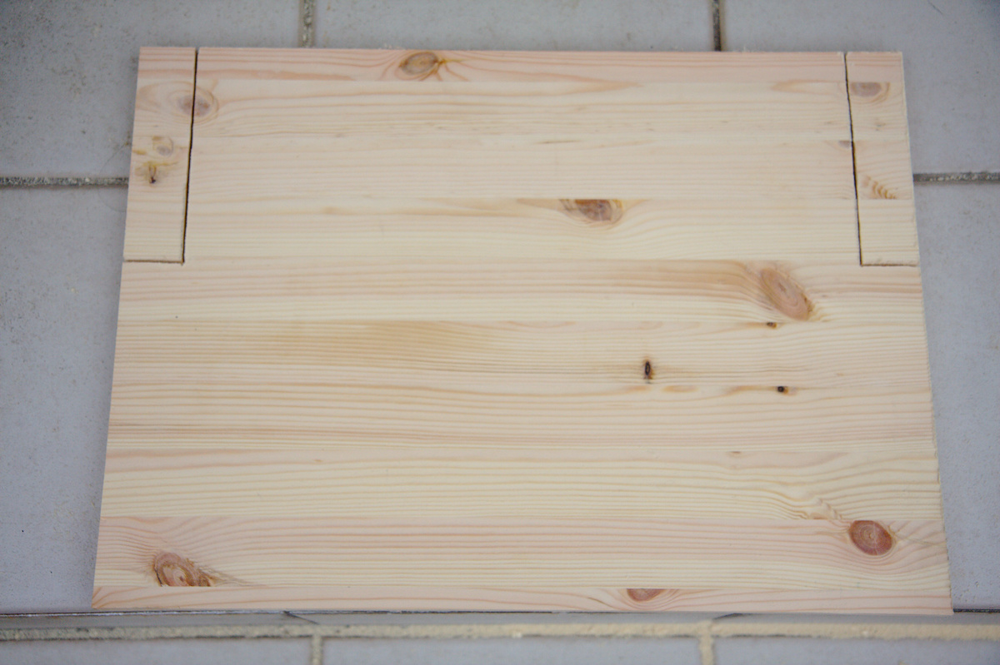

---
categories:
- DIY
date: "2025-02-15T23:42:31+09:00"
draft: false
images:
- images/01.jpg
description: キッチンで使う作業台の制作過程を解説します。中板をフレームに固定して完成です。
summary: 天板を取り付けたキッチン作業台ですが、思ったより苦労し時間がかかりましたが最後に中板を取り付けやっと完成しました。
tags:
- キッチン作業台DIY
title: キッチン作業台DIY 5 - 中板を取付けて完成
---

天板を取り付けたキッチン作業台ですが、思ったより苦労し時間がかかりましたが
最後に中板を取り付けやっと完成しました。

## 中板にカットする印をつける（ケガキ） {#中板にカットする印をつける（ケガキ）}

450X600mmの板をホームセンターでカットしてもらうのを忘れてしまったので、外形を詰めて
さらに脚とシンプソン金具を避けるようにカットする必要があります。そのへんにあった
アルミの棒を定規にして鉛筆で印を付けていきます。

こんな感じになりました。

## 中板をカットする

カットはDremelのSaw-Maxという丸ノコの小さい版みたいな電動工具を使用しました。
直線にカットするために1X4材を固定し定規として使います。

カットしました。定規の端面と実際にカットされる端面は工具のベースプレート分
オフセットされるので定規はオフセット分を考慮して固定する必要があります。

もう一方の端面もカットし、次は脚とシンプソン金具の逃げ部分のカットです。
カット部を途中で止める必要があるので丸ノコでは完全に切断できません。
全部手でのこぎりを引くのは大変なのでできるところまで丸ノコで切断しておきます。

残りは手で切ります。ピラニアソーといういかにも切れそうな名前ののこぎりを使いました。

カット完了です。

サンドペーパーでバリを取り、仕上げはBRIWAXのゴールデンオークという黄色っぽい
ワックスを塗布しました。

ワックスが乾いたらスリムビスで中板をフレームに固定します。

 

やっと完成です！

シンクと食器棚の間に設置後の写真です。かなり広々とした感じになりました。

## まとめ

思い立ってから1ヶ月程度かかりましたがなんとか完成できました！材料費はなんだかんだで約2万円近くなったのでDIYで安くなるかというとコスト的には微妙ですね。しかし自分で設計した寸法でキッチンにピッタリ配置できること、ステンレスシート貼りで水にも強く清潔なテーブルにできたのはとても満足です。中板にお鍋を置いて収納も増えました。

ステンレスシート貼りはかなり大変な作業だったので、やる場合には気合が必要です。

これでキッチンが広く使えるようになったので男の料理をガンガン作っていきたいと思います！
