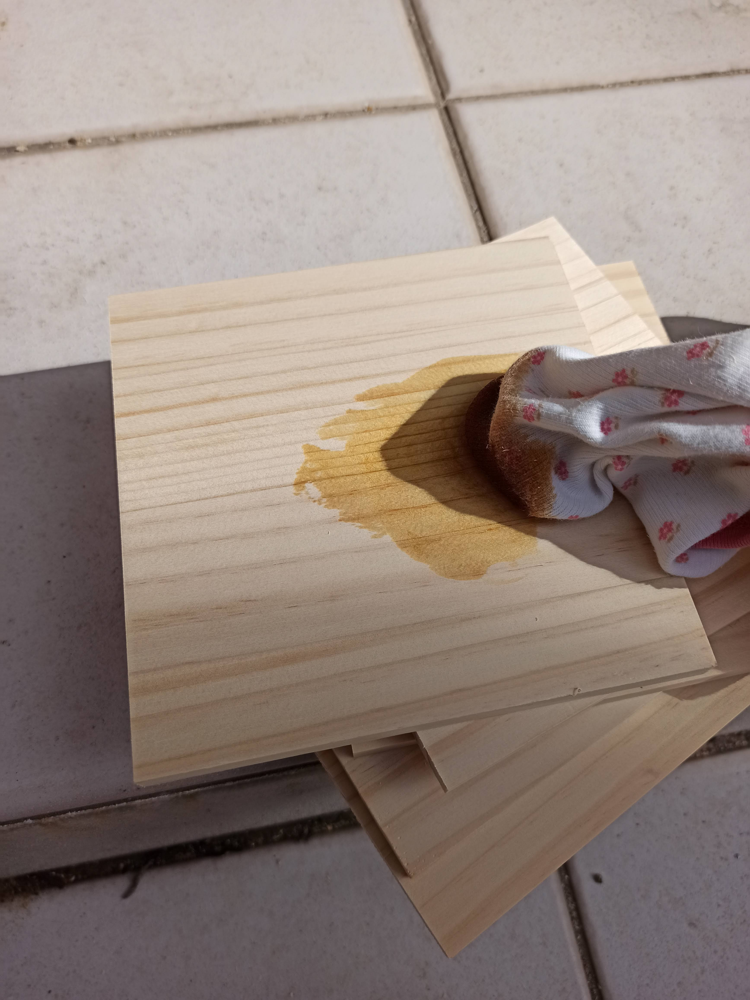
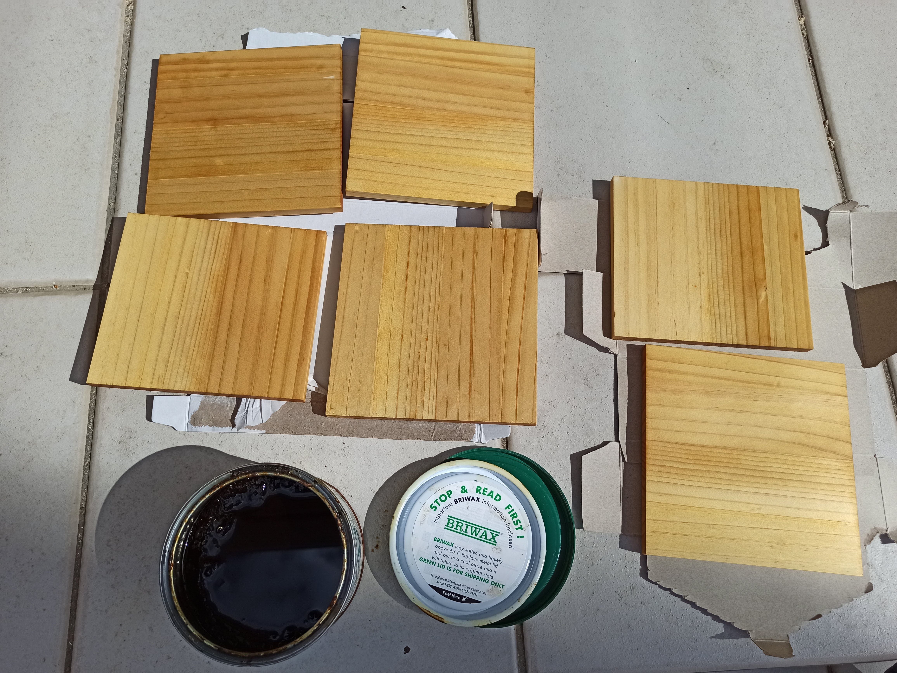

---
categories:
- アウトドア
- キャンプ
- CAD
date: "2025-02-15T23:42:51+09:00"
draft: false
images: 
- images/lanthern.jpg
summary: レトロな見た目が素晴らしいキャンプ用ランタン、Petromax HK500のガラスホヤが割れてしまいました。割れ防止にとDIYでガラスホヤの入れ物を作りました。
tags:
- ランタン
- キャンプグッズ
- OnShape
title: Petromax HK500 ランタン ガラスホヤを入れる箱をDIYで製作
---

キャンプのランタンはPetromax
HK500を使っています。灯油のランタンで扱いが面倒だしでかいし値段も高いのですが見た目最高で雰囲気抜群です。
そんなPetromax
HK500のガラスホヤが割れてしまったのでまた割れないように入れ物をDIYで作りました。

## ガラスホヤが割れてしまった

このランタンは専用ケースが別売りであるのですが、ソフトケースで値段も高いので裸のまま車のトランクに立てた状態で運んでいました。この前キャンプから帰った際にガラスホヤが割れているのに気づきました。

車の振動によるものか他の荷物がガラスに当たったのかわかりませんがショックです。楽天で新しいガラスホヤを購入しましたが、また同じことが起こりそうなのでガラスホヤケースを作ってみることにしました。

## ガラスホヤケースの設計

届いたガラスホヤは直径111mm、高さ約115mmでした。板で箱を作り、中にスポンジを貼ることにします。板を切るのは大変なので、ホームセンターに売っている幅150mm
X
厚み9mmの板を長さ方向に切るだけにして150mmをそのまま使うことにします。スポンジは厚み10mmとします。

3D CAD OnShape
で図面を描きました。フタは蝶番や取っては設けず、ただ板をかぶせるだけです。スポンジの抵抗でしっくりはまってくれるのではと思い、シンプルに。

[On Shape
図面へのリンク](https://cad.onshape.com/documents/8e301e7b6f7f484be1c783ac/w/cf59398cec014ba47f6ad914/e/9cc32d479eb6a30b8291e73e)

## 材料の購入

ホームセンターで以下を購入

-   パイン集成材 150mm X 910mm X 9mm
-   黒セルスポンジ（天然ゴム） 500mm X 500mm X 10mm

## 作っていきます

まずパイン集成材をスライド丸のこで切っていきます。DIYを始めて木を真っ直ぐ平らに切るのが難しいことを実感し、スライド丸のこが一番きれいに切れるということで買ってみたもののその巨大さと重さで3年に一度くらいしか使わない逸品です。

ケガキに刃を当てて合わせます。刃幅が太いので刃の片側にケガキを合わせています。

一気に切断。スライド丸鋸を箱から出してセットするまでがとても大変ですが切るのは一瞬です。でも毎回これだけの大きさの刃が回るのは怖いです。

一通り切り終わりました。

切ったパイン集成材にBriwaxを塗ります。Golden Oakです。

真夏で完全に液体化していました。ワックスというよりオイルみたいです。

サラサラの液体を布に染み込ませて塗っていきます。

全部塗り終わりました。黄色っぽくなっています。

次にスポンジを切ります。定規に沿ってカッターで切っていきます。

切り終わりました。

Briwaxが乾いたら木をボンドでくっつけます。釘も打とうかと思っていましたが夜になってしまったので接着だけにしました。

朝までクランプで固定しておきます。

木が接着できたらボンドでスポンジを内側に貼ります。

全部貼って乾いたら完成です。

内側のスペースは112mm X
130mmでガラスホヤを入れると長手方向に隙間ができます。せっかくなのでスポンジで仕切りを作り、付属ツールの収納部分を設けました。定期メンテで増し締めや清掃をするためのツールですが一度も袋から出したことありません。。。

いい感じで収納できます。

フタを締めたら完成です。パイン集積版にBriwaxを塗って炎天下で乾かしたからなのか、もともとなのか木が反っていてうまく継ぎ目がフラットになりませんでした。まあ機能的には問題ないので良しとします。

これで割れずに運べるようになったと思います。味気ないただの箱に見えるのでPetromaxのロゴでも入れようかと思案中です。ランタン本体のケースも作りたいですね。

