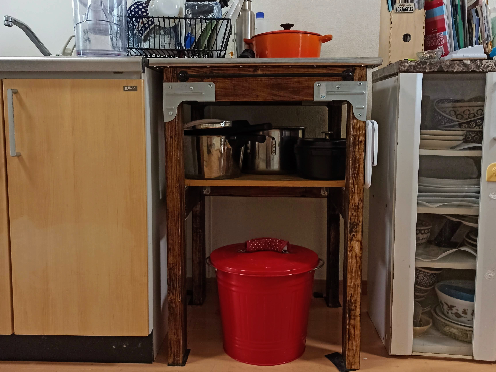

---
categories:
- DIY
date: "2025-02-15T23:42:50+09:00"
draft: false
image: images/IMG_20200807_130153.jpg
summary: おしゃれなゴミ箱、IKEAのKNODD。かわいらしい外観ですがそこそこ大きく移動が不便なのでホームセンターで車輪を買ってDIYで付けてみました。
tags:
- IKEA
- ゴミ箱
title: IKEAのゴミ箱KNODDに車輪を付ける
---

キッチンのゴミ箱にIKEAのKNODDというスチール缶のゴミ箱を使っています。色、デザインが可愛らしいですが場所をとるため台の下に収納しています。使うときに引き出すのですが、床を摺るしやりにくいのでホームセンターで車輪を買ってきて付けてみました。

裏返します。底面はリング状に凹凸があります。スペーサーを噛まして凹凸を避けたほうが良いのでしょうが、もう車輪を買ってきてしまったのでそのまま取り付けます。

車輪を当てて穴位置をマジックで印を付けてドリルで穴あけです。

こんな感じで車輪を付けていきます。車輪はホームセンターのΦ25mmで床に傷の着きにくいゴム車輪のもの。ボルトはM4×10と裏側はM4ナット、ワッシャーを使用しています。2個が自在輪で2個が固定輪です。

全部付けました。自在輪は穴4つ、固定輪は穴2つで合計12個ボルトが必要でしたが間違えて8個しか買っていなかったので自在輪も2個止めです。

キッチンに置いたところです。

これでゴミ箱の移動がらくらくになりました。ただ、丸いゴミ箱なのでどちらが自在輪かわからないので意図しない方向に移動しそうになったりするので全部自在輪か、全部固定輪で前後だけ移動できるようにする方が良かったかなと思います。普通の台車とか、車とかもそうですが2個の車輪が回転し残り2個の車輪は固定なのがセオリーですが前後がはっきりしているのが前提ですね。

