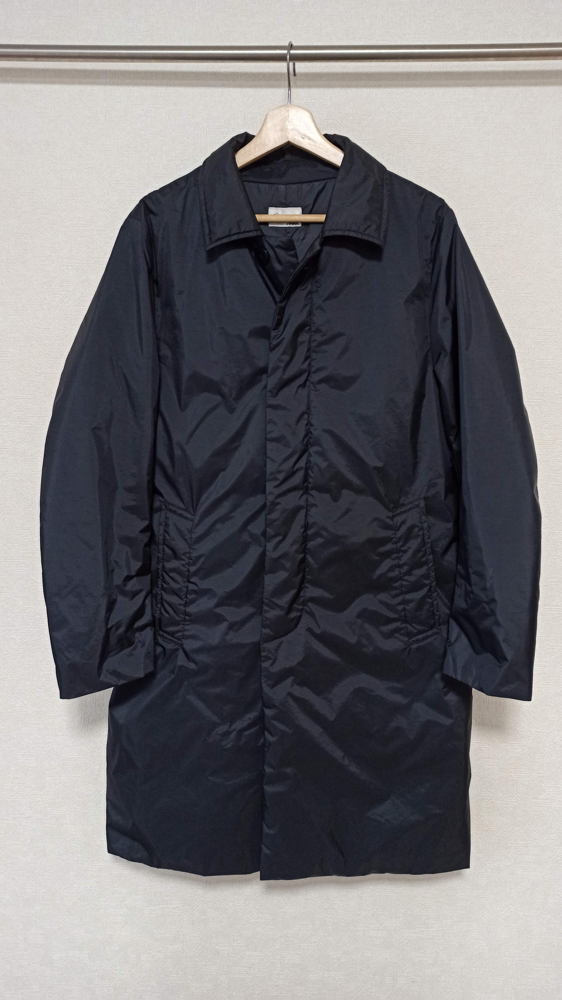
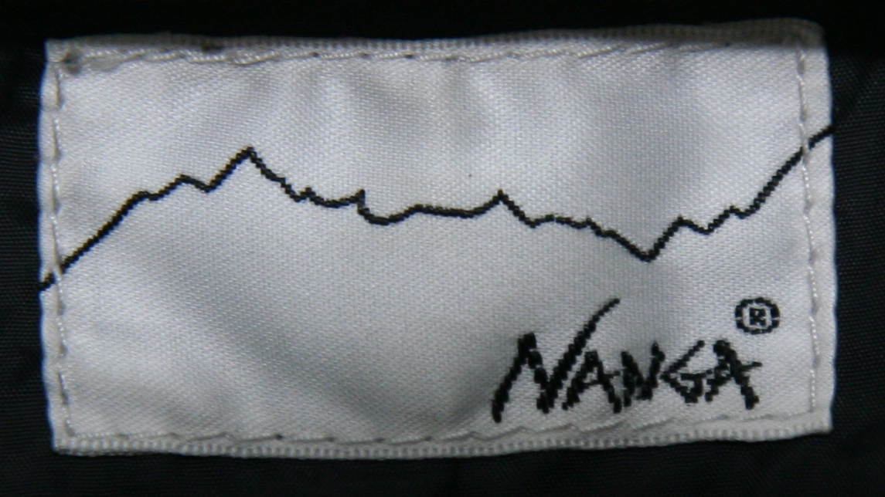
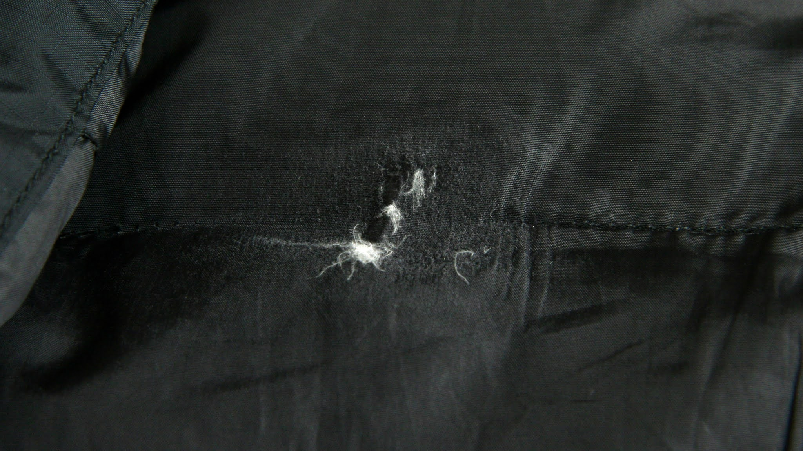
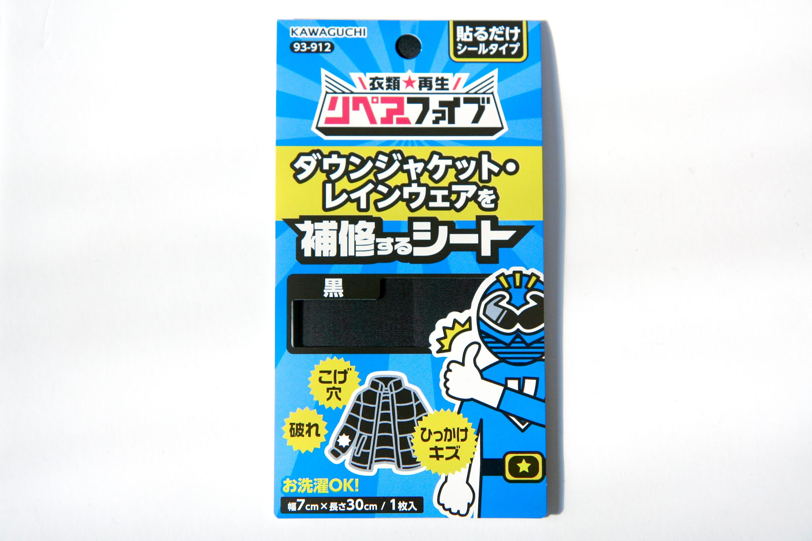
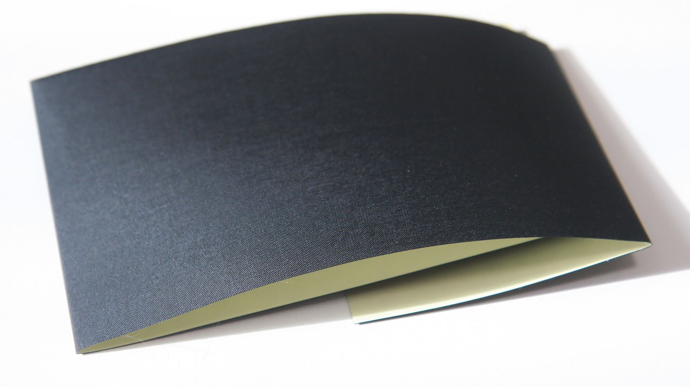
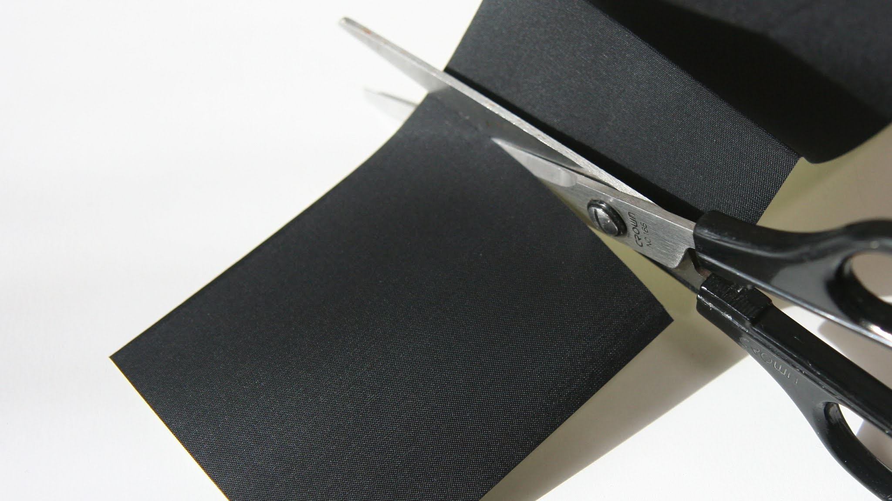
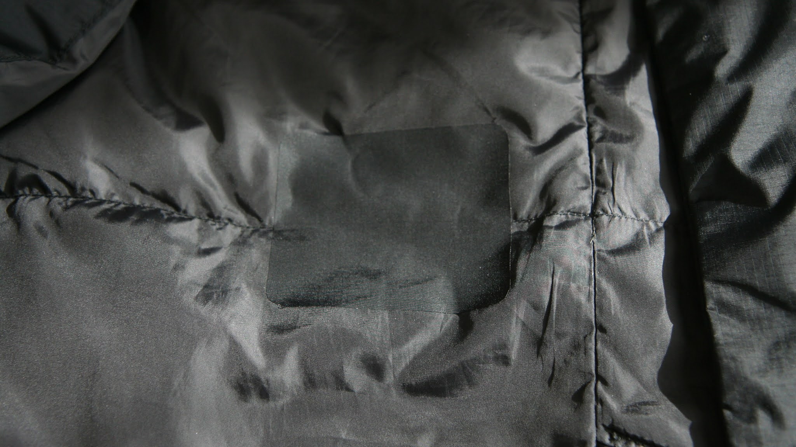
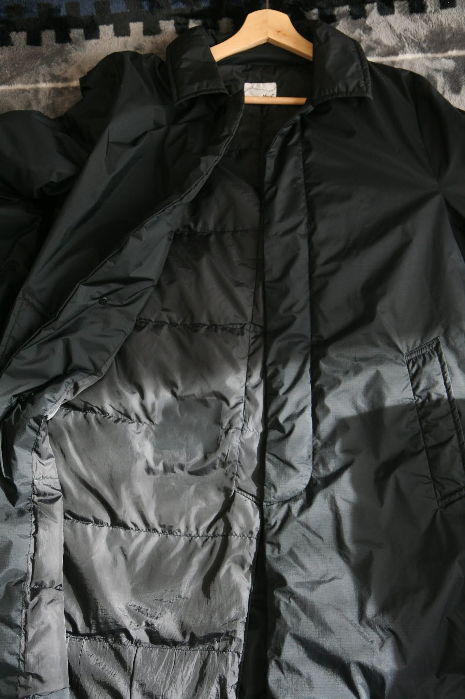

---
categories:
- DIY
date: "2025-02-15T23:43:04+09:00"
draft: false
images:
- images/og.jpg
description: ダウンの生地の破れを補修するリペアシートを使ったダウンコートを補修方法を解説します。
summary: ダウンコートの内側の腰あたりに生地の破れがあり、ダウンが飛び出してきていました。ダウン用の破れ補修シートを購入し、DIYで修理してみました。
tags:
- ダウンコート破れ補修
title: ダウンコートの破れをリペアシートで修理
js: js/paad.ts
---

寒い冬のアウターはダウンがやはり一番暖かいです。通勤で早朝に家を出るときが一番寒いのですが、普通のもこもこダウンは通勤ではちょっと違和感があるのでナンガのダウン入りステンカラーコートを愛用しています。

ナンガはもともと登山用シュラフ（寝袋）のメーカーだけあってダウン製品の品質は素晴らしいです。

## ダウンコートの生地が破れた

使いはじめて3シーズン目、ふと見ると内側の腰あたりに生地の破れがあり中のダウンが出てきていました。

リュックを背負っているのでリュックで押されながらベルトと擦られたのが原因のようです。外側は全く傷んでいないのでこのまま捨てるのももったいないので補修できないか調べてみました。

## ダウンの破れ補修方法

ネットで調べた限り、やり方は何種類かありそうです。

1.  あて布（リペアシート）を買って破れた部分に貼り付ける
2.  服の一部から生地を取り破れた部分に貼り付ける
3.  上の2つの方法のうちいずれかで、ブロックごと生地を縫い付ける
4.  破れた部分を縫い付ける

このうちDIYでやれそうなのは1.
の方法くらいでしょうか。ちなみにお店に頼むと1〜4いずれかの方法で数千円
〜1万円台くらいが相場のようです。

## 補修用の生地

補修用の生地はシールのようにぺたっと貼るだけのものがいろいろ売られています。
ダウン用と謳われたものでカワグチのリペアーファイブというものを買ってみました。
お値段たったの300円程度です。

選定基準は色、材質がもとの生地と合うか、接着の耐久性あたりですが色は黒かつ
内側なので少し目立っても問題なし、材質、接着の耐久性はどれも大差なさそうで
使ってみなければわからないです。

最終的な決めてはそのパッケージ、○○レンジャーの絵が頼もしくダウンの穴を塞いで
くれそうな雰囲気が伝わります。

## リペアシートの貼付け

リペアーファイブを袋から出してみます。裏側はシールみたいになっています。

ハサミでちょきちょきカットします。

ぺたっと貼りました。

継ぎ目は、、、まあ余裕で分かりますね。

遠くからみると、まあそれほど目立たないです。まあ、分かりますが。

## まとめ

ダウンの破れをDIYで補修する場合、選択肢は基本的にリペアシートを貼る
くらいになります。

補修箇所は、まあ容易にシート貼ったなと分かるレベルです。

シート自体は数百円と安く、特に技術も要らないです。専門業者に頼むと
数千円〜数万円かかるので自分でやると激安です。その代わり得られるものは
安かろうの品質ですが。

というわけで、目立たない場所か外観を気にしないので穴を塞げれば良いのであれば
リペアシートによる補修もありかと思います。


