---
categories:
  - DIY
date: "2025-02-15T23:43:53+09:00"
description: 綿100%の帽子が色落ちしてきたので捨てようかどうしようか迷っていたところ、アマゾンで見つけたDYLONという染料で染めて復活できないか試してみました。やり方と結果をレポートします。
draft: false
images:
  - images/00_dylon.jpg
summary: 綿100%の帽子が色落ちしてきたので捨てようかどうしようか迷っていたところ、アマゾンで見つけたDYLONという染料で染めて復活できないか試してみました。
tags:
  - 帽子
  - 色あせ復活
  - 染料
title: 色落ちした帽子を染めるー家庭用染料DYLONー
---

綿100%の帽子が色落ちしてきたので捨てようかどうしようか迷っていたところ、アマゾンで見つけた染料で染めて復活できないか試してみました。

## 帽子の色落ち

BILLA
BONGのハットです。夏の海や川、プールなどでの紫外線対策で使っています。塩水に浸かったり過酷な紫外線を浴びているためか脳天とつばの部分が白っぽく色落ちしてきました。

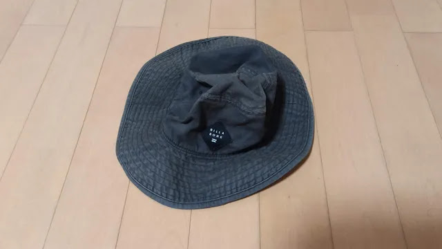

綿100%なのでジーンズみたいにビンテージ感が出れば良いのですが、脳天がハゲたような色落ちをしており残念な感じになってしまっています。

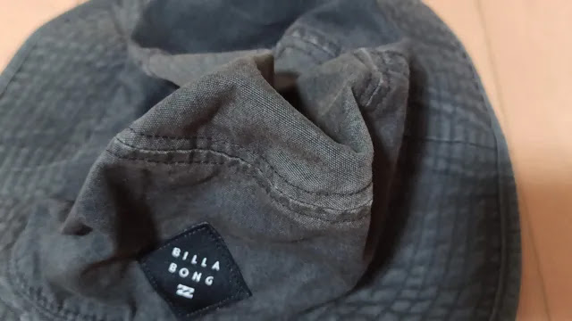

## 家庭用染料DYLON（ダイロン）

捨てる前に、ふと自分で染め直すことができないか、と思いアマゾンを調べると、家庭用染料DYLON（ダイロン）というものを発見しました。500円ちょっとと安いので失敗してもいいかと思い買ってみることに。届いたものは粉薬程度の小さな袋1つだけ。

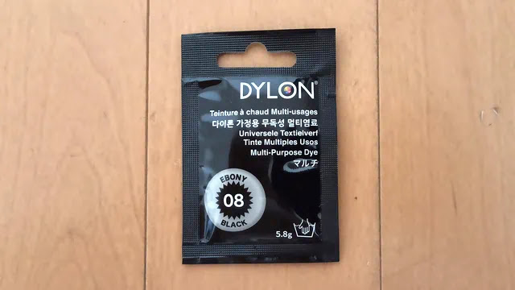

DYLONは1946年にロンドンで創業した家庭用染料メーカーだそうです。裏面に染料は英国製、パックは台湾と記載があります。

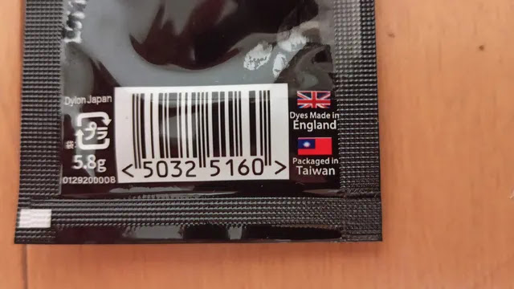

小さな紙に使い方が記載されています。これに従って染めるのですが、注意点として80℃の熱湯6.5Lが必要でやけどしないよう熱湯の取り扱い注意です。この袋1つでTシャツ2枚分だそうです。

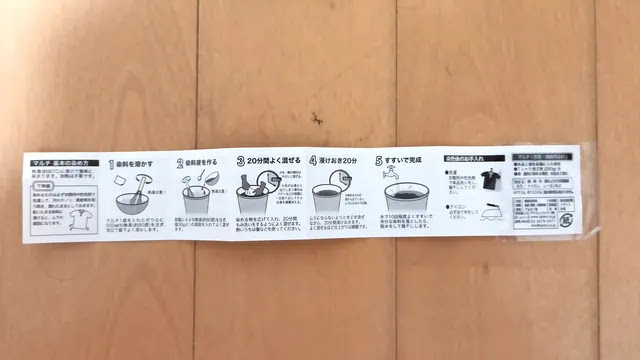

## 用意するもの

1.  DYLON染料 1パック
2.  塩30g
3.  ボウル(500mLで染料を溶かす)
4.  熱湯に耐えられるバケツ(6.5Lで衣類を染める)
5.  泡立て器
6.  ゴム手袋、割り箸

今回は2.のボウルは使わずいきなりバケツで染料を溶かしました。泡立て器は100円ショップで買って使い捨てです。金属は染まらないので良く洗えば大丈夫かもしれませんが、洗った後料理に使う気にならなかったので、、、

## 染めていきます

まず6.5Lのお湯を準備する必要があります。大きな鍋に水を入れてお湯を沸かします。水の量は、感覚です。こんなもんかな？？

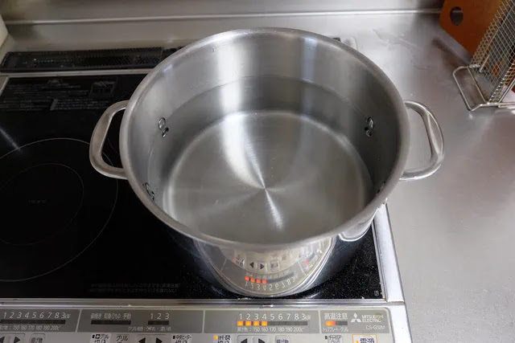

お湯を沸かしている間に塩を計量します。塩30gの感覚が全くわからなかったのできちんと秤を使いました。多いですね！

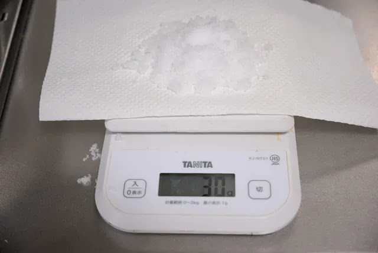

バケツは熱湯を注ぐので材質に注意です。車の洗車に使っているものがポリプロピレン製で底面に耐熱温度120℃と記載があったのでこれを利用します。バケツにDYLONの粉を入れておきます。

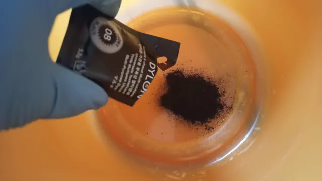

お湯が沸いたら熱湯をだいたい500ml注ぎます。6.5Lの熱湯が入った鍋を持ったまま滑って転んだりしたら大惨事です。慎重に持ち運び注ぎましょう。

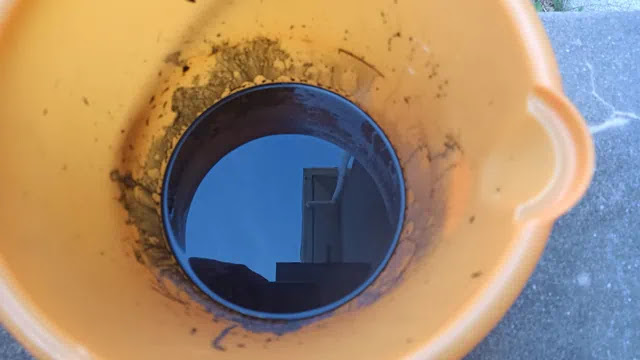

泡立て器で混ぜます。おどろおどろしい真っ黒な液から便所のような強烈な異臭が放たれています。すごい臭いです、外でやってよかった。

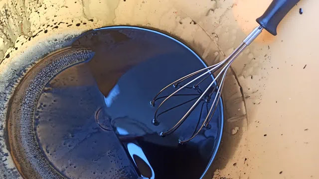

さらに6Lのお湯を注ぎます。このあとすぐに塩を入れて混ぜて衣類を入れて染めていくのですが、強烈な臭いで記憶が飛んでしまったのか、何を間違えたか6Lのお湯を注いで塩を入れる前に20分かき混ぜ続けてしまいます。

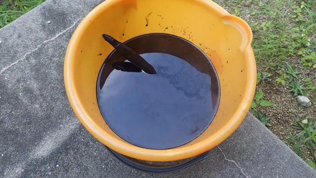

手順書を読んで間違えに気づき、お湯がだいぶ冷めてしまいましたが塩を投入します。

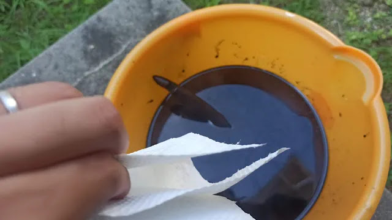

そして帽子を入れます。

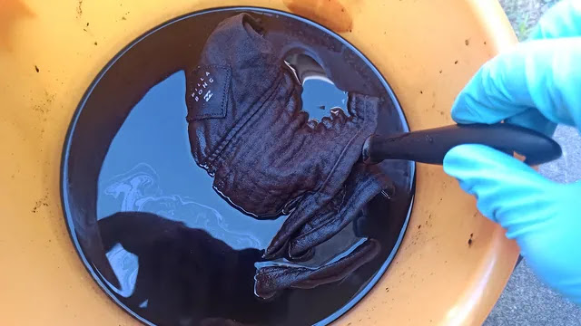

ゴム手袋をして泡立て器や割り箸で20分ほど帽子をかき混ぜ続けます。お湯は冷めてきているので手を突っ込んでもよかったのですが、この黒い液に躊躇し泡立て器と割り箸でがんばります。

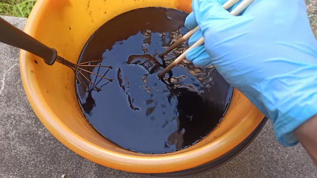

さらに浸け置き20分したら水道水で10回よくすすぎます。

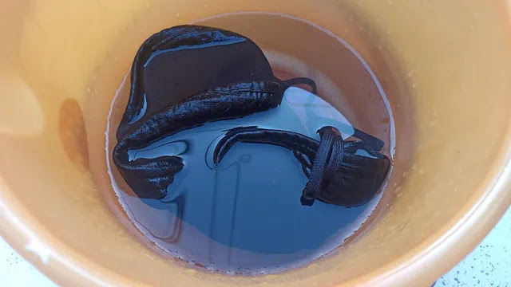

あとは乾かして完了です！

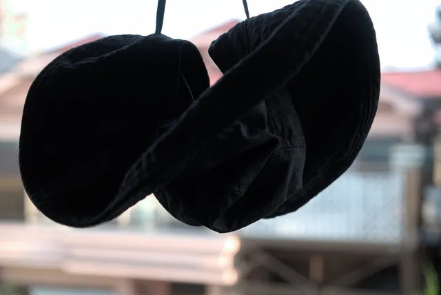

## 黒色が復活

乾いた帽子です。かなりいい感じに真っ黒に染まっています。ムラもなさそうです。

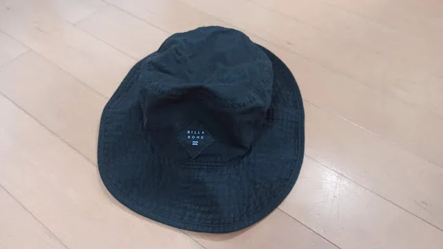

BILLA
BONGのロゴは真っ白でしたが、何故かあまり染まらず、白さを残しています。カメラの加減で下の写真だと真っ白に見えますが実際は少し黒く染まっています。繊維の種類なのか、手順を間違えてお湯の温度が下がってしまったからなのか分かりません。

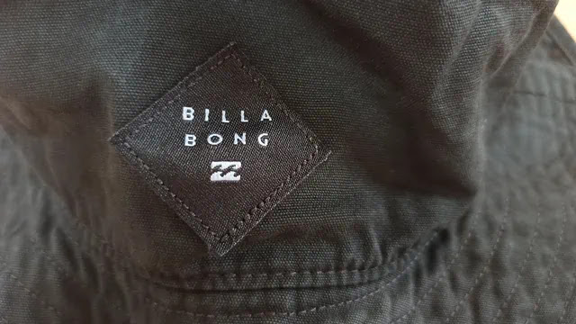

帽子裏側のタグです。これも真っ白でしたがそれなりに中途半端に黒く染まっていますね。

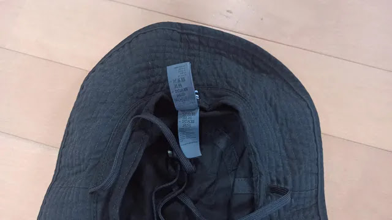

耐久性が気になりますが、かなり満足いく結果でした！

## まとめ

家庭用染料DYLONを使うと色あせた衣類を染め直すことができます。染料は安いしお手軽といえますが、一番の注意点は6.5Lもの熱湯が必要で、とにかく熱湯を運ぶ際に転ぶ、こぼすなどしないよう十分に注意する必要があります。筆者の家はコンロからすぐドアを開けて外に出れるのでそこで行いましたが、コンロでお湯を沸かすとしたらせいぜい数歩で慎重に持って移動しましょう。風呂場や玄関まで行く、とかは絶対やめたほうが良いです。
