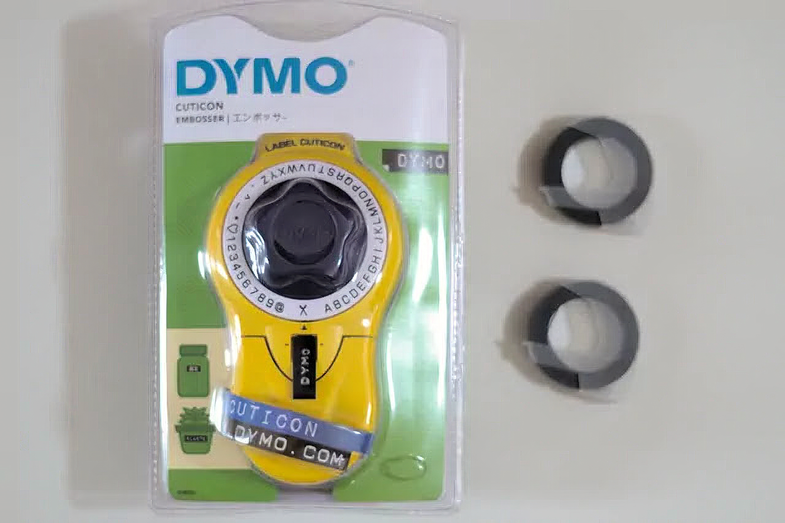
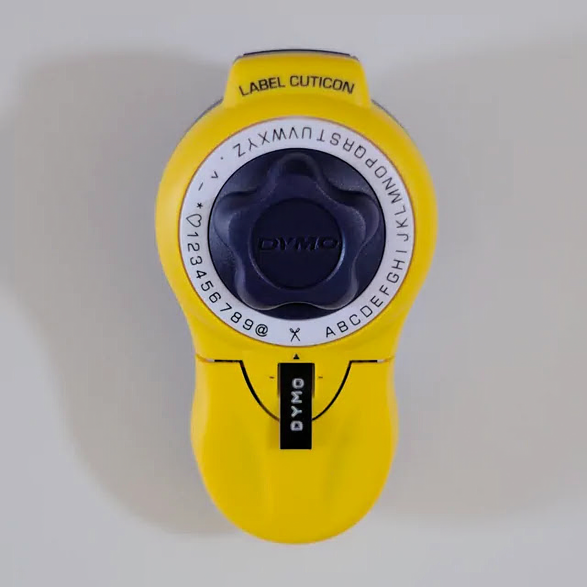
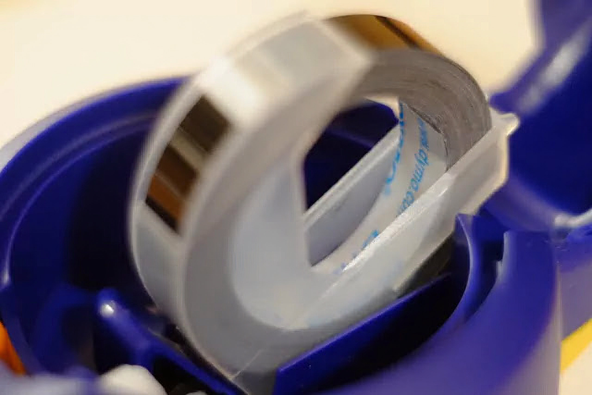
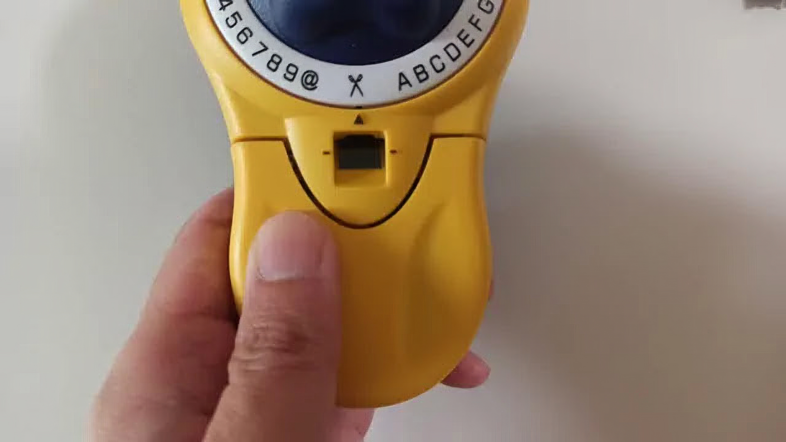
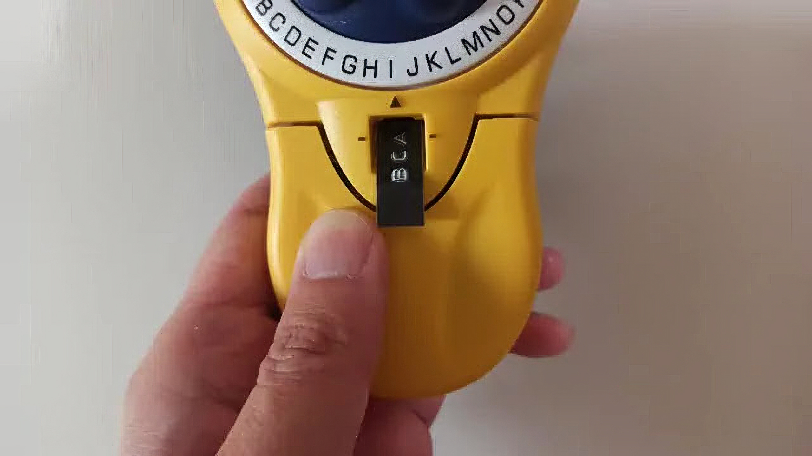
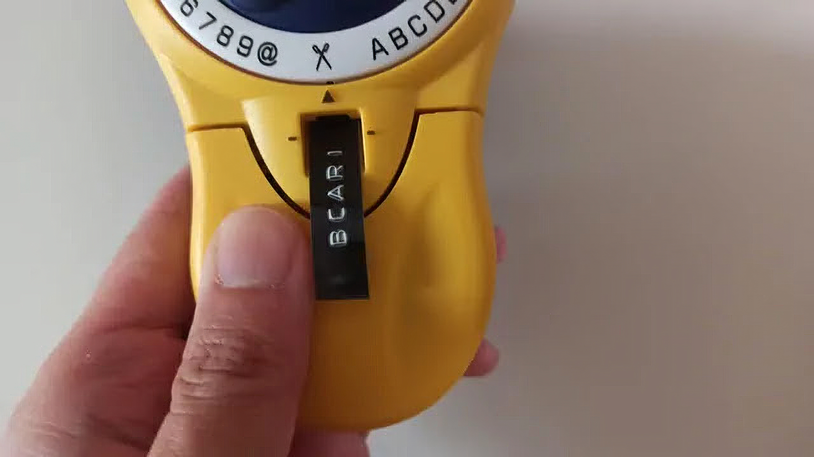
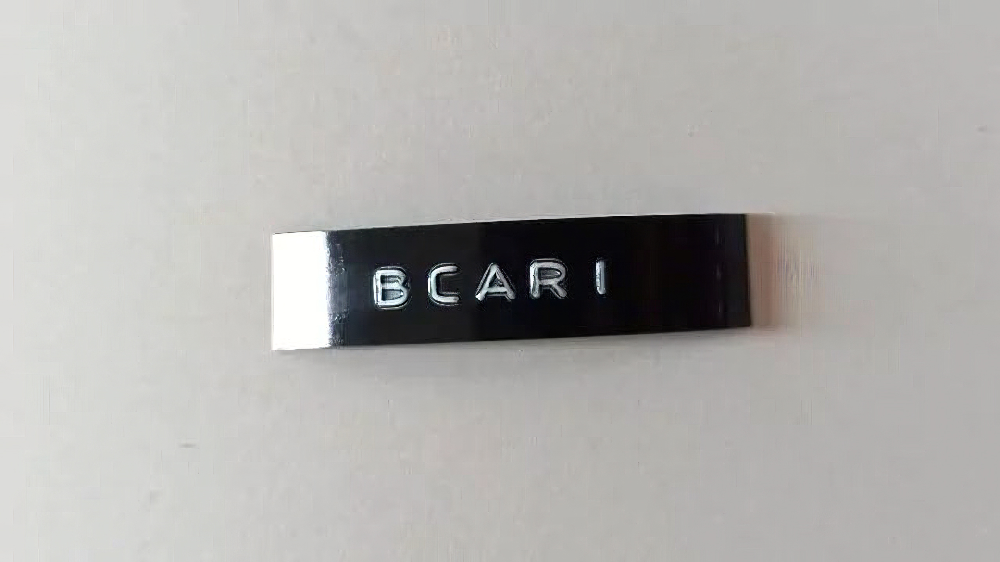
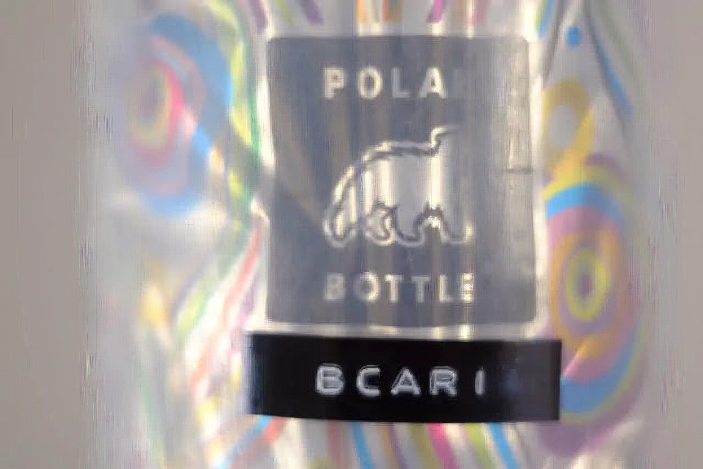

---
categories:
  - 雑記
date: "2025-02-15T23:43:42+09:00"
description: 無性にラベルを作りたくなることはありませんか？ラベル制作は、テプラなどが有名ですが固くて厚みのあるプラスチックテープにパンチで凸状に文字を打つことでレトロなラベルを作れるDYMOをレビューします。
draft: false
images:
  - images/F5906.jpg
summary: 無性にラベルを作りたくなることはありませんか？ラベル制作は、テプラなどが有名ですが固くて厚みのあるプラスチックテープにパンチで凸状に文字を打つことでレトロなラベルを作るDYMO。昔家にあったなぁと懐かしくなり買ってしまいました。
tags:
  - 文房具
  - ラベル
title: レトロなエンボスラベル DYMO を買ってみた
---

無性にラベルを作りたくなることはありませんか？ラベル制作は、テプラなどが有名ですが固くて厚みのあるプラスチックテープにパンチで凸状に文字を打つことでレトロなラベルを作るDYMO。昔家にあったなぁと懐かしくなり買ってしまいました。

## DYMOとは

DYMOとは、上でも書きましたが固くて厚みのあるプラスチックテープにパンチで凸状に文字を打つことでレトロなラベルを作るラベルライターです。

印字方法は、凹凸のついた文字盤をテープに押し付けパチンとパンチする方式です。電池も不要な機械式です。印字できる文字は英数字のみ（筆記体、ひらがな、カタカナの文字盤に交換できるタイプもあります）です。1958年に誕生ました。もう60年以上前ですね。

## DYMO Cuticon

DYMOの一番オーソドックスな製品、Cuticonを買いました。右の交換用の黒ラベル2個も一緒に購入です。ラベルは9mm幅のみ。文字盤は英数字（英字大文字のみ）＋何故かハートマーク💚と割り切った仕様です。

ずんぐりむっくりしたアメリカンプラスチックな筐体が可愛らしいですね。

裏蓋を開けるとテープがセットされていました。

## 使い方

使い方については、小さな英語で書かれた説明書が入っていますが、わかりにくいです。触って覚えよということでしょうか。

本体下側がパンチのレバーになっていて、握ると押すことができます。実はこのレバーが、「軽く押す」と「強く押す」2通りの動作があるのがポイントです。

まずはレバーを軽く押してみましょう。クリック感を感じたところで止めます。何回かカチャカチャやるとラベルが出てきます。この「軽く押す」動作がラベル送りになります。

ラベルが出てきたら今度は印字です。文字盤を回してレバーを押しますが、クリック感が出てからさらに強く押し込んでください。写真は片手ですが両手で強く押す必要があります。「強く押す」ことでラベル送り＋印字加工されます。

一度印字するとラベル送りされてしまうので失敗は許されません。力が弱かったり強すぎたりで印字の濃さ、凸具合が変わってしまうのも愛嬌です。

文字を打ち終えたら文字盤をハサミマークに合わせ2回程度レバーを軽く押してラベルを送り、最後に強く押すことでラベルがカットされます。

## 味のあるラベル

作ったラベルは無骨ながらもレトロで可愛らしさを醸し出しています。

サイクリングで使っているPolarのドリンクボトルに貼ってみました。接着力も強く簡単に剥がれそうにはありません。

パチパチやっていたら子供に取り上げられ至るところがラベルだらけに。。。こんな作品まで作っていました。

## まとめ

簡単にエンボスラベルが作れるDYMOはパチパチするのが楽しく、おしゃれなラベル作りが楽しめます。

テープ幅は文字の種類ではテプラに敵わないですが、テプラに比べるととても安いし遊びで買ってみてもよし。固いテープは耐久性がありそうなのでいろいろな物に貼ってみたいと思います。
