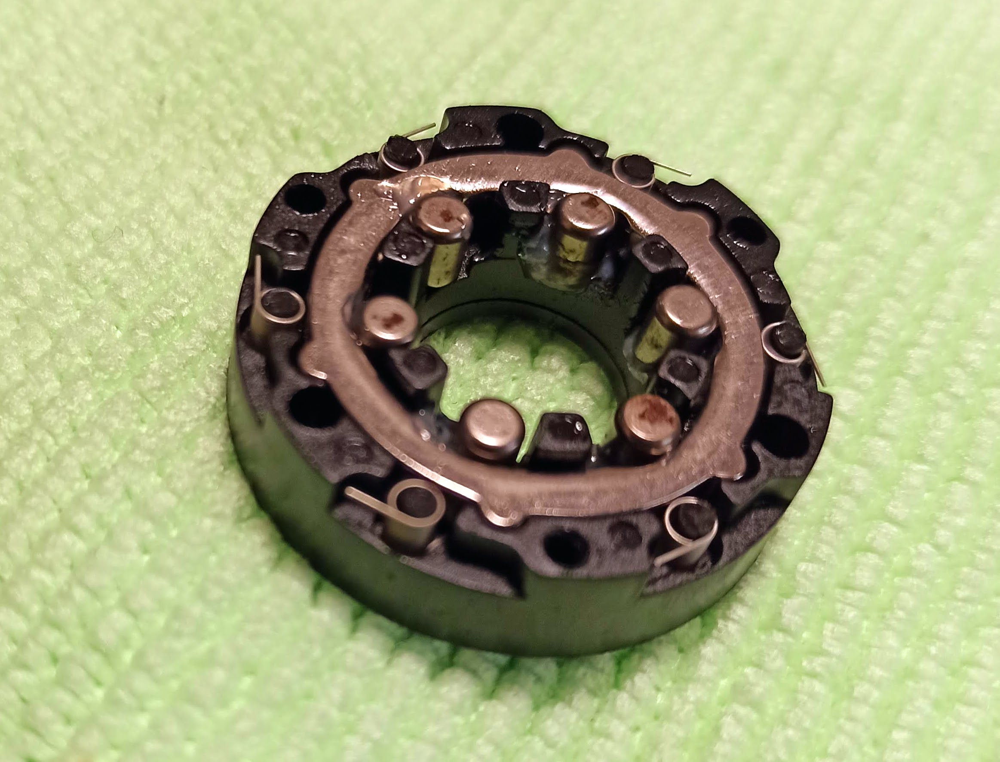
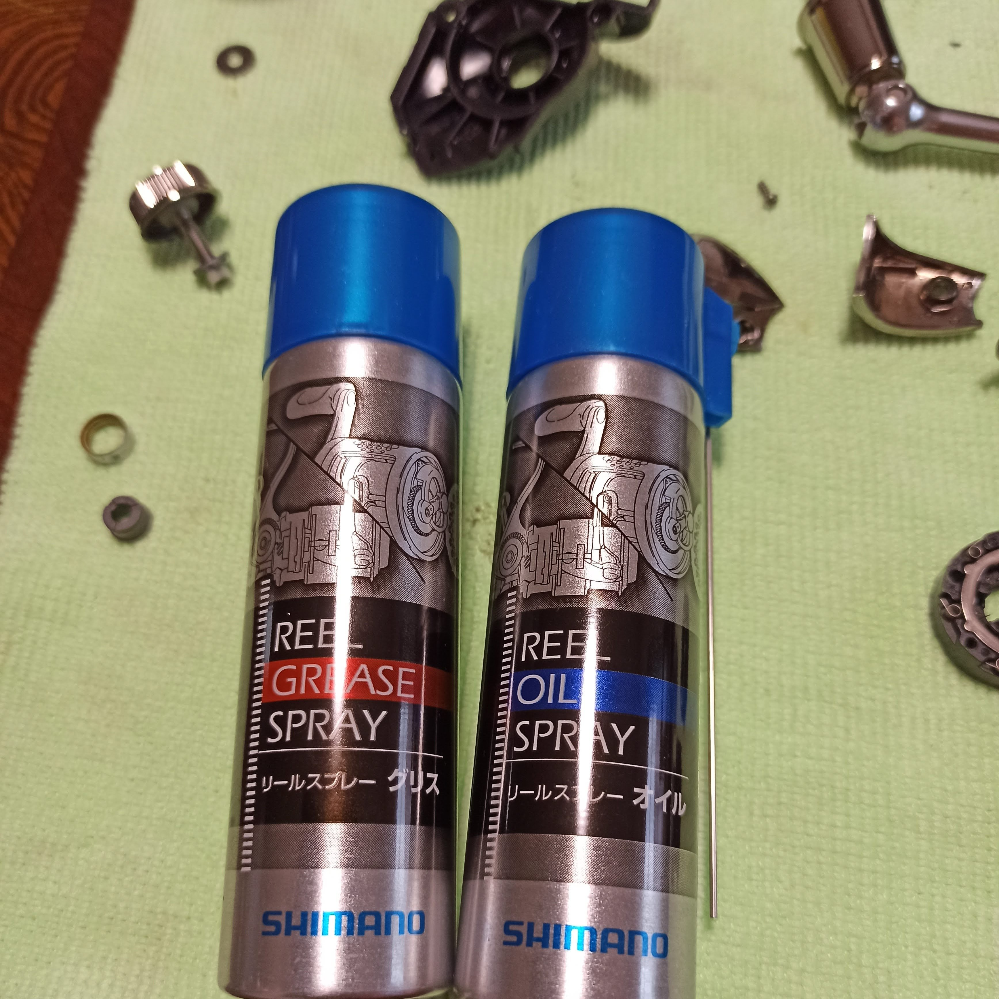
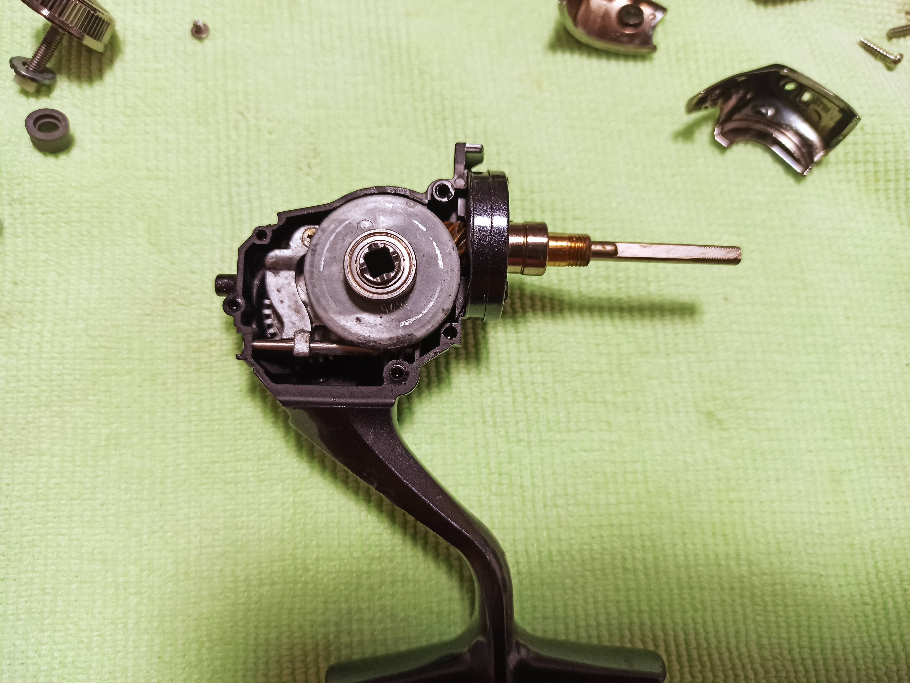
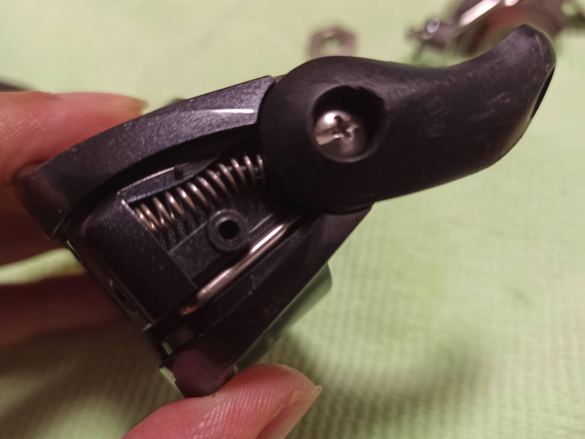
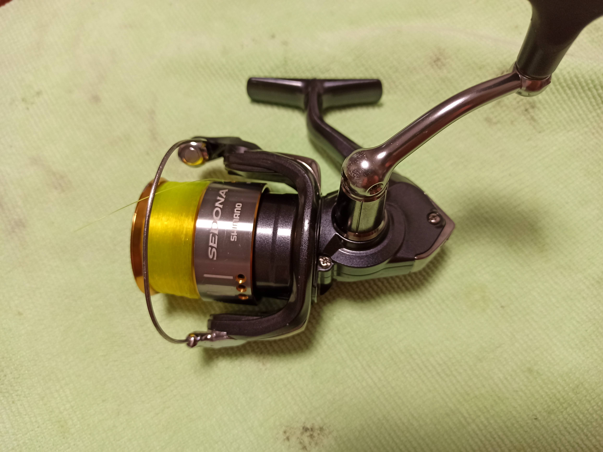

---
categories:
- アウトドア
- 釣り
date: "2025-02-15T23:42:47+09:00"
draft: false
image: images/IMG_20200613_110324.jpg
summary: スピニングリールの動きが固くなってしまったので分解してグリスアップしました。
tags:
- スピニングリール
- 釣り道具メンテ
title: スピニングリール分解、グリスアップ
---

スピニングリールの動きが固くなってしまったので分解してグリスアップしてみました。

リールはシマノのセドナでどちらかというと安物の部類なので分解は考慮されていなそうですが、スプールを外し、プラスドライバー（0番）でどんどんネジを外していくとけっこうかんたんにバラバラにできました。

オキアミ、アミエビの臭いがキツイです。汁が中まで浸透しています。。。

興味深いのは逆回転防止のワンウェイ部分。複雑な形をした内周をもつリングの内側に6つのローラーがあります。中の軸が逆回転すると周りの6つのローラーがリングと軸の間にかみこむように動き軸をロックします。

一通り部品を台所用洗剤で洗い乾燥させてからギア部などにグリスを塗っていきます。

組立していきます。下の写真のハンドル回転させると左側の歯車が回転し、歯車表面に凸部が設けてあります。軸側の部品には溝が切ってあり、凸部が溝に入りスライドすることでスプールが前後します。また、ハンドル軸が入る右側の歯車は外側がウォームギアになっていて、これがペールアームを回しています。

ペールアームをパチンと上下させて固定するバネ部分が機構を理解するのが難しく組立で戸惑いました。

無事組立完了です。壊さず組立できるか心配でしたが無事スルスルに回るようになってくれました。

