---
categories:
  - ガジェット
date: "2025-02-15T23:43:43+09:00"
description: Linuxで動作するビデオキャプチャカードについてネットで調べても情報が少なくいです。今回人柱としてアマゾンで安物 HDMI ビデオキャプチャカード購入したらLinuxで動作したのでご紹介します。
draft: false
images:
  - images/IMG_20220403_073344.jpg
summary: Linuxで動作するビデオキャプチャカードについてネットで調べても情報が少なくいです。今回人柱としてアマゾンで安物 HDMI ビデオキャプチャカード購入したらLinuxで動作したのでご紹介します。
tags:
  - Linux
  - ビデオキャプチャ
title: Linuxで使える安物HDMIビデオキャプチャカード
---

Linuxで動作するビデオキャプチャカードについてネットで調べても情報が少なくいです。今回人柱としてアマゾンで安物 HDMI ビデオキャプチャカード購入したらLinuxで動作したのでご紹介します。

## KINGONE HDMI キャプチャーボード

ビデオキャプチャカードは高いもので数万円しますが、これは二千円程度の安物です。謎メーカーですがおそらく中国のものでしょう。

他にも色々な謎メーカーからほとんど同じ外観をしたものが販売されていますが、多分中身は一緒でしょう。

## 外観

早速購入しました。外装は驚きのジップロックのような袋に入っている状態です。


中身は、ビデオキャプチャカード本体の他に、USB延長ケーブルと取り扱い説明書が入ってます。HDMIケーブルは含まれていないので自分で別途用意する必要があります。

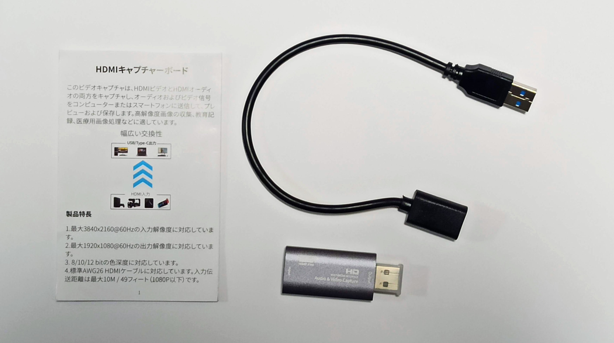

本体です。至ってシンプル、こんなものでビデオキャプチャできるのか不安です。

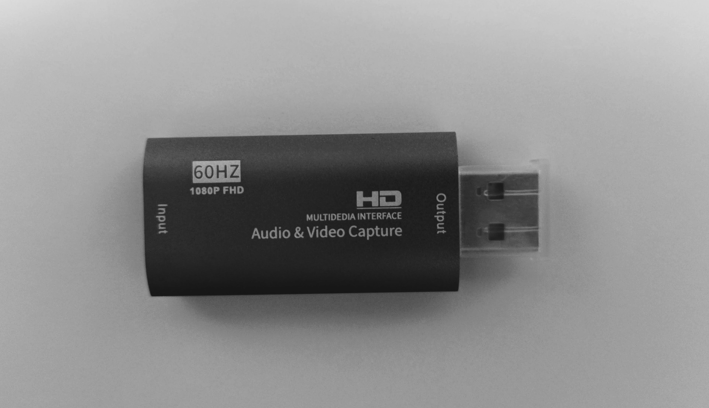

## ソフト（OBS）のインストール

説明書には OBS というフリーソフトを使うよう書いてあります。Youtube
の配信などに利用される有名なソフトみたいですね。

Linux版もあり、Debian sid(unstable)では Debian
パッケージも標準で用意されているため、これをインストールしました。


```
$ sudo apt install obs-studio
```


起動画面はこんな感じです。日本語化もされていますね。

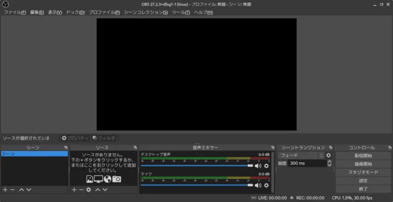

## ビデオキャプチャカードをつなぐ

PCのUSBポートにビデオキャプチャカードを差します。

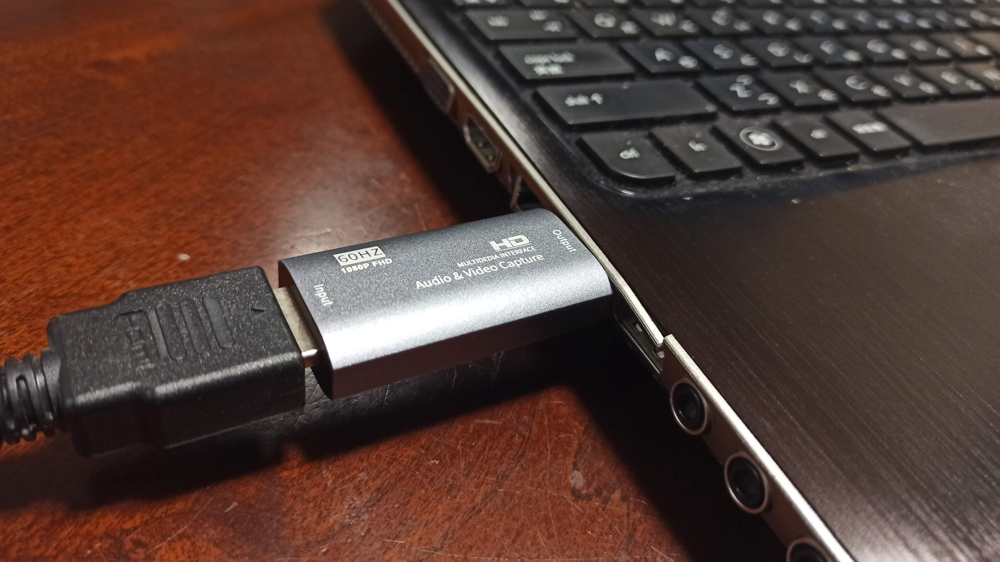

Cloudreadyを起動したLenovo Thinkpad
E420のHDMIポートとビデオキャプチャカードをHDMIケーブルで接続します。

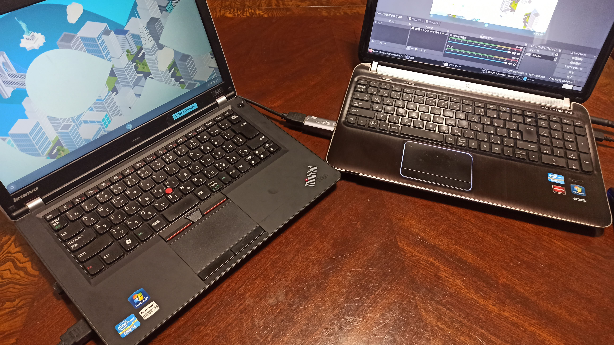

これだけで準備完了です。

## キャプチャにトライ！

さて、OBSの設定です。画面下の「ソース」から「＋」マークをクリックします。

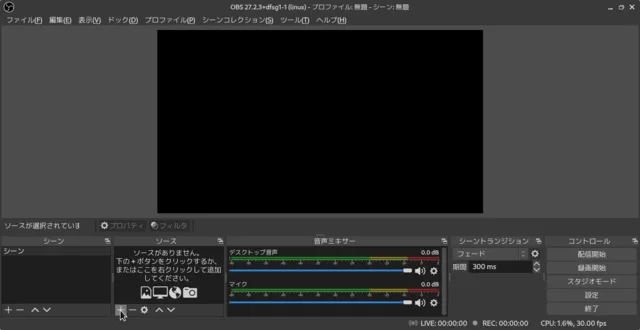

「映像キャプチャデバイス(V4L2)」を選択して追加します。

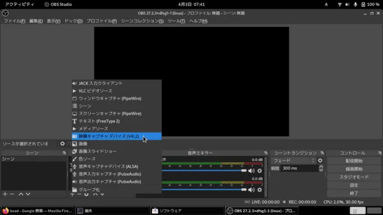

「ソースを作成/選択」ウィンドウで適当に名前を付けて「OK」をクリック。

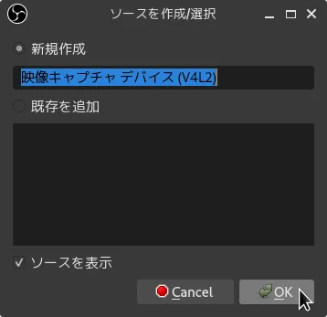

「プロパティ」ウィンドウが出るので「デバイス」に「USB
Video」を選択すると映像がプレビューされます。が、画面がザラザラしていますね。。。

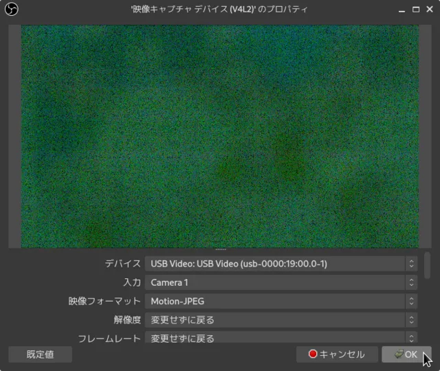

一度「デバイス」を PC 内部カメラに切り替え、また「USB
Video」に選択しなおしたら正常に映りました。初回だけでこのあとはザラザラ問題は出なかったです。何故かよくわかりませんが、もしかすると少し不安定なのかもしれませんね（安物だし）。

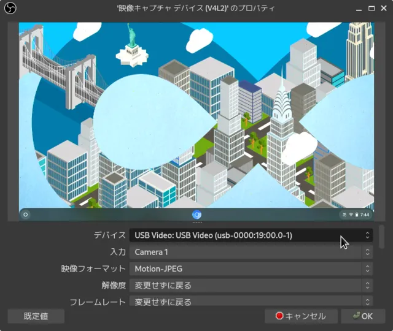

あとは「プロパティ」ウィンドウで入力と出力の解像度を適当に合わせるとちゃんと表示できました！

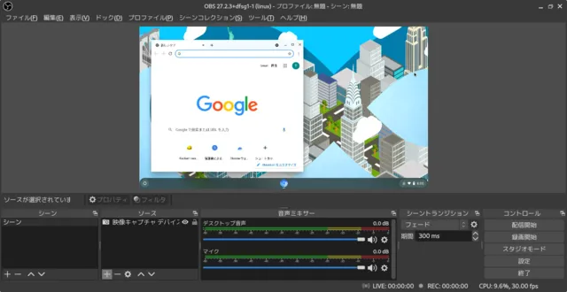

画面右下の「録画開始」で動画を撮ることができますが、スクリーンショットは画面上を右クリックするとメニューからキャプチャできます。

## BIOS画面キャプチャ

OSが起動する前のBIOSの画面をキャプチャするにはBIOSでPCモニタではなくHDMI出力するように設定変更が必要でした。

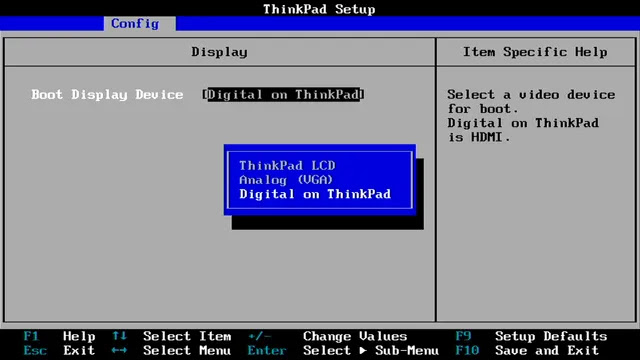

設定変更するとPC画面は真っ暗で何も表示されなくなるので注意です。

## まとめ

Linuxで動作するビデオキャプチャカードは少なく、ハードルが高いと思っていましたが意外とあっさりできました。

ビデオキャプチャカード次第なので謎メーカー物だと見た目一緒でも本当に同じ仕様か、個体差や同じ物でもたまにザラザラになるなど、運の要素もありそうですが今回は一発で当たりでよかったです。

早速気になる Chrome OS Flex のインストールをキャプチャしてみようかな。
