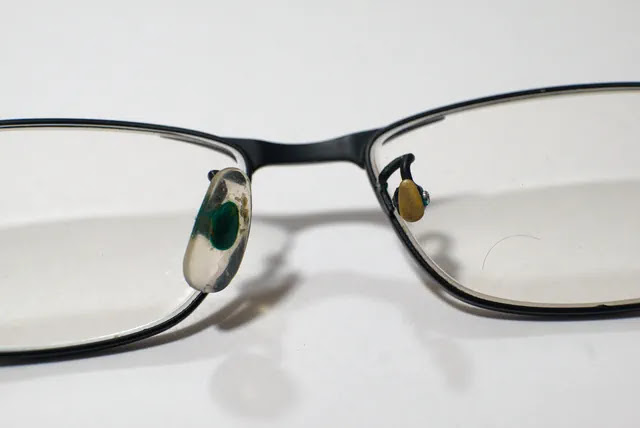
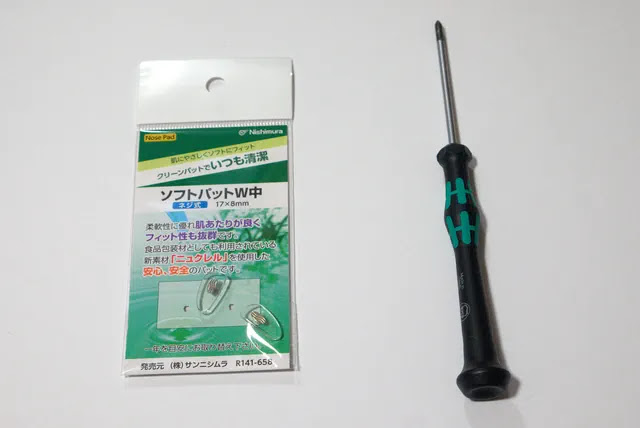
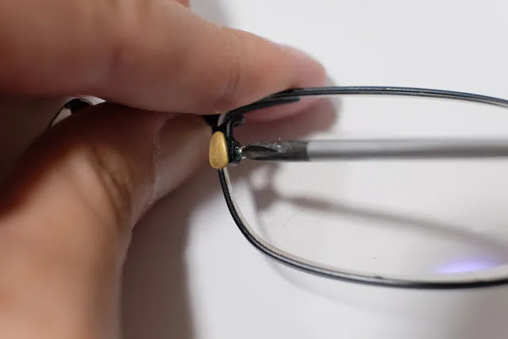
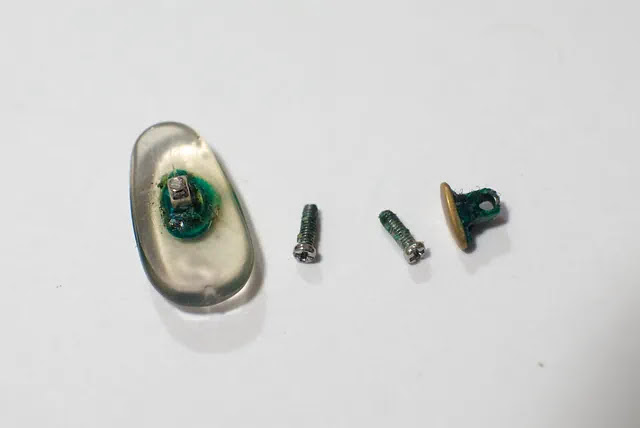
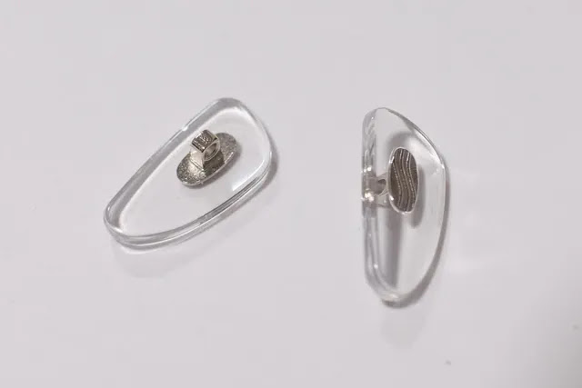
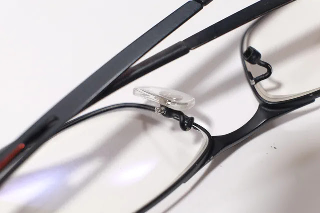
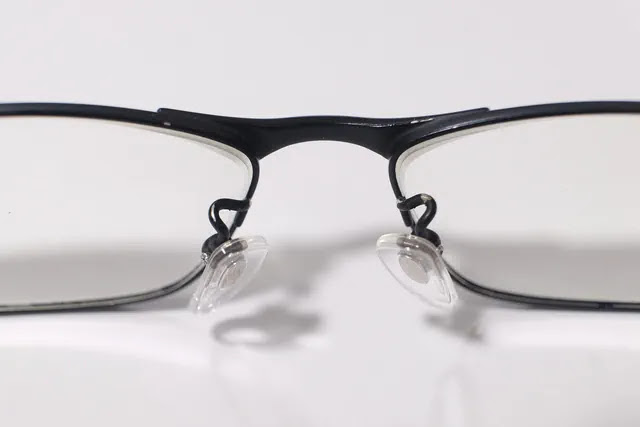

朝起きてめがねをかけると違和感が。鼻パッドが片方とれてしまっているではないですか😨

裏から見るとこんな感じで右側の鼻パッドのプラスチック部分が取れています。ネジは付いているので金属部分とプラ部分が剥がれてしまったような感じです。

アマゾンで「めがね 鼻パッド」で検索すると売っていました。サンニシムラというブランドで600円程度と激安です。

早速購入しました。包装に「一年を目安にお取替えください」と書いてあります。鼻パッドなんてこれまで一度も交換したこと無かったのですが、消耗品みたいですね。必要な工具は精密ドライバーです。

壊れた鼻パッドのねじを弛めて外します。

もう片方も外しました。鼻パッドをじっくり観察するのは初めてですが、かなり汚れて汚いです。。😱 しかも緑色のグリスのようなものが染み出していました。これは定期的に外して洗ったり一年で交換したほうがよさそうですね。

新品はクリアです。少し形が異なり三角形に近い形状をしています。

新しい鼻パッドを入れてねじで固定します。取付部分の形状やねじ径は万国共通なのでしょうか？合わなかったらどうしようと思いましたが、問題なく取付できました。

取付完了です。鼻パッドが新品になると古いめがねも蘇った感があります。

めがねの鼻パッドは安く簡単に交換できるのでこれからは定期的に掃除、交換していこうと思います。
