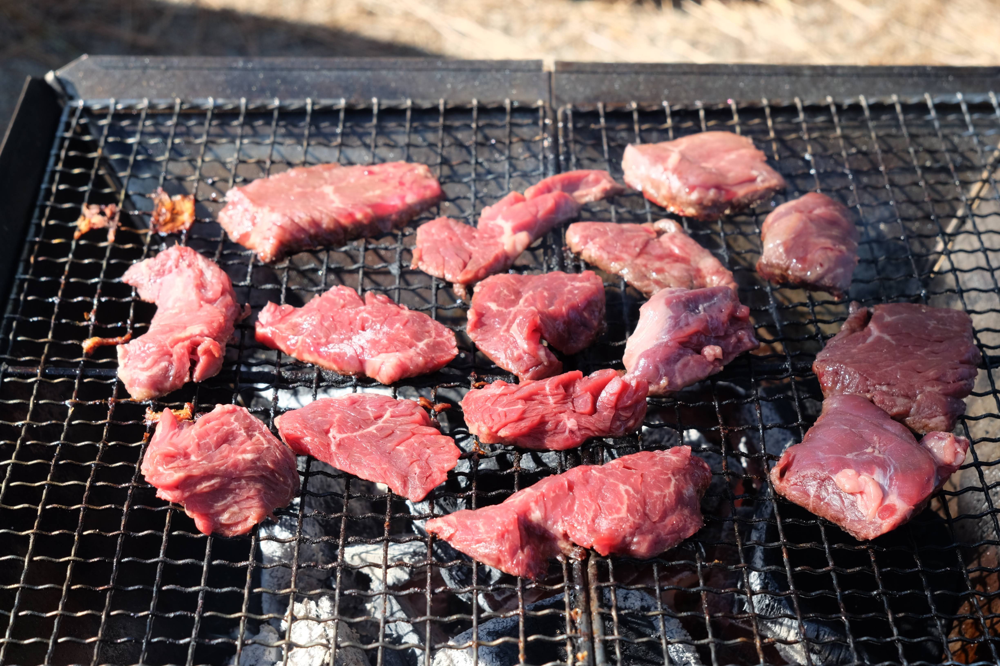

---
categories:
- アウトドア
date: "2025-02-15T23:43:07+09:00"
draft: false
images:
- images/IMG_20210206_131444.jpg
description: 大阪にある無料でバーベキューのできる公園、浜寺公園に行ってきました。敷地がとても広くゴーカートなど、遊具も充実している公園です。
summary: 大阪でバーベキューのできる公園、浜寺公園に行ってきました。無料でバーベキューができて遊具もあり、交通遊園ではゴーカートに乗れるなど子供を連れて家族で遊びに行くのにおすすめスポットです。
tags:
- 公園
- バーベキュー
- 大阪
title: 【大阪バーベキュースポット】浜寺公園でバーベキュー
---

大阪でバーベキューのできる公園、浜寺公園に行ってきました。無料でバー
ベキューができて遊具もあり、交通遊園ではゴーカートに乗れるなど子供を
連れて家族で遊びに行くのにおすすめスポットです。

## 浜寺公園のバーベキュー可能エリア

浜寺公園では、公園中央から北側の松林にかなり広い範囲でバーベキュー
可能なエリアがあります。

バーベキュー可能エリアについては、
[公式ホームページ](https://www.osaka-park.or.jp/rinkai/hamadera/main.html#bbq)
をご確認ください。

公園中央を南北に横断する広い道の両サイド松林がバーベキュー可能エリ
アです。できるところ、できないところがあるので看板を確認して場所を確
保しましょう

広いエリアで冬ということもあり場所とりには困りませんでした。もしか
すると夏場は混雑するのかもしれません。

焼き肉、やきそばと外で気持ちの良いバーベキューが楽しめました！

 

松林にはくねくね曲がった松の木があり子どもたちは木登りをしたり楽し
んでいました。

バーベキューエリアには「炭置き場」があり、使用して火消し後の炭を置
いて帰れるので後片付けが楽ちんです。

またゴミステーションもありますが「ゴミのお持ち帰りにご協力ください！」
と記載あるため特にBBQのゴミは大きいので持ち帰りましょう。

## 浜寺公園の遊具など

公園内にはちょっとした遊具もあり、BBQの後は思いっきり遊べます。

 

バラ園もあります。

## 交通遊園

南へ行くと交通遊園があり、ゴーカートを乗ることもできます。

こちらはちびっこ用です。

## まとめ

浜寺公園は無料でバーベキューができて遊具もあり、交通遊園ではゴーカー
トに乗れるなど子供を連れて家族で遊びに行くのにおすすめスポットです！

## アクセス



住所：〒592-8346 大阪府堺市西区浜寺公園町

URL： <https://www.osaka-park.or.jp/rinkai/hamadera/main.html>
