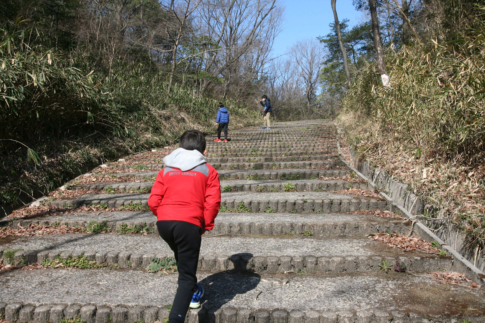

---
categories:
- アウトドア
date: "2025-02-15T23:43:05+09:00"
draft: false
images:
- images/IMG_5541.JPG
description: 大阪と奈良の境に屯鶴峯（どんづるぼう）という白い奇岩の絶景スポットをご紹介します。
summary: 大阪と奈良の境に屯鶴峯（どんづるぼう）という白い奇岩の絶景スポットがあります。不思議な名前と日本とは思えなそうな絶景なのにあまり知られていないB級観光スポットに行ってみました！
tags:
- ハイキング
- 屯鶴峯
- 大阪
title: 【大阪近郊B級観光スポット】屯鶴峯（どんづるぼう）
---

大阪と奈良の境に屯鶴峯（どんづるぼう）という白い奇岩の絶景スポットがあります。
不思議な名前と日本とは思えなそうな絶景なのにあまり知られていないB級観光スポット
に行ってみました！

## 屯鶴峯（どんづるぼう）とは

大阪と奈良の県境、奈良県香芝市に屯鶴峯（どんづるぼう）というおもし
ろい白い岩が見られる場所があります。

[香芝市のサイト](https://www.city.kashiba.lg.jp/soshiki/15/4690.html)
によると、その成り立ちについて下記のような説明が なされています。

> 千数百万年前に二上山の火山活動によって火砕流や火山灰などが堆積し、そ
> の後の地殻変動によって隆起し、さらに、長い年月の間に侵食されて現在の
> 姿になりました。古くは古墳の石棺材や寺院の基壇などの石材として利用さ
> れました。遠くから見ると鶴が屯（たむろ）しているような奇観のため、こ
> の名称で呼ばれるようになりました。≪県指定天然記念物≫

前々から気になっていたのですが、情報も少なくこれのために出かけるの
も、、、という気分で行けてませんでした。2月とは思えない暖かい休日で
外に出る気分だったので行ってみることに。

## アクセス


住所：〒639-0252 奈良県香芝市穴虫

アクセス：大阪より南阪奈道路、太子ICを下りて大阪府道・奈良県道703を
約3分。

## 駐車場

観光スポットというほどメジャーなところではなさそうと思っていましたが、
駐車場は満車でした。とはいっても小さな駐車場で車は多くて13台程度でいっ
ぱいになってしまいます。駐車料金は無料、トイレもあります。

すぐに出ていく人がいたので無事停められました。帰りには入り口で待って
いる車もいたので意外と人気！？です。

## 突然現れる不思議な白い岩

駐車場から横断歩道で道の反対側に渡ると案内があります。ローマ字での読
みがなは「どんづるみね」ですね。

案内通りに左に進むとすぐに屯鶴峯（どんづるぼう）の入り口があります。

屯鶴峯（どんづるぼう）を説明した看板が立っています。

階段を登ると、、、

すぐに突如として白い岩が現れます！

屯鶴峯（どんづるぼう）の案内板です。この看板では読みがなが「どんづる
ぼう」ですね。

ずいぶんあっさりしたマップです。2箇所ある「展望スポット」のみ。これ
ら展望スポットは、ほんとうに目の前でものの3分で到着してしまいます。

左の道を進みます。

白い岩は小さな子供にはなかなか登るのが大変です。

展望スポットに付きました。

右側の展望スポットは、すぐそこです。白い岩を伝って行くことができます。
なんと、ドローンを飛ばしている人がいました。

右側の展望スポットからの眺めです。

奥に遊歩道の案内が。進んでみることにします。

丸みを帯びた白い奇岩の様子がよく見えます。

岩の下まで下りてきました。この先平な谷をあるくことができそうですが、
写真右の小高い山に登ってみます。

急な斜面で砂状の地面なので滑ります。

上まで到着。ここからも白い岩が見えます。この先も行けそうだし谷も先に
進めそう。さらに見えている白い岩場のてっぺんにもどうやって行ったか人
が歩いています。

ただ、これ以上見るべきところもなさそうで子供たちも飽きてきたのでこの
辺で引き返すことにしました。

## まとめ

不思議な名前と白い奇岩が特徴で前々から気になっていた屯鶴峯（どんづる
ぼう）に行くことができました。いきなり現れる白い岩はなかなか見応えが
ありますが、入り口からすぐに着く展望スポットがハイライトで、それ以上
進んでもあまり大きな見どころはなさそうです。

大人だけであれば、少々気をつける必要がありそうですが岩場をどんどん進
んでみるとそれなりに面白いかもしれませんね。

大自然の神秘みたいな感じもしますが、なんせ駐車場からすぐ着いてしまう
のでありがたみはあまり感じられません。1回行けばいいかな、というのが
感想です。
