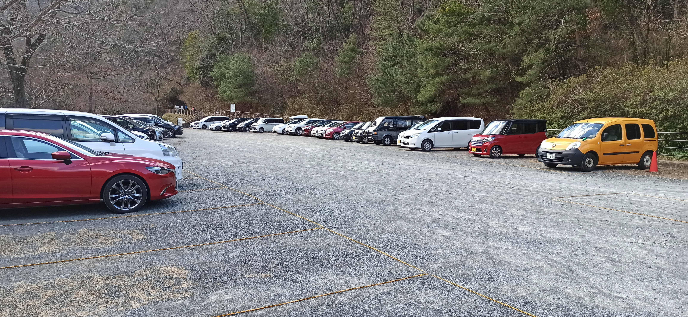

---
categories:
- アウトドア
date: "2025-02-15T23:43:05+09:00"
draft: false
images:
- images/DSCF4313.JPG
description: 星のブランコと呼ばれる大きな吊り橋とクライミングウォールがランドマークの、大阪府民の森ほしだ園地に家族でハイキングに行きました。
summary: 星のブランコと呼ばれる大きな吊り橋とクライミングウォールがあるという不眠の森ほしだ園地。前々から気になっていた場所を家族で訪れハイキングをしました。
tags:
- ハイキング
- 登山
- 大阪
- 府民の森
title: 家族でらくらくハイキング 大阪 府民の森ほしだ園地
---

星のブランコと呼ばれる大きな吊り橋とクライミングウォールがあるということで、前々から気になっていた府民の森ほしだ園地に行ってきました。

## アクセス

住所：〒576-0011 大阪府交野市星田５０１９−１

URL： <http://osaka-midori.jp/mori/hoshida/>

車：国道168号沿いに駐車場入口があります。

電車：京阪電車交野線私市駅から徒歩40分



今回は車で行きましたがハイシーズンであるGWや紅葉の時期の休日は満車で入れないことが多々あるようです。ハイシーズンは公共交通機関で行くのがおすすめです。冬の時期は比較的空いていると思います。

駐車場は見た感じ100台程度でしょうか。

## 府民の森ほしだ園地マップ

[大阪府民の森Webサイトから引用](https://o-wonderforest.com/hoshida/map.html)

地図右上の駐車場からスタート、ピトンの小屋（管理事務所）→ぼうけんの路→星のブランコ（吊り橋）→展望台→さえずりの路→ピトンの小屋→駐車場の順に歩いていきました。

子供たちとゆっくりと、ときには抱っこしながらのんびり歩いて2時間弱くらいでした。

## 駐車場〜ピトンの小屋（管理事務所）

駐車場からピトンの小屋までは木道を歩いていきます。歩きやすい道です。

## 大きなクライミングウォール！

しばらく歩くとピトンの小屋（管理事務所）に到着です。トイレ、自動販売機があります。ここにはある大きなクライミングウォールが壮観です。年数回講習会をやっているみたいなので機会があればチャレンジしてみたいですね。

脇に子供のお試し用があったので遊びでやってみるものの手が痛くて無理です。

## 冒険の路を通り星のブランコへ

ここから先少し整備された道を歩き、右手に折れてぼうけんの路に入ります。ちょっとした登山道といった感じで雰囲気が出てきました。

いい運動になり体も温まってきたところでまた整備された路に合流です。

## 見どころ！星のブランコ

今回のハイライト、280mの吊り橋、星のブランコが見えてきました。

山の中に忽然と現れる巨大な吊り橋です。高度感もすごいです。吊り橋自体はかなりガッチリ作られていてあまり揺れず、安心して歩けます。

吊り橋からの眺めです。中央付近にピトンの小屋が見えます。

## 尾根筋の路を通り展望台に到着

展望台方面へさらに進んでみます。

やまびこ広場は工事中でした。。。

やまびこ広場からすこし登るとすぐに展望台に着きます。北摂、京都方面の眺めが素晴らしいです。中央はポンポン山です。

眼下には渡ってきた星のブランコが見えます。

## さえずりの路を下り駐車場へ

下りは星のブランコは通らず、ショートカットでさえずりの路を下っていきました。シダ植物がワサワサ群生している山道でした。こんなにシダ植物を見るのも初めてかも。

ピトンの小屋で自動販売機のアイスを食べて駐車場へ戻りました。

## まとめ

府民の森ほしだ園地は大きな吊り橋を楽しめてちょっとしたハイキングにおすすめです。道はよく整備されており案内板も多く、わかりやすいです。夏場は暑そうなので涼しい時期に行くのが良いとおもいます。いい運動になりました！
