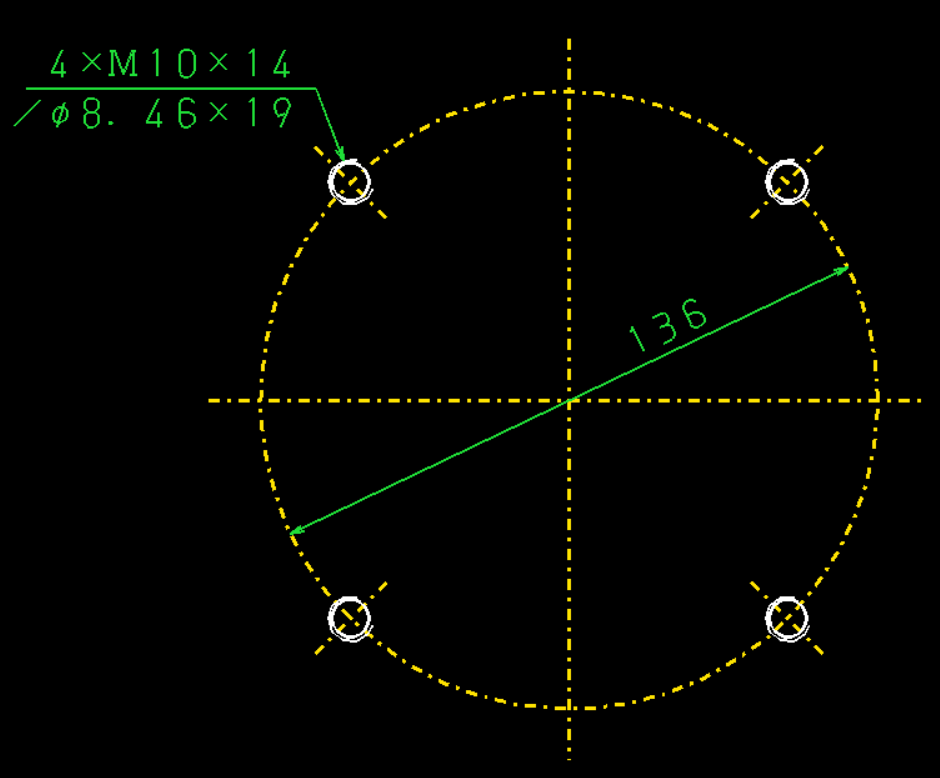

---
categories:
- CAD
date: "2025-02-15T23:42:35+09:00"
draft: false
images:
- images/icad.svg
description: iCADで2D図形を寸法変更しながら再利用できるパラメトリック部品として登録する方法を解説します。
summary: iCADで円周上に等分配置されたキリ穴、ねじ穴などを描く際に、毎回ピッチ円や角度線をいちいち描くのが面倒です。パラメトリック部品を登録し、径と角度を指定して一発で図形を描けるようにしてみました。
tags:
- iCAD/SX
title: iCAD/SX 2Dパラメトリック部品の登録
---

円周上に等分配置されたキリ穴、ねじ穴を描くことがあります。例えば下の図のようなもの。

円、角度線とひとつひとつ描いていくと意外と面倒です。中心線をパラメトリック部品として径と角度を指定して登録してみました。

始めに適当な寸法で登録した図形を描きます。コマンドメニューの「子図／部品／記号」から「部品管理」「登録」「パラメトリック部品」「部分」と選択し、描いた図形を選択、Goします。

パラメトリック部品の編集画面が開きます。「幾何拘束設定」「要素上」を選択し、円の中心点、直線の順にクリックして円を縦横の中心線上に拘束します。

中心線の水平、垂直の幾何拘束も設定しておきます。

次に斜め4方向の線に対称拘束を設定します。「幾何拘束設定」「対称」を選択し、対称の中心線、1つめの要素、2つめの要素の順にクリックし対称拘束を設定します。4本の線が上下中心線に対してそれぞれ対称になるよう設定します。

円の直径を変えたときに円の中心線、4本の斜め線の長さも変わるようにするため、下書き円を描いて下書き円上に線の端を拘束します。

まず「作図」「中心点円」を選択し、「作図属性」ウィンドウで「下書き」を選択して下書き円を中心円の内と外に描きます。円の中心を選択すると同一中心の拘束は自動で設定されるようです。

下書き円上に各直線の端を拘束していきます。

斜めの線の長さが中心円に対して等分にならず内側が長くなってしまいました。線の中心で中心円と交わるようにするために下書き円を追加し、拘束していきます。

下書き円の中心を斜め線と中心円の交点に描きましたが、自動で拘束が設定されないので「幾何拘束設定」「要素上」を選択し、下書き円の中心、中心円、下書き円の中心、斜め線とクリックし下書き円の中心を拘束します。

その後、斜め線の端点、追加した下書き円とクリックすることで下図のように斜め線の中心で中心円が交わるようになりました。これで幾何拘束の設定はおしまいです。

次に寸法拘束を設定します。「寸法拘束設定」「直径」で中心円と右上の下書き円の寸法を記入します。「角度」で斜め線と中心線との角度を記入します。

ここでやっとパラメータを定義します。「寸法式入力」を選択し、中心円の直径寸法を選択すると「寸法式入力・パラメータ入力」というウィンドウが出ます。寸法式にパラメータ名（ここでは「A」としました）を入力、Enterで確定します。

右上の下書き線の直径は、「A/6」に設定、角度も別のパラメータ（「B」）を設定しました。

これでiCADでの作業は終わりです。「ファイル」「名前保存」で「PCD中心線」と名前をつけて保存します。ダイアログで「CSV出力」のチェックボックスをチェックしておきます。

図形に拘束を設定するのは結構面倒で長い記事になってしまいました。このあとはCSVファイルを編集して寸法変更させる条件を設定しますが記事を分けて書きます。続きは下記の記事で！

一般的なパラメトリック3D
CADのスケッチではあまり考えなくてもある程度自動で幾何拘束が設定されて寸法も記入時にパラメータ入力できたりするのですがiCADは基本的にノンパラメトリックなのでパラメトリック設計の操作性がいまいちです。
